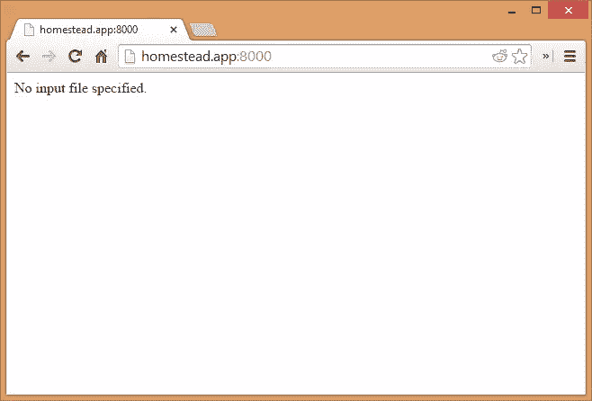
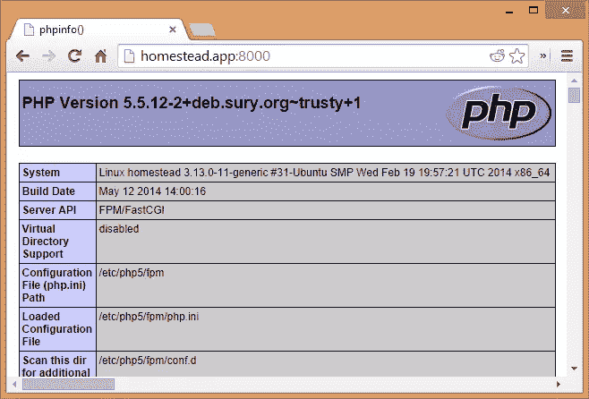
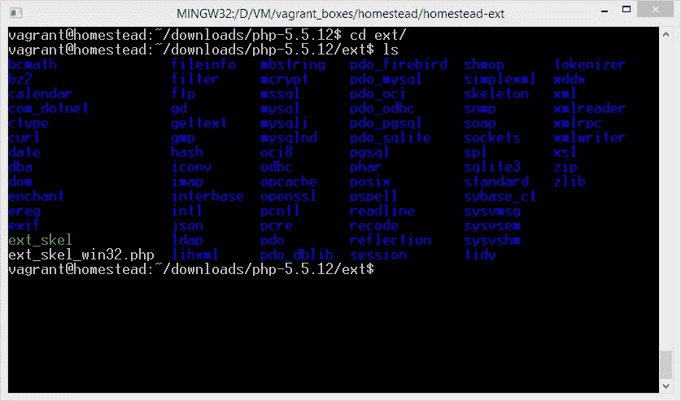
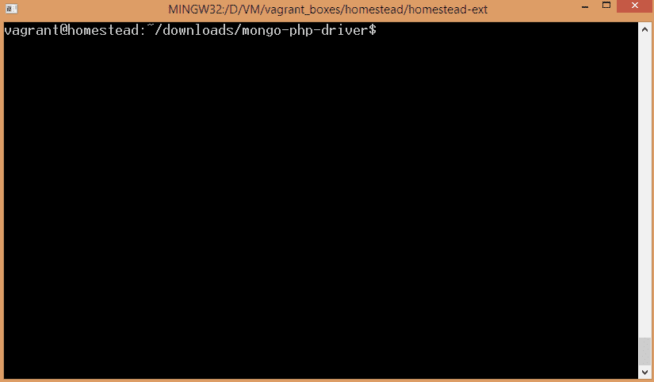
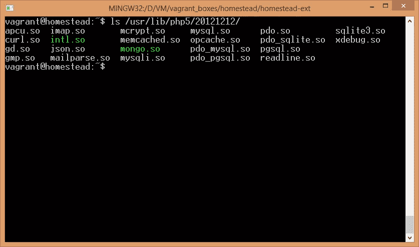
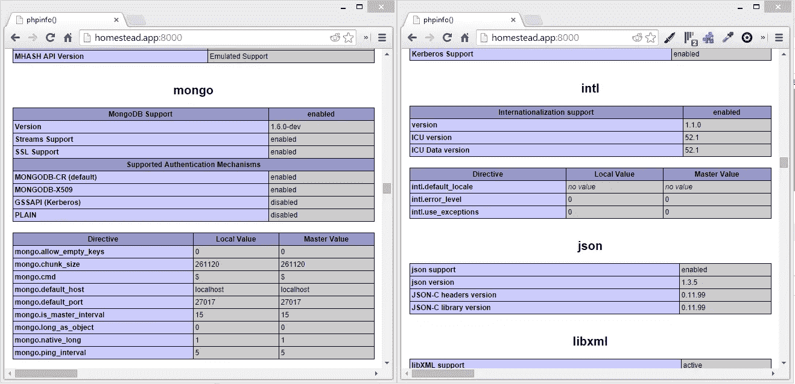

# 如何从源代码安装 PHP 扩展

> 原文：<https://www.sitepoint.com/install-php-extensions-source/>

有时在安装 PHP 之前很难知道需要哪些 PHP 扩展。如果以后需要添加扩展，幸运的话，扩展可能在您正在使用的操作系统的库中。这可能只是一个简单的`sudo apt-get install php5-intl`之遥。然而，在其他情况下，您可能需要从源代码安装它——[Phalcon](http://phalconphp.com/)就是这样一种情况，但它通过引入供应商支持、快捷方式和预先编写的操作系统执行指令，使过程[变得极其简单](http://phalconphp.com/en/download)。但是，如果其他扩展没有这样的东西呢？

在本教程中，我们将在 Linux 系统上安装一些定制的扩展(和 OS X——过程几乎相同)。该程序与我们已经在 Nitrous.io 上所做的[非常相似，但针对当地环境进行了调整——更具体地说，](https://www.sitepoint.com/installing-php-extensions-nitrous-io/) [Laravel Homestead](https://www.sitepoint.com/6-reasons-move-laravel-homestead/) 。您可以很容易地从本教程中获得安装说明，并将它们应用到其他发行版中。

## 启动虚拟机

如果你还没有，读一读上面链接的家园文章，让它运行起来。运行新的 Homestead box 后，您应该能够立即执行以下操作:



这很好，发生这种情况是因为默认挂载的文件夹实际上还不包含任何文件。现在`vagrant ssh`进入 VM，并执行以下命令:

```
cd Code git clone https://github.com/Swader/publicinfo
```

这将在 Homestead 默认设置的路径中创建一个有效的 PHP 信息文件。刷新 URL 将会产生一个 PHPInfo 屏幕:



## 为环境做准备

为了从源代码构建扩展，我们需要在机器上安装 PHP 开发工具，以及可以生成扩展文件的编译器。下面介绍如何在各种操作系统上安装这些必备组件:

#### 人的本质

```
sudo apt-get install php5-dev php5-mysql gcc libpcre3-dev
```

#### 一种男式软呢帽

```
sudo yum install php-devel php-mysqlnd gcc libtool
```

#### RHEL

```
sudo yum install php-devel php-mysql gcc libtool
```

#### 苏塞

```
yast2 -i php5-pear php5-devel php5-mysql gcc
```

如果您使用的是最新的 Homestead，所有这些工具都已经为您安装好了。一切准备就绪，让我们开始安装扩展。

## 安装扩展

您可以安装两种类型的扩展:与 PHP 捆绑在一起但默认不安装，以及第三方扩展。像 Phalcon 这样的第三方扩展通常通过提供快捷方式来简化安装过程，因为它们不需要遵守捆绑的 PHP 扩展所遵循的某些传统。

首先，让我们进入虚拟机上的主文件夹:`cd ~`。在那里，制作一个`downloads`文件夹，并把`cd`放入其中。当安装一个捆绑的扩展时，你需要在你的机器上安装 PHP 的源代码，最好是与你当前版本相匹配的。Homestead 使用的版本是 5.5.12，所以我将下载那个版本:

```
wget http://be2.php.net/distributions/php-5.5.12.tar.bz2 tar xvjf php-5.5.12.tar.bz2
cd php-5.5.12
```

我用的是上面的比利时镜子，你可以随意使用那个或者其他来自[下载档案](http://php.net/releases/)的镜子。

要查看所有捆绑扩展的源代码，进入未归档的 PHP 源代码文件夹中的`ext`文件夹，用`ls`做一个列表。



### 安装捆绑扩展

首先，如果您还没有安装 PHP-intl 扩展，我们将安装它。如果你这样做了，那很好——你将在下面看到的安装过程对于每个捆绑的 PHP 扩展都是一样的。intl 扩展是为了国际化——如果你感兴趣，在这里阅读更多。

鉴于 intl 扩展需要 ICU 库作为先决条件(如[需求](http://www.php.net/manual/en/intl.requirements.php)中所述)，让我们先安装它。

```
sudo apt-get install icu-devtools icu-doc libicu-dev libicu52 libicu52-dbg
```

在其他发行版中，安装说明可能会有所不同。这一步最好参考 [ICU 站点](http://site.icu-project.org/)或您个人发行的文档。

一旦安装了 ICU，在`ext`文件夹中执行以下操作:

```
cd intl
phpize ./configure --enable-intl
make
sudo make install
```

让我们解释一下这是怎么回事。

*   为编译准备扩展的文件夹。它允许您通过创建一个`configure`文件来执行后续命令，基本上是让扩展的文件夹“认为”它是 PHP 本身。实际上，`phpize`之后的过程与从源代码安装 PHP 时的过程是一样的——只是在这种情况下，只编译了 PHP 的一部分，并准备好与已经编译和安装的 PHP 一起使用。
*   `./configure --enable-intl`配置编译环境。它为编译器制作我们将要使用的`intl.so`文件做好了一切准备。尽管我们在`intl`文件夹中，但`enable-intl`标志是必要的，因为文件夹实际上认为*是* PHP，我们需要帮助它实现这种错觉。这个命令告诉它:“好，你是 PHP 的源代码。现在用 intl 扩展编译并安装。，而事实上，这是唯一可以从这个文件夹中安装*的部分。*
*   `make`将把源代码编译到`intl.so`中，把文件放到你当前所在的文件夹中，在`modules`子文件夹下。
*   会将这个文件移动到当前 PHP 安装的扩展文件夹中。

我们现在需要做的就是通过让`php.ini`消费它来启用扩展。我们稍后再做，先编译一个第三方扩展。

### 安装第三方扩展

我们将安装 Mongo 作为第三方扩展。Mongo 有二进制发行版，这使得安装更简单，但是为了便于学习，让我们手动安装。我们假设您已经安装了实际的 Mongo，因此只关注 PHP 扩展。如果你没有安装 Mongo，参考他们的[安装文档](http://docs.mongodb.org/manual/installation/)。

```
git clone https://github.com/mongodb/mongo-php-driver cd mongo-php-driver
phpize ./configure
make
sudo make install
```



这已经构建了我们的 mongo.so 文件，并将其放入 PHP 安装的 extensions 文件夹中。我们将在下一节启用它。

## 启用和测试

要查看编译后的`.so`文件是否确实在我们的 PHP 扩展文件夹中，请列出它的内容:



如你所见，它们就在那里，用亮绿色突出显示。

要启用它们，我们需要告诉`php.ini`它们。有几种方法可以做到这一点:

1.  你可以把线`extension=mongo.so`和`extension=intl.so`直接放到`php.ini`里。这是可行的，并且在大多数情况下是完全有效的方法。
2.  你可以为每一个创建一个单独的`ini`文件，把它们放在一个文件夹中，在`php.ini`被加载后，这个文件夹会自动包含它们，这样就可以保持`php.ini`的分离和隔离。这种方法更健康，尽管更难实现。
3.  您可以结合使用 2)和默认工具来启用 PHP mods。Homestead 使用这种方法，我们也会这样做。

```
cd `/etc/php5/mods-available`
```

这个文件夹是所有这些单独的`ini`文件的存储库。在此创建两个新文件:

```
sudo touch mongo.ini
echo "extension=mongo.so"  | sudo tee -a mongo.ini
sudo touch intl.ini
echo "extension=intl.so"  | sudo tee -a intl.ini
```

这些命令创建了两个新的`ini`文件，每个文件对应于我们之前构建的一个扩展。因为它们现在在`mods-available`文件夹中，我们可以使用已经可用的`php5enmod`(PHP enable mod 的缩写)命令行工具。

```
sudo php5enmod mongo
sudo php5enmod intl
```

注意:如果你没有`php5enmod`工具，将`ini`文件符号链接到各种`php`运行时的`conf.d`文件夹中就可以了:

```
ln -s /etc/php5/mods-available/mongo.ini /etc/php5/cli/conf.d/mongo.ini
ln -s /etc/php5/mods-available/intl.ini /etc/php5/cli/conf.d/intl.ini
ln -s /etc/php5/mods-available/mongo.ini /etc/php5/fpm/conf.d/mongo.ini
ln -s /etc/php5/mods-available/intl.ini /etc/php5/fpm/conf.d/intl.ini
```

之所以有四个条目，是因为我们有 PHP 的命令行版本和 PHP 的 FPM 版本。每一个都使用自己的`php.ini`文件，每一个都加载自己的`conf.d`文件夹用于扩展——因此，如果我们希望扩展全面可用，我们需要将两个扩展都添加到两个 PHP 版本中。只有在没有`php5enmod`工具的情况下才使用这种方法。

最后，让我们重启 nginx 和 php-fpm 来加载这些更改。

```
sudo service nginx restart
sudo service php5-fpm restart
```

要查看我们是否已经安装了它们，请刷新之前的 PHPinfo 屏幕，并分别搜索 mongo 和 intl。



成功！

### 移除扩展

要删除扩展名，没有必要删除任何实际文件，除非你真的空间不足。你可以用三种方法来做:

1.  如果有可用的工具，运行`php5dismod`。和上面说的`php5enmod`工具相反。`.so`文件将保留在原处，`ini`文件将保留在`mods-available`中，它们只是不会加载，因为它们的符号链接将从`fpm`和`cli` `conf.d`文件夹中移除。
2.  手动删除符号链接。例如`sudo rm /etc/php5/cli/conf.d/mongo.ini`
3.  如果您通过将扩展直接放入`php.ini`文件来启用它们，那么从`php.ini`文件中删除这些行，或者更好的方法是，对它们进行注释，以便在您改变主意时可以访问它们以供将来使用。

## 结论

如您所见，从源代码安装扩展非常简单，即使没有精确的说明，即使操作系统的官方库不支持该扩展。下次你需要在*nix 系统上的 PHP 安装中添加一个扩展时(本教程也适用于 OS X)，请参考这篇文章。

请在下面留下您的反馈，如果您对某个特定的扩展感到困惑并希望获得安装帮助，请告诉我。

## 分享这篇文章