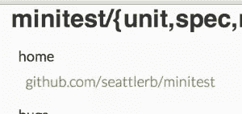

# 用 Minitest 和 Shoulda 让你的 Ruby 测试更干净

> 原文：<https://www.sitepoint.com/minitest-shoulda/>



早在 RSpec 和 Cucumber 之前，Ruby 中就有一个名为[测试单元](http://www.ruby-doc.org/stdlib/libdoc/test/unit/rdoc/Test/Unit.html)的核心库。它只是一个单元测试代码的框架。然而，从 Ruby 1.9.3 开始，测试单元已经被 [Minitest](http://ruby-doc.org/stdlib/libdoc/minitest/rdoc/MiniTest.html) 取代，成为 Ruby 的测试框架。在本文中，我们将概述 Minitest(因为它现在已经取代了测试单元)和 [shoulda-context](https://github.com/thoughtbot/shoulda-context) ，一个`Test::Unit` / `Minitest`框架的好处。

## 先决条件

*   Ruby(咄；当前版本 2.1.2 最好)
*   轻松运行`gem install GEM`的能力。
*   少量的 TDD 知识，点缀一下 BDD。

测试驱动开发(TDD)一直是 Ruby 社区的固定设备。这是极限编程的核心概念，几乎在每个 Ruby 项目中都被使用。用 Minitest 进行单元测试很简单，但是首先，我们需要一个 Ruby 库来测试。我们最终的项目结构将如下所示:

```
.
├── Gemfile
├── Gemfile.lock
├── Rakefile
├── lib
│   └── calculator.rb
└── test
    ├── test_calculator.rb
    ├── test_calculator_basic.rb
    └── test_helper.rb
```

你可以在这里找到这个项目[的回购。](https://github.com/JesseHerrick/minitest-with-shoulda)

我们的库是一个计算器，有两种方法:`add`和`subtract`。

```
class Calculator
  def add(num1, num2)
    num1 + num2
  end

  def subtract(num1, num2)
    num1 - num2
  end
end
```

要用 Minitest 测试这个库，创建一个继承自`Minitest::Test`的测试类。

```
# file: test/test_calculator_basic.rb
  require 'minitest/autorun'
  require 'calculator' # don't worry, this works

  class TestCalculator < Minitest::Test

  end
```

这个类中的测试是以`test_`开始的方法，应该描述测试在测试什么。

```
# file: test/test_calculator_basic.rb

require 'minitest/autorun'
require 'calculator'

class TestCalculator < Minitest::Test
  def setup
    @calc = Calculator.new
  end

  def test_proper_addition
    assert_equal 4, @calc.add(2, 2)
  end

  def test_proper_subtraction
    assert_equal 0, @calc.subtract(2, 2)
  end
end
```

要运行这个测试，使用下面的命令:`$ ruby -I test:lib test/test_calculator_basic.rb`。这似乎有点重复，尤其是如果您计划使用 CI 服务器，那么我们可以使用一个简单的 Rake 任务来实现自动化。

```
# file: Rakefile
require 'rake/testtask'

Rake::TestTask.new do |task|
  task.libs << %w(test lib)
  task.pattern = 'test/test_*.rb'
end

task :default => :test
```

现在，只需调用`rake`或`rake test`就可以运行测试。这将为我们提供以下输出:

```
Run options: --seed 41508

# Running:

..

Finished in 0.001047s, 1910.2197 runs/s, 1910.2197 assertions/s.

2 runs, 2 assertions, 0 failures, 0 errors, 0 skips
```

如你所见，我们的测试通过了。再补充一些吧…

```
# file: lib/test_calculator_basic.rb
require 'minitest/autorun'
require 'calculator'

class TestCalculator < Minitest::Test
  def setup
    @calc = Calculator.new
  end

  # add
  def test_add
    assert_equal 4, @calc.add(2, 2)
  end

  def test_failing_add
     refute_equal 5, @calc.add(2, 2)
  end

  # subtract
  def test_subtract
    assert_equal 0, @calc.subtract(2, 2)
  end

  def test_failing_subtract
    refute_equal -1, @calc.subtract(2, 2)
  end
end
```

这样做的结果与上一次类似。

```
Run options: --seed 4571

# Running:

....

Finished in 0.001081s, 3700.2775 runs/s, 3700.2775 assertions/s.

4 runs, 4 assertions, 0 failures, 0 errors, 0 skips
```

您可能已经注意到，测试方法开始变得越来越难以理解。这是因为你受到了限制。这就是 [shoulda-context](https://github.com/thoughtbot/shoulda-context) 的用武之地。在 [thoughtbot](http://thoughtbot.com/) 的好人们创建了这个库来帮助给出单元测试的上下文。下面是上面以 shoulda-context 格式编写的测试:

```
# file: lib/test_calculator.rb
require 'minitest/autorun'
require 'shoulda/context'
require 'calculator'

class TestCalculator < Minitest::Test
  context 'a calculator' do
    setup do # notice the difference
      @calc = Calculator.new
    end

    should 'add two numbers properly' do
      assert_equal 4, @calc.add(2, 2)
    end

    should 'not add incorrectly' do
      refute_equal 5, @calc.add(2, 2)
    end

    should 'subtract two numbers properly' do
      assert_equal 0, @calc.subtract(2, 2)
    end

    should 'not subtract incorrectly' do
      refute_equal -1, @calc.subtract(2, 2)
    end
  end
end
```

如果您还没有，在您的终端中运行`gem install shoulda-context`来安装 shoulda-context。

如您所见，测试可读性更强。人类可以这样阅读测试:`context: should 'do something'`。比如第一个测试可以读作:`a calculator should add two numbers properly`。这比上一个例子更有表现力。这些测试现在看起来更像 Ruby 风格了。

## 扩展:输出

如果您一直遵循代码示例，那么您可能会注意到测试输出不如 RSpec 或 Cucumber 的输出好。为了解决这个问题，我们可以使用一个叫做 [minitest-reporters](https://github.com/kern/minitest-reporters) 的小工具。

首先，我们将把我们的测试再分开一点。如果你有使用 Rails 和测试的经验，那么你可能用过`test_helper.rb`。我们可以在我们的项目中做同样的事情，只需在我们的测试目录中创建一个名为`test_helper.rb`的文件

在`test_helper.rb`中，我们将放置我们在测试中使用的前两个开始`require`语句。

```
# file: test/test_helper.rb
require 'minitest/autorun'
require 'shoulda/context'
```

请注意，我们没有包括`require 'calculator'`。这样做是因为我们可以在某个时候扩展我们的库，而不仅仅是`Calculator`类。因为不是我们在库中测试的所有东西都需要包含`calculator`，所以我们没有在`test_helper.rb`中包含它。

我们的计算器测试文件现在应该看起来像这样:

```
# file: test/test_calculator.rb
require 'test_helper'
require 'calculator'

# ... lots of tests ...
```

为了用我们的新设置来设置**迷你测试记者**，首先安装 gem ( `gem install minitest-reporters`)。现在，再次打开`test_helper.rb`并添加以下内容:

```
# file: test/test_helper.rb
require 'minitest/autorun'
require 'minitest/reporters' # requires the gem
require 'shoulda/context'

Minitest::Reporters.use! Minitest::Reporters::SpecReporter.new # spec-like progress
```

如果我们运行测试(`ruby -I test:lib test/test_calculator.rb`或`rake test`只有一个测试文件)，我们应该看到:

```
Started

TestCalculator
  test: a calculator should subtract two numbers properly.       PASS (0.00s)
  test: a calculator should not add incorrectly.                 PASS (0.00s)
  test: a calculator should add two numbers properly.            PASS (0.00s)
  test: a calculator should not subtract incorrectly.            PASS (0.00s)

Finished in 0.00141s
4 tests, 4 assertions, 0 failures, 0 errors, 0 skips
```

可读性更强，而且还有颜色！请注意，这种格式与人类阅读测试的方式是一样的。这是应该的。

## 结论

测试不仅被推荐，而且在处理 Ruby 项目时几乎是必需的。像 [shoulda-context](https://github.com/thoughtbot/shoulda-context) 这样的工具可以帮助简化这个过程。我们讨论了 Minitest 基础知识、自动化测试、shoulda-context 和花哨的(彩色的、人类可读的)输出。如果您想了解更多信息，请查看以下链接:

*   [Minitest 库](http://ruby-doc.org/stdlib/libdoc/minitest/rdoc/MiniTest.html)(包含在 Ruby 中)
*   [Minitest Repo](https://github.com/seatlerb/minitest) (官方仓库)
*   [shoulda-context](https://github.com/thoughtbot/shoulda-context)(shoulda-context GitHub 页面)
*   [迷你测试记者](https://github.com/kern/minitest-reporters)(迷你测试记者 GitHub 页面)
*   [本文代码](https://github.com/JesseHerrick/minitest-with-shoulda)(本文所有代码)
*   [极限编程–维基百科](http://en.wikipedia.org/wiki/Extreme_programming) (XP 维基百科页面)
*   [极限编程——官方](http://www.extremeprogramming.org/) (XP 官网)
*   被 RSpec 冒犯的 DDH(旧的，但仍然相关)

## 分享这篇文章