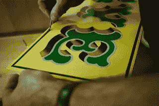
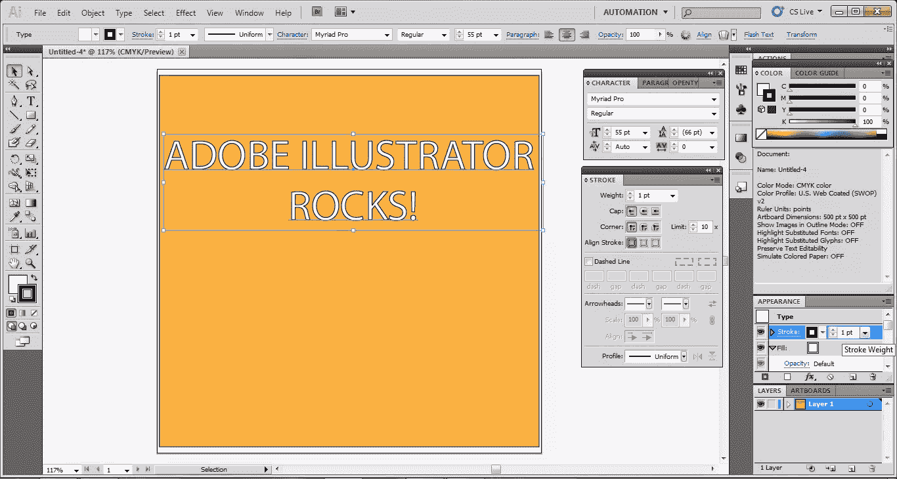
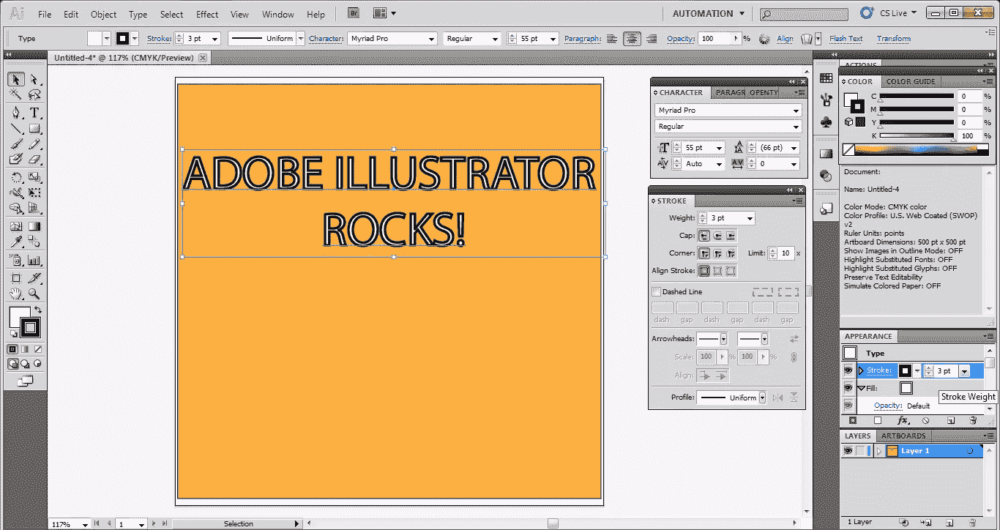
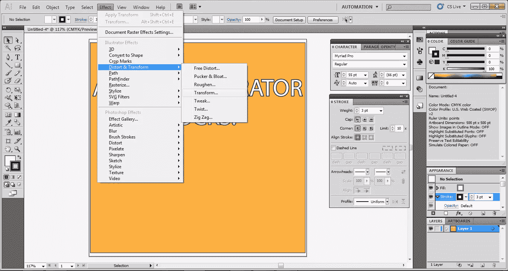
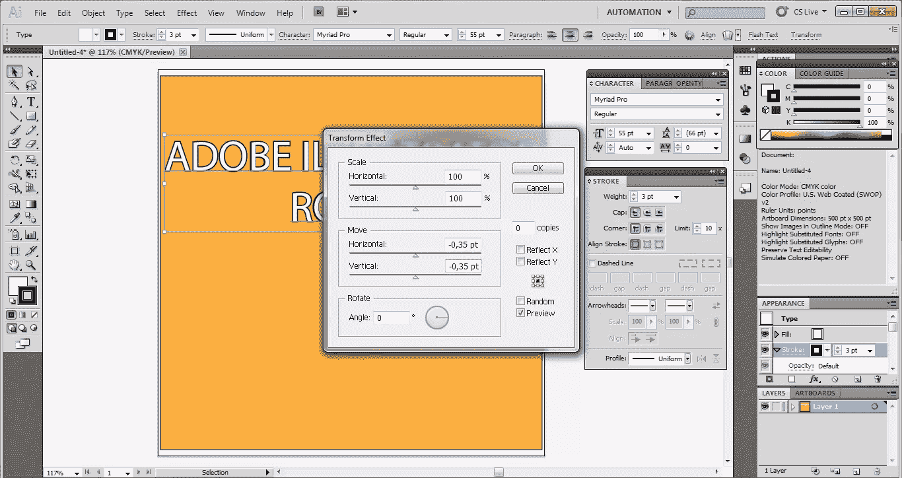
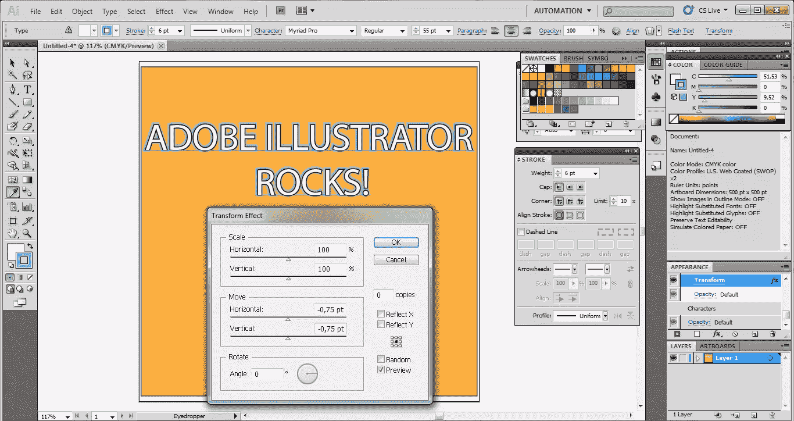
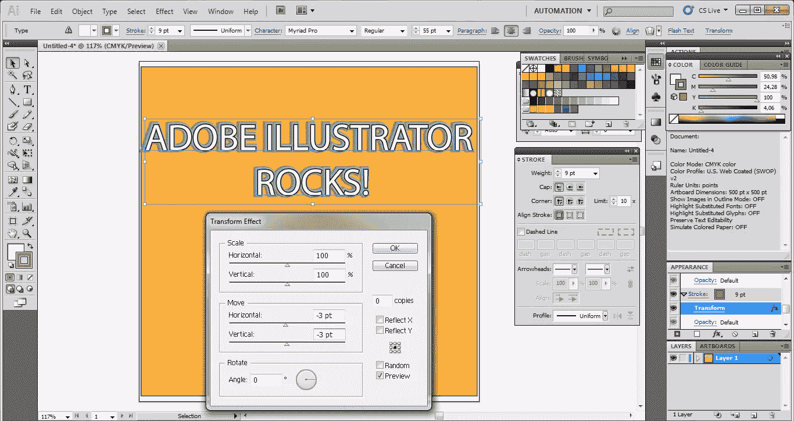
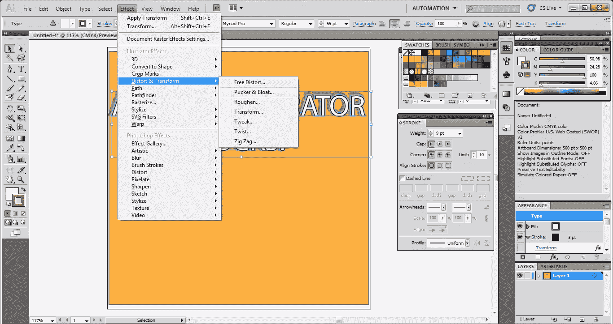
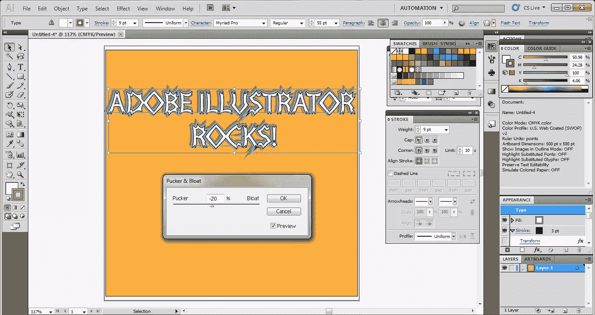
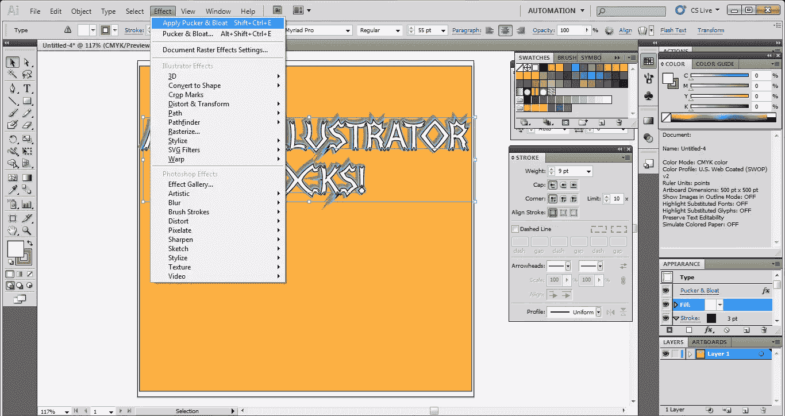

# Adobe Illustrator:利用变换效果

> 原文：<https://www.sitepoint.com/adobe-illustrator-exploiting-transform-effect/>

照片:jaype

Adobe Illustrator 中的变换效果允许您移动、缩放、翻转、旋转和克隆一个或多个选定对象的外观(全部从一个中央对话框中完成)。

使用它，您可以创建带有路径和文本块的模式，并通过对原生项目进行调整来处理整个模式。

在本教程中，我将向你解释如何创建一个简单的斜角笔画效果，我会向你展示一些关于变换效果的好奇心。

你会惊讶于这个不可或缺的工具的威力。

## 转换效果:它是什么？

正如我在文章的介绍中提到的，变换效果是一种动态效果，其主要结果是创建可以在单个命令中简单操作的路径或文本块的模式，允许您对原始对象进行调整。

在这个实际的例子中，我将指导你一步一步地创建一个简单的斜面笔画效果。其次，我们将看看如何使用 Illustrator 的最重要和最有趣的路径摆动器之一——折叠和膨胀。

好了，这是前提，我们开始吧。

### 步骤 1:设置文本

打开一个简单的正方形背景的线条画，这将是我们的起点。本练习的第一个任务是使用偏移笔划来创建深度效果。我们将动态地实现这种实际效果，这是一种更智能、更好的工作方式。

事实上，非常普遍的是，特别是在 Adobe Illustrator 的初学者中，使用多种笔画创建丰富的多层文本的好方法如下:

1.  创建文本
2.  指定笔画
3.  复制一份
4.  把它贴在原件前面
5.  改变它的颜色
6.  减少冲程
7.  反复重复同样的操作，直到达到你想要的效果。

由于多种原因，这不是创建这种效果的理想(或推荐)方式。它不仅速度慢、重复且容易出错，而且最重要的是，你对字距或大小写的任何调整，都需要手动对每一份副本单独重复。

使用这种新方法，您有一个参考文本对象，因此任何更改都会影响每组偏移笔划。我相信这是一种更聪明的工作方式。

诀窍是建立新的填充和描边属性；因此，让我们看看如何继续创造这个非常简单和基本的应用中风的影响结合一个文本，以达到一个良好的结果，在更少的时间和在一个非常专业的方式。

如果你没有设置它们，首先要做的就是恢复默认颜色。在这一点上，选择字体和大小，输入你的信息并在你的文档中撰写(我不能提出任何其他的信息！).我选择了一种非常经典的字体，叫做 *Myriad Pro* (你可以在这里找到它:【http://www.cufonfonts.com/it/font/492/myriad-pro】T2)，并且我用自己选择的颜色填充了字体(我认为白色可能不错)。我也给了它一个 1 点的冲程。

此图像代表教程的第一步，用户选择字体和大小并在文档中键入消息，选择颜色并设置 1 点描边

如果你仔细检查笔画，你会看到它进入铅字和离开铅字，这意味着进入字母和离开字母。为什么？原因很简单，因为默认情况下，笔画以每个字母形式的路径轮廓为中心。

### 第二步:抚摸它

第二步，打开“描边”面板，将权重值从 1 点更改为 3 点。

此图像表示应用值为 3 点的第二个笔画后产生的文本

如您所见，给出的结果很糟糕，因为笔画漏进了字母中。外观面板是纠正这一问题的最简单的方法。你所要做的就是抓住填充并把它移动到笔画的顶部。

这个图像代表了笔画漏入字母造成的不公平结果

你能看到变化吗？现在效果肯定更好。请记住，即使是非常简单的文本对齐效果，你也必须在外观面板内部工作。

### 第三步:是时候转型了！

将填充放在顶部，因为默认情况下笔画总是在顶部，选择笔画后，进入*效果>扭曲&变换>变换*。

该图像表示变换效果的应用

变换效果对于许多目的来说是非常有用的。让我们看看它是如何在对话框中改变水平和垂直的值，为它们输入 0.35 磅。此外，将值更改为负值，看看会发生什么:笔划向下并向左移动。按 Ok 以应用效果。

该图像表示“变换”对话框中水平和垂直值的变化

### 第四步:将你的笔画分层

我们再加一笔。当描边在外观面板中处于活动状态时，单击复制选定项目图标(右数第二个)，然后选择您刚刚创建的全新描边项目。为了使区别更加明显，你应该改变颜色(我已经选择了颜色 *#69D2E7* )和线宽(已经加倍并设置为 6 磅)。

该图像表示另一个笔画的创建以及该笔画的另一种颜色和线条粗细的应用

发生了什么事？还有更粗的笔画。现在怎么办？双击变换并提高数值(我已经设置了水平和垂直方向的值-0.75)，然后单击确定应用更改。

### 第五步:冲洗并重复

现在，对我们的第三个笔画重复同样的操作:选中这个笔画项，点击外观面板底部的新建图标。点击 stroke 将线宽值放在 9 点并改变颜色(浅蓝色之后，轮到绿色 *#8A9B0F* )。

最后，放上 stroke，双击 Transform，将值改为 3 磅。

该图像表示创建第三个也是最后一个笔画，并为该笔画应用另一种颜色和线宽

完了！你喜欢我们信件的这种斜面效果吗？

我希望如此。但这并不是结束，因为是时候开始这个练习的第二个任务了。在*变换*和*折叠&膨胀*的帮助下，我们将看到如何将这个简单的文本发展成一个高影响力的图形设计。

### 噘起嘴

在外观面板中，单击顶部项目*键入*以激活整个文本对象。

选择*效果>扭曲&变换>折叠&膨胀*。

这张图片展示了折叠和膨胀效果的应用

在对话框中输入-20%的值，然后单击确定。

此图像表示应用折叠和膨胀效果后值的变化

太神奇了，不是吗？

您可以根据需要多次应用该效果。但是请记住，首先你必须点击填充项激活它，然后在效果菜单中选择第一个命令*应用折叠&膨胀*来重新应用上次使用的效果。

此图像代表教程的最终结果

下面你看到的是教程的最终结果。

决赛成绩

## 结论

在本文中，您看到了 Adobe Illustrator 中的变换效果是多么简单和强大，以及正确使用它可以如何改善每个个人和专业项目的外观。尝试一下，并通过结合你已经知道的其他效果来享受它。

## 分享这篇文章