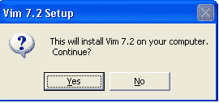
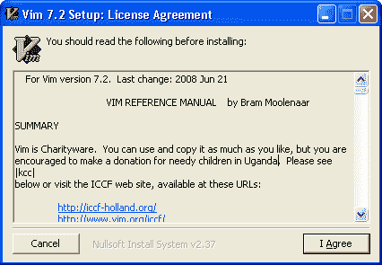
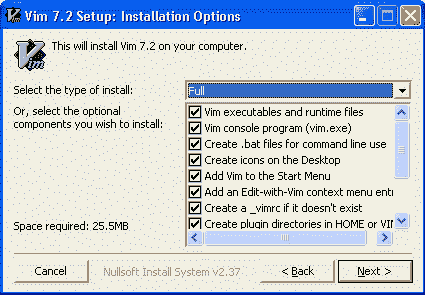
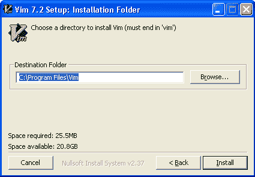
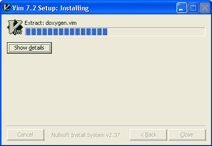

# Vim 入门

> 原文：<https://www.sitepoint.com/getting-started-vim/>


Vi/Vim 是编程社区中最受欢迎的编辑器之一。Vim 已经存在了几十年，提供了许多优势和效率，前提是您愿意学习它。今天，我希望能在学习 Vim 的道路上帮助你。我们将在本教程中探索 Vim 的基础知识，还有一个关于在 Ruby on Rails 开发中使用 Vim 的教程即将发布。

### Vi 和 Vim 简史

在 UNIX 出现之前，文本编辑器“ed”出现了，它是由 Ken Thompson 在 1971 年编写的。被认为是有史以来最古老的文本编辑器之一，也是第一个实现正则表达式概念的编辑器。

过了一会儿，出现了“ex”文本编辑器。`ex`是“扩展”的缩写，因为它为`ed`增加了一些功能，并使其更简单。

Vi 出现于 1976 年，由 Bill Joy 编写，用于 BSD 操作系统。当然，是在与操作系统同名的许可证(BSD 许可证)下许可的。

Vi 被认为是对只有两种当前模式的 T0 的补充。在本教程中，我们将探讨模式的概念以及如何使用它们。

几年后，其他版本开始出现，最著名的是 bding Vim，它是“Vi 改进版”的缩写。

1991 年，布莱姆·米勒开始研究 Vim。目标是构建一个 Amiga 兼容的文本编辑器来编辑源代码。Vim 作为一个开源程序在 GPL 下获得许可。Vim 只在 shell 中工作到 1996 年，当时第一个 GUI 界面首次亮相。此时，Vim bac 的版本是 4。

以下是我最喜欢的几个 Vim 特性:

*   Vim 已经被移植到比 vi 更广泛的操作系统上。
*   Vim 包括对几种流行编程语言(C/C++、Python、Perl、shell 等)的支持(语法突出显示、代码折叠等)。
*   Vim 与 cscope 集成。
*   Vim 可用于使用 SSH 和 HTTP 等网络协议编辑文件。
*   Vim 包括多级撤销/重做。
*   Vim 允许分割屏幕来编辑多个文件。
*   Vim 可以编辑压缩归档文件(gzip、zip、tar 等)中的文件。
*   Vim 包含一个用于比较文件的内置 diff(vim diff)。
*   Vim 包括对插件的支持，以及对配置和启动文件的更好控制。
*   Vim 可以用 vimscript 或外部脚本语言(例如 python、perl、shell)编写脚本。

### 安装 Vim

#### 在 Ubuntu 上

如果你使用基于 GNOME 的桌面，比如 Unity，你可以使用 Vim 的 GUI 版本`vim-gnome`。要安装，请键入终端

```
sudo apt-get install vim-gnome
```

如果你运行另一个桌面环境，比如 XFCE、LXDE 或 KDE，你可以使用`vim-gtk`，它不像`vim-gnome`那样依赖那么多额外的库文件。要安装，请键入终端:

```
sudo apt-get install vim-gtk
```

> **注:**
> 从 Ubuntu 6.10 (Edgy Eft)开始，默认的 Vim 安装是一个名为“vim-tiny”的删减版。为了获得完整版的完整的在线帮助文档，以及许多高级功能，如代码折叠；您需要安装“vim”:

```
sudo apt-get install vim
```

#### 在 MacOSX 上

在 Mac OS X 中，包管理者是`Homebrew`和`MacPorts`。有一个名为 MacVim 的项目，它是 Vim 的 GUI 界面。要使用自制软件安装，只需键入:

```
brew install macvim --override-system-vim
```

这将创建`vim`、`vimdiff`等。指向`/usr/local/bin/vim`中`mvim`的符号链接。你需要确保`/usr/local/bin`在你前进道路上的`/usr/bin`之前。MacVim 内置了对 Ruby 的支持，这在集成一些插件时很有用，比如 Command-T。

#### 在 Windows 上

1.  下载 Vim:进入 Vim 下载页面，点击“PC: MS-DOS 和 MS-Windows”。点击`gvim72.exe`，这是一个自安装的可执行文件，或者直接下载`gvim72.exe`。
2.  安装:下载后点击`gVim72.exe`，这将在你的 Windows 上安装 gVim，如下所示。


Vim 安装确认


Vim 7.2 许可协议


Vim 安装选项。(确保从下拉列表中选择“完整”)


Vim 安装位置(目录应以 Vim 结尾)


gVim 安装进度及完成情况

### 开始 Vim

下面是人们第一次尝试使用 Vim 时的一个常见场景:

*   启动 Vim 并尝试键入“test”
*   令人担忧的是，只打印了字母“t ”!
*   尝试关闭 vim，但他们不知道如何关闭。
*   强制退出或终止进程。
*   忘记 Vim，永远不要再尝试使用它。

许多初学者不知道，有很多有用的资源可以学习 Vim 的基础知识。有众所周知的`vimtutor`(你可以通过在终端输入`vimtutor`来使用它，它会在不到 30 分钟的时间里向你介绍基础知识)或令人敬畏的游戏 [Vim Adeventures](http://vim-adventures.com/) 。为什么不在从终端点击`vim`或启动 Vim 的 GUI 版本之前给他们一个尝试呢？

是的，Vim 在开始时并不简单，但是一旦你学会了基础知识，就更容易继续掌握更多。许多人说 Vim 有一个令人生畏的学习曲线，我认为这是在实践之后操作文本的效率的代价。

Vim 就像一个游戏:你开始玩的时候只知道一些基础知识，然后你会学到越来越多。一段时间后，你开始有效地编写或链接命令，你建立了肌肉记忆，然后你就走下坡路了。说到肌肉记忆，建议你在使用 Vim 的时候准备一份这样的备忘单。

你可以通过在终端输入`vi`或`vim`来启动 Vim，或者在图形模式下通过在 Linux 上输入`gvim`或在 Mac 上输入`macvim`来启动`vim`。这样做应该会弹出一个空白屏幕，显示关于 Vim 的详细信息。但是，大多数键入文本的尝试都会失败！你走错模式了！这给我们带来了初学者最困惑的特性:模式。

### Vim 模式

Vim 假设用户编辑文本的频率比输入文本的频率高。因此，它有一个插入文本的模式和几个编辑文本的模式。Vim 的行为取决于当前的模式:

1.  **命令模式**是 Vim 的默认模式。它提供了一个基于键盘的命令库来编辑文本。按 escape 键切换回这种模式。

2.  **插入模式**允许插入文本。这是大多数用户与文本编辑器联系在一起的功能。在命令模式下按下`i`键切换到插入模式。

3.  **视觉模式**提供文本选择功能。在命令模式下按下`v`键切换到可视模式。

### Vim 命令

Vi 的设计与 Unix 操作系统非常相似。也就是说，功能是通过简单命令库提供的，这些简单命令库可以组合成更复杂的命令。

例如，`w`命令将光标移动到下一个单词的开头。`d`命令是删除命令。于是，`dw`删除了下一个字；`d2w`删除接下来的两个单词。这就是基于命令组合动作的工作方式。

这里有一个非常聪明的[备忘单](https://raw.githubusercontent.com/LevelbossMike/vim_shortcut_wallpaper/master/vim-shortcuts_1280x800.png)，它将向你介绍基本的 Vim 运动命令。看一下，练习每个命令。另外，这里有另一个非常有用的[备忘单](http://www.viemu.com/vi-vim-cheat-sheet.gif)，供使用/学习 Vim 时参考。

**作为初学者，你应该可以(这些都是在命令模式下):**

*   在命令模式和插入模式之间切换。
    *   要从命令模式切换到插入模式并在当前光标位置**插入文本，按`i`。**
    *   要从命令模式切换到插入模式，并在该行的**开始**处插入文本，按`I`。
    *   要从命令模式切换到插入模式，并在该行的**端**插入文本，按下`A`。
    *   使用`Esc`从插入模式切换回命令模式。
*   开通新线路
    *   要在当前行后打开新行**并开始插入文本(切换到插入模式)，使用`o`。**
    *   要在当前行之前打开新行**并开始插入文本(切换到插入模式)，使用`O`。**
*   使用`hjkl`在信号源中导航
    *   导航**向上**一行，按`k`。
    *   导航**向下**一行，按`j`。
    *   导航**左侧**一个字符，按`h`。
    *   导航**右**一个字符，按`l`。
*   救援
    *   使用`:w`(write 的缩写)保存当前编辑。
*   出口
    *   要退出，请键入`:q`(quit 的缩写)。
    *   要保存并退出，请键入`:wq`。
    *   要强制退出而不保存，请键入`:q!`。
    *   要强制保存并退出，请键入`:wq!`。
*   取消
    *   使用`u`撤销上次编辑。
*   重做
    *   要重做，使用`CTRL + r`。
*   复制并粘贴
    *   要选择一个文本块，`Ctrl + v`切换到可视模式，然后使用方向键(`hjkl`)选择一个块。
    *   要复制选中的块，`yy`(猛拉线)。
    *   要粘贴选中的块，`p`(粘贴)。
    *   要在光标前粘贴，`P`。
*   标签完成
    *   要使用制表符补全，`CTRL + p`。
*   移动到文件的开头和结尾
    *   移动到直线的**起点**，`0`。
    *   移动到线的**端**，`$`。
*   替代/替换
    *   要替换光标下的字符，请键入`r`，后跟您要替换的字符。
    *   要切换到替换模式，使用`Shift + r`并开始输入。
*   将操作符(如删除)与动作(如单词结束)结合起来
    *   如前所述，Vim 命令是可组合的。因此，您可以将删除/更改/复制等*操作*与单词/行的开始/结束等*动作*结合起来。
    *   要删除到单词的末尾，请键入`dw`。
    *   要删除到行尾，请键入`d$`。
    *   分别使用`di'`、`di"`、`di(`、`di{`删除引号、双引号、圆括号、方括号内的文本。
    *   要复制到单词的末尾，请键入`yw`
*   您可以在命令前键入一个数字来多次执行该命令
    *   要删除 4 行，请键入`4dd`。
*   通过键入`.`重复最后一个命令。
*   跳到文件中的特定位置。
    *   使用`gg`跳转到文件的**开头**。
    *   使用`G`跳转到文件的**结尾**。
    *   使用`8gg` (8 是行号)跳转到文件中特定的**行。**
*   向前和向后搜索。
*   匹配圆括号和方括号。
    *   使用`%`匹配当前的圆括号或方括号。
*   水平和垂直分割。
    *   要水平分割屏幕**使用`:sp`。**
    ***   要垂直分割屏幕**使用`:vs`。****
*****   在拆分之间切换。
    *   使用`CTRL + ww`切换到下一个分屏。*   向前向后跳。
    *   使用`CTRL + f`向前跳一页。
    *   使用`CTRL + b`向后跳转一页。*   通过点文件修改您的环境。
    *   你可以在阅读完本教程后这样做:)编辑你的`.vimrc`文件的一个简单方法是`:e $MYVIMRC`。*   执行 shell 命令。
    *   要执行一个 shell 命令，只需键入`:sh`,后跟命令。****

 ****要了解更多命令，请查看这篇精彩的[教程](http://mislav.uniqpath.com/2011/12/vim-revisited/)。

#### Vim 记录

Vim 有一个很棒的特性叫做 Vim Macros。它能让你记录下你做的任何动作，并重放它们。

要开始记录一个宏，只需键入`q`后接任意字母。您在`q`后键入的字母是宏被分配的位置。

假设您想在各行的特定位置添加一些单词，如下所示:

```
They smart
He smart
They smart
He smart
They smart
He smart
```

您希望将其转换为:

```
They are smart
He is smart
They are smart
He is smart
They are smart
He is smart
```

*   按下`q`和任意字母开始录音(我们选`w`)。
*   从行首开始，移动到“他们”后面的空格，进入插入模式(`i`)，键入“are”。
*   点击`Esc`返回命令模式，键入`^`转到行首。
*   按下`j`进入下一行。
*   移动到单词“he”后面的空格，进入插入模式，然后键入“is”并返回命令模式。
*   转到下一行的开头。
*   按下`q`结束记录。

现在，您可以键入`2@w`来为剩余的行重复该宏。

### 生产力提示

#### 复制到系统剪贴板

要使用`CTRL + c`复制到系统剪贴板，只需将下面一行添加到您的`~/.vimrc`(或 Windows 上的 _vimrc)文件中:

```
" Enable copying to clipboard using `CTRL + c`
map <C-c> y:e ~/clipsongzboard<CR>P:w !pbcopy<CR><CR>:bdelete!<CR>
```

#### 使用箭头键

在 Vim 中，您可以在命令和插入模式下使用箭头键，但这是一种不好的做法。你应该使用`hjkl`进行导航来建立你的肌肉记忆。同样，不要使用`Home`或`End`按钮，只需坚持使用`$`和`^`分别移动到一行的**末端**和**开始**。

你可以解开箭头键来避免诱惑。只需将以下几行添加到您的`vimrc`文件中:

```
noremap <Up> <nop>
noremap <Down> <nop>
noremap <Left> <nop>
noremap <Right> <nop>
```

#### 将大写锁定重新映射到控件

使用 Vim 一段时间后，您可能会发现使用控制键很痛苦。控制键位于键盘上一个非常糟糕的位置，所以许多 Vim 用户将控制键重新映射到 CapsLock。

下面是如何在 Mac、Linux 和 Windows 上做这件事的方法。

#### 改变大小写和重复命令

Vim 为文本操作提供了三个非常棒的命令。我经常发现有经验的 Vim 用户不知道他们，这真的很奇怪。这三个命令是:

*   `~ (tilde)`–切换字母/选择的大小写(大写/小写)。
*   `. (dot)`–重复最后一组命令(与搜索结合使用，如`*`和跳转)。
*   `* (star)`–搜索并高亮显示光标下的单词。

#### 设置 Vim

当 Vim 启动时，它加载一个名为`.vimrc`(在 Windows 上为`_vimrc`)的文件，该文件保存配置设置。它位于您的主目录中，由`$HOME` (Windows)或`~` (Unix)指定。

在 Vim 中键入`:help vimrc`可以看到一些关于它的文档。在本教程中，我们将编辑`vimrc`文件来添加一些插件和定制。

#### 最低限度。vimrc

建议从最少的`.vimrc`文件开始定制。是的，有许多受欢迎的开发人员共享他们的点文件(配置文件)，但他们是按照自己的方式构建的，这取决于他们的使用和需求。那么，为什么要完全照搬呢？？？我认为每个用户都应该从一个最小的`.vimrc`文件开始，并根据他/她的需要进行配置。

这里是您`.vimrc`的一个良好起点:

```
set nocompatible                " choose no compatibility with legacy vi
syntax enable
set encoding=utf-8
set showcmd                     " display incomplete commands
filetype plugin indent on       " load file type plugins + indentation

"" Whitespace
set nowrap                      " don't wrap lines
set tabstop=2 shiftwidth=2      " a tab is two spaces (or set this to 4)
set expandtab                   " use spaces, not tabs (optional)
set backspace=indent,eol,start  " backspace through everything in insert mode

"" Searching
set hlsearch                    " highlight matches
set incsearch                   " incremental searching
set ignorecase                  " searches are case insensitive...
set smartcase                   " ... unless they contain at least one capital letter
```

#### 从错误中恢复

您的`vimrc`文件中的错误可能会阻止 Vim 成功启动。处理这种情况的一个可靠方法是重命名您的`vimrc`文件，启动 vim，并编辑重命名的文件。或者，您可以用这样的命令启动 Vim(或者使用“GVim/MacVim ”,如果这是您运行 Vim 的方式的话):

> 维姆-N -u 无-u 无

`-N`在“不兼容”模式下启动(即带有额外的 Vim 功能)。NONE 参数(必须大写)跳过初始化，不读取`vimrc` (-u)，也不读取任何 gvimrc 文件(-u)。

#### 使用 Vundle 插件管理器

Vim 有一个插件系统，可以用来添加更多的功能。这些插件被实现为简单的配置文件，位于`$HOME/.vim`目录的子目录中。如果你正在使用大量的插件，管理它们可能会很麻烦，所以插件管理器可以帮助你有效地管理它们。

Vim 有一些插件管理器，像 [Vundle](https://github.com/gmarik/Vundle.vim) 和[病原体](http://www.vim.org/scripts/script.php?script_id=2332)，这使得添加、安装、更新、搜索或删除任何插件变得非常容易。在这里，我们将探索如何使用 Vundle。

Vundle 是`Vim Bundle`的简称。要安装它，你需要先有 [Git](http://git-scm.com/) 。[这里](http://git-scm.com/book/en/Getting-Started-Installing-Git)是如何安装 git 的指南。一旦安装了 git，就可以按照下面的步骤安装 Vundle。

**1-** 在您的终端中键入:

```
$ git clone https://github.com/gmarik/Vundle.vim.git ~/.vim/bundle/Vundle.vim
```

这个命令会将 Vundle 插件克隆到正确的位置。

**2-** 在 vim 中输入`:e $MYVIMRC`打开你的 vimrc 文件。

**3-在您的 vimrc 中包含 vu ndle**

将此放在您的`.vimrc`顶部，以使用 Vundle。

```
set nocompatible              " be iMproved, required
filetype off                  " required

" set the runtime path to include Vundle and initialize
set rtp+=~/.vim/bundle/Vundle.vim
call vundle#begin()
" alternatively, pass a path where Vundle should install plugins
"call vundle#begin('~/some/path/here')

" let Vundle manage Vundle, required
Plugin 'gmarik/Vundle.vim'

" The following are examples of different formats supported.
" Keep Plugin commands between vundle#begin/end.

" All of your Plugins must be added before the following line
call vundle#end()            " required
filetype plugin indent on    " required
```

**4-添加插件:**

现在你可以添加任何你想要的插件，只需要添加单词`Plugin`和它或它的 Git 库的 URL(不管这个库是在 Github 上，另一个服务器上，甚至是在你的机器上，只要添加它的路径就可以了。)

例如，要添加[vim-escapile](https://github.com/tpope/vim-fugitive)插件，请在`call vundle#begin()`和`call vundle#end()`块中放置以下代码行。

```
Plugin 'tpope/vim-fugitive.git'
```

> **注意:**
> 我们没有添加完整的 git URL(即‘git @ github . com:tpope/vim-available . git’)，因为如果存储库托管在 Github 上，Vundle 会自动为我们添加。如果它不在 Github 上，请添加完整路径。

**5-安装插件**

要安装插件，启动 vim 并运行`:PluginInstall`或从命令行输入:

```
$ vim +PluginInstall +qall
```

**6-搜索插件**

Vundle 最有用的功能之一就是能够找到并安装更多的插件。

要列出 Vundle 可以在`Vim Scripts`网站上找到的每个插件，请使用:

```
:Plugins
```

或者

```
:PluginSearch!
```

“！”在命令结束时，刷新 Vim 脚本站点的本地列表。

如果我们想要搜索特定的插件，请使用:

```
:PluginSearch! plugin_query
```

**7-删除插件**

要删除一个特定的插件，您需要首先使用命令`:PluginList`列出插件，然后移动到插件行并点击`D`将其标记为删除。然后，运行命令`:PluginInstall`。

> **注意:**
> 这样做之后，插件就是`vimrc`文件，输入`:PluginInstall`就可以重装了。

删除插件有一个更简单的方法，简单地从`vimrc`文件中删除它，发出命令`:PluginClean`，这将删除任何不在你的`vimrc`文件中的插件。

```
" Removing Plugins:
Plugin 'MarkdownFootnotes'

. . .
Continue? [Y/n]:
You can type "Y" to remove all unreferenced plugins.
```

### Vim 主题/配色方案

您可以在 Vim 中添加任意多的 Vim 配色方案。有很多配色方案，从亮色到暗色都有。这里有一个[链接](http://www.vimninjas.com/2012/08/26/10-vim-color-schemes-you-need-to-own/)到最流行的方案。让我们探讨一下如何将这些方案添加到 Vim 中。

每个配色方案都有一个扩展名为`.vim`的文件。你需要做的就是将文件下载到`~/.vim`目录下的`colors`子目录中。然后，从您的`vimrc`文件中，将线条`colorscheme badwolf`更改为您选择的配色方案的名称。或者，你可以使用这个可怕的配色方案滚动插件。

#### 配色方案滚动条插件

在`vimrc`文件中手动更改配色方案时，很难对其进行测试。假设你有一个 15 种配色方案的列表，你需要选择一个适合你心情的。那会很痛苦的！

这是配色方案滚动插件的优点，它允许你使用箭头键滚动配色方案，并快速方便地预览主题。

只需将下面一行放入您的`vimrc`文件的`vundle`块中:

```
Plugin 'https://github.com/vim-scripts/ScrollColors'
```

然后用`:PluginInstall`来安装插件。

Vim 重启后，输入`:SCROLL`并使用箭头键快速预览配色方案。整洁，是吧？

这个插件只允许你在当前打开的 Vim 会话中查看主题。如果您重新启动 Vim，配色方案的更改将不会生效，因此您需要手动将您选择的配色方案添加到您的 vimrc 中，如上所述。

### Vim 替换图标

默认的 Vim 图标有点旧了，下面是一些替代图标的列表:

*   [https://dribbble.com/shots/337065-MacVim-Icon-Updated](https://dribbble.com/shots/337065-MacVim-Icon-Updated)
*   [http://niw . at/articles/2008/10/11/vim-app-silver-square-icon/en](http://niw.at/articles/2008/10/11/vim-app-silver-square-icon/en)
*   [http://www . imeos . com/blog/2013/01/04/MAC vim-replacement-icon/](http://www.imeos.com/blog/2013/01/04/macvim-replacement-icon/)
*   [http://wolfrosch.com/works/goodies/vim](http://wolfrosch.com/works/goodies/vim)
*   [https://github.com/jasonlong/vim-replacement-icon](https://github.com/jasonlong/vim-replacement-icon)
*   [http://brettterpstra . com/2011/04/23/bored-with-your-MAC vim-icon-me-too/](http://brettterpstra.com/2011/04/23/bored-with-your-macvim-icon-me-too/)

### 学习资源

*   [http://vim-adventures.com/](http://vim-adventures.com/)
*   [http://robots.thoughtbot.com/vimulator](http://robots.thoughtbot.com/vimulator)
*   [http://www.viemu.com/vi-vim-cheat-sheet.gif](http://www.viemu.com/vi-vim-cheat-sheet.gif)
*   [http://blog.sanctum.geek.nz/vim-anti-patterns/](http://blog.sanctum.geek.nz/vim-anti-patterns/)
*   [http://www.moolenaar.net/habits.html](http://www.moolenaar.net/habits.html)
*   [http://vimcasts.org/](http://vimcasts.org/)

## 摘要

看完这个教程，你就知道了 Vim 的基础知识，以及如何定制它来添加任何适合你的插件。在下一部分中，我们将探索如何为 Rails 开发定制 Vim。当我们完成后，Vim 将被改造成一个功能齐全的 RoR 文本编辑器。**** 

## ****分享这篇文章****