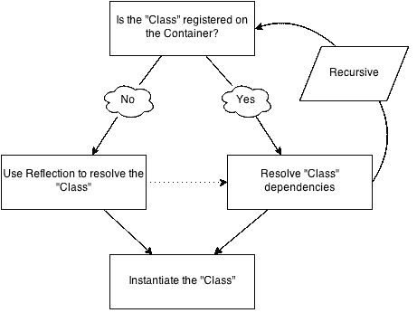

# 使用 Laravel 的 IoC 进行依赖注入

> 原文：<https://www.sitepoint.com/dependency-injection-laravels-ioc/>

作为开发人员，我们总是试图通过采用新的风格、使用设计模式和尝试新的健壮框架来寻找新的方法来编写设计良好和干净的代码。在本文中，我们将通过 Laravel 的 IoC 组件探索依赖注入设计模式，看看它如何改进我们的设计。

## 依赖注入

依赖注入是马丁·福勒创造的一个术语，它是将组件注入到你的应用程序中的行为。就像[沃德·坎宁安](http://en.wikipedia.org/wiki/Ward_Cunningham)说的那样:

> 依赖注入是敏捷架构的一个关键元素。

让我们看一个例子:

```
class UserProvider{
    protected $connection;

    public function __construct(){
        $this->connection = new Connection;
    }

    public function retrieveByCredentials( array $credentials ){
        $user = $this->connection
                        ->where( 'email', $credentials['email'])
                        ->where( 'password', $credentials['password'])
                        ->first();

        return $user;
    }
}
```

如果您想测试或维护这个类，您必须访问一个真实的数据库并进行一些查询。为了避免不得不这样做，并且为了*将*类从其余的类中分离出来，你有三个选择之一来注入`Connection`类，而不是直接使用它。

向类中注入组件时，可以使用以下三个选项之一:

### 构造函数注入

```
class UserProvider{
    protected $connection;

    public function __construct( Connection $con ){
        $this->connection = $con;
    }
    ...
```

### 定型剂注射

类似地，我们可以使用 setter 方法注入我们的依赖关系:

```
class UserProvider{
    protected $connection;
    public function __construct(){
        ...
    }

    public function setConnection( Connection $con ){
        $this->connection = $con;
    }
    ...
```

### 界面注入

```
interface ConnectionInjector{
    public function injectConnection( Connection $con );
}

class UserProvider implements ConnectionInjector{
    protected $connection;

    public function __construct(){
        ...
    }

    public function injectConnection( Connection $con ){
        $this->connection = $con;
    }
}
```

当一个类实现我们的接口时，我们定义 injectConnection 方法来解决依赖关系。

### 优势

现在，当测试我们的类时，我们可以模拟依赖类，并将其作为参数传递。每个类必须专注于一个特定的任务，不应该关心解决他们的依赖关系。这样，您将拥有一个更好的聚焦和可维护的应用程序。

如果你想了解更多关于 DI 的信息，Alejandro Gervassio 在本系列的[中有广泛而专业的报道，所以请务必阅读这些文章。那么，国际奥委会呢？Ioc(控制反转)并不是使用依赖注入的必要条件，但是它可以帮助你有效地管理你的依赖。](https://www.sitepoint.com/managing-class-dependencies-1/)

## 控制反转

Ioc 是一个简单的组件，它使得解决依赖关系更加方便。您向容器描述您的对象，并且每次解析一个类时，依赖关系都会被自动注入。

### 拉勒韦尔国际奥委会

当你请求一个对象时，Laravel Ioc 在解决依赖关系的方式上有些特别:



我们将使用一个简单的例子，我们将在本文中改进它。
`SimpleAuth`类有一个`FileSessionStorage`的依赖项，所以我们的代码可能是这样的:

```
class FileSessionStorage{
  public function __construct(){
    session_start();
  }

  public function get( $key ){
    return $_SESSION[$key];
  }

  public function set( $key, $value ){
    $_SESSION[$key] = $value;
  }
}

class SimpleAuth{
  protected $session;

  public function __construct(){
    $this->session = new FileSessionStorage;
  }
}

//creating a SimpleAuth
$auth = new SimpleAuth();
```

这是经典的做法，让我们从使用构造函数注入开始。

```
class SimpleAuth{
  protected $session;

  public function __construct( FileSessionStorage $session ){
    $this->session = $session;
  }
}
```

现在我们创建我们的对象:

```
$auth = new SimpleAuth( new FileSessionStorage() );
```

现在我想使用 Laravel Ioc 来管理所有这些。

因为`Application`类扩展了`Container`类，所以您总是可以通过`App`外观访问容器。

```
App::bind( 'FileSessionStorage', function(){
    return new FileSessionStorage;
});
```

`bind`方法的第一个参数是绑定到容器的唯一 id，第二个参数是每次解析`FileSessionStorage`类时要执行的回调函数，我们还可以传递一个表示类名的字符串，如下所示。

**注意:**如果你检查 Laravel 包，你会发现有时候绑定是这样分组的(`view`，`view.finder`..).

假设我们想将会话存储切换到 MySql，我们的类应该类似于:

```
class MysqlSessionStorage{

  public function __construct(){
    //...
  }

  public function get($key){
    // do something
  }

  public function set( $key, $value ){
    // do something
  }
}
```

既然我们已经更改了依赖关系，我们需要更改`SimpleAuth`构造函数，并将一个新对象绑定到容器！

> 高级模块不应该依赖于低级模块。两者都应该依赖于抽象。抽象不应该依赖于细节。细节应该依赖于抽象的
> 。
> 
> 罗伯特·马丁

我们的类不应该关心我们的存储是如何完成的，相反，它应该更专注于消费服务。

因此，我们可以对我们的存储实施进行抽象:

```
interface SessionStorage{
  public function get( $key );
  public function set( $key, $value );
}
```

这样我们就可以实现并请求一个`SessionStorage`接口的实例:

```
class FileSessionStorage implements SessionStorage{

  public function __construct(){
    //...
  }

  public function get( $key ){
    //...
  }

  public function set( $key, $value ){
    //...
  }
}

class MysqlSessionStorage implements SessionStorage{

  public function __construct(){
    //...
  }

  public function get( $key ){
    //...
  }

  public function set( $key, $value ){
    //...
  }
}

class SimpleAuth{

  protected $session;

  public function __construct( SessionStorage $session ){
    $this->session = $session;
  }

}
```

如果我们尝试使用`App::make('SimpleAuth')`通过容器解析`SimpleAuth`类，在尝试从绑定中解析类之后，容器将抛出一个`BindingResolutionException`，退回到反射方法并解析所有依赖项。

```
Uncaught exception 'Illuminate\Container\BindingResolutionException'  with message 'Target [SessionStorage] is not instantiable.'
```

容器正在尝试实例化接口。我们可以通过为我们的接口创建一个特定的绑定来解决这个问题。

```
App:bind( 'SessionStorage', 'MysqlSessionStorage' );
```

现在每次我们试图通过容器解析接口，都会得到一个`MysqlSessionStorage`实例。如果我们想切换我们的存储服务，我们可以只更新绑定。

**注意:**如果你想查看一个类是否被绑定到容器，你可以使用`App::bound('ClassName')`或者使用`App::bindIf('ClassName')`来注册一个绑定，如果它还没有被注册的话。

Laravel Ioc 还为共享绑定提供了`App::singleton('ClassName', 'resolver')`。
您也可以使用`App::instance('ClassName', 'instance')`来创建一个共享实例。
如果容器不能解析依赖关系，它将抛出一个`ReflectionException`，但是我们可以使用`App::resolvingAny(Closure)`来解析任何给定的类型或者作为一种回退形式。

**注意:**如果你注册了一个给定类型的解析器，那么`resolvingAny`方法也将被调用，但是来自`bind`方法的值将被返回。

## 最终提示

*   在哪里存储绑定:
    如果你只有一个小的应用程序，你可以使用你的`global/start.php`，但是如果你的项目越来越大，你必须使用一个[服务提供商](http://laravel.com/docs/ioc#service-providers)。
*   测试:
    当你只是在测试时，你需要考虑使用`php artisan tinker`，它非常强大，可以增加你的测试工作流程。
*   反射 API:
    PHP 反射 API 非常强大，如果你想了解 Laravel Ioc，你需要熟悉反射 API，一定要查看这个[教程](https://www.sitepoint.com/introspection-and-reflection-in-php/)以获得更多信息。

## 结论

和往常一样，了解一些事情的最好方法是检查源代码。Laravel Ioc 只是一个文件，完成所有的功能不会花你太多时间。你想更多地了解国际奥委会或国际奥委会吗？让我们知道！

## 分享这篇文章