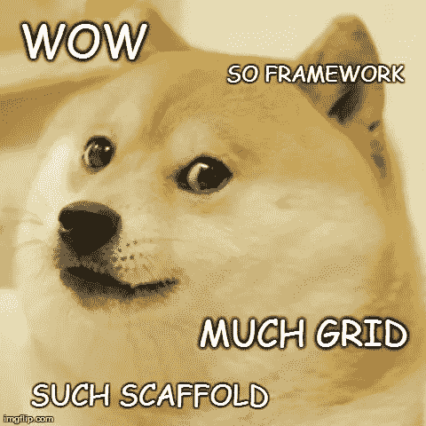

# 萨斯框架:指南针还是波旁？

> 原文：<https://www.sitepoint.com/compass-or-bourbon-sass-frameworks/>

偶尔，我们会在 Twitter、Reddit 或 StackOverflow 上看到这个问题。几乎所有和萨斯共事过的人都会在某个时候问自己该选择哪一个:指南针还是 T2 波旁酒？

如果我已经失去了一些你，指南针和波旁是萨斯的框架。你可能知道，Sass 是一个时髦的 CSS 预处理器，对吗？好吧。就像在 JavaScript 上放置 jQuery 或 Backbone 或其他东西一样，您可以在 Sass 上使用一个框架来帮助事情进展。

在今天的文章中，我想告诉你我对这个话题的看法。但首先，让我用一点历史来介绍这个话题。

## 历史

Compass 将自己描述为 Sass 的 *CSS 创作框架。它由[克里斯·埃普斯坦](https://twitter.com/chriseppstein)维护，他是 Sass(Ruby 版本)的两个维护者之一。Compass 一半是 Ruby，一半是 Sass，它提供了一大堆 mixins 和一个 Sass 工具箱。稍后将详细介绍。*

另一方面，**波旁酒**是由[思维机器人](http://thoughtbot.com/)的优秀团队用萨斯制造的。根据该项目的主页，波旁更像是一个图书馆，而不是一个框架；*一个用于 Sass 的简单轻量级 mixin 库*。

所以一方面我们有一个 Ruby/Sass 框架，另一方面我们有一个 Sass 库。或许很不一样？

## 混合蛋白

当你问一个 Compass/Bourbon 用户他用这个工具做什么时，他很可能会告诉你:*跨浏览器兼容性*。好吧，也许他不会这么说，但想法是一样的。Compass 和 Bourbon 都提供了一个庞大的 mixins 集合来处理 CSS3 特性，因此您不必处理供应商前缀或 CSS hacks。

```
// Compass
el {
  @include box-sizing(border-box);
}

// Bourbon
el {
  @include box-sizing(border-box);
}

// Doh. Same API. Awesome!
```

事实上，Compass 和 Bourbon 对大多数 mixins 使用相同的语法，使得从 Compass 到 Bourbon 或 Bourbon 到 Compass 的切换相当容易。

不过，这两个工具之间有一点很重要:从 Compass 1.0(与 Sass 3.3 一起发布)开始，Compass 直接从[获取数据](http://caniuse.com)，这意味着它将(几乎)总是更新供应商前缀，而 Bourbon 的有效性，截至本文撰写之时，取决于维护者的更新。

*注意:如果你使用[自动前缀](https://github.com/ai/autoprefixer)作为你的供应商属性的前缀，那么这个部分对你来说没什么关系。*

## 排印

Compass 和 Bourbon 都提供了一些与排版相关的混合、变量和函数。Compass 附带了一个完整的垂直节奏模块，包括许多变量和一些混音。

```
// Compass 
$base-font-size: 16px;
$base-line-height: 1.35;
$rhythm-unit: em;

element {
  @include adjust-font-size-to(42px);
}

element {
  font-size: 2.625em;
  line-height: 1.06071em;
}
```

如果你设置`$rhythm-unit`为`rem`而不是`em`，指南针甚至可以对付`px`后退的`rem`单位。那很好。这里有大量的选择，所以如果你是一个印刷爱好者，指南针可以满足你。

Bourbon 在排版功能方面没有那么强大，但它仍然提供了一些很好的入门功能。不仅可以有像素到`em`或者`rem`的转换，还有一些可爱的功能像[`golden-ratio()`](http://bourbon.io/docs/#golden-ratio)[`modular-scale()`](http://bourbon.io/docs/#modular-scale)。虽然这些与排版没有直接关系，但在设计文档的垂直节奏时，它们会派上用场。

事实上，Thoughtbot 决定在另一个名为 [Bitters](http://bitters.bourbon.io/) 的项目中解决排版问题(当然可以和波本威士忌一起使用)。在文章的最后有更多关于这个的内容。

## 网格

没有网格系统的 CSS 框架算什么，对吧？对吗？好吧。



Compass 过去与 Blueprint Grid 一起发布(据我所知，这与名为 <cite>Blueprint</cite> 的相当旧的 CSS 框架无关)。也就是说，Compass 的蓝图确实没有得到充分利用。在我见过的所有使用 Compass 的人当中，只有一个人尝试过 Blueprint。它的使用率如此之低，以至于 Chris Eppstein 决定从版本 1.0.0 开始将它从 Compass 中移除(匹配 Sass 3.3)。

与此同时，Bourbon 提供了一些 mixins 来帮助您构建自己的网格。有 [`flex-*`功能](http://bourbon.io/docs/#flex-grid)(与 Flexbox 无关)，还有 [`grid-width()`](http://bourbon.io/docs/#grid-width) 。实际上，Thoughtbot 在 Bourbon 之外有自己的网格系统，名为 [Neat](http://neat.bourbon.io/) ，它将自己描述为 Sass 和 Bourbon 的轻量级语义网格框架。所以，波旁本身并不包含网格系统，你可以好好利用 Neat。

长话短说，如果你需要一个与你的 Sass 框架紧密相连的网格系统，我建议你用 Bourbon + Neat。它们是由同样的人用同样的想法建造的。这就像一个拼图的两部分(你必须承认，这是一个简单的拼图)。

## 助手

Sass 框架中有趣的一点是它们经常提供*助手*。助手是预定义的 CSS 规则，可以直接在样式表中使用以节省时间。

例如，Compass 为[浮动清除](https://www.sitepoint.com/clearing-floats-overview-different-clearfix-methods/)提供了一个助手(包括几种不同的方法)，为旧的 Internet Explorer 版本提供了一些 CSS 技巧，一个重置(带有各种选项)，一些图像替换的技术，[和更多的](http://compass-style.org/reference/compass/utilities/general/)。

波旁称这些助手为附加组件[](http://bourbon.io/docs/#add-ons)*，但提供的助手比指南针略少。也就是说，Thoughtbot 在 [Bitters](http://bitters.bourbon.io/) 中包括了*的许多*助手，这是一个与波旁威士忌很相配的副业项目。*

 *## 鬼怪；雪碧

试着问一个 Compass 用户，为什么几个月或几年后他还在使用这个库；我打赌他会告诉你雪碧制造者的事。*这个*才是指南针真正擅长的。因为它部分是用 Ruby 构建的，Compass 可以用文件系统做一些很酷的事情。其中之一就是基于一个图像文件夹构建精灵。多棒啊。

```
// Compass simple API to build sprites
@import "icon/*.png";
@include all-icon-sprites;
```

它不仅提供了一种自动生成精灵的方法，而且还提供了一些方便的函数来访问样式表中的图像文件数据，比如`image-width()`、`image-height()`，甚至`inline-image()`来用 Base64 编码图像文件。

```
// Compass functions accessing file system
.logo {
  $image: "path/to/my/logo.png";
  width: image-width($image);
  height: image-height($image);
  background: inline-image($image) no-repeat;
}
```


因为 Bourbon 只在 Sass 中构建，所以它不能访问文件系统，所以它不提供类似这样的东西。因此，如果您需要一种动态构建 sprite 文件的方法，并且您没有运行 Grunt、Gulp 或 Ant 之类的任务运行器，那么这里的选择是明确的。

## 概述

为了快速参考，这里有一个总结了我所讨论的内容的表格。

|  | 指南针 | 波旁家族 |
| --- | --- | --- |
| 前缀 | 是(从<cite>开始，我可以使用……</cite>) | 是 |
| 排印 | 好的 | 体面(适合苦味) |
| 格子 | 不 | 用纯的 |
| 助手 | 是 | 是的+苦味 |
| 鬼怪；雪碧 | 是 | 不 |
| 社区 | 优秀的 | 很好 |
| 重量 | 沉重的 | 轻量级选手 |

## 最后的想法

所以最后:指南针还是波旁威士忌？

如果你问我:*都不是*。我是一个长期使用指南针的人，直到最近我因为很少使用而放弃了它。现在，我更喜欢在 Sass 项目中添加我自己的工具，而不是包含一个完整的框架。但这只是我。我认为在大多数情况下使用框架会更好，至少对于大项目来说是这样。

现在，当你做出选择时，有几个标准会很重要，但我认为你应该问自己的第一件事是:*我是否需要与图像相关的功能(图像尺寸、精灵生成器等。)?*

指南针在这点上很神奇，但是它让速度变慢了。这么慢…所以如果你不需要这个，那就去喝波旁威士忌吧。它快得惊人，因为它基本上只不过是一堆 Sass 混合在你的 Sass 样式表中做 Sass 的东西。

此外，如果你决定使用 Bourbon，我会推荐使用其他 Thoughtbot 项目: [Neat](http://neat.bourbon.io/) 作为网格系统， [Bitters](http://bitters.bourbon.io/) 作为基线(字体、变量、主题)，为什么不甚至[再填充](http://refills.bourbon.io/)，这基本上是一个有竞争力的替代方案 [Bootstrap](http://getbootstrap.com/) 提供了许多组件，随时可以在你的项目中使用。

## 分享这篇文章*