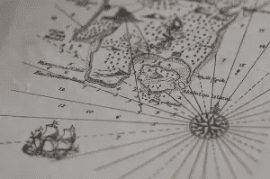
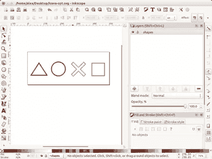
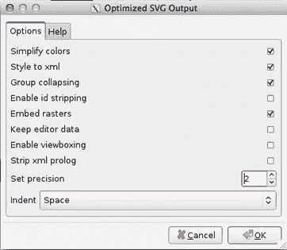
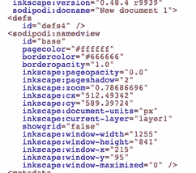
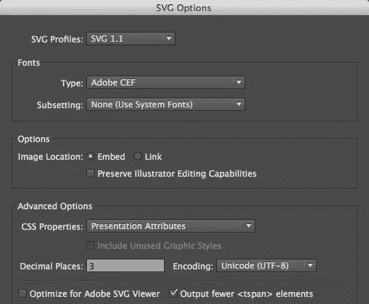
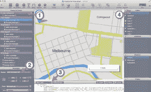
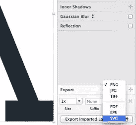
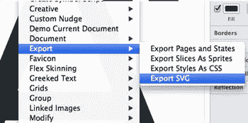
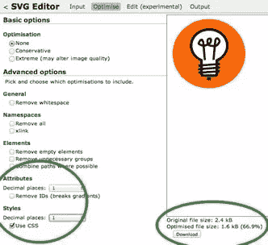

# 使用 SVG 的设计者指南–第 1 部分

> 原文：<https://www.sitepoint.com/designers-guide-working-with-svg/>

[](http://www.flickr.com/photos/hubmedia/3009549257/)

照片:安迪·菲尔德(现场办公室)

SVG 到底有什么大不了的？

你不就是在 Illustrator 中点击“*另存为 SVG* ”就得到一个 SVG 吗？

是也不是。虽然从技术上来说这是真的，但根据同样的逻辑，每个 MS Word 用户从技术上来说都是 web 开发人员。

也许要问的问题是:*SVG 文件比对等的 PNG 或 JPG 文件更有用吗？*

通常，我们从图形应用程序中获得的生成的 SVG 文件在制作它的应用程序之外实际上并没有太多用处。

当你得到一个可读的、可操作的文档，而不是一个从图形应用程序中弹出的密集的、晦涩难懂的文档时，SVG 的 ***真正的*** 威力变得更加清晰。

今天，我想给你一个关于 SVG 基础知识的快速指南，以及如何获得你可以使用的文件。

在接下来的几周里，我们将介绍一些您可以用这些文件做的更有趣的事情。

## SVG 101:如何创建 SVG？

可以说，SVG 最酷的一点是你不需要花哨(或昂贵)的软件来制作它们。就像你的 HTML/CSS 文件一样，你可以创建一个 SVG，只需要一个可靠的记事本，文本编辑甚至 VIM。

事实上，如果您以前从未手工编写过 SVG，可以试试这个:

*   在你选择的编辑器中创建一个新的文本文件。
*   添加以下三行:
    `<svg >`
    `<circle cx="40" cy="40" r="24" fill="#00cc00"/>`
    `</svg>`
*   将文件另存为' *whatever.svg* '。
*   把你的浏览器指向它。

给你。你已经创建了一个简单、完整的图形，比写一条推文还简单。

如果我们想在圆形后添加一个红色的矩形，我们可以添加如下内容。

`<rect x="100" y="20" height="40" width="70" fill="#ff3300"/>` 

如果我们想把圆形和矩形组合成一个单独的对象呢？

SVG 有一个方便的 [< g >](http://tutorials.jenkov.com/svg/g-element.html "SVG: The Group element") 元素，您可以将它用作将对象分组在一起的“容器”。把它想象成 HTML 中的一个 DIV。

我们可以这样做。

```
 <svg >
  <g id="shapes">
  <circle cx="40" cy="40" r="24" fill="#00cc00"/>
  <rect x="100" y="20" height="50" width="50" fill="#ff3300"/>  
  </g>
</svg> 

```

如您所见，SVG 编写和理解起来都相对简单。如果你了解你的 HTML，这应该感觉很熟悉。

然而，有*将是手工编码一个复杂的字母、图标或地图海岸线变得不切实际的时候。我们将需要一个图形工具，为我们提供干净、原始的 SVG。*

 *因此，让我们首先快速(但绝不是全面)地看一下处理 SVG 的一些主要图形编辑器——以及它们是如何执行的。

### Inkscape



Inkscape

我从 [Inkscape](http://www.inkscape.org/en/ "Inkscape vector graphics") 开始，因为尽管它可能不是最漂亮的，但它功能强大，免费，可以在所有平台上运行，并且可以生成非常好的 SVG。

像许多图形应用程序一样，Inkscape 在右栏有一个“图层”面板。每当您命名这些层中的一个时，该名称就会自动成为您的 SVG 中的一个组的 ID。

在 SVG 变成代码之前，这是开始构建和组织 SVG 的好方法。

**在 Inkscape 中导出 SVG**

如果你对 Inkscape 有所了解，很可能 Inkscape 使用 SVG 作为默认格式。

完美，对吧？

不完全是。

默认的 Inkscape 格式——被称为“Inkscape SVG”——并不是你想在 Inkscape 之外使用的格式。



Inkscape 中优化的 SVG 的导出对话框。

将这些文件保存为“工作文档”没问题，但是它们充满了 Inkscape 特有的无用代码，并且在 Inkscape 之外膨胀。

因此，当你在 Inkscape 中保存文档时，你会看到“Plain SVG”作为一种格式列在“Inkscape SVG”的下面。这样好多了。

更好的是，在文件格式列表的下方，你会看到“优化的 SVG”。

这个“优化 SVG”选项为您提供了一个导出设置对话框(如图)，包括修剪小数位和嵌入光栅图像的能力。

这个“优化的 SVG”与默认格式相比如何？

作为一个例子，这里有一个非常简单的 SVG 字母格式，在文本编辑器中查看时为 [2125 个字符。](http://cssdeck.com/labs/inkscapes-default-svg)



Inkscape 默认 SVG 显示了大量不必要的代码

看看标记，你会看到一行又一行的“inkscape”和“sodipodi”属性，它们在 Inkscape 之外没有任何意义。

作为[“优化 SVG”导出的相同文件变成 760 个字符](http://cssdeck.com/labs/inkscapes-optimized-svg)。

即使是这个文件，也可以在不改变其呈现方式的情况下，手动调整到 500 个字符以下。

简而言之，对于任何想要在浏览器中使用的文件，请始终使用“优化 SVG”选项。

**注意:**“优化的 SVG”选项可能需要您安装额外的 Python 库文件。如果这成为你的一个症结，“普通 SVG”仍然是一个很好的选择。

### Adobe Illustrator CC

Adobe Illustrator 很久以前就能够导出 SVG，但直到最近它还相当糟糕。

好消息是 Adobe 已经加强了他们的游戏，Illustrator CC 的 SVG 导出现在非常灵活和高效。

像 Inkscape 一样，Illustrator 会将您的所有图层名称转换为 SVG 组，因此请使用有意义的图层标题，不要错过适当组织您的作品的机会。

在“另存为”选项下，你会在下拉列表中找到 SVG。这将启动一个对话框(如图所示),让您设置精度级别



Illustrator SVG 导出选项面板

Illustrator 令人惊叹的工具集也是其最大的潜力 SVG 'gotcha '。人们很容易被诱惑使用在 SVG 中没有明显对等物的奢华画笔和滤镜。

大多数情况下，结果在视觉上会显得笨拙和臃肿，并且您将开始失去使用 SVG 的许多好处。

总之:用 Illustrator，但尽量不要太花哨。

另请注意，旧版 Illustrator 会导出 SVG，但您必须手动清理文件。

### 网络代码



WebCode 界面

[Webcode](http://www.webcodeapp.com/ "Webcode ") 是一个 OS-X 独有的选项，我在几周前回顾过这个选项[，所以我在这里就不赘述了。](https://www.sitepoint.com/webcode-review-create-better-svg/ "Webcode review")

Webcode 的一个很棒的方面是它能够很容易地从您的 SVG 生成后备 png 或 jpg。它还会在你求圈的时候给你纯 SVG 圈。

可以说，Webcode 积极鼓励您从一开始就用一个非常以 SVG 为中心的工具集来构建智能的、组织良好的 SVG。我喜欢。

### 素描

Sketch 是另一个 OS-X 独有的选项，似乎引起了设计师的极大共鸣。事实上，我们的彼得·巴卡克斯将在另一篇文章中讲述他转向素描的经历。我跑题了。



就纯工具集而言，Sketch 与 Adobe Fireworks 甚至 Illustrator 的关系可能比与 Photoshop 的关系更密切。它的核心是向量，而不是像素，这是一个好的开始。

但是，它能写出漂亮的 SVG 吗？

Sketch 当然是一个比 Webcode 这样的“以编码为中心”的工具更广泛的图形设计工具。因此，Sketch 目前不会在您工作时直接向您展示 SVG 代码。就我个人而言，我确实发现在点击导出之前能够看到我的代码很有用。

Sketch 只有一个“导出为 SVG”选项，所以目前没有办法根据你的喜好调整或调整 SVG 输出。

然而，也就是说，Sketch SVG 代码是我见过的最干净、考虑最周全的代码。

### Adobe Fireworks



虽然 [Fireworks](http://www.adobe.com/products/fireworks.html "Adobe Fireworks") 从未真正被设计用来编写 SVG，( [Aaron Beale 的 SVG Export](http://fireworks.abeall.com/extensions/commands/Export/) )扩展成功地将 SVG 的超能力移植到它上面。

通常，你可能认为这样的事后想法会产生糟糕的结果，但是实际上我已经从这个解决方案中得到了很好的结果。

它甚至允许您在一个较大的项目中导出较小的组件。当您从较小的 SVG 组件组装较大的 SVG 信息图或动画时，这可能很有用。

需要注意的事项:

*   它将路径坐标导出到小数点后四位。这远远超出了我们的需求。稍后我们将讨论如何使用 SVG 优化器来解决这个问题。
*   像 Inkscape 一样，Fireworks 保持矩形不变，但似乎会在导出时自动将圆形转换为更复杂的路径。

简而言之，如果你已经是一个烟花迷，这实际上是一个相当好的解决方案。

## 代码操场是磨练你的 SVG 的好地方

我发现像[CSSDeck.com](http://cssdeck.com/ "CSSDeck")和 [CodePen.io](http://codepen.io/ "Codepen code playground") 这样的实时“代码游乐场”在使用 SVG 时非常有用。

能够编辑你的 SVG 并看到结果是实时的，真的可以帮助你理解你在看什么。

只需在代码编辑器中打开您的 SVG，复制并直接粘贴到 HTML 窗口中。这些应用程序在您处理文件时为您提供实时反馈，并且是了解 SVG 如何工作的好方法。

## 在 SVG 中使用 CSS

当您意识到可以在 SVG 文档的顶部使用`<style>`块时，SVG 开始变得非常有趣。

与 HTML 一样，这允许您将重复属性从内联元素中移到顶部的单个类中，这通常会显著减小文件大小。显然，它还允许您从一个点对整个文档进行修改。

例如，以这样一个 SVG 元素为例:

```
 <rect  fill="#7f7f00" stroke="#7f0000" stroke-width="3" height="143" width="143" y="156" x="386" /> 

```

我们可以将 stroke、stroke-width 和 fill 属性从这个 PATH 元素中移出，并将其移到一个类中:

```
 <style>.basecolor{
    stroke: #7f0000;
    stroke-width: 3; 
    fill: #7f7f00;
    }</style>
...
<rect class="basecolor" height="143" width="143" y="156" x="386" /> 

```

现在，在这种规模下，这显然对您的文件大小没有什么影响，但一旦您让数百(或数千)个图像组件共享一个类，这就是一件大事。

如果你在想，*‘等等，笔画，笔画宽度和填充不是有效的 CSS’*，它们在 SVG 文件中完全有效。事实上，除了坐标、位置和大小之外，几乎所有的 SVG 属性都可以转移到 CSS 中。

## 优化您的 SVG 代码

[](http://petercollingridge.appspot.com/svg-editor)

彼得科林里奇的在线 SVG 优化。

无论您使用哪种编辑器，它们都不能编写完美的 SVG 代码。因此，值得关注独立的 SVG 优化器。

有许多可下载的应用程序，但我更喜欢彼得·科林里奇的在线工具。

正如我们前面提到的，一些应用程序会导出精确得离谱的坐标。这种精度不仅对其渲染方式毫无意义——1/100 像素是多少？—但是它会很快耗尽任何包含大量坐标的 SVG 文件中的文件大小。

[Peter 的 SVG 优化器](http://petercollingridge.appspot.com/svg-editor "Peter Collingridge's SVG optimizer")会在你给它的任何 SVG 文件中修剪小数点位置。大多数情况下，一位小数*应该足够了，最多两位。*

在路径密集的文档中，我发现这可以将你的文件大小减少三分之一以上——同时，使你的文件更容易阅读和理解。

例如，下面是从 Adobe Fireworks 导出到 SVG 的 Helvetica 字母“K”的路径。

```
 <path d="
M 18 191 L 58.1684 191 L 58.1684 129.1406 L 73.5454 112.6903 
L 128.6201 191 L 177 191 L 102.3118 83.5213 L 173.2865 6 
L 123.9128 6 L 58.1684 76.4261 L 58.1684 6 L 18 6 L 18 191 
L 18 191 Z" /> 

```

这是彼得的工具完成它的工作后的相同路径。

```
 <path d="
M18 191 L58.2 191 58.2 129.1 73.5 112.7 128.6 191 
177 191 102.3 83.5 173.3 6 123.9 6 58.2 76.4 58.2 6 
18 6 18 191 18 191Z"/> 

```

对眼睛来说，它呈现相同。

请记住这一点，尤其是你从 [Wikimedia Commons](http://commons.wikimedia.org/wiki/Main_Page "Wikimedia commons ") 或其他在线仓库获得的 SVG 地图、图标或图表。根据我的经验，大多数人需要一些爱。

Peter 的优化器还可以自动将内联 SVG 属性移动到文档顶部的样式块中。在更复杂的艺术品上，这成了一个杀手级的功能，我不知道还有其他工具可以自动完成这个过程。

非常方便。一定要去看看。

第一部分到此结束。

这是后续文章的一点基础。

下周我们将讨论更有趣的事情。到时候见！

## 分享这篇文章*