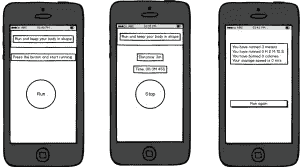
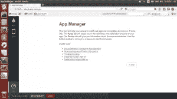

# Firefox 操作系统应用程序开发简介

> 原文：<https://www.sitepoint.com/introduction-firefox-os-app-development/>

## 什么是 Firefox OS？

Firefox OS 是两年前开发的新的移动操作系统。到目前为止，它基本上还是实验性的，但在去年，在 LG 和中兴等公司的支持下，它已经商业化，这些公司是实现 Firefox OS 的设备的主要生产商。火狐操作系统是由 Mozilla 创建的，其主要产品火狐网络浏览器是世界上使用最多的浏览器之一。Firefox 浏览器在网络历史上非常重要，拥有大量的支持者和应用开发者。要获得火狐操作系统的全面指导和一般介绍，请阅读杰夫·弗里森的文章。

在本文中，我们将创建一个打包的应用程序。我们不会安装上面文章提到的模拟器，而是 Mozilla 推荐的另一个。

## 为什么要创建 Firefox OS 应用程序？

因为简单。

Firefox OS 的应用程序是使用 HTML5 开发的，因此非常容易学习和开发，并为每个人提供了开发移动应用程序的机会。Mozilla 是开放网络的支持者，它已经建立了一个 API，使应用程序与设备集成变得容易，并且正在与 W3C 合作，使这个 API 成为一个标准。通过构建 Firefox OS 应用程序，您可以获得有价值的一般知识。

## 我们正在创建什么应用程序？



我决定在 [Firefox Marketplace](https://marketplace.firefox.com/app/runner-1) 上创建一个现有应用程序的简化版本。这是一个跑步应用程序，可以发现你跑了多少距离和时间，燃烧了多少卡路里和你的平均速度。

该应用程序只包含两个页面。第一页允许用户启动计时器，并给出实时运行数据。第二页显示结果，并询问用户是否想再次运行。

我们将使用[构件](http://buildingfirefoxos.com)及其基础设施和逻辑。构建模块使 Firefox OS 应用程序看起来更漂亮、更自然。在开始之前，最好先看一下框架、它的组件、如何使用它们以及它们是如何相互连接的。

你还需要 JQuery 和 [Jquery 彩色动画](http://www.bitstorm.org/jquery/color-animation/)插件。

## 安装模拟器



从 Mozilla 的 Firefox App Manager 附加页面安装 Firefox OS 模拟器。安装完成后，可以在 Firefox 浏览器中从工具> Web Developer > App Manager 菜单启动模拟器，点击窗口底部的蓝色按钮**启动模拟器**。

如果您有可用于测试的设备，也下载 **ADB 助手**和适当的驱动程序。你可以在这里找到关于在 Windows [中安装驱动程序的指南](https://hacks.mozilla.org/2013/05/pushing-firefox-os-apps-to-the-geeksphone/)

## 我们开始吧

[github 上简化的转轮](https://github.com/AleksanderKoko/runner-simplified)

解压缩构建块下载并打开 manifest.webapp 文件。如果我们只是修改它，它会更容易。这是包含应用程序信息的清单。我们将应用程序命名为“Runner-simplified ”,并将其输入“name”字段。

您可以添加任何您想要的描述，并保持 launch_path 不变，这是我们将用于应用程序的文件。不要改变图标链接，如果你想添加更多的图标，只需改变现有的。我们还添加了应用程序的版本以及开发人员的姓名和 url。

我们还需要在清单中添加更多的信息，比如屏幕方向和与使用地理定位系统相关的权限。因为我们每 10 秒钟就要找到设备的位置，以便找到跑步距离，所以添加这个权限很重要。在做了这些修改之后，我们有了下面的清单文件

```
{
  "name": "Runner-simplified",
  "description": "Run and keep your body in shape.",
  "launch_path": "/app.html",
  "permissions": { 
        "geolocation": { 
            "description": "Used to calculate the distance of run" 
        }
    },

  "icons": {
    "60": "statimg/app_icon_60.png",
    "128": "statimg/app_icon_128.png"

  },
  "version": "0.8",
  "developer": { 
    "name": "Your Name",
    "url": "App`s site"
  },
  "default_locale": "en",
  "orientation": "portrait-primary"
} 
```

## 我们将使用积木中的什么？

这个应用程序将只使用积木的两个组件，一个标题和一个蓝色按钮。首先创建一个备份文件，即**app.html**(我称之为**onePageApp.html**)的副本。这使得返回到开发的早期阶段变得更加简单。我们还通过将这个新文件(onepageApp.html)设置为启动路径来修改清单文件。

## 让我们编码

删除正文中的所有内容，除了带有 ***id="index"*** 的第一部分。这个部分有另一个子部分，带有“侧边栏”的**数据类型**(构建块有许多不同的**数据类型**，为所识别的元素赋予图形含义)。既然我们不需要，也删掉吧。第二个元素是保存标题的另一个子部分。我们需要它，所以不要删除它。标题包含 2 个边栏使用的链接，删除这些链接。

我们需要的最后一个修改是元素**“article”**。这将保存页面的代码。你可以在模型中看到，我们需要文本和一个按钮，将激活 GPS 并保持运行，直到按钮被点击。我们还删除了文章中“**list”**的数据类型为**的 **div** ，因为我们不需要它。我们现在有一张白纸。**

这是身体经过这些变化后的样子:

```
<section id="index" data-position="current">

    <section role="region">
        <header class="fixed">
            <h1>Building Blocks <em>demo</em></h1>
        </header>
        <article class="scrollable header">

        </article>
    </section>

</section> <!-- end index -->

<script type="text/javascript" defer src="js/status.js"></script>
<script type="text/javascript" defer src="js/seekbars.js"></script>
<script type="text/javascript" defer src="js/app.js"></script> 
```

修改标题从实物模型。

```
<header class="fixed">
    <h1>Run <em>and keep your body in shape</em></h1>
</header> 
```

为文本和按钮添加两个 div。在第一个 div 中为文本添加 h2，在第二个 div 中为按钮添加 span。

```
<article class="scrollable header">
    <div>
        <h2>Press the button and start running</h2>
    </div>
    <div>
        <span id="runButton"><span>Run</span></span>
    </div>
</article> 
```

让我们添加一点 CSS，使它更有吸引力。在主目录中添加一个名为 style.css 的文件并包含它。

添加以下几行 CSS 代码:

```
#index h2{
    text-align: center;
    margin-top: 60px;
}

#runButton{
    display: block;
    margin: 80px auto;
    width: 100px;
    height: 100px;
    border-radius: 999px;
    border: 10px solid green;
    font-size: 26px;
}

#runButton span{
    display: block;
    padding-top: 34px;
    padding-bottom: 34px;
    margin: 0 auto;
    text-align: center;
} 
```

现在让我们制作第二页，它可以是对第一页的修改。隐藏 **h2** 标题。我们将把按钮的文本从“Run”改为“Stop ”,并打印显示用户跑的距离和时间的文本。此文本将每秒更新一次。我们将使用 jQuery 来实现这一点。我们包括 jquery.js 和其他 JavaScript 库，以及用于彩色动画的 jquery 插件。

```
<script type="text/javascript" src="js/jquery-2.1.0.min.js"></script>
<script type="text/javascript" src="js/jquery.animate-colors-min.js"></script> 
```

现在我们有了一个正常工作的样本，我们可以在模拟器中测试它。进入应用程序管理器，点击**启动模拟器**，选择 Firefox OS 1.3(可能还有其他版本的模拟器)。使用模拟器，您可以看到应用程序在设备上的外观。

单击添加打包的应用程序，导航到您的清单文件，然后单击更新。这是将应用程序安装到模拟器中，或者是更新，如果之前安装了应用程序的话。在更新按钮旁边，有一个控制台按钮，帮助我们调试。

让我们添加一些 JavaScript 来隐藏标题，并更改文本和按钮的边框颜色。我们把这个放在文件的末尾。

```
<script>
    $("#runButton").on("click", function(){

        if($(this).find("span").html() === "Run"){
            $(this).find("span").html("Stop");
            $(this).animate({"borderColor": "red"}, "fast");
            $("#index").find("h2").slideUp();
            $("#realTimeStats").slideDown();
        }else{
            $("#realTimeStats").slideUp();
            $("#index").find("h2").slideDown();
            $(this).find("span").html("Run");
            $(this).animate({"borderColor": "green"}, "fast");
        }

    });
</script> 
```

这里我们为 run 按钮创建一个事件处理程序。如果按钮中的文本是“Run ”,它将被更改为“Stop ”(反之亦然),并且通过使用 jQuery 插件 jquery.animate-colors-min.js 来更改边框的颜色。

到目前为止，我们有一个改变文本及其边框颜色的按钮，一个 **h2** 标题和实时数据，通过点击按钮可以隐藏和显示。我们现在添加代码来查找坐标和运行距离。删除 app.js 中的所有代码，并添加以下代码:

```
var distance = 0;

var locationCords = {
    firstPos: null,
    secondPos: null
};

var distanceInterval;

function getLocation() {
    // Gets the current position
    navigator.geolocation.getCurrentPosition(function(position) {
        if(locationCords.firstPos === null){
            locationCords.firstPos = position.coords;
        }else{
            locationCords.secondPos = locationCords.firstPos;
            locationCords.firstPos = position.coords; 
            distance += calculateDistance(locationCords.secondPos, locationCords.firstPos);
        }
    }, function(error){ // error handling
        switch(error.code){
            case error.PERMISSION_DENIED:
                alert("User denied the request for Geolocation.");
                break;
            case error.POSITION_UNAVAILABLE:
                // Some error handling here
                break;
            case error.TIMEOUT:
                // Some error handling here
                break;
            case error.UNKNOWN_ERROR:
                // Some error handling here
                break;
        }
    });
}

function calculateDistance(loc1, loc2) {
    var R = 6371; // km
    var dLat = (loc2.latitude-loc1.latitude).toRad();
    var dLon = (loc2.longitude-loc1.longitude).toRad();
    var a = Math.sin(dLat/2) * Math.sin(dLat/2) +
        Math.cos(loc1.latitude.toRad()) * Math.cos(loc2.latitude.toRad()) *
            Math.sin(dLon/2) * Math.sin(dLon/2);
    var c = 2 * Math.atan2(Math.sqrt(a), Math.sqrt(1-a));
    var d = R * c;
    return d * 1000; //meters
}

Number.prototype.toRad = function() {
    return this * Math.PI / 180;
}; 
```

首先，我们创建 3 个变量:

*   **“距离”**，保存跑步距离
*   **“location coords”**，保存当前和上一个坐标
*   **"distanceInterval"** ，保存函数 **getLocation()** 被调用的间隔。

在函数的事件处理程序中，我们创建了一个每 10 秒执行一次的时间间隔，在我们点击“停止”后，这个时间间隔被打破，变量被重置。这是通过使用 distanceInterval 作为参数调用 clearInterval()来实现的。

```
$("#runButton").on("click", function(){

    if($(this).find("span").html() === "Run"){
        $(this).find("span").html("Stop");
        ...

        distanceInterval = setInterval(function(){getLocation()}, 10000);  // Add this

    }else{
        ...

        clearInterval(distanceInterval); // And this

    }
}); 
```

我们还添加了另一个更新运行数据的时间间隔，即保存该值的“timeInterval”。

```
$("#runButton").on("click", function(){

    if($(this).find("span").html() === "Run"){
        ...

        startTime = new Date().getTime();

        timeInterval = setInterval(function(){timeLeft()}, 1000);
        distanceInterval = setInterval(function(){getLocation()}, 5000);

    }else{
        ...

        clearInterval(timeInterval);
        clearInterval(distanceInterval);

        $("#hours").html(0);
        $("#minutes").html(0);
        $("#seconds").html(0);
        $("#meters").html(0);

    }

}); 
```

我们添加了另一个名为“startTime”的变量，它保存运行开始时的时间。我们通过调用**函数 timeLeft()** 创建一个间隔来更新时间。

我们将这段代码添加到 **app.js** 中。这使得计算时间和更新时间和距离成为可能。

```
function timeLeft(){

    var thisTime = new Date().getTime();

    var seconds = Math.floor((thisTime - startTime)/ 1000);

    var hours = Math.floor(seconds/3600);
    var minutes = Math.floor((seconds - (hours * 3600))/60);
    var seconds = Math.floor(seconds - (hours * 3600) - (minutes * 60));

    $("#hours").html(hours);
    $("#minutes").html(minutes);
    $("#seconds").html(seconds);
    $("#meters").html(Math.floor(distance));

} 
```

唯一剩下的就是用户可以看到运行结果的页面。我们创建一个没有标题的新部分。让我们从《积木 app.html》中复制一段并编辑它。我们把一个 id 和它的数据位置作为“右”。使用这些数据位置，我们可以从一页过渡到另一页。我们只留下了 article 元素，因为我们不需要任何其他元素。

```
<section role="region" id="viewResultsPage" data-position="right">
    <article class="content scrollable header">

        <div style="text-align: center;">
            <div><h2>You have run <em id="resMeters"></em> meters.</h2></div>
            <div><h2>You have rund <em id="spanHours"></em> H <em id="spanMinutes"></em> M <em id="spanSeconds"></em> S.</h2></div>
            <div><h2>Your avarage speed is <em id="avarageSpeed"></em> m/s</h2></div>
            <button class="recommend" style="margin-top: 150px;">Run Again</button>
        </div>

    </article>
</section> 
```

我们需要添加的是从 id="index "的部分到 **id="viewResultsPage"** 的部分的转换。

```
$("#runButton").on("click", function(){

    if($(this).find("span").html() === "Run"){
        ...

    }else{
        ...

        $("#viewResultsPage").removeClass("right");
        $("#viewResultsPage").addClass("current");
        $("#index").addClass('left');
    }

}); 
```

在模拟器中再测试一次。只需点击更新到应用程序管理器，并看到结果。

我们选择 id="viewResultsPage "的部分，删除类" right "并添加类" current "。在 id="index "的部分中添加类" left"。为了回到 id="index "的部分，只需将那些类添加回来。

```
$("#viewResultsPage").find("button").on("click", function(){
    $("#viewResultsPage").addClass("right");
    $("#viewResultsPage").removeClass("current");
    $("#index").removeClass('left');
}); 
```

这是“再次运行”按钮的一个简单事件处理程序，它与我们从 index 到 viewResultsPage 的操作相反。

最后一件事是将运行数据打印到视图 ResultsPage 中，并为新的运行重置每个变量。

```
function timeLeft(){
    ...

    $("#emMeters").html(Math.floor(distance));
    $("#emHours").html(hours);
    $("#emMinutes").html(minutes);
    $("#emSeconds").html(seconds);
    $("#avarageSpeed").html(Math.floor(distance/((hours*3600) + (minutes*60) +seconds)));

}

$("#viewResultsPage").find("button").on("click", function(){
    ...

    startTime = 0;
    distance = 0;
    locationCords.firstPos = null;
    locationCords.secondPos = null;

}); 
```

## 结论

创建一个 Firefox OS 应用程序并不难，对于任何有 web 开发经验的人来说都很容易。使用构建模块使它变得更加简单。火狐操作系统是一个新的移动操作系统，正在做出其他操作系统没有过的举动。我相信开放的网络将会带来一个网络新时代，Firefox OS 和 Mozilla 正在做出巨大的努力。

你对 Firefox OS 有什么看法？

## 分享这篇文章