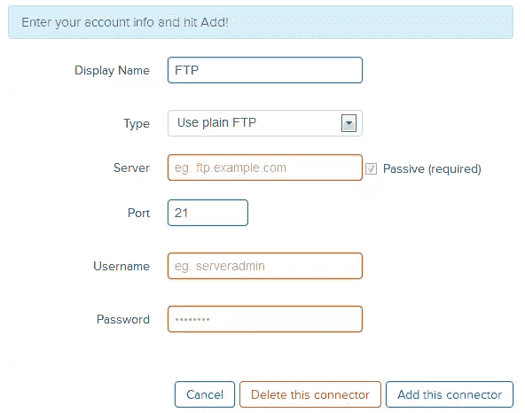
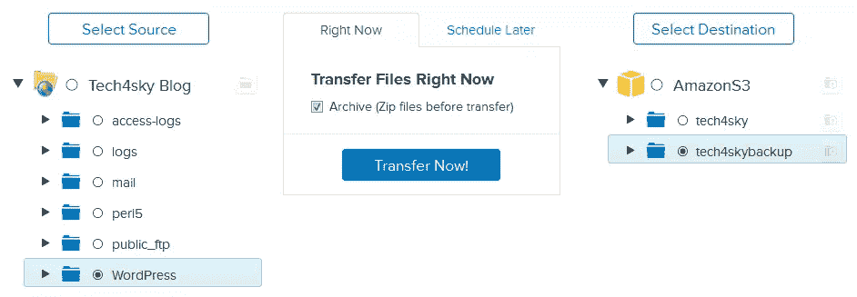
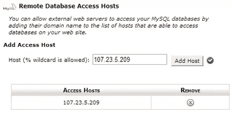
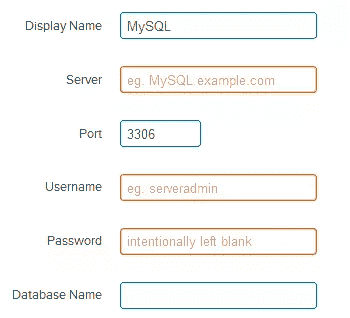

# 使用 Mover.io 轻松备份网站

> 原文：<https://www.sitepoint.com/effortless-website-backups-with-mover/>

进行网站备份的传统方式是下载并保存网站文件的本地副本到你的电脑或云存储服务，如 Dropbox 和亚马逊 S3。

但是当备份的规模很大时，事情就变得难以处理了。因此，一个大的互联网数据计划与快速下载速度，以及相当大的块你的时间是需要拉这一关。

我备份了我的 WordPress 博客，并把它保存在亚马逊 s3 的一个特殊的桶里。我必须承认，这个过程并不有趣。这就是为什么我寻找自动化备份过程的替代方案，经过数小时的研究和测试，我最终选定了一项名为 [mover](https://mover.io/) 的服务。

## Mover.io 简介

Mover.io 是一家安全的云传输公司，在各种不兼容的 web 技术之间充当中间人。当你喝咖啡时，Mover 从一个地方(内部称为“连接器”)获取文件，并将它们传输/转换到另一个地方。

因为它不在您的计算机上运行，所以它不使用您的任何资源(CPU、内存、磁盘空间或网络带宽)来传输文件。它支持超过 20 个连接器，包括 FTP、SFTP、Dropbox、Google Drive、MySQL、Rackspace 和其他的[主机。](https://mover.io/connectors/)

Mover 在注册时给你 2 GB 的免费空间，不需要信用卡。您可以在此查看所有定价详情。

## 为什么选择 Mover？

我很确定我们中的很多人都在多个云存储解决方案上拥有账户。就像俗话说的“不要把所有的鸡蛋放在一个篮子里”，为了安全起见，在多个位置保存网站备份是很重要的。

Mover 不仅允许您备份网站，还可以将备份转移到您拥有的多个云存储帐户，而不必下载和重新上传备份。

## 使用 Mover 进行网站备份

现在我们已经讨论了一些关于 Mover 的特性，以及为什么你应该使用它，让我们看看如何使用 Mover 来保存 WordPress 到亚马逊 S3 的备份。使用 Mover，您不仅可以备份您的网站文件，还可以备份您的数据库。注意:目前只支持 MySQL 数据库。

为了演示如何使用 Mover 使网站备份变得简单，我将向你展示我如何将我的 WordPress 文件和数据库的备份保存到亚马逊 S3 桶中。备份将分为两个过程:首先是 WordPress 文件，然后是 MySQL 数据库。

我们将在备份过程中使用以下三个连接器:FTP(Mover 用来访问服务器中的网站文件)、亚马逊 S3 和 MySQL。

### WordPress 文件备份

当您第一次登录到 Mover 界面时，您将看到两个选项:选择“源”的方法和选择“目的”的方法。

要创建 WordPress 备份文件并将其发送到亚马逊 S3，您需要以“FTP 连接器”的形式添加一个“源”。您将添加您的 web 服务器凭证来完成连接器选项。

接下来，您将选择一个“目的地”。为此，您将选择一个“S3 连接器”，添加您的 S3 访问 ID 和秘密访问密钥来完成连接器选项。

要启动备份，选择你的 WordPress 安装文件夹和 S3 桶旁边的 HTML 单选按钮。

如果您想要 zip 格式的备份，请勾选“存档(传输前压缩文件)”复选框。最后，单击“立即传输”按钮或安排以后备份。

转移完成后，将会向您发送一封包含迁移详细信息的电子邮件，如下所示。

### MySQL 数据库备份

没有数据库，我们的 WordPress 备份是不完整的。需要将 Mover IP 地址添加为“访问主机”,以便授予对您的服务器的访问权限，使其能够进行连接。

例如，在 cPanel 的数据库部分，您可以选择“远程 MySQL”选项:

然后添加移动器 IP 地址作为“访问主机”:

关于用 cPanel 和 Mover 备份数据库的完整细节可以在这里找到。

现在，对我们的服务器的访问已经被授予，您可以添加一个新的“源”并选择“MySQL 连接器”。然后填写包含您的服务器 IP 地址和端口、数据库名称以及 DB 用户名和密码的详细信息。

选择你的 WordPress 数据库和 S3 桶旁边的单选按钮。

最后，单击“立即传输”按钮或安排以后备份。

注意:Mover 会为您的数据库备份创建一个`.dump`文件，如果您将来遇到问题，可以使用它来恢复您的数据库。如果您使用 phpMyAdmin 这样的工具，在恢复或导入数据库时，该工具接受扩展名为`.sql`的数据库文件或 zip 存档中的`.sql`文件，那么您需要将数据库备份从`.dump`更改为`.sql`——否则，将会抛出一个错误。

## 结论

一旦您执行了首次备份，您的连接器将被保存，因此您不必在每次想要执行另一次备份时都创建连接器。

Mover 确实是救命恩人。我不再花费数小时下载和同步我的 WordPress 备份到亚马逊 S3。

如果你使用过 Mover，或者你尝试过其他服务，我们很乐意在评论中听到这些信息。

## 分享这篇文章