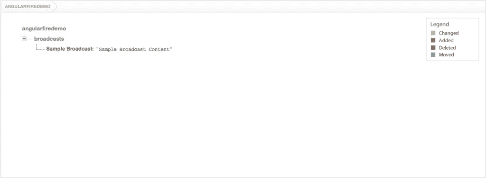

# 用 Firebase 和 Angular 创建三向数据绑定

> 原文：<https://www.sitepoint.com/creating-three-way-data-binding-firebase-angularjs/>

如你所知， [FireBase](https://firebase.google.com/) 充当你的应用程序的实时后端。我们都知道这有多棒。但你知道什么更棒吗？是 AngularJS+FireBase。FireBase 官方发布了一个名为 [AngularFire](http://angularfire.com) 的绑定，将 FireBase 的所有乐趣和欢乐带给 AngularJS。作为 AngularJS 开发人员，我们如此热爱数据绑定，甚至连做梦都在想它！与 AngularJS 中传统的双向数据绑定相比，使用 AngularFire，我们可以利用三向数据绑定创建一些非常棒的东西。本教程将在使用 AngularFire 创建一个简单的实时应用程序时，向您概述三向绑定。本文假设读者已经了解 FireBase，并在 AngularJS 中做过一些前期开发。

## 什么是三向数据绑定

在 AngularJS 中，由于双向数据绑定，我们的范围模型和视图保持同步。但是如果你引入 AngularFire，从而使用 FireBase 作为后端，你就拥有了一个三向绑定特性。您基本上可以将您的模型数据绑定到 FireBase 位置，这样无论何时您的模型发生更改，这些更改都会自动推送到 FireBase。类似地，每当特定 FireBase 位置的数据发生变化时，您的本地范围模型也会更新。而且，由于我们的视图和范围模型已经同步，这就创建了一个三向数据绑定。显而易见的好处是，它可以让你创建很酷的实时应用程序，在这些应用程序中，数据会频繁更改，并且这些更改会广播给所有连接的用户。所有这些都发生在没有任何重大努力的情况下。如果您正在构建一个聊天应用程序、一个多人游戏应用程序或一个广播系统，您可以利用这个特性。

## 入门指南

为了演示三向绑定的概念，让我们创建一个示例应用程序。我们的应用程序将是一个实时广播系统，用户可以实时广播他们正在键入的内容。对于每个用户，将有两个选项:

*   开始广播
*   观看广播

要开始广播，用户需要提供广播的名称。一旦用户输入名字并点击开始，他们就可以开始广播了。要观看广播，他们需要从下拉菜单中选择一个广播。

## 基础建筑

首先，我们需要了解如何存储我们的广播数据。首先，登录 FireBase 并创建一个新的 FireBase 存储。我创建了一个名为`angularfiredemo`的 FireBase，因此我们将使用 URL `https://angularfiredemo.firebaseio.com`来存储数据。注意，每个 FireBase 位置由一个 URL 表示，我们可以有多个广播来处理将使用我们系统的许多用户。让我们把所有的广播都保存在`https://angularfiredemo.firebaseio.com/broadcasts`这个位置下。每个广播有两个部分:名称和内容，用键/值对表示。示例广播数据的存储方式如下图所示。



要观看广播，用户需要选择一个特定的广播名称，该名称由我们的 FireBase 中的关键字表示。我们的下一步是围绕这些关键点构建 AngularJS 应用。

对最终产品感兴趣的人可以在 [Plunker](http://embed.plnkr.co/VkN1HQy8LxaXLymodVzS/preview) 查看演示。要获得实时体验，请并排打开浏览器的两个实例。首先，给你的广播一个名字，启动它，然后开始写作。在第二种情况下，从下拉菜单中选择您刚刚开始的广播。现在你可以看到实时广播。

## 构建应用程序

要开始，我们需要以下脚本:

*   `AngularJS`:主 AngularJS 脚本。
*   `FireBase`:启用 FireBase 支持的脚本。
*   `AngularFire`:角状骨的燃烧基结合。
*   `Angular Route`:用于 AngularJS 中的路由支持。
*   `Angular Sanitize`:整理来自 FireBase 的输入数据。

为了快速设计布局，我们将使用引导 CSS。

### 第一步

第一步是创建我们的主应用模块，如下所示:

```
angular.module('firebaseDemo', ['firebase', 'ngSanitize', 'ngRoute']);
angular.module('firebaseDemo').constant('FIREBASE_URL','https://angularfiredemo.firebaseio.com/broadcasts');
```

我们的主模块依赖于另外三个模块:`firebase`、`ngSanitize`和`ngRoute`。AngularFire 的所有功能都封装在自己的模块`firebase`中。`ngSanitize`和`ngRoute`分别用于净化数据和路由支持。我们还定义了一个常量`FIREBASE_URL`，它代表存储所有广播的位置。

### 第二步

现在，让我们创建一个从 FireBase 检索广播的工厂。

```
angular.module('firebaseDemo').factory('broadcastFactory', function($firebase,FIREBASE_URL) {
  return {
    getBroadcast: function(key) {
      return $firebase(new Firebase(FIREBASE_URL + '/' + key));
    },
    getAllBroadcasts: function() {
      return $firebase(new Firebase(FIREBASE_URL));
    }
  };
});
```

我们的工厂`broadcastFactory`声明了对`FIREBASE_URL`的依赖，它代表了我们广播的位置。我们的工厂也依靠一个叫做`$firebase`的 AngularFire 服务。它接受一个`FireBase`对象，并返回一个与远程 FireBase 位置保持同步的特殊对象。具有`$add()`、`$set()`、`$child()`等功能。来处理数据。每当对这个本地对象进行更新时，都会将更改推送到远程 FireBase 位置。

工厂有两个功能:

*   `getBroadcast(key)`:返回一个代表广播的对象。这个对象有一个名为`$value`的属性，表示广播的内容。我们使用这个对象来创建一个三方绑定，这样无论用户输入什么，都可以与远程 FireBase 位置保持同步。
*   这个函数返回一个对象，这个对象的属性是所有的广播。我们将这些数据呈现给用户，以便他们可以选择要观看的广播。

### 第三步

下一步是在`index.html`中创建我们的主视图:

```
<!DOCTYPE html>
<html ng-app="firebaseDemo">
  <head>
    <meta charset="utf-8" />
    <title>AngularFire Demo</title>
    <link rel="stylesheet" href="style.css" />
    <link rel="stylesheet" href="//netdna.bootstrapcdn.com/bootstrap/3.1.1/css/bootstrap.min.css" />
    <script src="https://ajax.googleapis.com/ajax/libs/angularjs/1.2.16/angular.min.js" data-semver="1.2.16"></script>
    <script src="https://code.angularjs.org/1.2.16/angular-sanitize.js" data-semver="1.2.16"></script>
    <script src="https://code.angularjs.org/1.2.16/angular-route.js" data-semver="1.2.16"></script>
    <script src="https://cdn.firebase.com/js/client/1.0.6/firebase.js"></script>
    <script src="https://cdn.firebase.com/libs/angularfire/0.7.1/angularfire.min.js"></script> 
    <script src="app.js"></script>
  </head>
  <body>
    <div class="container"> <br/>     
      <div class="row">
        <div class="col-xs-5 col-xs-offset-1 text-right">
          <a class="btn btn-lg btn-primary" href="/write">Write Something</a>
        </div>
        <div class="col-xs-5 text-left">
          <a class="btn btn-lg btn-success" href="/view">View a Broadcast</a>
        </div>
      </div>    
      <div ng-view></div>
    </div>
  </body>
</html>
```

主视图有两个链接:

*   `Write Something`:加载一条新的 AngularJS 路线，让用户开始广播。
*   `View a Broadcast`:加载允许用户观看广播的 AngularJS 路由。

您还可以看到`ng-view`指令，其中将加载不同的路线。我们所有的 AngularJS 代码都在`app.js`中。

**注意**:任何一个认真的 AngularJS app 都应该考虑代码模块化，要么分层，要么按特性模块化。对于这个简单的应用程序，我把所有的 AngularJS 组件如`controllers`和`directives`放在一个文件中，`app.js`。但这肯定不是大规模 AngularJS 应用的发展方向。

### 第四步

接下来，创建两个不同的视图:一个用于广播，另一个用于查看。我们还将使用`$routeProvider`来配置路由。以下代码摘自`views/write.html`。

```
<hr/>
<div class="row">
  <div class="col-xs-4 col-xs-offset-3">
    <input type="text" class="form-control input-lg" ng-model="broadcastName" placeholder="Type your broadcast name here" />
  </div>
  <div class="col-xs-5">
    <button class="btn btn-lg btn-success" ng-click="startBroadcast()" ng-disabled='isButtonEnabled()'>Start</button>
  </div>
</div>
<h1 class="text-center">Write Something. . .</h1>
<div class="row">
  <div class="col-xs-8 col-xs-offset-2">
    <div id="editor" demo-editor model="broadcast" class="well">
    </div>
  </div>
</div>
```

不用担心`<div id="editor" demo-editor></div>`。`demoEditor`是一个自定义指令，将在下面显示。

与此视图相关联的相应控制器是:

```
angular.module('firebaseDemo').controller('BroadcastController', function($scope, broadcastFactory) {
  $scope.isEditable = false;
  $scope.broadcastName = '';
  $scope.isButtonEnabled = function() {
    return ($scope.broadcastName === 'undefined') || ($scope.broadcastName.length < 1);
  };
  $scope.startBroadcast = function() { 
    $scope.isEditable = true;
    $scope.broadcastFromFireBase = broadcastFactory.getBroadcast($scope.broadcastName);
    $scope.broadcastFromFireBase.$set('');
    $scope.broadcastFromFireBase.$bind($scope, 'broadcast');
  };
});
```

我们的控制器有两个依赖项，`$scope`和`broadcastFactory`。`isEditable`范围模型用于指示我们的编辑器是否是活动的。当用户在我们的视图中单击 Start 按钮时，编辑器会激活并接受输入。我们的视图还包含一个绑定到范围模型的文本字段，`broadcastName`。在开始广播之前，我们要求用户给广播起一个名字。广播内容将根据这个密钥存储在我们的 FireBase 中。

`isButtonEnabled()`功能用于跟踪广播名称是否为空。如果是这样，那么我们禁用开始按钮。该功能与附加在开始按钮上的`ng-disabled`指令一起使用。

`startBroadcast()`功能用于启动广播。由于有了`ng-click`指令，当点击开始按钮时，这个函数被调用。在这个函数中，我们将`isEditable`模型设置为`true`，激活我们的编辑器。接下来，我们调用`broadcastFactory.getBroadcast()`函数，将`broadcastName`作为一个键传递。然后，我们使用`$set()`在这个位置设置一个空字符串。这充当初始广播内容。注意，这个操作在`https://angularfiredemo.firebaseio.com/broadcasts`下创建了一个新子节点。这个子的名字和`$scope.broadcastName`的值一样。所以，我们新广播的存储位置是`https://angularfiredemo.firebaseio.com/broadcasts/<broadcastName>`。注意，这个位置的初始内容将是一个空字符串。

最后，我们将执行最关键的操作，创建一个三方绑定。操作`$scope.broadcastFromFireBase.$bind($scope, 'broadcast');`就是这样做的。因此，远程 FireBase 位置与我们的本地范围模型`broadcast`保持同步。这个本地模型也绑定到我们的编辑器。因此，每当用户在编辑器中输入内容时，`broadcast`模型就会更新。此外，由于三向绑定，远程 FireBase 内容也将随新的广播内容一起更新。

现在，让我们转到下一个视图，它存在于`views/view.html`中。

```
<h1 class="text-center">Live Broadcast</h1>
<div class="row">
  <div class="col-xs-4 col-xs-offset-4">
    <select ng-model="broadcastToView" ng-change="broadcastSelected()" class="form-control" ng-options="k as k for (k, v) in broadcasts">
      <option value="">{{dropdownMessage}}</option>
    </select>
  </div>
</div>
<div class="row">
  <div class="col-xs-8 col-xs-offset-2">
    <div id="editor" class="well" ng-bind-html="broadcast.$value">
    </div>
  </div>
</div>
```

相应的控制器代码如下所示。

```
angular.module('firebaseDemo').controller('BroadcastViewerController', function($scope, broadcastFactory) {
  $scope.dropdownMessage = 'Retrieving Broadcasts...';
  $scope.broadcasts = broadcastFactory.getAllBroadcasts();
  $scope.broadcastSelected = function() {
    $scope.broadcast = broadcastFactory.getBroadcast($scope.broadcastToView);
  }
  $scope.broadcasts.$on('loaded', function() {
    $scope.dropdownMessage = 'Select a broadcast';
  });
});
```

当路由加载时，我们通过调用`broadcastFactory.getAllBroadcasts()`获得所有的广播。请记住，这是一个包含所有子对象作为属性的单个对象。属性名称是广播名称，而它们的值代表广播内容。这些广播名称在下拉列表中显示给用户，以便他们可以选择要观看的广播。

当下拉列表的值由于选择而改变时，函数`broadcastSelected()`被调用。该函数使用`broadcastFactory.getBroadcast()`获取特定的广播对象。这个对象有一个名为`$value`的属性，代表实际的内容。最后，我们通过`ng-bind-html`将这个值绑定到我们的`div`，这样用户就可以实时看到广播。使用`ng-bind-html`是因为 FireBase 位置可能也有 HTML 内容。因为这个指令，我们包含了`ngSanitize`模块(来净化数据)，没有这个模块，指令将抛出一个异常。

还要注意，当加载视图时，FireBase 数据不会立即同步。`$scope.broadcasts`将在几秒钟后显示实际值。因此，在数据从服务器同步之前，最好表明我们正在检索下拉数据。这就是为什么我有型号`$scope.dropdownMessage`作为下拉列表中的第一个`<option>`。当数据实际上从服务器同步时，一个`loaded`事件被触发，我们将`dropdownMessage`值更改为`Select a broadcast`。

### 第五步

我们还有一个自定义指令`demoEditor`，它将一个`div`转换成一个可编辑的`div`，这样用户就可以在其中输入内容。我知道我们可以用一个简单的`textarea`，但是如果你想给用户写 HTML 的能力呢？也许是某种所见即所得的编辑器？在这种情况下，我们需要一个`div`，用户可以在那里输入。下面是我们的指令定义:

```
angular.module('firebaseDemo').directive('demoEditor', function(broadcastFactory) {
  return {
    restrict: 'AE',
    link: function(scope, elem, attrs) {
      scope.$watch('isEditable', function(newValue) {
        elem.attr('contenteditable', newValue);
      });
      elem.on('keyup keydown', function() {
        scope.$apply(function() {
          scope[attrs.model] = elem.html().trim();
        });
      });
    }
  };
});
```

这个指令非常简单。编辑器`div`最初是不可编辑的，当用户点击 Start 时就变成可编辑的了。由于这是一个`div`元素，您不能附加`ng-model`来同步它的内容到一个模型。因此，我们附加了一个`keyup keydown`监听器来保持作用域模型与这个`div`内容同步。`scope`模型名称(我们希望保持更新)作为属性传递给指令。如果您没有注意到，该指令在视图中是这样使用的:

```
<div id="editor" demo-editor model="broadcast" class="well"></div>
```

`model`属性指定了要保持同步的`scope`模型。还要注意，这个指令没有创建新的作用域。它使用父作用域。

### 第六步

让我们来配置路由，享受酷炫的三路绑定吧！

```
angular.module('firebaseDemo').config(function($routeProvider, $locationProvider) {
  $routeProvider.when('/write', {
    controller: 'BroadcastController',
    templateUrl: '/views/write.html'
  }).when('/view', {
    controller: 'BroadcastViewerController',
    templateUrl: '/views/view.html'
  }).otherwise({
    redirectTo: '/write'
  });
  $locationProvider.html5Mode(true);
});
```

## 结论

我希望你喜欢 AngularJS 和 FireBase 的实验。AngularJS 与 FireBase 结合使用，可以用来创建实时同步的优秀应用程序。我鼓励你浏览一下 [AngularFire](https://github.com/angular/angularfire) 文档，了解更多关于 API 方法的知识。祝你在**过得愉快，真正的**时光！！

完整的源代码可以从 [GitHub](https://github.com/jsprodotcom/source/blob/master/AngularFireDemo.zip) 下载。

## 分享这篇文章