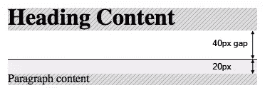
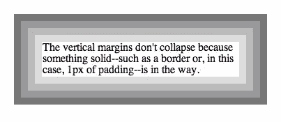

# 折叠页边距

> 原文：<https://www.sitepoint.com/collapsing-margins/>

让我们来探究折叠边距的确切后果，以及它们将如何影响页面上的元素。

W3C 规范将折叠边距定义如下:

在本规范中，折叠边距这一表述是指两个或多个框(可能彼此相邻或嵌套)的相邻边距(没有非空内容、填充、边框区域或分隔它们的间隙)组合在一起形成一个边距

简单来说，这个定义表明当两个元素的垂直边距接触时，只有边距值最大的元素的边距会被接受，而边距值较小的元素的边距将被折叠为零。在一个元素具有负边距的情况下，边距值被加在一起以确定最终值。如果两者都是负值，则使用较大的负值。此定义适用于相邻元素和嵌套元素。

还有其他一些元素没有折叠边距的情况:

*   浮动元素
*   绝对定位元素
*   内嵌块元素
*   overflow 设置为除 visible 之外的任何内容的元素(它们不会与其子元素一起折叠边距。)
*   清除的元素(它们不会将其顶部边距与其父块的底部边距折叠在一起。)
*   根元素

这是一个很难理解的概念，所以我们来看一些例子。

## 折叠相邻元素之间的边距

相邻元素之间的边距折叠。简而言之，这意味着对于普通文档流中的相邻垂直块级元素，只有具有最大边距值的元素的边距会被接受，而具有较小边距值的元素的边距将被折叠为零。例如，如果一个元素有一个`25px`下边距，而紧接在它下面的元素有一个`20px`上边距，那么只有`25px`下边距将被执行，并且元素之间的距离将保持为`25px`。他们不会像预期的那样分开`45px` (25+20)。

这个行为最好用一个简短的例子来说明。考虑以下代码:

```
h1 {
  margin: 0 0 25px 0;
  background: #cfc;
}
p {
  margin: 20px 0 0 0;
  background: #cf9;
}
```


从图 1 中可以看到，元素之间的间距只有`25px`，较小的边距已经缩小到零。如果在上面的例子中，元素有相等的边距(比方说，每个 20 个像素)，它们之间的距离将只有`20px`。

有一种情况会与折叠边距的行为稍有不同:如果其中一个元素的上边距或下边距为负，那么正负边距将会相加，以达到最终的真实边距。这里有一个演示这个概念的示例样式表:

```
h1 {
  margin: 0 0 25px 0;
  background: #cfc;
}
p {
  margin: -20px 0 0 0;
  background: #cf9;
}
```

h1 元素的下边距是正数(`25px`)，p 元素的上边距是负数(-20px)。在这种情况下，将两个数字相加，计算出最终的差额:`25px` + (- `20px` ) = `5px`。

如果此计算的结果是负数，此值将产生一个元素与另一个元素重叠的效果。可以说，负边距将元素拉向正边距的相反方向。有关负边距的更多详细信息，请参见边距。

## 折叠父元素和子元素之间的边距

到目前为止，我们只解决了相邻元素的塌陷效应，但是对于边界接触的父元素和子元素来说，同样的过程也是成立的。所谓“接触”，我们指的是相邻边距之间没有填充、边框或内容的地方。在下面的示例中，父元素有一个设置了上边距的子元素:

```
h1 {
  margin: 0;
  background: #cff;
}
div {
  margin: 40px 0 25px 0;
  background: #cfc;
}
p {
  margin: 20px 0 0 0;
  background: #cf9;
}
```

在上面的样式表中，您可以看到为`p`元素声明了一个顶部边距值，在下面的代码摘录中，您可以看到`p`元素是 div 元素的子元素:

```
<h1>Heading Content</h1>
<div>
  <p>Paragraph content</p>
</div>
```

这段代码的结果如图 2 所示。


您可能希望段落位于标题的`60px`处，因为 div 元素有一个`40px`的`margin-top`，在`p`元素上还有一个`20px` `margin-top`。您可能还期望 div 元素的背景色的`20px`会显示在段落上方。这种情况不会发生，因为，正如您在图 2 中看到的，边距折叠在一起形成了一个边距。正如我们已经看到的，只有最大的余量适用(如在相邻块的情况下)。

事实上，如果 div 元素没有上边距，而 p 元素有一个`40px` `margin-top`，我们会得到相同的结果。p 元素上的`40px` `margin-top`实际上变成了 div 元素的上边距，并通过`40px`将 div 向下推，使`p`元素紧贴地嵌套在顶部。在段落上方的 div 元素上看不到任何背景。

为了显示两个元素的上边距，并且为了在`p`元素上方显示 div 元素的背景，需要有一个边框或填充来阻止边距折叠。如果我们简单地给 div 元素添加一个顶部边框，我们就可以达到我们最初想要的效果:

```
h1 {
  margin: 0;
  background: #cff;
}
div {
  margin: 40px 0 25px 0;
  background: #cfc;
  border-top: 1px solid #000;
}
p {
  margin: 20px 0 0 0;
  background: #cf9;
}
```

在图 3 中，我们可以看到 div 元素仍然`40px`远离标题，但是段落已经被进一步向下推了`20px`，从而显示了 div 元素背景的`20px`(通过边框的存在)。



如果我们不想在设计中显示可见的顶部边框，div 元素上的`1px`顶部填充可以达到同样的效果。请注意，边框或填充应该应用于父 div，因为段落上的边框不会阻止边距折叠，因为段落的边距在边框之外。

上面的例子处理的是具有相邻边距的单个父元素和单个子元素，但是如果有几个子元素(即嵌套元素)都具有相邻的垂直边距，同样的方法也适用:这仍然意味着所有的边距都将合并成一个单独的边距。虽然上面的例子提到了上边距，但是下边距也有同样的效果，如下图所示。

在下面的例子中，我们嵌套了四个 div 元素，它们都应用了一个`10px`边距。每个 div 都有不同的背景颜色，因此边距折叠的效果将清晰可见:

```
.box {
  margin: 10px;
}
.a {
  background: #777;
}
.b {
  background: #999;
}
.c {
  background: #bbb;
}
.d {
  background: #ddd;
}
.e {
  background: #fff;
}
```

上述 CSS 的结果如图 4 所示。


正如你在这个例子中看到的，我们的 CSS 的效果是非常戏剧性的:所有的垂直边距都折叠成了一个单独的，`10px`边距。与水平边距示例(所有边距都可见)不同，垂直边距根本不显示这种颜色，这是因为每个元素都应用了背景色。整个块将从页面上的其他流入元素中定位`10px`，但是每个嵌套块将把它的边距折叠成一个单独的边距。

如前所述，防止边距塌陷的最简单方法是为每个元素添加填充或边框。如果我们想要每个元素上的`10px`边距，我们可以简单地使用`9px`边距和`1px`填充来得到我们想要的结果:

```
.box {
  margin: 9px;
  padding: 1px;
}
```

这一微小变化的结果将会“取消”垂直边距，如图 5 所示。



同样，在上面的演示中，考虑 Internet Explorer 中的布局会产生的效果也很重要。如果第一个例子中的元素(图 4)在 IE 中有一个布局，结果将如图 5 所示。同样值得注意的是，在 IE 以外的浏览器中，如果使用 visible 以外的值添加 overflow 属性，也会出现相同的效果。

## 包装它

虽然边距折叠行为起初有点不直观，但它确实使多个嵌套元素的情况变得更容易，在这种情况下，这种行为通常是可取的。如上所示，如果需要，可以使用简单的方法来帮助您停止折叠。

## 分享这篇文章