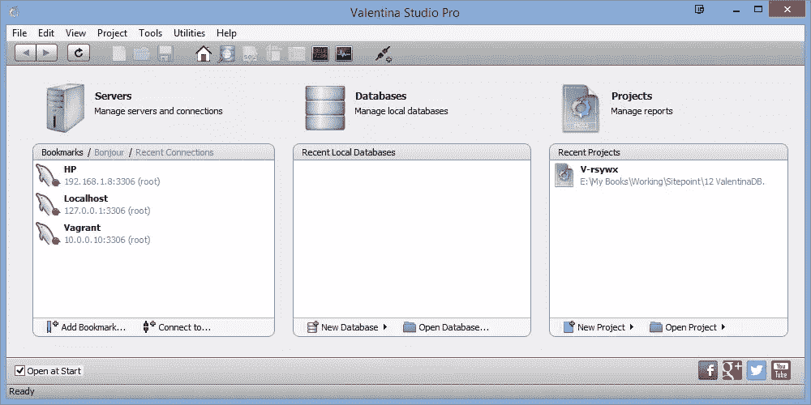
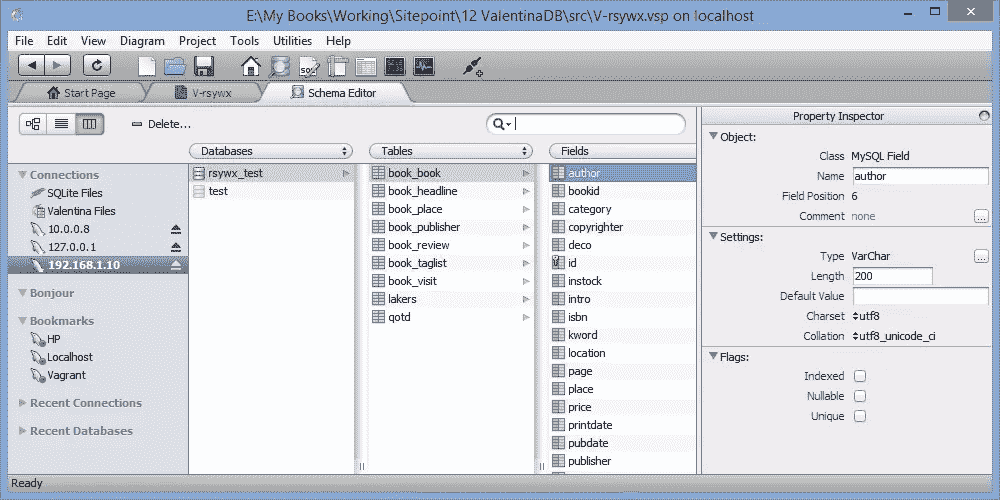
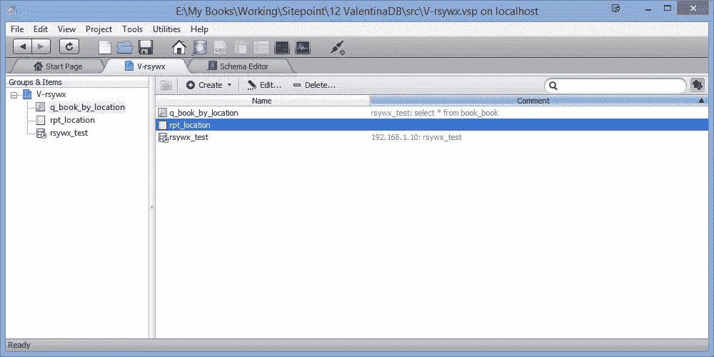
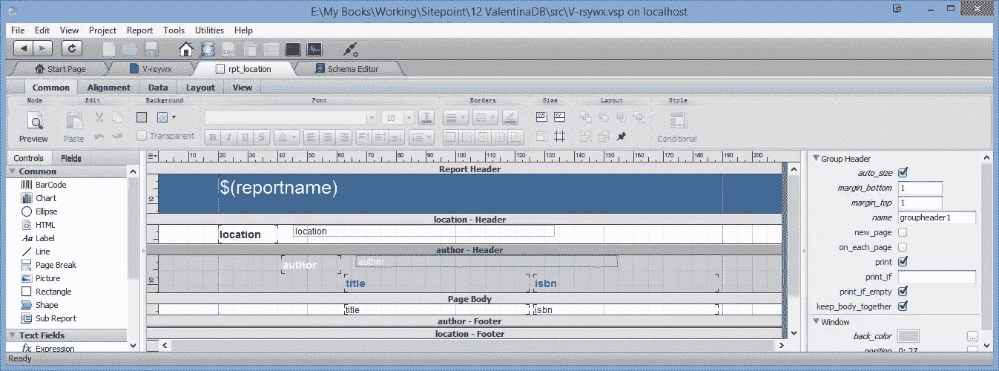
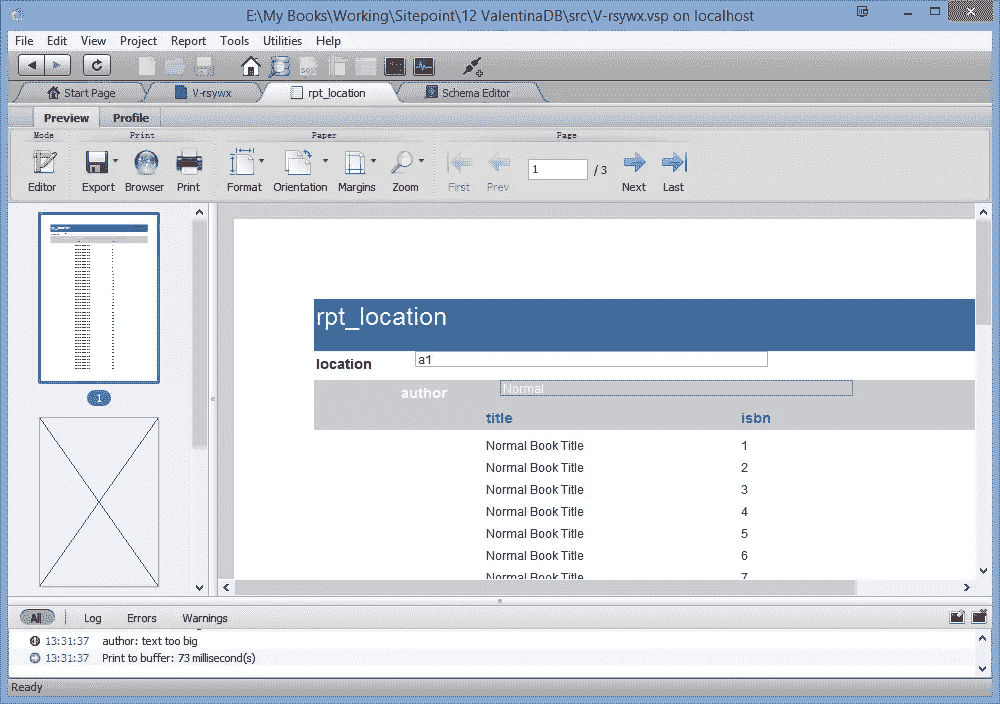
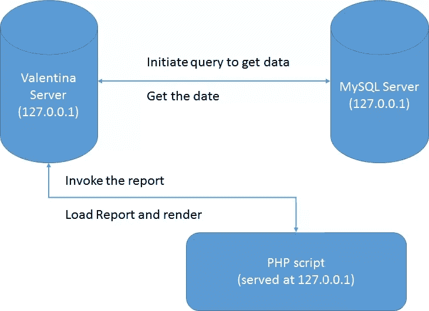

# 瓦伦蒂娜的样子

> 原文：<https://www.sitepoint.com/look-valentina/>

Valentina 是一套工具，包括:Valentina DB(一种新的 SQL 数据库服务器)，Valentina Studio(一种数据库管理工具)，Valentina Report(一种 GUI，用于创建在 PHP 等应用程序中使用的报告)和相关的开发工具包(称为 ADK)。

在本文中，我们将了解:

*   如何使用 Valentina Studio 管理我们的 MySQL 数据库；
*   如何使用 Valentina 报告创建一个像样的报告？

然而，我们不会讨论 Valentina 数据库，因为不可能在这么短的文章中掌握一个新的数据库服务器并涵盖其底层机制。

### 瓦伦蒂娜工作室

数据库管理工具 Valentina Studio 有两个版本。一个是免费的，可以在这里下载。另一个是专业版，功能更多，每台售价 200 美元。两个版本都支持 Windows、Mac 和 Linux 平台，是一个跨平台的工具。

在本文中，我将使用 Valentina Studio Pro。感谢 Valentina 为我提供了一把安装和评估的钥匙。

Valentina Studio 的启动速度很快，比我正在使用的另一个工具还要快。它的主界面有 3 个窗格:



图 1 欢迎窗口

*   **服务器:**提供基于 CS 的数据库管理。它支持四种类型的“服务器”:MySQL、PostgreSQL、Valentina 和 ODBC。它支持本地服务器和远程服务器连接。在我的例子中，我们可以看到有两个远程 MySQL 连接和一个本地连接。连接前的红点(或 Valentina 术语中的“书签”)表示服务器当前关闭。绿点表示它已启动并正在运行。
*   **数据库:**支持基于文件的数据库管理。目前它支持 Valentina DB 和 SQLite。
*   **项目:**主要用于报表生成。Valentina 生成的“报告”可以驻留在本地和远程。但是它必须有 Valentina 报表服务器支持(与 Valentina 服务器捆绑在一起)才能从应用程序调用。报表项目管理报表的源、查询和设计。我们稍后将讨论这一点。

选择服务器后，该服务器中的数据库将显示在以下级联列视图中:



这是我在瓦伦蒂娜工作室最喜欢的景色。在这个视图中，不同级别的实体(数据库、表、字段、链接、索引等)以级联样式显示在列中。在第一列中选择一个数据库，我们可以选择在第二列中显示表、链接、视图；对于表，在第三列中查看它的字段、索引等。最终级别的详细信息将显示在最右边的窗格中。我们还可以相应地创建和修改实体。

另一个视图，在我的例子中很少使用，是树形视图:


当选择一个表时，它在网格视图中显示表数据；当选择一个字段时，只显示列数据。在网格中，我们可以右键单击一条记录，将该记录导出为 CSV 或 SQL。

我们可以在树视图或列视图中双击一个表，调出另一个视图来查看主从关系。

它还提供了一个 SQL 对话框，我们可以在其中输入 SQL 语句。它具有代码洞察和代码完成功能，非常方便。

总的来说，Valentina Studio 提供了丰富的、但仍然需要改进的特性。例如，无论您是在网格视图中还是在 SQL 输出视图中，它都缺少过滤器和导航。这使我们的工作更加努力。此外，与 PHPMyAdmin 不同，在一个操作(比如插入一个字段)之后，它不会为该操作提供 SQL 语句。在大多数情况下，这并不方便。

同样，当创建一个表时，需要花费更长的时间来定义所有的基本元素:字段、索引、主键等。PK/FK 的定义也没有其他应用程序直观。

UI 行为并不一致。比如在做一些任务的时候(比如说指定字段类型)，我们需要双击一个箭头来弹出一个对话框；在执行其他任务时(比如更改表的 DB 引擎，或者它的字符集)，我们只需要单击一下。这种不一致会使最终用户困惑和烦恼。

最后，在免费版本中禁用功能是可以理解的。但 Valentina Studio Free 和 Pro 之间的功能差异太大，不知何故不太合理。

我给 Valentina Studio(免费和专业)打 3.5 分。它们是可用的，但需要改进——特别是要证明 200 美元的钞票是合理的。初学者会发现免费版已经足够好了，可以零成本享受。经过一段时间的评估后，可以决定是否升级到专业版。

接下来，我们将看看报告模块。

### 瓦伦蒂娜报道

这可能是我认为 Valentina Studio 中最有趣的功能。我目前的图书收藏应用程序一直缺少报告功能，所以我很乐意演示如何用 PHP 创建我的图书收藏报告。

有了 Valentina Studio(和 Valentina Report，Valentina Server)，任务会相当简单。

Valentina 报告是一个独立的项目文件，扩展名为`vsp`。在启动窗口中(如上图 1 所示)，我们选择“`New Project|Local`”，为我们的第一个 Valentina 报告项目选择一个名称，然后将文件保存到一个位置。报告管理窗口如下所示:



一个报告项目至少有 3 项:

1.  一个数据源(`rsywx_test`)。我们可以从显示所有当前可用连接和数据库的对话框中进行选择。
2.  至少一个查询(`q_book_by_location`)。查询基于数据源，SQL 语句可以是任意合法的 SQL 语句。它不支持可视化的“拖放”方式来设计查询，但支持代码突出显示和代码完成(针对 SQL 关键字和表/字段名)。
3.  一个报表布局(`rpt_location`)。它有一个向导来帮助我们设计布局(字段显示，页眉，页脚，分组，排序等)。这是一个相当直观的过程。

由于我们将在报表设计中设置分组和排序，建议在查询设计过程中，我们只包括基本查询(通过只选择字段并省略所有的`ORDER BY`、`GROUP BY`语句)。

报告管理窗口经过精心设计，提供了设计工具和预览功能:





Valentina 报表设计器非常强大，几乎可以改变报表中的所有内容:样式(字体系列、大小、颜色、阴影、边框等)、布局(位置、边距、大小、对齐等)、聚合(计数、求和等)功能等。

预览功能也非常简洁。我们可以很快看到最终输出会呈现什么。它还有一个导航工具栏和页面属性设置。

**注意:**在免费版本中，“保存”是禁用的，因此它使得报告工具几乎没有用。我建议 Valentina 团队考虑在他们的免费版本中增加一个保存功能。

**注意:**通常，显示中文字符需要将字体设置为中文字体系列。否则，默认字体系列(Arial)将只是将中文字符显示为一个块。

**注意:**虽然在向导过程中有一些主题可供选择，但它没有主题重新选择按钮来应用新主题。这个有点不方便。

在我们完成报告的设计后，我们可以保存它并离开设计界面。接下来，我们将看到如何在我们的 PHP 脚本中调用该报告，并以不同的格式输出它(将演示 HTML 和 PDF)。

### 在 PHP 中调用 Valentina 报告

为了在 PHP 中使用 Valentina Report，我们需要将两个 Valentina 扩展放入我们的 PHP 环境中。在我的 Windows 设置中，这两个 dll 是:`php5?_pdo_valentina.dll`和`php5?_valentina`。注意到这两个文件不在 Valentina Studio 的安装目录下，而是在`<user>\Documents\Paradigma Software\VPHP_5`中，有点奇怪。

目前，Valentina Studio 正式支持 PHP 5.3 和 5.4，一个 5.5 lib(在 VC9 下编译)可以根据请求获得，但是一个在 VC11 下编译的 5.5 lib 还没有。这迫使我降级我的 EasyPHP 安装。

此外，我们将需要 Valentina 报告服务器(捆绑在 Valentina 服务器)。可以在这里下载【Windows，Linux，Mac。

要在 PHP 中使用报表，我们需要做一些准备:

1.  安装 Valentina 服务器(和报表服务器)。服务器安装将有一个默认用户“sa”(密码“sa”)。
2.  将`vsp`报表项目文件复制到`projects`下的服务器目录中，如:`c:\Program Files\Paradigma Software\VServer x64\projects\`。
3.  再次启动 Valentina Studio(如果还没有的话)，为我们刚刚安装的 Valentina 服务器创建一个书签。
4.  在本地 Valentina 服务器中，将有一个名为“Projects”的节点，显示我们刚刚复制过来的 vsp 文件。点击“注册”进行注册。

我们现在可以在“服务器”中打开该报告并预览它，以确保一切仍在工作。

现在我们有了一个报表服务器，一个 MySQL 服务器，我们将继续客户端 PHP 编程。这个三层系统的整体结构大致如下:



这可能有点夸张，因为我们只做了一个非常简单的演示，但是在大型应用程序和多用户环境中，这种结构有它的优势。

调用我们之前用 PHP 设计的报告很简单。我们先来看看如何制作一个 HTML 报表:

```
$host = 'localhost';
$username = 'sa';
$password = 'sa';
$conn_id = prepare($host, $username, $password);

$report_file = "V-rsywx.vsp";

// Create VProject, get report dumped with data

$project = vproject_create($conn_id, $report_file);
$report_id=vproject_make_new_report_with_datasource($project, 'rpt_location', "mysql://host='localhost', dbname='rsywx_test' user='root' password='xxxxxx' ", "select * from book_book");

// Get the output and render to HTML 
$html_data=vreport_print_to_buffer($report_id, VALENTINA_REPORT_PRINT_TYPE_TO_HTML, 1);
print($html_data);

// Clean up

vreport_close($report_id);
vproject_close($project);
valentina_close($conn_id);

// The helper function
function prepare($host, $login, $pass) {
    // For Standalone VPHP only
    $conn_id = valentina_connect($host, $login, $pass);

    if (!$conn_id)
        die("error connecting to VServer!");

    return $conn_id;
}
```

Valentina 有一个[完整的 API 参考手册](http://www.valentina-db.com/dokuwiki/doku.php)(和一个 [PHP 参考手册](http://www.valentina-db.com/docs/dokuwiki/v5/doku.php?id=valentina:products:adk:vphp:reference:reference))所以请看看了解功能和相关参数。

整个过程是:

1.  连接到 Valentina 服务器，而不是 MySQL 服务器。
2.  获取对项目的引用并创建包含必要数据的报告。
3.  呈现报告并打印 HTML。
4.  清理干净。

以上所有陈述都是不言自明的，只有一个例外:

```
$report_id=vproject_make_new_report_with_datasource($project, 'rpt_location', "mysql://host='localhost', dbname='rsywx_test' user='root' password='xxxxxx' ", "select * from book_book");
```

这个函数在手册中没有参考条目(它有一个类似的函数`vproject_make_new_report`)，所以我必须依赖 Valentina 提供的示例代码。

前两个参数更简单。一个用于项目资源 ID ( `$project`)，一个用于报告名称(`rpt_location`)，也可以是整数索引(从 1 开始)。

第三个参数是到实际存储数据的 MySQL 服务器的连接字符串。为什么我们需要提供一个新的数据源？数据源是用来设计报表的，所以当我们指定一个报表的时候，数据源应该已经固定了吧？

嗯，Valentina 对此的回答是:在设计阶段，我们可能会使用一个测试服务器，配置将与我们在生产服务器中使用的不同。因此，通过提供/覆盖连接，我们可以切换到生产服务器，而无需重新创建报告文件。

第四个参数是检索数据的查询字符串。等等！我们在报表设计中构建了一个查询。为什么我们需要提供一个新的查询字符串？

从我和瓦伦蒂娜的通信中，我得到了和上面提到的一样的答案。

但这没有意义。报表设计和布局完全依赖于基础数据。在我的例子中，我选择了我的书籍信息，并按照位置、作者和书名进行分类。所有这些“额外”功能都是在报表布局中指定的(而不是在查询中)。因此，如果我们提供一个完全不同的查询，比如说不是从`book_book`表中选择，而是从`book_review`表中选择，我们将失去对所选数据的控制，因为我们将使用一个完全不同的结果集！

在这个函数中提供新的连接字符串和新的查询的灵活性只有在生产服务器与开发服务器有一组完全不同的表名时才有帮助。在我看来，这实际上是一个相当糟糕的设计，我们应该尽一切努力避免它。

浏览器中的输出是好的。它的输出与预览中看到的完全一样。

要以 PDF 格式输出报告，只需做两处细微的改动:

```
$html_data=vreport_print_to_buffer($report_id, VALENTINA_REPORT_PRINT_TYPE_TO_PDF, 1);
header('Content-Type: application/pdf'); 
```

需要使用`header`功能，否则输出会失真。输出将显示在浏览器中，我们可以保存它供将来使用。

输出格式还包括 SVG、LaTex、PostScript 等。它还有一个类似的输出功能，将输出保存到磁盘文件:`vreport_print_to_disk`。

### 结论

在这篇文章中，我们介绍了一个“新来的家伙”:瓦伦蒂娜。我们展示了如何使用它的 GUI 数据库管理工具(Valentina Studio)和它的报告服务器(与 Valentina 服务器捆绑在一起)。

总的来说，它的 GUI 工具是可用的，但仍然需要一些 GUI 调整，以使用户体验更加一致和高效。免费版和专业版之间的功能差异可能还需要进一步调整。

它的报告服务器速度很快，非常适合运行内部网站点的公司生成供其员工使用的数据报告。可以节省很多时间。对于那些希望向访问者提供动态报表功能的 web 应用程序来说，这也很有吸引力。

但是，在我看来，它的 API (ADK)有很大的改进空间，需要重新设计。上面我已经引用了一个例子(`vproject_make_new_report_with_datasource`)来说明一个方向。

它在 Windows 中的安装目录也需要更加一致:

*   瓦伦蒂娜工作室 32 位:`Program Files (x86)`
*   Valentina 服务器 64 位:`Program Files`
*   PHP 库和示例文件:`<User>\Documents\`

无论如何，我可以推荐 Valentina Studio 和 Valentina Server 供个人和商业使用。

我期待着它变得更加成熟，更加成功。你试过吗？你觉得怎么样？请在下面的评论中告诉我们。

## 分享这篇文章