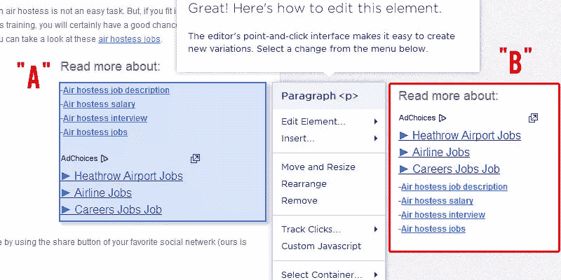
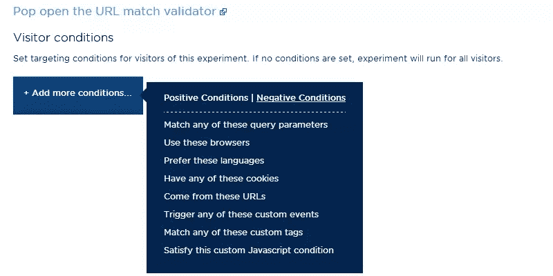
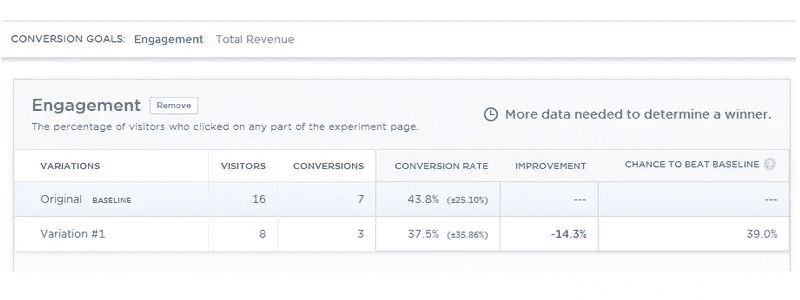
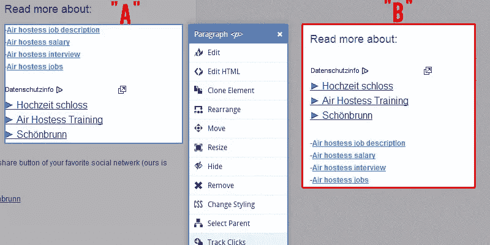
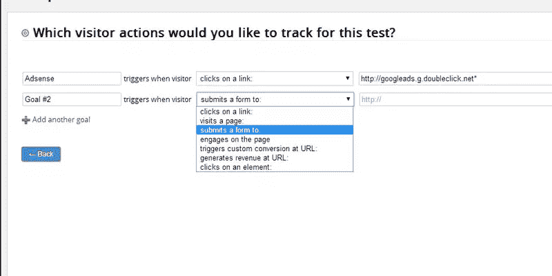
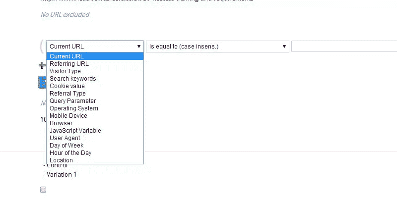
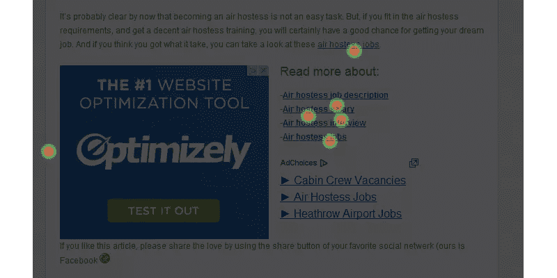
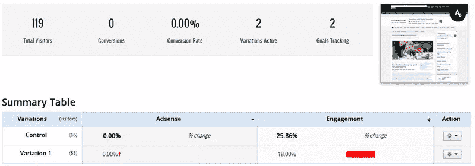
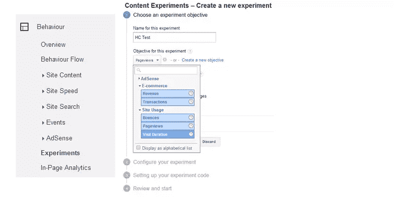
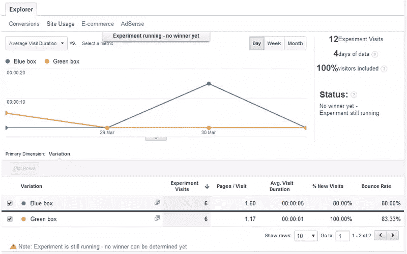

# 比较 3 种 A/B 测试工具

> 原文：<https://www.sitepoint.com/3-ab-testing-tools-compared/>

在我最近的一篇关于谷歌分析替代方案的文章中，有人在评论中问了一个关于 A/B 测试的问题。对此，提到了两个工具: [Optimizely](https://www.optimizely.com/) 和[可视化网站优化器](http://visualwebsiteoptimizer.com/)。在这篇文章中，我将回顾这些以及另一个名为[Google Analytics Content Experiments](https://support.google.com/analytics/answer/1745147)，它提供了简化(但免费)的 A/B 测试功能，作为分析套件的一部分。

如果你是 A/B 测试的新手，我推荐 Kerry Butters 的文章[大多数成功的 A/B 测试结果会产生误导吗？](https://www.sitepoint.com/winning-ab-test-results-misleading/)和[设计师的 A/B 测试指南](https://www.sitepoint.com/designers-guide-a-b-testing/)，两者都包含了更多关于什么是 A/B 测试以及为什么它很重要的基本信息。

现在让我们继续评论。

## 优化地

先从优化看[。他们提供了一个价格合理的入口计划，每月 2000 次访问，这足以运行一些测试(或一个大型测试)。Optimizely 要求您在标题中插入一段代码(通过电子邮件确认，这很好)，然后您可以使用他们的仪表板。你只需添加一个新的实验，一个向导会带你完成所有必要的步骤。](https://www.optimizely.com/)

我准备了一个实验来测试 Google Adsense 链接单元是应该放在导航链接的下面(现在的样子)还是上面。你可以看到真正的页面[这里](http://www.heathrowcareers.co.uk/air-hostess-training-and-requirements/)得到一个想法。

我可以很容易地选择相关代码并进行切换。这只是一个测试，但如果这是一个真正的分析，我还需要生成新的 Adsense 代码来衡量收益的影响。但是现在重要的是概念。

如果您运行一个非常受欢迎的网站，您可以添加一个或多个条件来过滤您的流量(如来自特定的 URL)，如下所示:

你也可以设定目标，在你的报告中显示出来，但是我发现标准设定非常有限。您可以根据点击量、页面浏览量或您自己用 JavaScript 设置的自定义事件进行比较。

在他们的推销中，Optimizely 声称你不必成为一名程序员就能让它工作。但是如果你想做一些严肃的跟踪，一些编码还是有必要的。我认为更直观的方法会更好。在你已经把他们的跟踪脚本放在你的头中之后，编码应该是不必要的。

假设你想比较一个时事通讯注册箱的不同位置，测量每个位置的注册率。使用 Optimizely，除了跟踪脚本之外，您还必须在表单后面插入一些 JavaScript 代码。这似乎是多余的。

我的测试结果怎么样？这是我看过的报告。

结果仍在收集中，但这并不能真正告诉我什么，因为没有明确定义这些转换是什么(可能是点击)。这太有限了。

优化允许与热图工具如 [CrazyEgg](http://www.crazyegg.com/) 和 [ClickTale](http://www.clicktale.com/) 以及各种分析工具(包括 GA)的大量集成。我认为在这些价格水平上，至少应该包括一些现成的功能。

Optimizely 在纸上看起来令人印象深刻，如果你不介意编码的话，它肯定是一个有用的工具。但我希望它更像是点击播放，这样你就可以专注于测试。

Optimizely 提供 30 天免费试用。

## 可视化网站优化器

现在让我们看看[可视化网站优化器](http://visualwebsiteoptimizer.com/) (VWO)，它声称你根本不需要编码。他们的定价很高，但是有免费试用。VWO 首先带你完成建立实验所需的步骤。在那之后，你就可以插入代码了，但是你也可以使用大多数流行系统的插件，比如 WordPress 和 Magento。

我通过编辑 HTML 对我的 AdSense 链接单元进行了与优化测试相同的修改。还有一些方法可以修改你的页面。对于我的例子来说，最简单的方法是使用“重新排列”功能，但这不适用于 AdSense 代码。

在选择和更改 HTML 之后，我需要选择我想要测试的内容。正如你所看到的，当点击一个链接时，我可以非常明确地跟踪什么(如果测试代码允许的话)。有一种方法可以跟踪注册表单。与 Optimizely 一样，您可以基于一系列条件过滤您的流量。

VWO 的一个很好的特点是它带有一个集成的热图，尽管它没有专用的热图工具先进。可惜你不能在你的 A/B 测试中比较两个热图。它们也不是很高级，因为颜色并不能告诉你太多。但这是一个很好的想法，可以通过更多的开发来改进。

VWO 提供了一份总结报告和一份详细报告，但老实说，这些应该是相互结合的。详细报告只是添加了一些图表和过滤器，但没有真正深入的内容。你得到的报告足以帮助你分析结果，并作为进一步行动的基础。

你从 VWO 那里得到的信息比 Optimizely 多一点。在这种情况下，参与度是通过总点击量来衡量的。不幸的是，我最终无法跟踪 AdSense 广告的实际点击量，因为它在 iframe 中。

可视化网站优化器提供了我在 Optimizely 中错过的点击播放体验，并为您提供了足够多的方法来衡量访问者对变化的反应。热图功能很好，但在目前的形式下不是很有用。尽管报告比基本的多一点，但感觉还是太简单了。

视觉网站优化器提供 30 天免费试用。

## 谷歌分析实验

为了结束这个工具比较，我将看一看[谷歌分析内容实验](https://support.google.com/analytics/answer/1745147) (GACE)，以前被称为谷歌网站优化器。GACE 是免费的 A/B 测试工具，是 Google Analytics 的一部分。它只允许纯粹的分割测试，你必须自己做不同的变化(例如，建立新的页面)。

要使用 GACE，首先要设置您的实验并定义您的目标(这也可以是 GA 中预定义的目标，这非常有帮助)。你也可以在 Adsense 结果上运行实验。然后你只需要定义两个或更多的测试页面(其中一个是原始的)，插入一些代码就可以了。你甚至可以利用你的销售渠道，开始对这些进行对比测试。

在我的另一个网站上，我发表了一篇关于灵动网络的评论。如您所见，有突出的蓝色方框显示了明确的行动号召。改变颜色需要你复制原始页面，并自己进行修改(就像我在[这里做的](http://www.hipaahq.com/liquid-web-review-hipaa-compliant-host/))。此外，你需要确保你的替代网页没有被索引。

在您设置了您的实验之后，您将立即体验到 GACE 的一个主要缺点:您必须等待 1-2 天才能看到结果，不像其他两个工具，它们是实时的。这意味着你不能立即对即将到来的结果采取行动。与 A/B 测试，它肯定会有助于测试多天的组合，但如果你是测试小的调整，你会想每天做一些变化，这样你就可以确定哪些变化影响你的转换。

GACE 不允许您在设置您的实验时过滤您的流量，您只能选择测试中应包含的流量百分比。

GACE 的另一个(不必要的)缺点是它会更改您的 URL 来跟踪实验:

虽然这并不存在什么大问题，但当有人想要将你的链接加入书签时，这并不干净，也不方便(就像我在 [Evernote](https://evernote.com/) 中做的那样)。

GACE 确实在这种比较中为您提供了最佳的报告结果，因为它允许您基于不同的指标进行比较。即使是你最初没有设置的，也会显示出来，但是赢家是根据你客观的标准来定义的。

内容实验功能很好地集成在整个 GA 套件中，这为您提供了一些优于其他工具的好处。当谈到测试本身时，设置它是相当有限的，而且更费时。这也需要你有耐心。但是它给了你一个简单的方法，不用花钱就可以开始 A/B 测试。如果你运营一个广告支持的网站，AdSense 的整合是非常有价值的。

## 结论

总之，尽管这三种产品似乎提供了相同的功能，但它们处理事情的方式却大相径庭。

如果你不介意把一些东西编码在一起，Optimizely 给了你很多可能性，而可视化网站优化器更像是点击播放。VWO 附带了一个额外的热图追踪工具，这是一个很好的功能，但太有限了。您可以使用这两种工具进行基本(改变元素)和高级(过滤)实验。但说到报告，仍有改进的空间。这两种产品的文档都非常优秀，即使您只是想了解 A/B 测试的不同概念。

对于这两种产品，我仍然觉得我错过了重要的信息。让我们以游客来源为例。我可以排除某些类别的游客，这样我就可以知道他们来自哪里，而不是来自哪里，但是看看英国和美国的游客对变化的反应是否一样，并在图表中看到这一点，这不是很好吗？现在，它要求您运行两个单独的测试，并使用一个单独的分析工具。也许我在这里问得太多了，但我相信这些工具有很大的潜力，因为他们已经知道这么多关于你的流量。

两者都提供 30 天的免费试用，所以我鼓励你自己进行一些测试。

Google Analytics Content Experiments 与 GA suite 的其余部分完全集成，但在测试的执行方式上相当有限。它还需要更多的手动操作来进行调整，在看到结果之前，您需要有耐心。但是一旦你建立了一套好的目标或漏斗，这是一个很好的(免费的)工具。

如果你使用过这些工具或者知道其他工具，请在评论中告诉我们。

## 分享这篇文章