# 全球网站本地化的 9 种方法

> 原文：<https://www.sitepoint.com/localize-a-global-website/>

[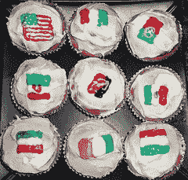](http://www.flickr.com/photos/dave_apple/158653594/)

戴夫 _ 苹果

虽然所有的网址都是全球性的，但无论你在哪里看到，保持你的品牌的本质不变都是至关重要的。

如果你的品牌在一个国家运营，这可能会更容易，但当你在文化、语言和期望完全不同的多个国家设有办事处时，例如阿联酋和中国，给你的网站添加本地特色可能是一项伟大的 UX 投资。

在本帖中，我们将讨论如何在你的网站中采用/实施本地化(有时也称为' [l10n](http://en.wikipedia.org/wiki/Internationalization_and_localization "Wikipedia: Internationalization and localization") ')的面孔、文化和语言。你应该有一些想法，如何在你的网页设计中创造一个情感的感觉，反映你的地方特色。

作为一名设计师，关键是首先要了解品牌的起源，它所代表的价值观，并为该品牌创建一个典型的员工草图。这个角色将使品牌人格化，并帮助你理解是什么理念使你的品牌与众不同。

然后开始一砖一瓦的搭建网站。

## 网页设计中的品牌个性:

### 1.文化主题

研究你的文化。每个城镇、州和地区都有自己独特的艺术风味和风格。以微妙或明显的方式使用这些元素，为你的网站增添美感，并彰显你的品牌个性。

例如，[索契奥运会网站](http://www.sochi2014.com/en "Sochi website")被全世界浏览——然而俄罗斯却通过背景中微妙的蓝色图案让人们感受到它的存在:

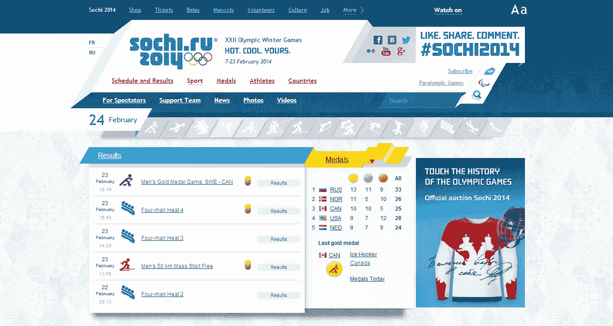

Sochi.ru

**注意** **:背景繁重的网站可能需要一段时间来加载，所以要确保你的[图形已经过优化](http://www.famousbloggers.net/optimize-web-speed-apache-iis-server.html)。**

### 2.排印

每种字体都有自己的个性。有些是大胆的，有些是害羞的(是的，我们仍然在谈论字体)，有些是怪异的，有些是优雅的。

设计模仿生活。

所以，字体也描绘了某种性质。选择一种能描述你的品牌特征的字体，并给出你来自哪里的线索。

例如， [Austin Beerworks](http://austinbeerworks.com/) 的网页设计使用了醒目的橙色字体来强调他们粗犷的牛仔精神。

奥斯汀啤酒厂

另一方面， [Italio Kitchen 的](http://italiokitchen.com/)网站和标识的字体是草书，纤细而圆滑。他们尽可能让它保持自然，它会立刻让你想起文艺复兴时期伟大艺术家的笔迹。

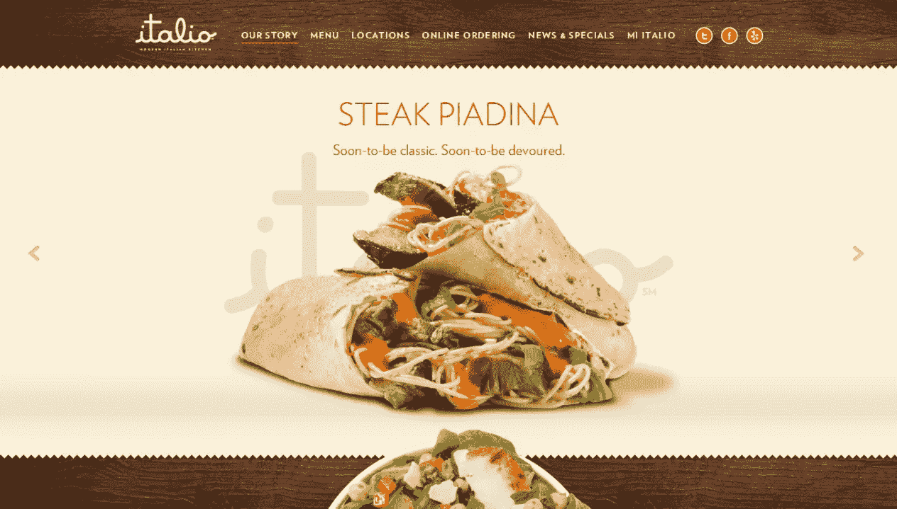

Italio Kitchen

**注意**:使用可在多种设备上使用的网络字体

### 3.艺术运动

从达达主义到哥特到洛可可，艺术运动已经在全球范围内兴起，不仅影响了他们出生地区的艺术，也传播到了其他地区。艺术运动是世界公认的贵国文化的另一个决定性因素。

Luhse Tea 位于佛罗里达州中部，其 1920 年的图形主题生动地展现了他们的文化。

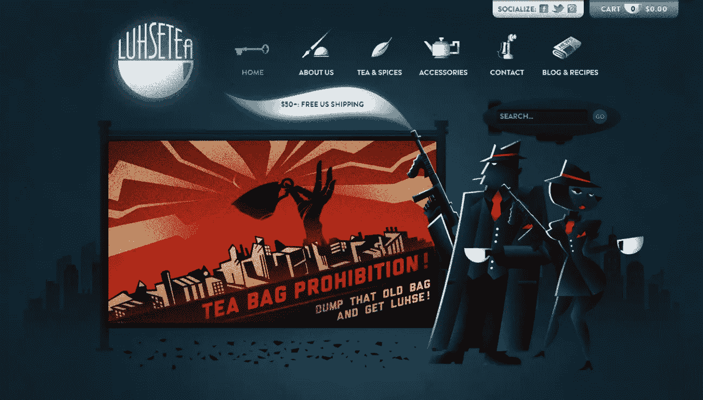

网站:卢瑟茶

### 4.已知地标

你来自哪里的明显线索。城市的天际线和著名的地标可以帮助用户立即与你联系起来。只要看一眼网站，他们就能说出你以所在的城市或国家为荣。

例如，[wt-cm.com](http://www.wt-cm.com/)用瑞士风景中如画的场景作为背景，向你展示他们对[来自日内瓦](http://www.wt-cm.com/contact)感到多么自豪。

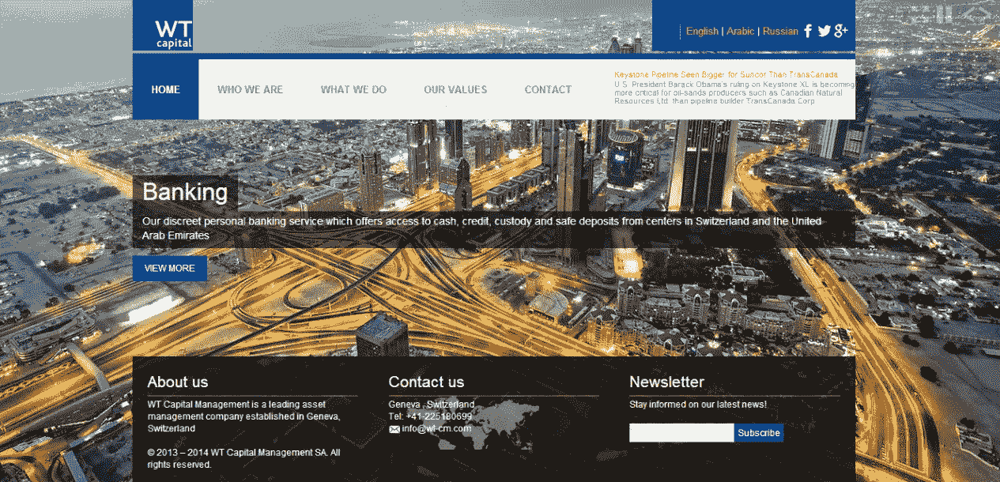

WT 资本

小心:天际线可能非常俗套。给它添加一个有趣的维度，让它与众不同。

### 5.当地人

很多网页设计师在选择面孔时会忘记他们代表的是哪个品牌。有数不清的例子表明，东方的品牌有网站显示外国人在使用他们的产品。

有时，对于像 [REI](http://www.rei.com/) 、[三星](http://www.samsung.com/)和[谷歌](http://www.google.com/)这样的网站来说，有必要展示不同种族和文化的人，因为这些品牌迎合大众。但是如果你的产品或服务是针对某个特定地区的，展示当地人会增加你网站的吸引力和相关性。

例如， [Buffalo Wild Wings](http://www.buffalowildwings.com/) 在其主页上以“蔻驰”为特色，他是品牌本身的化身。

一看这个角色，你就能知道这个品牌的很多东西。

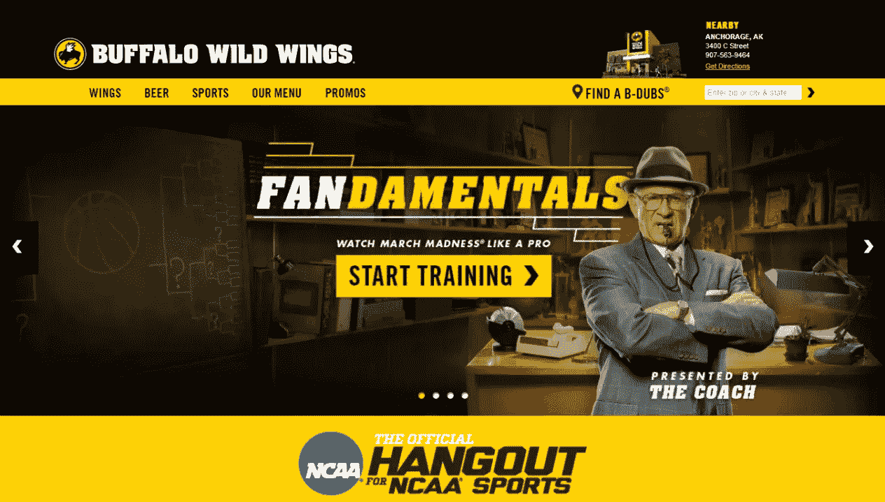

布法罗辣鸡翅

另一个例子是迎合巴基斯坦观众的 [Engro Foods](http://www.engrofoods.com/) 网站。该网站展示了受欢迎的巴基斯坦名人，如网球运动员 [Aisam-ul-Haq](http://en.wikipedia.org/wiki/Aisam-ul-Haq_Qureshi) 来强化他们的信息。

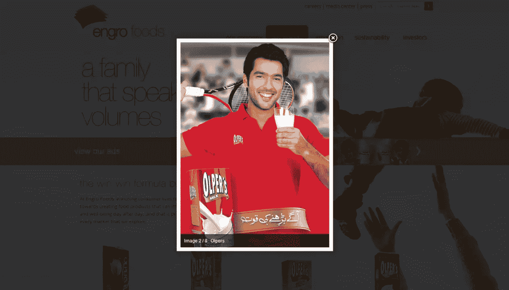

Engro 食品网站

### 6.流行语

一些地区有流行的流行语，如希腊的“有钱”和加拿大的“证据就是证据”。你可以在你的文化中使用名言作为你品牌的一部分，或者在你的正文中诙谐地使用。

[“有牛奶吗？”实际上是 1993 年的一个竞选口号](http://socialmediatoday.com/kumail-hemani/475582/impact-slogans-branding),多年来一直非常流行，MilkPEP 已经创建了一个单独的网站来记录它的成功:

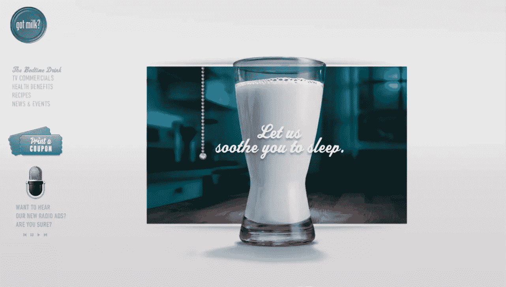

有牛奶吗

### 7.风景

有什么比真正炫耀自己的国家更好的方式呢？你的国家的风景不仅会增加你的网站的美感，还会迅速将你的品牌与你的出生地联系起来。

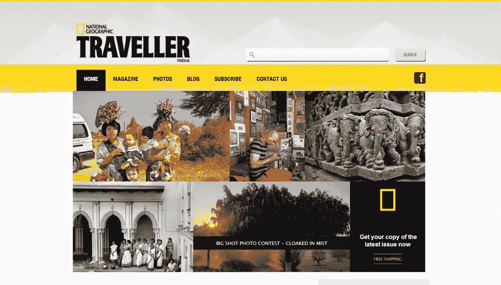

NatGeo Traveller

### 8.历史参考

历史可能是你在学校里最无聊的一门课，但是你的网站中的历史味道可以增加一种真正的魅力。想想古巴革命和下面提到它的网站。第一个是关于同一主题的纪录片的网站，题为“古巴上空的云”。这里的引用没有什么不寻常的。

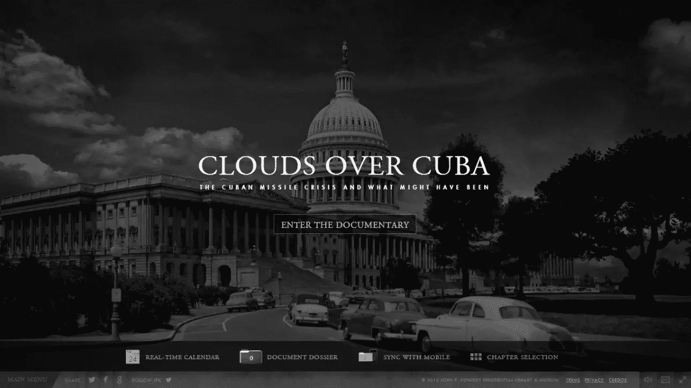

古巴上空的云

现在，考虑一下这家餐厅，它在名字中引用了这个词，不仅修改了它的正文，还展示了那个时期的艺术作品。

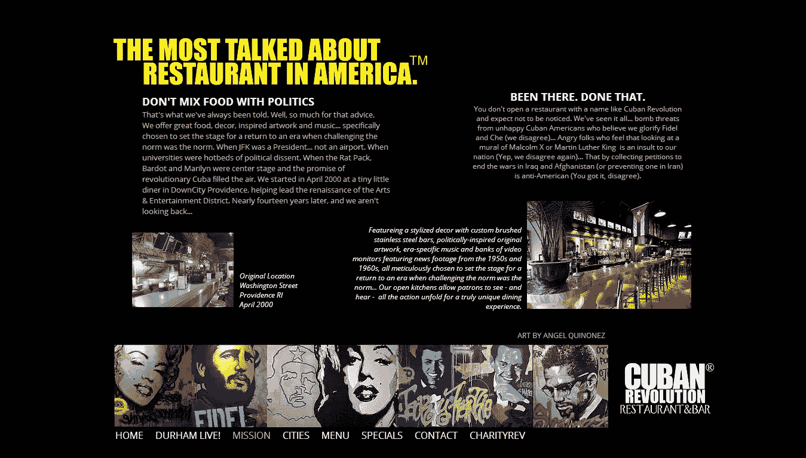

古巴革命

### 9.一张地图！

最后，但不是最不重要的，告诉用户你在哪里的最明显的方法，是在地图上标出你自己并展示给他们看！通常在旅游网站上，很容易找到地图、导游和路线，但是即使你不是在推广旅游，你也可以在网站上加入地图。

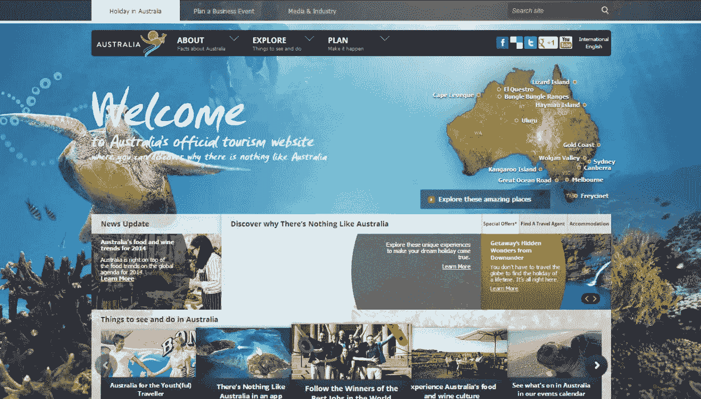

澳大利亚旅游网站

既然你已经读完了这篇博客，我希望你的脑子里充满了本地化网站的想法。从微妙的暗示到明显的指示，你可以选择你的文化中有多少与你的品牌相关联。

关于如何跨文化管理网页设计的更多细节，请阅读 Creative Bloq 的帖子。你有没有想到以独特的方式展示他们文化的网站？

在下面的评论中分享你的最爱

## 分享这篇文章