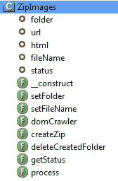

# 使用 Symfony 的 DomCrawler 进行图像抓取

> 原文：<https://www.sitepoint.com/image-scraping-symfonys-domcrawler/>

我的一个摄影师朋友恳求我从网上找到并下载相框的图片。我最终登陆了一个网页，上面有很多免费的图片，但是有一个问题:没有一个链接可以下载所有的图片。

我不想承受单独下载图像的压力，所以我编写了这个 PHP 类来查找、下载和压缩网站上找到的所有图像。

### 该类如何工作

它搜索图像的 URL，下载并保存图像到一个文件夹，创建文件夹的 ZIP 存档，最后删除文件夹。

该类使用 Symfony 的 [DomCrawler](http://symfony.com/doc/current/components/dom_crawler.html) 组件来搜索网页上找到的所有图像链接，并使用自定义的`zip function`组件来创建 zip 文件。拉链功能归功于[大卫·沃什](http://davidwalsh.name/create-zip-php)。

### 编写类代码

该类由五个私有属性和八个公共方法组成，包括`__construct` magic 方法。



下面是类属性及其角色的列表。
1。`$folder`:存储包含已刮除图像的文件夹的名称。
2。`$url`:存储网页网址。
3。`$html`:存储待抓取网页的 HTML 文档代码。
4。`$fileName`:存储 ZIP 文件的名称。
5。`$status`:保存操作状态。即它是成功还是失败。

让我们开始构建这个类。

创建包含上述五个属性的类`ZipImages`。

```
<?php
class ZipImages {
    private $folder;
    private $url;
    private $html;
    private $fileName;
    private $status;
```

创建一个接受 URL 作为参数的`__construct`神奇方法。
方法相当自明。

```
public function __construct($url) {
    $this->url = $url; 
    $this->html = file_get_contents($this->url);
    $this->setFolder();
}
```

创建的 ZIP 存档有一个文件夹，其中包含抓取的图像。下面的`setFolder`方法对此进行了配置。

默认情况下，文件夹名被设置为`images`，但是该方法提供了一个选项来更改文件夹名，只需将文件夹名作为参数传递即可。

```
public function setFolder($folder="image") {
    // if folder doesn't exist, attempt to create one and store the folder name in property $folder
    if(!file_exists($folder)) {
        mkdir($folder);
    }
    $this->folder = $folder;
}
```

`setFileName`提供一个选项来更改 ZIP 文件的名称，默认名称设置为`zipImages`:

```
public function setFileName($name = "zipImages") {
    $this->fileName = $name;
}
```

此时，我们实例化 Symfony `crawler`组件来搜索图像，然后下载并保存所有图像到文件夹中。

```
public function domCrawler() {
    //instantiate the symfony DomCrawler Component
    $crawler = new Crawler($this->html);
    // create an array of all scrapped image links
    $result = $crawler
        ->filterXpath('//img')
        ->extract(array('src'));

// download and save the image to the folder 
    foreach ($result as $image) {
        $path = $this->folder."/".basename($image);
        $file = file_get_contents($image);
        $insert = file_put_contents($path, $file);
        if (!$insert) {
            throw new \Exception('Failed to write image');
        }
    }
}
```

下载完成后，我们使用自定义的`create_zip`函数将图像文件夹压缩成 ZIP 档案。

```
public function createZip() {
    $folderFiles = scandir($this->folder);
    if (!$folderFiles) {
        throw new \Exception('Failed to scan folder');
    }
    $fileArray = array();
    foreach($folderFiles as $file){
        if (($file != ".") && ($file != "..")) {
            $fileArray[] = $this->folder."/".$file;
        }
    }

    if (create_zip($fileArray, $this->fileName.'.zip')) {
        $this->status = <<<HTML
File successfully archived. <a href="$this->fileName.zip">Download it now</a>
HTML;
    } else {
        $this->status = "An error occurred";
    }
}
```

最后，我们在创建 ZIP 文件后删除创建的文件夹。

```
public function deleteCreatedFolder() {
    $dp = opendir($this->folder) or die ('ERROR: Cannot open directory');
    while ($file = readdir($dp)) {
        if ($file != '.' && $file != '..') {
            if (is_file("$this->folder/$file")) {
                unlink("$this->folder/$file");
            }
        }
    }
    rmdir($this->folder) or die ('could not delete folder');
}
```

获取操作的状态。即它是成功的还是发生了错误。

```
public function getStatus() {
    echo $this->status;
}
```

处理以上所有方法。

```
public function process() {
    $this->domCrawler();
    $this->createZip();
    $this->deleteCreatedFolder();
    $this->getStatus();
}
```

你可以从 [Github](https://gist.github.com/Swader/9036132#file-class-ziparchive-php) 下载完整的类。

### 类依赖性

为了让类工作，需要包含`Domcrawler`组件和`create_zip`函数。你可以在这里下载这个函数[的代码。](https://gist.github.com/Swader/9036132#file-zipfunction-php)

通过 [Composer](http://getcomposer.org/) 下载并安装 [DomCrawler](http://symfony.com/doc/current/components/dom_crawler.html) 组件，只需将下面的 require 语句添加到您的`composer.json`文件中:

```
"symfony/dom-crawler": "2.3.*@dev"
```

运行`$ php composer.phar install`下载库并生成`vendor/autoload.php`自动加载程序文件。

## 使用类

*   通过自动加载或显式加载，确保包含所有必需的文件。
*   调用`setFolder`和`setFileName`方法，并传入它们各自的参数。只有当你需要改变文件夹名时，才调用`setFolder`方法。
*   调用`process`方法让类工作。

```
<?php
    require_once 'zipfunction.php';
    require_once 'vendor/autoload.php';
    use Symfony\Component\DomCrawler\Crawler;
    require_once 'vendor/autoload.php';

    //instantiate the ZipImages class
    $object = new ArchiveFile('https://www.sitepoint.com');
    // set the zip file name
    $object->setFolder('pictureFrames');
    // set the zip file name
    $object->setFileName('myframes');
    // initialize the class process
    $object->process();
```


## 摘要

在本文中，我们学习了如何创建一个简单的 PHP 图像抓取器，自动将下载的图像压缩到 Zip 存档中。如果您有其他解决方案或改进建议，请在下面的评论中留下，欢迎所有反馈！

## 分享这篇文章