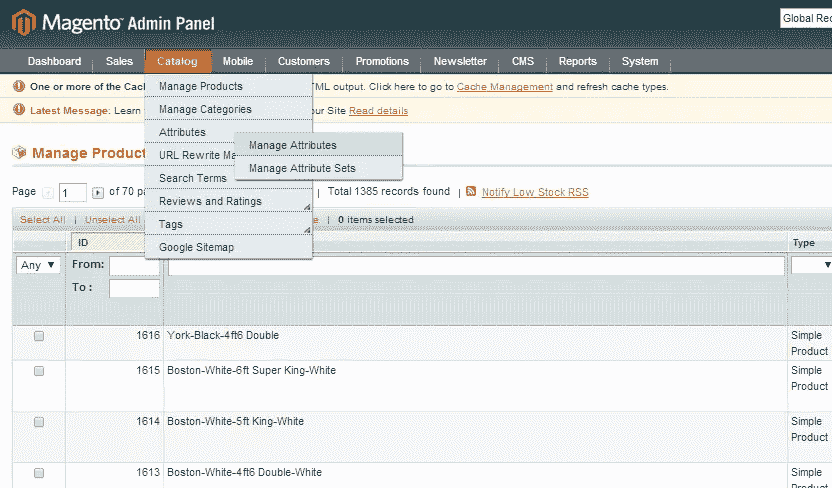
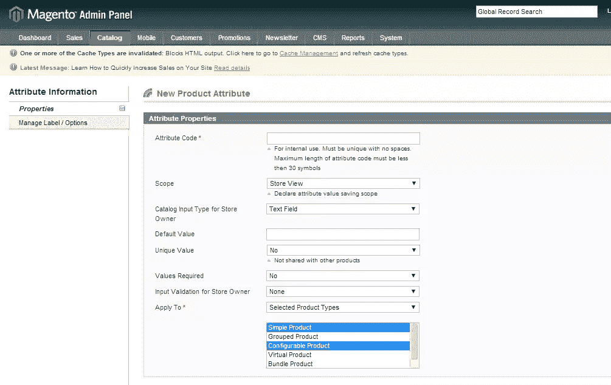
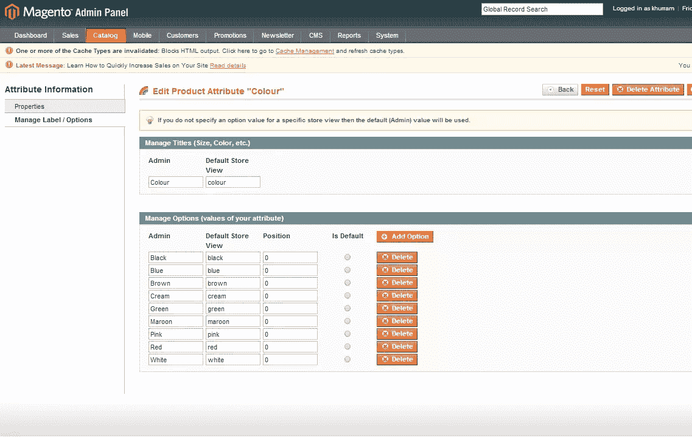
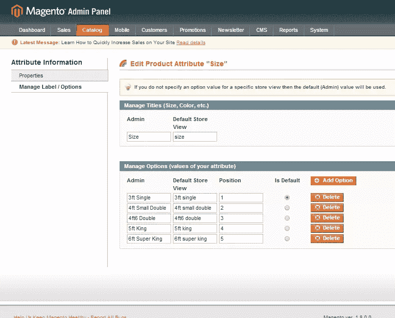
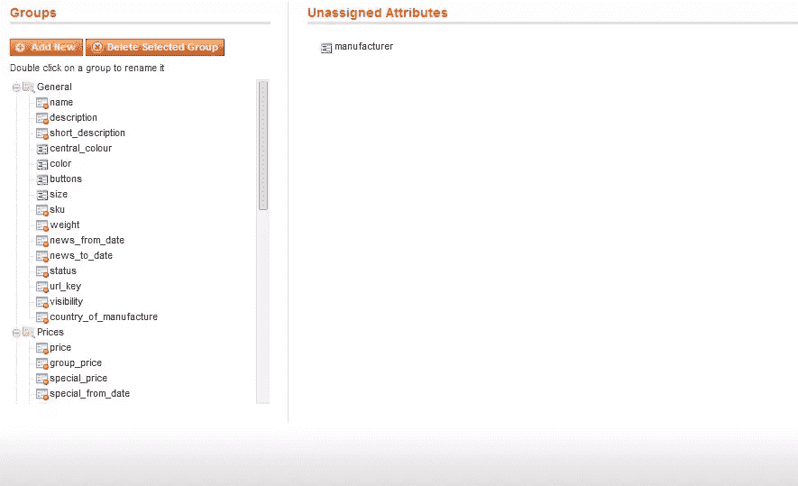
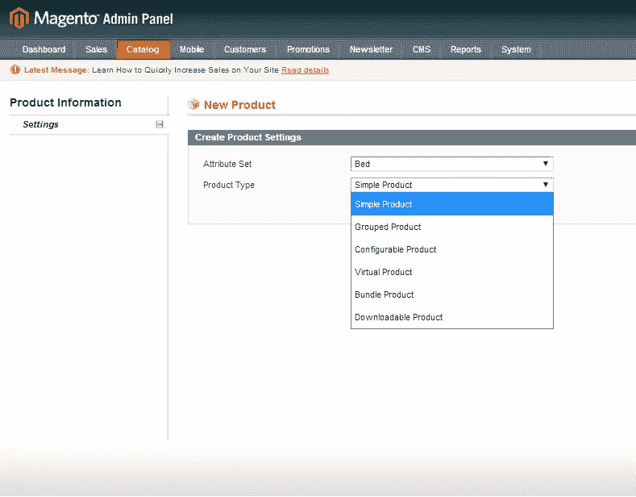
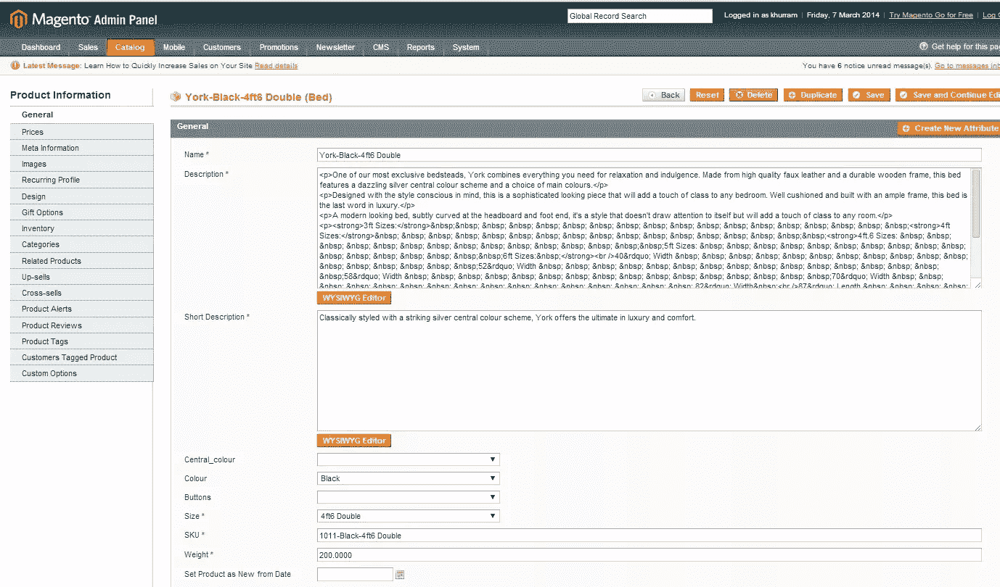
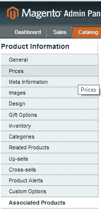
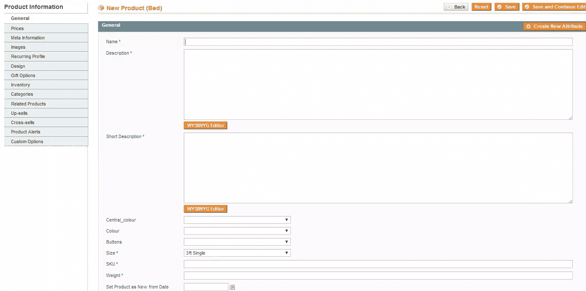
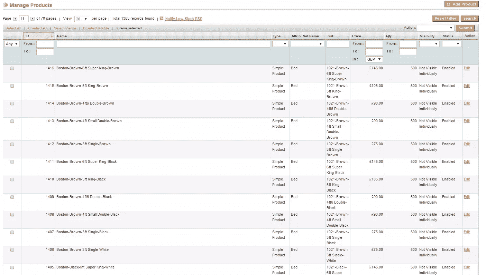

# 向您的 Magento 电子商务网站添加可配置产品

> 原文：<https://www.sitepoint.com/adding-configurable-products-magento-ecommerce-site/>

建立一个电子商务网站是一项看似复杂的任务。即使使用像 Magento 这样现成的 CMS 解决方案，像添加可配置产品这样简单的事情也需要设置许多变量和股票相关的选项。

你在网上出售的任何东西，无论是可下载的 zip 文件还是可运输的物品，如果附有选项，都可以归类为可配置产品。Magento 中的可配置产品在给出价格和描述之前，需要分配属性，如尺寸和颜色。

Magento 这种自下而上的产品创造方式是完全理性的。例如，通过这种方式，更容易控制股票，并将 SKU 氏症分配给个体差异。

## Magento 的复杂产品

Magento 是一个完全开源、免费安装的电子商务网站应用程序。当您将产品添加到数据库中时，您可以选择创建简单产品还是复杂产品。一个简单的产品没有变量，只卖一种类型。复杂产品可以是成组产品、可配置产品或交叉销售产品。

在这种情况下，可配置产品可以是用户可以在前端选择的任何变体，例如有几种不同尺寸和颜色的 t 恤。Magento 将可配置产品视为简单产品的集合:每个变体都有自己的 SKU 和库存清单。

## 创建可配置产品

创建可配置产品的基本步骤是:

*   添加属性。这些将由用户配置-对于我们的例子，他们将是大小和颜色。
*   将这些属性添加到属性集中—对于我们的例子，我们称之为`beds`。
*   创建一个新的可配置产品，并添加`bed`属性集。
*   为可配置产品的每个变体创建单独的简单产品。

## 添加属性

在本教程中，我们将创建一个床产品，类似于我的在线零售网站上的产品。该床有两种选择—一种用于`color`，一种用于`size`。这是我们将在 Magento 管理区创建的。在顶部菜单中，选择*目录>属性>管理属性*。

在*属性>属性*控制面板中，选择右上角的`Add New Attribute`。这将允许您为可配置产品的尺寸和颜色创建变化。

上面的截图显示了属性`color`是如何设置的。简而言之，`Attribute Code`可能是`color`或`size`，而`Scope`应该是`Global`以应用于您的整个站点。

`Catalog Input Type for Store Owner`也被设置为`Dropdown` —这是属性与可配置产品兼容所必需的。把`Unique Value`和`Value Required`留给`No`，把`Input Validation for Store Owner`留给`None`。

`Apply To`应该是`Selected Product Types`，在 Ctrl+下面的框中点击`Simple Product`和`Configurable Product`，使属性适用于这两种类型。你还会注意到出现了`Use to Create Configurable Product`下拉菜单。这必须设置为`Yes`。

接下来，在左侧菜单中，选择`Manage Label/Options`开始为属性选择不同的变量。对于我们床上用品的`color`属性，您的标签选项应该如下所示:

每个`color`选项:黑色、蓝色、棕色、奶油色等。，被赋予一个`Admin Name`和一个`Default Store View`的名字，这就是你的客户将会看到的。对于大小选项，属性标签将如下所示:

您会注意到，在尺寸选项中，我们在`position`列中对每个尺寸进行了编号，并将`3ft single`指定为默认值。每种床品都有这些变化，因此在下拉列表中按位置排列并设置默认值是有意义的。

添加完标签后，请务必点击`Save Attribute`。

接下来，您需要创建一个附加了这两个属性的`Attribute Set`，然后将集合添加到产品中。您可以通过转到*目录>属性>管理属性集*然后选择右上角的`Add New Set`来创建它。将属性命名为`Bed`，并基于`default`将其保留。

在下一个窗口中，您将看到两个窗格，都包含属性。左侧面板显示属于集合的属性，右侧面板显示未分配的属性。

将`color`和`size`属性拖到左侧面板的`General`文件夹下，然后点击右上角的`Save Attribute Set`。

## 创造简单的产品

现在我们已经创建了属性集，我们准备开始输入简单产品的数据，这些产品将成为可配置产品的一部分。进入 Magento 管理中的*目录>管理产品>新产品*。您将看到`New Product`创建窗口。

首先要做的是选择应用于该产品的`Attribute Set`，在我们的例子中是`Bed`。`Product Type`也应该设置为`Configurable Product`。点击`Continue`。

在下一个屏幕上，选择`color`和`size`，这是我们之前为 beds 产品创建的两个属性，然后继续。在下一个屏幕中，输入如下所示的所有详细信息。

为产品变体选择一个唯一的名称，其描述将显示在前端。注意大小和颜色的两种变化，它们是在我们的属性中创建的。为此选择一个默认的变化，在我们的例子中设置大小为`3ft`和颜色为`black`。确保也将`Visibility`设置为`Not Visible Individually`，因为我们希望它作为`Configurable Product`出现，而不是单独出现。

然后，您应该沿着左侧菜单中的标签往下走，根据需要填写所有细节。标签将允许您设置基本价格，任何搜索引擎优化的目的元信息，还可以为您的产品添加图像。

您会注意到菜单中的最后一个标签是`Associated Products`。这是您创建将成为该产品一部分的所有变体的地方。选择该选项卡，并在右侧出现的控制面板中，选择`Create Empty`。应该会弹出一个熟悉的窗口，用于输入产品变化的信息。

像你做默认变化一样填充它，确保为`size`和`color`属性选择不同的选项，完成后，选择`Save`。您需要重复这一过程，并在`New Product`窗口中为您的产品的每个变化创建一个简单的产品。您的`Associated Products`选项卡现在应该填充了如下产品:

在顶部菜单中选择`Save`，您的可配置产品现在应该准备好显示在前端。

## 结论

你们都完了。产品在前端的外观将取决于你在网站上设置的主题和插件，以及定制设计。

但是不管它们看起来如何，像这样单独输入每个产品和变量将允许你为你的站点提供一致的客户体验。

正如我们在本教程中所展示的，所有产品都将显示有`size`和`color`选项，并且当被选中时，将自动更新库存和前端购物车。

## 分享这篇文章