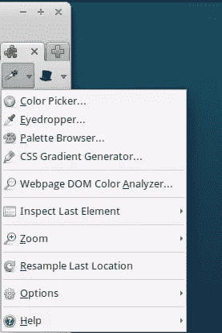
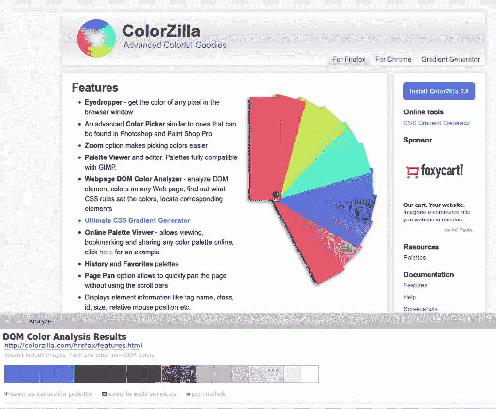
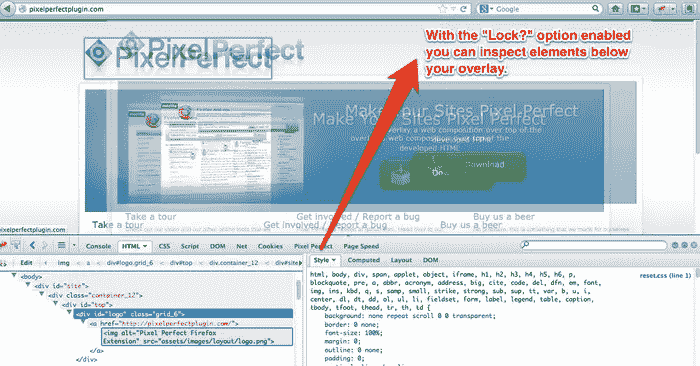
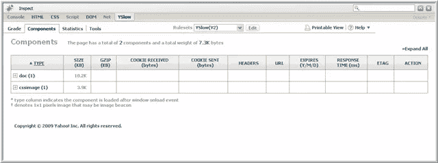
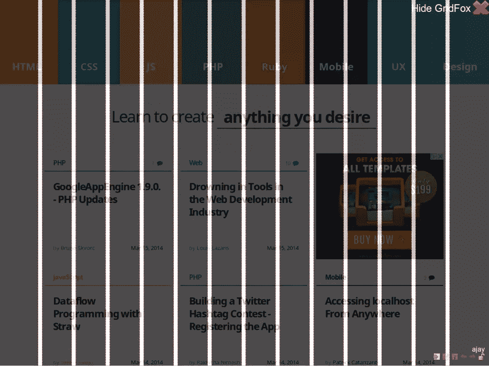
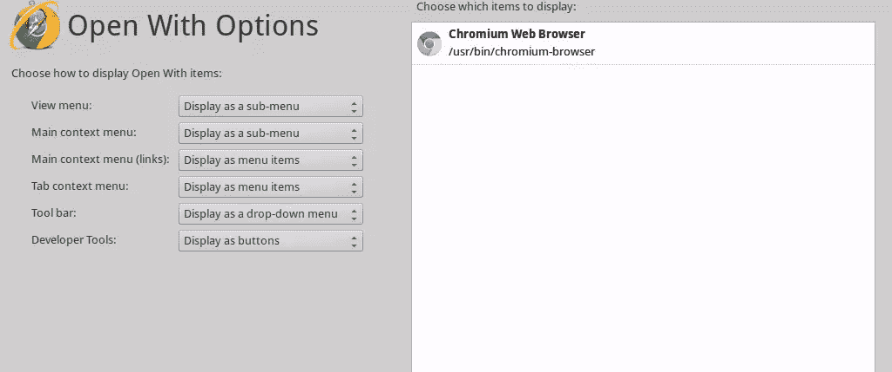
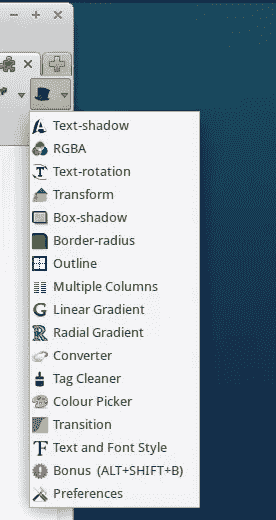
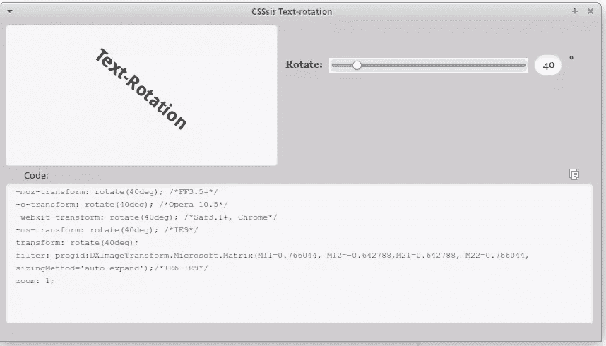

# 面向设计师的 6 大 Firefox 扩展

> 原文：<https://www.sitepoint.com/6-great-firefox-extensions-designers/>

80 年代的火狐:支点前。(不尽然)

在数百个可用的火狐扩展中，我猜几乎没有一个设计师没有听说过克里斯·佩德里克的 [Web 开发者工具栏](https://addons.mozilla.org/en-US/firefox/addon/web-developer/) (790，521 个用户)，以及乔·休伊特的 [Firebug](https://addons.mozilla.org/en-us/firefox/addon/firebug) (2，918，506 个用户)。

它们可以说是成就了 Firefox 今天的两个扩展，甚至对于最有兴趣的 web 开发人员来说也是不可或缺的。

但这并不是扩展乐趣的终点。有相当多的以设计者为中心的 Firefox 扩展很可能在你的保护下溜走了。

总是很难找到时间尝试所有这些，所以希望我们可以为你做一些跑腿的工作！

其中一些是独立的 Firefox 插件，而另一些安装在 Firebug 之上——所以从某种意义上说，它们是 Firebug 插件。

不管他们的背景如何，这里有 6 个鲜为人知，但对设计师很有用的 Firefox 扩展。享受吧。

## 1.色彩奇拉

DOM 颜色分析

我不确定 [ColorZilla](https://addons.mozilla.org/en-US/firefox/addon/colorzilla/) 是否是第三大最受设计师欢迎的 Firefox 扩展(似乎有超过 300，000 名用户)，但它肯定是前端人员最有用的颜色工具之一。

安装后，可以从上下文菜单或工具栏中找到它，如下图所示:

ColorZilla 有许多与颜色相关的选项，如高级吸管、颜色选择器、缩放、调色板浏览器、网页 DOM 颜色分析器、渐变生成器等等。

吸管和颜色选择器工具类似于你在任何像样的桌面图形程序中找到的工具。使用它们，您可以从页面中选择颜色，将它们保存到调色板中，并在以后访问它们。

一个更高级的工具是“网页 DOM 颜色分析器”。

分析页面上使用的颜色(不包括图像、Flash 等中的颜色。)，您打开页面并运行网页 DOM 颜色分析器。

这将产生一个色卡调色板，如下图所示。

这对于合理化和简化你的网站的调色板来说是很棒的，当它开始“蠕动”的时候。

## 2.像素完美

Pixel Perfect 是 Firefox 的一个扩展，似乎没有多少设计师知道它。

这对设计师来说非常有用，尽管你可能并不每天都需要它。

完美像素用于布局叠加。当你工作时，它允许你在你的动态 HTML/CSS 上覆盖一个半透明的设计截图。

这对于项目的初始“粗略设计”阶段尤其有用，在这一阶段，您需要将文本大小、字体、行距、颜色、边距和填充与原始 Photoshop 模型相匹配。

控制很简单。您可以手动将覆盖图像放置并锁定在页面上的任何位置，滑块可让您控制不透明度。

截图:Firebug 中的完美标签

为了运行 Pixel Perfect，你需要安装 Firebug。

你可以从 Mozilla 网站下载该扩展的最新版本，但如果你运行的 Firefox 版本与 Mozilla 网站上的 Firebug 版本不兼容，你可以从存储所有先前版本的[开发者网站](https://getfirebug.com/downloads)上下载。

## 3.YSlow

“优化”。这是一个许多设计师可能认为*并不真正*适用于他们的词——这是技术人员要处理的事情，对吗？

不是真的。一个缓慢的网站只是一个糟糕的 UX，UX 是一个基本的设计问题。作为设计师，真的要自己拥有！

YSlow 是一个很好的工具，可以精确定位慢点和瓶颈。最棒的是，它没有记录你的问题——它为你的问题提供了切实可行的解决方案，并在过程中教会你。

与 Pixel Perfect 类似，这个扩展运行在 Firebug 框架之上，所以您需要 Firebug 来了解它的好处。

YSlow 是雅虎的一个工具(这就是 Y 的来源),通常被它的开发团队维护的很好。不幸的是，在撰写本文时，YSlow 似乎无法与最新版本的 Firefox 兼容，尽管它适用于最新版本的 Firefox。

如果您可以安装它，您应该会看到类似这样的内容:

基本上，该工具会报告页面中的慢区域，并建议如何修复它们。YSlow 几乎已经成为一个 web 服务，运行在 Node 的平台上。JS 到 Chrome 到 Commandline，但是最初的 Firefox 版本仍然可以完成这项工作。

## 4.GridFox

GridFox 扩展是一个小把戏，但幸运的是它是一个好把戏——它只在网站的顶部绘制一个网格，但当你需要它时，这已经足够了。

该扩展使用起来非常简单明了。

安装后，右击页面上的任意位置，从菜单中选择 GridFox >切换网格。这将绘制网格。您还可以编辑和保存网格以供将来参考。

尽管 GridFox 在帮助您在自己的项目中实施网格方面很有用，但它最好还是用作学习工具。

试着去英国广播公司、NYT、推特、脸书或任何一个大网站，启动 GridFox，试着弄清楚他们的网格是如何构建的。要学的东西很多。

## 5.始于

随着 Web 标准的发展，跨浏览器问题不像几年前那么严重了，但是你仍然不能想当然地认为你为一个浏览器设计的东西在其他主流浏览器上也能正常显示。

虽然有许多跨浏览器测试工具可供您使用，但其中一些工具需要很长时间才能在几个浏览器中预览一个页面。

对于这种情况，[用](https://addons.mozilla.org/en-US/firefox/addon/open-with) Firefox 扩展打开非常方便。安装之后，在首选项对话框中你必须输入一个你想用来打开你的网页的浏览器列表。你可以进入 ie 浏览器，Chrome，Safari，Opera，Chromium，或者任何你想要的浏览器。

安装并配置它之后，根据您在首选项对话框中选择的选项，您将看到如下内容:

但是，这里的问题是，为了将浏览器包含在列表中，您必须在系统上安装浏览器。如果你想在一个不能在你的操作系统下运行的浏览器中测试你的页面，这不是很有用，但是在其他情况下，这仍然是一个省时的方法。

## 6.CSSsir

CSSsir 不是唯一生成 CSS 代码的 Firefox 扩展，但它是最好的之一。如开发者自己所列，目前，该扩展可以为以下应用生成 CSS3 代码:

*   文本阴影
*   RGBA 吗
*   改变
*   箱形阴影
*   边框半径
*   多列
*   线性梯度
*   径向梯度
*   概述
*   过渡
*   文本和字体样式

它还附带了一些方便的工具，用于标签清理、转换(RGB 到 HEX，PX 到 EM)和颜色拾取。它还带有一些提示，如 CSS3 选择器列表、浏览器 CSS-hacks、关系 px、pt、em、% table、JS 键码等。

在你安装 CSSsir 之后，它会在工具栏中显示为一顶非常漂亮的帽子。单击帽子打开下拉列表:

选择要执行的操作。例如，让我们旋转一些文本。选择文本-旋转并选择旋转角度。这将生成代码粘贴到您的 CSS 文件。

对于设计师和前端开发人员来说，这些都是超级方便的 Firefox 扩展。

当然，还有很多其他的没有被列在名单上——其中一些真的很好。例如，Pencil 是 Firefox 对 GUI 原型的扩展。我过去用过它，它真的很棒。

随着 Mozilla 转向更加活跃的 Firefox 发布时间表，保持插件最新变得越来越困难——特别是对于一个人/兼职扩展作者。

不幸的是，Pencil 只是一段时间没有更新的众多扩展之一，因此，不能与当前版本的 Firefox 兼容。

这使得它们或多或少对大多数运行最新和最好的 brwoser 版本的 Web 设计人员来说毫无用处。

#### 变通办法？

如果你是一个修补者，应该注意的是，许多旧的扩展可以通过一个相对简单的攻击与当前版本的 [Firefox 兼容。](http://kb.mozillazine.org/Updating_extensions "Firefox Extension hack")

通常只需要更新文本文件中的一个数字就可以让旧的扩展再次工作。通常，但总是。

无论如何，让我们希望这些伟大的火狐插件不会烂掉。

火狐用户:我错过了什么吗？

## 分享这篇文章