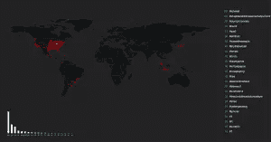

# 用吸管进行数据流编程

> 原文：<https://www.sitepoint.com/dataflow-programming-straw/>

数据流是一种编程模型，自从计算出现以来就一直存在。尽管数据流编程在那段时间的大部分时间里默默无闻，但由于当前 web 规模实时服务的爆炸，它正在寻找新的生命，并且是对当前许多工程挑战的自然适应。

数据流是一个简单的概念。代码的小节点接收输入、处理输入并输出结果。节点连接在一起，输出到输入，形成一个处理拓扑。使用数据流，复杂的问题变得容易推理，系统更容易扩展和恢复，你可以更好地利用你的计算资源。

[Straw](https://github.com/simonswain/straw) 是一个 Node.js 框架，让你在应用中实现数据流处理。Straw 是为了处理实时期货市场数据而出现的，在一个相当普通的系统上每秒可以处理大约 4000 条消息。在生产中，它已经处理了数十亿条消息。

本文将向您介绍 Straw，向您展示如何从 Twitter Firehose 中挖掘推文中的数据。因为消防水管是一个连续的信息流，所以它非常适合用稻草来处理。我们将使用免费的公共版本，只有一小部分推文。即便如此，也足够了。

## 介绍

在 Straw 中，您定义了节点的拓扑结构。每个节点都有一个输入，零个或多个输出。节点可以接收消息。当一个节点接收到一个消息时，它用一个用户提供的函数来处理它。该函数可以输出将被任何连接的节点接收的消息。

我们将编写几个节点——一个用于消费来自消防软管的原始数据并提取我们感兴趣的位，一个用于将这些位发送到分析它们的节点，以及实际的分析节点。从那里，我们将数据推送到一个 Express 服务器，并通过 WebSockets 到达我们的客户端可视化。有一堆东西要看，所以你要在你的本地机器上安装演示应用， [Haystack](https://github.com/simonswain/haystack) 。

一旦你理解了各部分是如何组合在一起的，你就应该扩展这个基本的演示——分支回购，看看你能把它做得多完整。你必须安装 [Redis](http://redis.io/) 。您还需要 Bower，可以使用下面的命令安装它。

```
npm install -g bower
```

安装完所有必备软件后，使用以下命令克隆 Haystack。

```
git clone https://github.com/simonswain/haystack
cd haystack
npm install
bower install
```

## 流动消防软管

要访问 Twiter Firehose，您需要通过在 [Twitter](https://apps.twitter.com) 上创建一个应用程序来获得 API 证书。这将让您的本地 Haystack 副本连接到 Twitter 的 API，并从 Firehose 流入原始数据。您创建的应用程序只需要读取权限。创建后，访问 API Keys 选项卡并复制值。

Haystack 附带了一个示例配置文件。复制它，并从 Twitter 输入您的凭据:

```
exports.twitter = {
  consumer<em>key: '{put yours here}',
  consumer</em>secret: '{put yours here}',
  access<em>token</em>key: '{put yours here}',
  access<em>token</em>secret: '{put yours here}'
}
```

您的本地副本 Haystack 现在应该可以运行了。Haystack 有两个部分——数据流的 Straw 拓扑和 web 前端的 Express 服务器。要运行它，您必须打开两个独立的 shells。首先，打开一个 shell 并使用以下命令运行拓扑。

```
node run
```

当拓扑启动时，您应该会看到一些输出，然后有一个@用户名列表作为 tweets 进入。接下来，打开另一个 shell 并使用以下命令运行 Express 服务器:

```
node server.js
```

接下来，在`http://localhost:3000`参观现场。你会看到一个屏幕，上面有一张世界地图，有各种语言的直方图，以及热门标签。这些都会实时更新。



## 检查吸管拓扑

让我们来看看数据流和实现它的代码。穿上我们的稻草上衣。当我们创建拓扑时，我们传递给它一个对象，描述我们想要的节点，以及它们是如何连接在一起的。下面的片段显示了`consume-firehose`节点有一个输出连接到一个名为`raw-tweets`的管道，一个名为`route-tweets`的节点从该管道接收它的输入。这意味着`consume-firehose`输出的任何消息都将通过拓扑传递给`route-tweets`，依此类推。我们还将 Twitter 的 API 细节传递给节点，以便它知道使用什么凭证。您可以将任何额外的内容传递给一个节点。

```
var topo = new straw.topology({
  'consume-firehose': {
    'node': __dirname + '/nodes/consume-firehose.js',
    'output': 'raw-tweets',
    'twitter': config.twitter
  },
  'route-tweets': {
    'node': __dirname + '/nodes/route-tweets.js',
    'input': 'raw-tweets',
    'outputs': {
      'geo': 'client-geo',
      'lang': 'lang',
      'text': 'text'
    }
  },
...
```

按照惯例，我们将节点的代码存储在`nodes`目录中。我们需要指定每个节点的绝对路径，所以我们使用脚本的`__dirname`变量来生成这个路径。

您可能会注意到`consume-firehose`没有输入。这是因为它实际上将消息引入到拓扑中。还要注意的是`route-tweets`有三个输出。这使它能够有选择地向不同的下游节点发送消息。

`consume-firehose`节点的简化版本如下所示:

```
// nodes/consume-firehose.js
var straw = require('straw');
var Twitter = require('twitter');

module.exports = straw.node.extend({
  initialize: function(opts, done) {
    this.twit = new Twitter(opts.twitter);
    process.nextTick(done);
  },
  run: function(done) {
    var self = this;

    this.twit.stream('statuses/sample', function(stream) {
      stream.on('data', function(data) {
        // process data then output it
        self.output(data);           
      });
    });

    done(false);
  }
});
```

这里有两种方法。第一次创建节点时调用`initialize()`。它使用我们传入的凭证创建我们的 Twitter 客户端。第二个方法是`run()`，在拓扑启动时调用，并在传入的 tweets 上绑定一个回调，该回调将一条消息输出到我们的拓扑中(通过我们之前创建的`raw-tweets`管道)。

`route-tweets`是一个简单节点的好例子:

```
var straw = require('straw');

module.exports = straw.node.extend({
  initialize: function(opts, done) {
    var self = this;

    process.nextTick(done);
  },
  process: function(x, done) {
    var self = this;

    if (x.hasOwnProperty('geo') && x.geo && x.geo.hasOwnProperty('type') && x.geo.type == 'Point') {
      console.log('@' + x.user.screen_name);
      self.output('geo', x.geo.coordinates);
    }

    self.output('lang', x.lang);

    self.output('text', {
      lang: x.lang,
      text: x.text
    });

    done();
  }
});
```

每当消息到达时，就调用`process()`方法。它检查消息(基本上是一条 tweet，它是 JSON 中的元数据),并将它的一部分输出到我们设置的输出中。并不是所有的 tweets 都包含地理位置数据，所以我们检查它是否存在，并偷偷摸摸地`console.log()`给出我们拓扑中活动的大致想法。

被解构的 tweets 被路由到几个不同的节点进行处理。Straw 在一个单独的 unix 进程中运行每个节点，因此这种下游工作实际上是并发进行的。因为 Redis 用于通信，所以如果愿意，您可以在不同的机器上运行您的节点。

### `catch-langs`节点

我们可能会收到大量的输入数据。我们将近乎实时地向我们的网络客户推送更新，但我们不想用收到的每一条消息轰炸他们。`catch-langs`通过对输入语言进行计数，然后定期发出总计数来解决这个问题。当该节点运行时，它设置一个间隔来控制发射器:

```
run: function(done) {
  var self = this;
  var fn = function() {
    self.ping();
  };

  this.timer = setInterval(fn, this.opts.interval);
  done(false);
}
```

当消息进来时，我们增加该语言的计数，并标记计数已经改变:

```
process: function(x, done) {
  var self = this;

  if (!this.langs.hasOwnProperty(x)) {
    this.langs[x] = 0;
  }

  this.langs[x] ++;
  this.total++;
  this.changed = true;
  done();
}
```

每次间隔计时器触发时，如果我们的计数发生变化，我们将发出总数:

```
ping: function() {
  var self = this;
  var msg;

  if (!this.changed) {
    return;
  }

  this.changed = false;
  msg = {};
  _.each(this.langs, function(x, i) {
    msg[i] = (x / self.total);
  });
  this.output(msg);
}
```

## 快速服务器

到目前为止，我们已经消费了来自 Twitter 的数据，将它分离出来，并从中获得了一些指标。为了将数据发送给我们的最终用户，我们必须从拓扑结构中提取数据，通过 WebSocket 发送数据，并显示数据。这就是基于 Express 的服务器的用武之地。

看一看`server.js`。这是一个非常标准的、最小的 Express 应用程序。它使用[插座。IO](http://socket.io) 作为一种简单的实时传输数据的方式。你可能也想看看 [sock.js](https://github.com/sockjs/sockjs-client) 作为一个更现代的选择。

`server.js`有趣的部分是它使用了一个叫做 Tap 的吸管功能。Tap 允许我们接入拓扑，以便我们可以从中传输数据。如果您查看我们在`run.js`中的拓扑定义，您会看到有`client-langs`和其他一些节点的管道，但是没有消费者连接到它们。这些是给我们水龙头用的。

在`server.js`里面，我们有这样的代码(这里简化了一点):

```
var straw = require('straw');
var langs = new straw.tap({
      'input':'client-langs',
    });

langs.on('message', function(msg) {
  langs = msg;
  io.sockets.emit('langs', msg);
});
```

这包括 Straw 库，从它创建一个连接到`client-langs`管道的新 Tap，并绑定一个事件处理程序，每当在该管道上接收到消息时都会调用该事件处理程序。当收到一个消息时，我们使用 Socket.IO 将它推出。在客户端，事情非常简单。参见`public/js/haystack.js`中的如下代码。

```
var socket = io.connect('http://localhost:3000');

socket.on('langs', function (data) {
  // do something
});
```

每当接收到一条消息时，就用我们在`data`中提供的任何有效负载在客户机上触发一个回调。这用于在地图上绘制我们的语言直方图、标签计数和地理定位 pings。

## 结论

总结一下，Haystack 是一个如何使用数据流处理传入消息的简洁示例。它提供了一个很好的例子，说明稻草是如何在现实世界中使用的。因为每个节点都在自己的进程中运行，所以扩展它不会有太多麻烦。但是，我认为更大的好处是将你的问题分解成小而简单的步骤是多么容易。

请随意使用 Haystack 作为应用程序的基础。Haystack 很容易通过添加更多的处理节点和可视化来扩展。分叉回购，如果你想出了一些很酷的东西，发送一个拉请求——让我们看看我们能做得多全面。

## 分享这篇文章