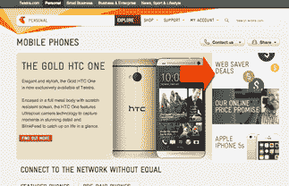
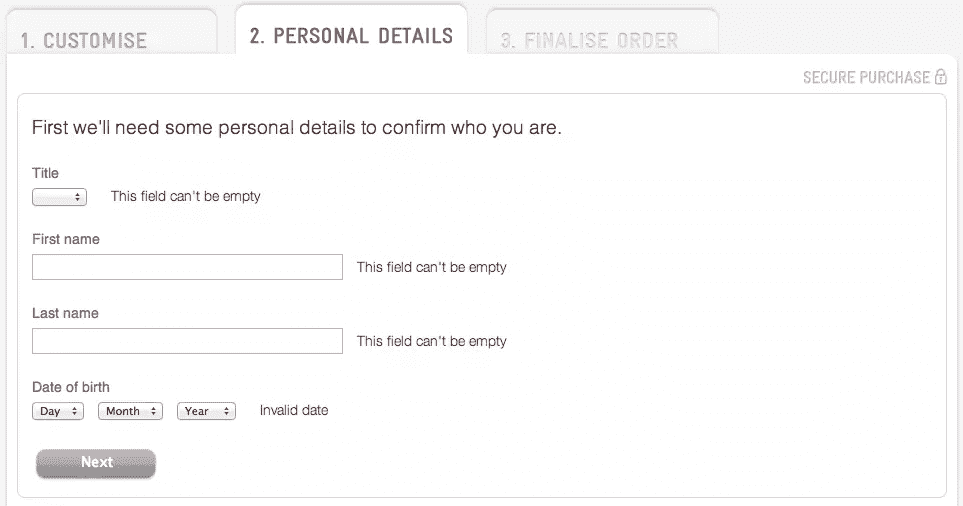
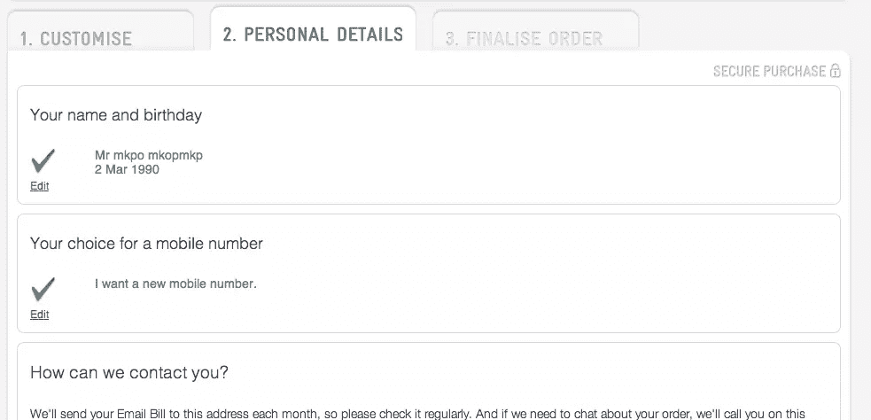

# 将作家的网络标准付诸实践

> 原文：<https://www.sitepoint.com/putting-web-standards-writers-practice/>

如果你想知道作者的网络标准如何在实践中发挥作用，你最好读一下这篇文章。

最近，我看了一下我国主要电信公司的网站，看看他们是如何处理我最近为网络作者指出的标准的。该公司的名字是 Telstra，它维护着澳大利亚的基本固定电话基础设施(以及移动和互联网基础设施)——所有年龄和能力的人都在使用的东西。

所以你会期望它的网站严格遵循最佳实践。

当然，这些标准不仅仅是作者为我们制定的——从理论上讲，每个在网站上工作的人都应该让它们成为现实。

但正如我发现的那样，标准经常被妥协。

我看了看网站的一页:[http://www.telstra.com.au/mobile-phones/](http://www.telstra.com.au/mobile-phones/)。让我们浏览一下这些标准，看看它是如何堆积起来的。

我们将从 WCAG 2.0 开始。

以文本为中心的图像不使用文本等价物或 ALT 标签。

## 1.1 替代文本

此页面没有为它所显示的所有图像提供文本替换。当我们关闭图像时，页面顶部功能块右侧的三个图像不会在文本中复制，因此没有图像的浏览者或使用屏幕阅读器的人不会在产品主机处获得任何信息。

这些图片也没有替换文字。

当然，图片的链接仍然是活跃的，如果你只是点击一下，这会产生一些有趣的互动。

## 1.2 基于时间的媒体选择

页面上没有基于时间的媒体，所以这个特定的标准不是问题。

## 1.3 适应性强

这些指导方针处理内容的结构、其各部分之间的关系，以及建立可以通过编程确定的有意义的信息序列。

我看到的页面使用了 H1、H2 和 H3 的标签。它们传达的结构看起来像这样:

移动电话

*   特色手机
*   预付费电话
    *   使用我们的移动计划选项，以您想要的方式进行连接
    *   澳大利亚最好的 4G 覆盖
    *   在更多地方跑得更快
    *   Telstra 24×7 应用程序

这看起来很好——直到你看到这一页。如您所见，演示文稿的结构并没有真正反映这一细分。所有 H3 的风格都不一样，所以视觉层次与编程层次不匹配。

有没有可能是商家使用标题标签来获得这些词的搜索排名，而不是用它们来组织内容？看起来是这样。

## 标题为的页面

这个页面有一个描述其主题的标题:Telstra 移动电话。呜！你勾选了一个框，澳大利亚电信。

## 2.4.4 链接目的(在上下文中)

这个要求非常具体:

每个链接的目的可以单独根据链接文本来确定，也可以根据链接文本及其以编程方式确定的链接上下文来确定，除非链接的目的通常对用户来说是不明确的

虽然页面包含一些带有通用文本的链接(例如“了解更多”)，但它们的目的在链接本身以及页面本身的上下文中都很清楚。

注意:如果你使用屏幕阅读器只阅读页面链接*和*，那么很难区分这些链接的目的。解决这个问题的一种方法是给每一个都添加一个关键字:

*   关于手机计划的更多信息
*   关于 SIM 卡套餐的更多信息
*   关于无锁定计划的更多信息
*   关于预付费计划的更多信息

这样，链接也将符合准则 2.4.9 链接目的(仅链接)。

## 多种方式

Telstra 网站成功地提供了多种定位网站内容的方式。它有导航、搜索框、面包屑(在页面底部)和网站地图。

这些面包屑也符合准则 2.4.8，位置。

## 标题和标签

页面上的标题和标签很好地描述了它们所涉及的内容。

## 章节标题

正如我们刚才看到的，标题标签的使用在这个页面上有点模糊。以相同方式显示的标题不一定以相同方式标记，这意味着以不同方式访问页面的用户会得到不同的信息。

然而，这个指导方针处理的是使用标题来组织内容，它们当然是用来做这件事的。

## 3.1 可读

这一页在这个指导方针上有点失败:它没有提供在上下文中解释诸如 4G 和 SIM 之类的术语的机制。

你越深入网站，某种术语表提供的价值就越大——尤其是在包含特性比较的页面上。

相信我，你不需要视力受损的人来帮助你揭开手机计划的神秘面纱。语境帮助将有助于潜在客户理解他们所花的钱得到了什么——并且很可能使品牌看起来更加平易近人和友好。

## 3.3 输入帮助

网站上的表单提供了输入帮助:字段被适当地标记，当必填字段丢失时会提供错误消息。

这些表格还允许您修改您输入的信息，这在准则 3.3.6 中有所涉及。

帮助是可用的，但是它不是真正的上下文敏感的，所以可以围绕准则 3.3.5 进行改进。

好了，这就是 WCAG 指导方针。但是我们不要忘记上次我们看的其他标准:BBC 网络内容指南。

## 运用英国广播公司的指导方针

正如我们所见，Telstra 网站没有避免使用行话——我们很难指望它完全做到这一点——但我也不认为它支持简单英语。

该网址当然是用户友好的(和搜索引擎优化友好，想不到吧！)，但是正如我们已经看到的，图像没有任何元数据，这是毫无帮助的。BBC 建议不要使用普通的链接文本，正如我们所看到的，这个页面确实使用了一些普通的文本——尽管这个问题很容易解决。

页面元数据方面，标题还好，描述也符合 BBC 的标准。但是关键字包括一个打字错误，我只能想象这是故意的，这样做是为了影响外部搜索引擎——我们不断听到，这种策略已经很久没有用了，因为搜索引擎决定忽略关键字标签。

## 看起来怎么样？

到目前为止，我认为 Telstra 网站只符合 WCAG 标准，这些标准代表了基本的网络用户期望。

网站导航、面包屑以及告诉用户提交的表单中哪些字段包含错误等内容被视为任何网站的基本元素，而且它们对于让客户找到并购买该组织出售的产品也是必要的。

不幸的是，Telstra 还没有找到合适的方法来帮助任何用户使用任何广泛可用的技术，而许多其他大型组织都乐于实施这些技术来帮助用户访问信息。事实上，他们在页面元数据中包含品牌名称输入错误的关键词，这表明他们的网络营销团队可能没有跟上当前的搜索技术。

如果我是这一页的作者，我会改变:

*   关键词
*   通用链接
*   图像元数据
*   缺乏术语表

我还会尽我所能说服当权者，标题的显示应该反映它们的程序层次。疯狂？也许吧！

如果你是作家，你会推动什么改变？我很想在评论中听到你的想法。

## 分享这篇文章