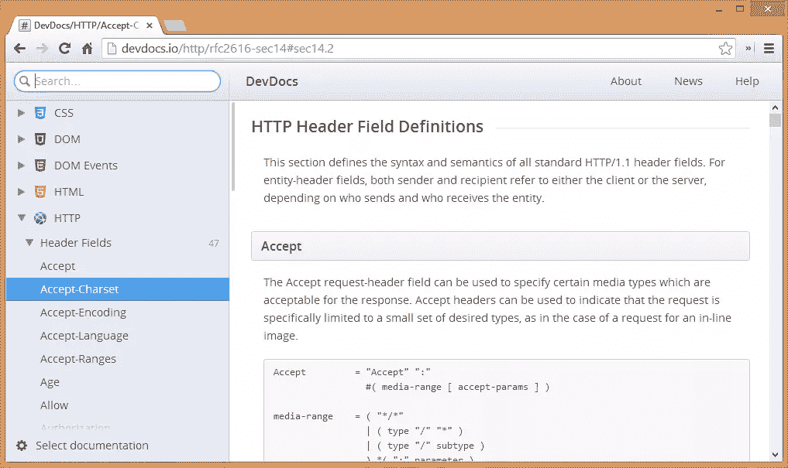
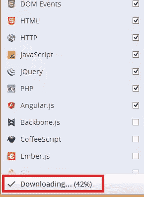
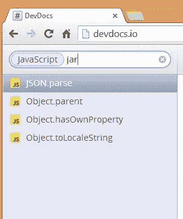
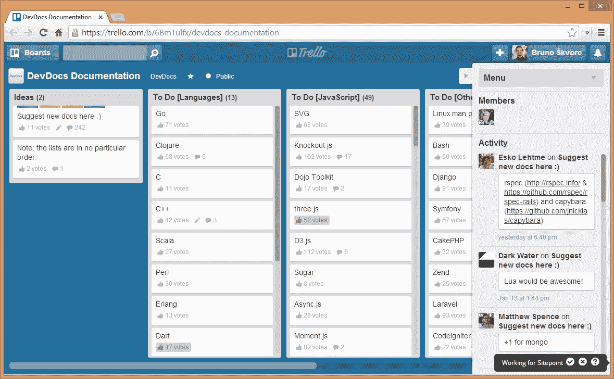
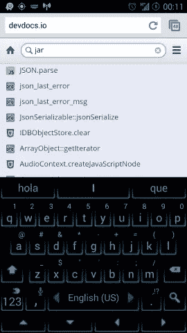
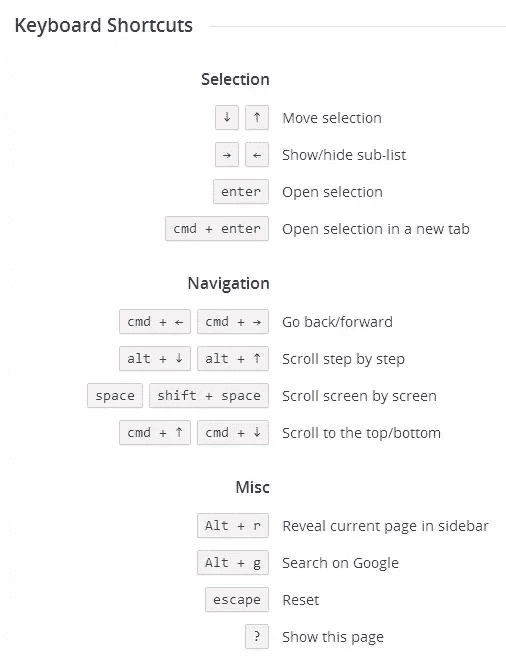

# 看看 DevDocs.io

> 原文：<https://www.sitepoint.com/look-devdocs-io/>

编码时你多久经历一次下面的过程？

1.  需要一个[在此插入编程语言]函数定义和例子
2.  谷歌搜索该功能
3.  点击第一个结果，或者是 w3schools [如果你运气不好的话](http://www.w3fools.com)，或者是你正在学习的语言的在线手册。
4.  意识到你需要演示和解释另一个功能
5.  回到谷歌，而不是在该语言的网站上使用搜索，因为它莫名其妙地糟糕，而且比在新的谷歌搜索后重新加载标签还要慢
6.  冲洗并重复

作为一名在很大程度上从事 web 技术的开发人员，我遇到过很多这样的情况。简单地找到一个函数或语句的技术定义已经变得比以往更加困难——不是从复杂性的角度，而是从浪费的时间的角度。如果我们可以把所有的开发文档放在一个地方，在一个漂亮的、支持离线的界面上，可以对任何语言进行超级快速的模糊搜索，这不是很好吗？进入 [devdocs.io](http://devdocs.io) 。

## 这是什么？

DevDocs 是一个 web 应用程序，旨在为您提供几乎所有前端语言和库的参考手册的快速访问。它以一种易于浏览和查看的格式列出了给定语言的所有 API 及其官方文档，没有像 php.net 这样的官方网站试图实现的不必要的菜单和俗气的样式。

这是一个 Ajax 驱动的开源 web 应用程序，具有语法高亮功能，甚至可以作为 [Chrome 扩展](https://chrome.google.com/webstore/detail/devdocs/mnfehgbmkapmjnhcnbodoamcioleeooe)或作为[插件](http://devdocs.io/about#plugins)用于美化文本或括号。

## 它是做什么的？

它汇集了所有流行语言的参考手册(前提是它们的手册是易于访问和机器可消费的格式)。它为您提供了一个灵活快速的界面，用于模糊搜索所有选定语言的文档，以便在尽可能少的按键下找到您需要的信息。你可能想知道，什么是模糊搜索？[模糊搜索](http://en.wikipedia.org/wiki/Approximate_string_matching)是搜索与您输入的内容近似(不完全)匹配的字符串。这是 Sublime Text 和 LightTable 等编辑器在命令搜索窗口中使用的方式——输入类似“sa”的内容会显示“另存为”，因为输入与命令的首字母匹配。输入“delte”将提供包含“delta”和“delete”的结果，输入“bgcp”甚至会给出“背景剪辑”。这种类型的搜索允许对结果进行超快速的微调，因为它们是实时的，你可以当场混合和匹配。

### 内容

DevDocs 为您选择的语言下载参考手册的索引，将它吸收到您的本地缓存中，从那里提供结果。这确实意味着您必须在每台新机器上重新下载您选择的语言，但是从这种操作方式中获得的速度远远优于老式的 Ajax 处理远程请求的方式。请注意——目前，只有索引是离线的，您点击的实际结果是从远程位置提供的——例如，您仍然需要互联网访问来获取 JavaScript 数组的文档，即使它在离线时也显示在搜索结果中。

需要注意的是，获取的内容仅供官方使用。这意味着用户提交的条目，如评论和样本，将被忽略。

你可以在特定的语言范围内搜索 DevDocs(例如仅 php ),方法是在搜索查询前加上“PHP ”,然后点击*标签*或*空格*(在手机上)。这将搜索模式切换到“仅选定的语言”。要退出该模式，只需退格即可。

### 开源和本地

DevDocs 是开源的，它鼓励社区以各种方式做出贡献。首先，它在 GitHub 上，邀请用户提交问题并改进代码，就像任何好的开源项目一样。其次，DevDocs 可以很容易地在本地部署，所以你可以运行或托管你自己的版本。例如，让它适应您公司内部系统的 API 是一件轻而易举的事情。最后但同样重要的是，DevDocs 使用 [Trello](https://trello.com/) 收集用户对所需语言的反馈。Trello 是一个非常有效的基于团队的任务列表，支持各种信息板，人们可以在那里合作，讨论和投票卡(主题)。DevDocs 使用这些卡片来收集个人语言集成的投票。参与，见[此处](https://trello.com/b/6BmTulfx/devdocs-documentation)。

DevDocs 会定期维护和更新，并提供各种方法来跟上变化:

*   如果你碰巧在更新日期前打开了这个网站，它会弹出一个最新的变化
*   有一个[简讯](http://eepurl.com/HnLUz)
*   有一个[推特账号](https://twitter.com/DevDocs)
*   甚至还有一个[邮件列表](https://groups.google.com/d/forum/devdocs)
*   有一个最新的[变更日志](http://devdocs.io/news)

所有这些似乎都来自同一个来源，所以最好只订阅其中的一个。

### 其他津贴

DevDocs 针对移动设备进行了全面优化，响应速度非常快。它可以在瞬间打开，在移动设备上和在桌面上运行完全一样。它以网站一贯的方式构建——在每台设备上都有流畅、快速和相同的体验。Thibaut Courouble 真的做得很棒。

如上所述，该应用程序作为 Sublime 文本和括号的插件安装，这意味着你可以从你的编辑器中搜索你需要的 API。更多的插件正在开发中，最引人注目的是 JetBrains 产品插件。该应用程序还被移植到一个独立的零配置可下载离线版本。

DevDocs 可以作为搜索引擎安装在 Firefox 和 Google Chrome 中，基本上其他任何支持 [OpenSearch](http://www.opensearch.org/Home) 的浏览器和 app 都可以。OpenSearch 是一个标准的集合，允许某个资源将自己标识为搜索引擎。

还提供了各种键盘快捷键，都非常直观和有用，提供了真正流畅的体验。

### 结论

如果您在阅读本文之前没有听说过 DevDocs，我强烈建议您尝试一下。网络迫切需要这种高度可用的资源，所以传播消息，帮助社区找到更好的解决方案来解决他们正在处理的问题。如果你可以贡献，DevDocs 在 GitTip 上并支持 T2 的 PayPal 捐款——但可以说最好的帮助方式是使用它，告诉别人，最重要的是，通过为 GitHub 上的项目做贡献来改进它。

## 分享这篇文章