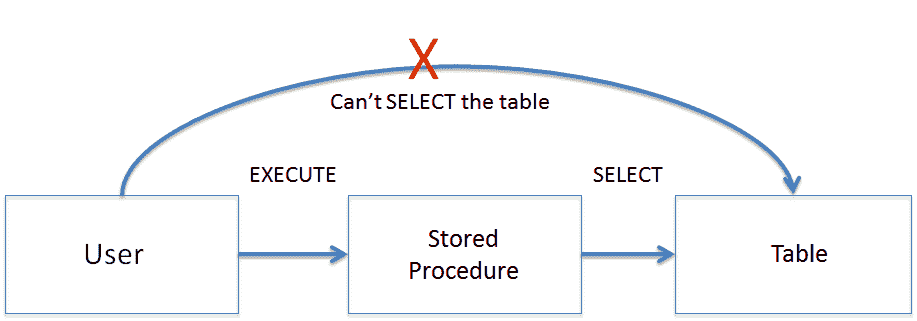
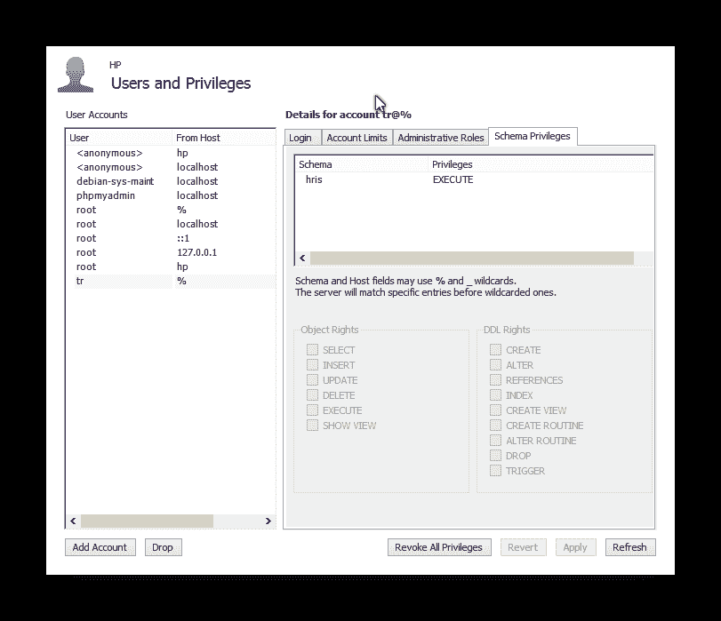
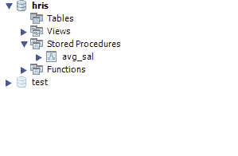

# MySQL 和 PHP 中的存储过程

> 原文：<https://www.sitepoint.com/stored-procedures-mysql-php/>

简而言之，存储过程(“SP”)是存储在数据库中的过程(用 SQL 和其他控制语句编写)，可由数据库引擎和连接的编程语言调用。

在本教程中，我们将看到如何在 MySQL 中创建一个 SP，并在 MySQL 服务器和 PHP 中执行它。

**注意:**我们不打算在这里涵盖 SP 的所有方面。官方的 [MySQL 文档](http://dev.mysql.com/doc/refman/5.7/en/create-procedure.html)应该永远是参考的地方。

SP 也可用于其他常见的数据库服务器(例如 Postgre ),因此我们在此讨论的内容也适用于这些服务器。

### 为什么推荐存储过程

我们大多数人都非常熟悉构建数据库应用程序的常规设置:创建数据库、创建表、建立索引、CRUD 数据、从客户端发出查询以及在必要时做进一步的处理。

该工作流在大多数情况下工作良好，但是缺少数据库编程的一个重要方面:存储过程。

我认为在数据库应用程序中使用 SP 至少有四个好处。

首先，它减少了网络流量和开销。在一个典型的 PHP 数据库 web 应用程序中，有四层:

*   客户端层，通常是一个 web 浏览器。它接收用户交互并在 UI 中显示数据。
*   web 服务器层，处理和调度用户请求，并将响应发送回客户端层。
*   PHP 层处理所有 PHP 解释，执行应用程序逻辑并生成响应的 PHP 部分。
*   数据库层，处理所有数据库查询，包括但不限于一个`SELECT`查询、一个`INSERT`语句等。

在典型的环境中，对于较大的应用程序，这些层很可能不在一台机器上，甚至可能不在一个网络中。

尽管网络速度在过去几年中有了巨大的提高，但与其他传输数据的方式(CPU 缓存、内存、硬盘等)相比，它仍然是最慢的和最不可靠的**。因此，为了节省带宽和增加健壮性，有时在服务器端(特别是 MySQL 服务器)进行更多的处理和逻辑处理，并减少通过网络传输的数据是一个好主意。**

其次，它提高了性能。SP 直接存储在 MySQL 服务器上运行。它可以由数据库服务器预先编译和分析。这与从客户端发出相同的查询截然不同，在客户端，每次调用查询语句时，查询将由数据库驱动程序解析、分析和优化(如果可能的话)**。这有点像解释语言执行(在客户端)和编译语言执行(在数据库服务器端)。我们知道编译过的程序会运行得更快。**

第三，一次编写，随处执行。SQL 是标准的，并且完全 100%独立于平台。它只依赖于数据库服务器。考虑一下有多少不同的语言/库可以用来处理数据库。将数据检索和处理放在服务器端会提高效率，而不是用所有这些语言/库提供的不同语法编写相同的处理逻辑，如果数据处理逻辑如此常用的话。

最后，SP 是数据库安全的一个基本方面。

让我们考虑一个简单的数据库设置。在人力资源信息系统(HRIS)中，可以合理地假设存在一个保存每个雇员工资信息的表。人力资源员工应该有权从该表中获取一些数据:总工资、平均工资等，但该员工不应看到每个员工的详细工资，因为这些信息过于敏感，应该只提供给少数人。

我们知道 MySQL 有全面的权限控制。在这种情况下，很明显我们甚至不能授予这个 HR 员工`SELECT`特权(如果我们这样做，意味着他/她可以看到每个人的详细工资)。但是如果他/她不能访问`salary`表，这个员工如何获得与`salary`相关的聚合信息呢？我们如何让员工在不影响人力资源政策的情况下获取这些信息？

答案是使用返回所需信息的存储过程，并授予该雇员`EXECUTE`特权。(关于 MySQL 特权的详细列表和解释，请查阅[官方文档](http://dev.mysql.com/doc/refman/5.6/en/privileges-provided.html)。这里的链接是针对 MySQL 5.6 的。请用您正在使用的版本替换 *5.6* 。)

SP 现在是一座桥梁，将用户(我们的 HR 员工)和用户不能直接访问的表(`salary`)连接起来。



就是这样！借助 SP，我们可以让用户在不损害数据库安全性(和人力资源政策)的情况下完成任务！

### 使用存储过程的缺点

在列举了使用 SP 的所有优点之后，我们需要明确一些缺点，看看是否有改进的方法。

*   SP 本身没有版本控制。当 SP 被修改时，它会被修改，服务器端不会保留任何历史记录。当用户想要回滚更改时，这可能会造成一些挫折。我的建议是把 SP 写在你的客户端，放在版本控制下。当 SP 准备好时，很容易将代码复制到，比如说 MySQL Workbench 中，并在服务器端创建它。通过这样做，我们可以有一定程度的版本控制。
*   没有简单的方法来“同步”应用的更改，并强制每个人使用最新版本，特别是当每个团队成员都有自己的本地数据库用于开发和测试时。版本控制可能是解决方案，但仍需要通过更新本地数据库服务器中 SP 的本地拷贝来进行手动干预。另一种方式是用“嘲讽”。可以对团队成员进行划分，以便至少有一个人专注于 SP 的维护和代码中对 SP 的调用的实现。需要 SP 结果的所有其他人可以使用模仿对象开发和测试他们的部分，即，总是假设对 SP 的“伪造”调用将返回期望的结果。在稍后的阶段，可以进行合并来丢弃模仿代码。
*   难以备份/导出。SP 位于服务器端。普通开发人员将只有基本权限(`SELECT`、`EXECUTE`等)，没有备份和导出的管理员权限。在某种程度上，我不会称之为缺点，而是 db 安全性的一个基本方面。没有办法，也不建议绕开这个。建议在一个团队中，指定一个专门的数据库管理员来做这些工作。常规数据库备份也可以用于备份/导出(和导入)目的。

### 在 MySQL 中创建存储过程

由于服务点存储在服务器中，建议直接在服务器中创建服务点，即不要使用 PHP 或其他编程语言发出 SQL 命令来创建服务点。

让我们看看如何在 MySQL 服务器中创建 SP，创建一个用户并应用权限，然后运行(作为该用户)SP，看看结果是否正确。在我的工作环境中，我使用的是 [MySQL Workbench](http://dev.mysql.com/downloads/tools/workbench) 。其他工具也是可用的(例如 PHPMyAdmin ),所以请随意使用最适合您的工具。

假设我们有一个这样的表:

```
CREATE TABLE `salary` (
  `empid` int(11) NOT NULL,
  `sal` int(11) DEFAULT NULL,
  PRIMARY KEY (`empid`)
) ENGINE=InnoDB DEFAULT CHARSET=utf8;
```

对于需要从该表中获取工资汇总信息(平均值、最大值、最小值等)的人力资源员工，我们首先创建一个用户`'tr'`,如下所示:

```
CREATE USER 'tr'@'localhost' IDENTIFIED BY 'mypass';
```

对于这个用户，我们只授予`salary`表所在模式的`EXECUTE`权限:

```
grant execute on hris.*  to tr@`%`
```

我们可以通过访问 MySQL Bench 中的“用户和权限”来验证是否授予了必要的权限:



现在，让我们像这样创建 SP:

```
DELIMITER $$

CREATE PROCEDURE `avg_sal`(out avg_sal decimal)
BEGIN
    select avg(sal) into avg_sal from salary;

END
```

**注意:**上述所有操作都需要 MySQL 服务器中的管理员角色。

在 MySQL Workbench 中发出命令后，`avg_sal` SP 将被创建并准备好被调用。它将返回表`salary`的平均工资。

为了测试用户`tr`是否可以实际运行 SP，但是不应该能够访问`salary`表，我们可以通过使用用户`tr`登录 MySQL 服务器来切换角色。这可以通过使用不同的用户/密码对在 MySQL Workbench 中创建另一个连接来实现。

以`tr`身份登录后，我们首先会注意到，用户将看不到任何表，只能看到 SP:



很明显，用户`tr`无法从任何表中选择任何内容(因此无法看到`salary`表的详细工资数字),但是他/她可以执行我们刚刚创建的 SP 并获得公司的平均工资:

```
call avg_sal(@out);
select @out;
```

将显示平均工资。

到目前为止，我们已经完成了创建用户、授予权限、创建 SP 和测试 SP 运行的所有准备工作。接下来，我们将展示如何从 PHP 内部调用 SP。

### 从 PHP 调用存储过程

有了 PDO，给服务提供商打电话很简单。PHP 代码如下:

```
$dbms = 'mysql';

//Replace the below connection parameters to fit your environment
$host = '192.168.1.8'; 
$db = 'hris';
$user = 'tr';
$pass = 'mypass';
$dsn = "$dbms:host=$host;dbname=$db";

$cn=new PDO($dsn, $user, $pass);

$q=$cn->exec('call avg_sal(@out)');
$res=$cn->query('select @out')->fetchAll();
print_r($res);
```

`$res`将包含表`salary`的平均工资。用户现在可以用 PHP 进一步处理输出。

### 结论

在本文中，我们回顾了 MySQL 数据库中被遗忘已久的组件:存储过程。使用 SP 的优势是显而易见的，让我再次强调:**存储过程允许我们对某些数据应用更强的数据库访问控制，以适应业务需求。**

我们还说明了创建存储过程、创建用户和分配特权的基本步骤，以及如何在 PHP 中调用它。

本文没有涵盖存储过程的全部内容。一些重要的方面，如输入/输出参数、控制语句、游标、完整的语法等，在这篇短文中没有讨论。

如果您感兴趣，请在这里留下您的评论，我们将很高兴为您带来更多关于 MySQL 这一有用和强大方面的深入文章。

## 分享这篇文章