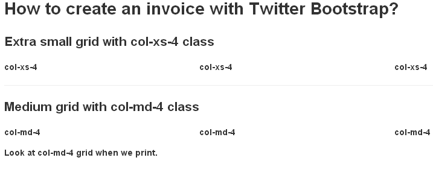
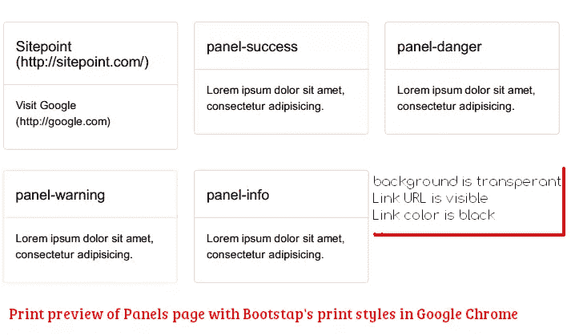
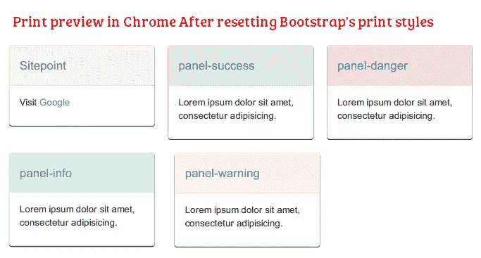

# 如何使用 Twitter Bootstrap 创建发票，第 1 部分

> 原文：<https://www.sitepoint.com/create-invoice-twitter-bootstrap-part-1/>

几天前，我必须创建一个发票。我在谷歌上搜索在线服务，以便快速开具发票。我找到了一个网站，创建了一个简单的发票，当我点击另存为 PDF 按钮时，它提示我注册。我还没有准备好注册下载我的 PDF 格式的简单发票。

我是一个 Bootstrap 用户，喜欢这个奇妙的框架，所以我决定看看我是否可以用 Bootstrap 创建我的发票。

用 Bootstrap 创建发票花了一些时间，但对我来说这是一次学习经历。在这篇文章中，我将与你分享我的经验。

Twitter Bootstrap 是一个非常流行的创建网站的框架，它提供了很棒的功能。你可以用 Bootstrap 非常快速地创建一个网站，但是在这篇文章中，我将用 Bootstrap 创建一些不同的东西。我将向你展示如何用 Twitter Bootstrap 创建发票，并将其保存为 PDF 格式。

## 我们需要什么

我们需要一个文本编辑器来编辑我们的 HTML 文件。你可以使用任何你选择的文本编辑器，我将使用 SublimeText。我们还需要 Twitter Bootstrap 框架和谷歌 Chrome 浏览器，因为这可以让我们将网页保存为 PDF 文件。

**下载链接**

*   [下载自举 3](http://getbootstrap.com/)
*   [下载引导程序 2.3.2](http://getbootstrap.com/2.3.2/)
*   [谷歌 Chrome 浏览器](https://www.google.com/intl/en_uk/chrome/browser/)
*   [SublimeText](http://www.sublimetext.com/)

## 入门指南

在桌面上新建一个文件夹，命名为 **Invoice** 。现在打开 Bootstrap 的压缩文件，在 dist 文件夹下，你会有 CSS，JS 和 fonts 文件夹，对于我们的项目，我们需要 Bootstrap 的 CSS 文件。只需将 CSS 文件夹从 dist 文件夹复制到您的新发票文件夹。

在 CSS 文件夹中，您会看到四个 CSS 文件。我们需要 bootstrap.css，如果你愿意，你可以删除其他文件。

打开您的文本编辑器，创建一个新文件，并将其作为 invoice.html 保存在我们的发票文件夹中，然后在 invoice.html 文件中添加以下代码。

```
<!DOCTYPE html>
<html lang="en">
  <head>
    <meta charset="utf-8">
    <title>INVOICE Template</title>
    <link href="css/bootstrap.css" rel="stylesheet">
  </head>
  <body>
    <div class="container">
        <div class="row">
            content here
        </div> <!-- /row -->
    </div> <!-- /container -->
  </body>
</html> 
```

这是我们文件的基本 HTML 代码。对于我们的发票项目，我们将使用额外的小网格。我们将为一个额外的小网格使用 Bootstrap 的`col-xs-*`类。

**为什么我们需要使用无响应电网**

我们将使用谷歌浏览器将我们的最终发票保存为 PDF 格式。如果我们使用中等大小的网格，当我们打印页面时，Chrome 会将各个列堆叠在一起。请看下图。



正如你所看到的，中等网格在普通网页上看起来很好，但当我们试图打印我们的页面时，Chrome 将中等网格列堆叠在彼此下方。现在你明白为什么我们要使用一个额外的小`col-xs-*`类了。

### 替代方法:使用 Bootstrap 2 中的无响应 CSS

如果你熟悉 Bootstrap 2，那么你可以使用它作为替代，因为它提供了无响应的 CSS。Bootstrap 2 不是移动的。首先，你必须添加一个额外的样式表来使你的网页响应迅速。

如果您确实想使用 Bootstrap 2，那么您可以使用`span*`类来创建列(用 1 到 12 之间的一个数字替换*作为列宽)。以下示例将创建具有三个相等列的布局。

```
<div class="row">
    <div class="span4"></div>
    <div class="span4"></div>
    <div class="span4"></div>
</div>
```

**警告:**如果您想使用 Bootstrap 2，那么您必须使用两个样式表，第一个来自 Bootstrap 2，用于无响应网格，第二个来自 Bootstrap 3，用于面板，因为面板是 Bootstrap 3 中的新功能。

### 我们要用什么

**Bootstrap 3，小网格和面板**对于本文，我将使用 Bootstrap 3，因为我将使用`.panel`类来创建面板，这在 Bootstrap 3 中是可用的。有不同的面板可供选择，你可以使用任何你喜欢的。我将使用`panel-primary`和`panel-info`类来创建面板。

`.panel-default` `.panel-success` `.panel-danger` `.panel-warning` `.panel-info`类可用于上下文面板。


还有一些类可以用来设置面板内容的样式。`.panel .panel-default` `.panel-body` `.panel-title` `.panel-heading` `.panel-footer`

### Bootstrap 印刷风格的重要之处

请记住，Bootstrap 删除了一些打印样式。例如，Bootstrap 使背景透明，消除文字阴影，打印时的方框阴影。对于链接，链接的 URL 将显示在链接文本之后。这意味着当你用 Chrome 打印网页时，你的背景色和链接色在 PDF 上是不可见的。



### 如何重置 Bootstrap 的打印样式

你可以在 bootstrap-min.css 的第 33 行找到 Bootstrap 的打印样式，在 bootstrap.css 打印样式从第 217 行开始，到第 290 行结束。

css 中的打印样式从

```
@media print {
  * {
    color: #000 !important;
    text-shadow: none !important;
    background: transparent !important;
    box-shadow: none !important;
  }
```

并在行 290 处结束

```
 .table {
    border-collapse: collapse !important;
  }
  .table-bordered th,
  .table-bordered td {
    border: 1px solid #ddd !important;
  }
}
```

要删除/重置打印样式，只需选择打印样式并在 SublimeText 中按`Ctrl+/`。这将注释掉所有打印样式。



现在，我们已经设置了所有必要的功能。在本文的第 2 部分，我们将创建发票并将其保存为 PDF。

## 分享这篇文章