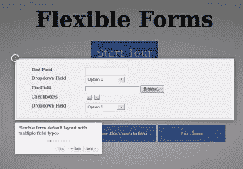
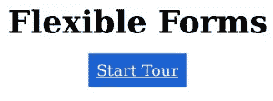
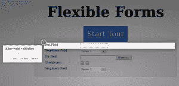

# 使用 Intro.js 介绍产品游览

> 原文：<https://www.sitepoint.com/introduction-product-tours-intro-js/>

在网上销售产品已经成为吸引全球观众注意力的一种趋势。在这些产品中，与有形产品相比，纯粹基于网络的产品和服务更容易销售。在线营销产品是提高销售额的决定性因素。因此，以互动的方式展示你的产品和服务的特点来吸引潜在客户的注意力是很重要的。产品之旅，也称为特色之旅，是推广产品的完美解决方案。本教程将解释创建产品游览的重要性，并展示如何使用 Intro.js 来创建有效的产品游览。



## 什么是产品之旅？

产品导览是一系列介绍产品现有功能或最新版本新增功能的步骤。产品参观有各种类型，直到最近，大多数产品参观都是使用 Flash 作为演示创建的。最近，JavaScript 库在构建产品游览中变得更加流行，因为它们提供了产品特性的交互式演示，而不是静态图像和动画。

## 为什么我需要产品参观？

通常，基于网络的产品与用于营销目的的网站相关联。这些网站包含说明产品功能和特性的用户指南或文档。但是这些用户指南不如产品参观有效，原因如下。

*   人们不喜欢阅读冗长的文档。
*   文档没有提供每个特性的交互式演示。
*   人们不经常阅读文档，因此很难引入新功能。

作为一种解决方案，产品之旅被用来突出产品特性，吸引新用户对产品的注意。不同类型的产品巡视路线创建库的产品巡视路线的功能可能有所不同，但是每个库都提供了一组构建巡视路线所需的通用功能。让我们来看看产品游览创建库的最基本的特征。

## 产品巡视路线创建库的功能

*   **产品参观开始按钮**–该按钮可能与库一起提供，或者开发人员可能需要定义一个自定义按钮来初始化参观。这个按钮应该设计成能引起用户的注意，并且通常比普通按钮大。
*   **产品参观步骤**–一旦开始，用户应该能够通过一系列介绍其功能的步骤进行导航，直到产品参观结束。产品导览创建库应该包含一种简单明了的方法，通过在文档中分配各种 HTML 元素来定义导览中的步骤。尽管这不是强制性的，但拥有**上一个**和**下一个**按钮来浏览产品参观的步骤是很有价值的。
*   **产品导览跳过按钮**–几乎可以肯定的是，并非每个用户都想浏览完整的产品导览。有时，旅程的前几步可能足以让你做出购买产品的决定。在这种情况下，应该允许用户跳过浏览并继续前进。因此，图书馆应该包含一个**跳过**按钮，让用户跳过游览。这个按钮应该在旅程的每一步都可用。
*   **产品参观完成按钮**–当用户到达最后一步时，应该有一种方法来完成参观。通常，这将是最后一步可用的按钮。我们需要针对此按钮的有效行动号召。通常，行动号召是购买或试用产品。一个**完成**按钮将取代最后一步的**跳过**按钮。

这些是产品之旅的一般特征。接下来，让我们看看一些用于创建基于 JavaScript 的产品之旅的流行库。

## 产品游览创建库

存在几个基于 JavaScript 的产品游览创建库。它们中的每一个都提供了该库独有的功能。一些更受欢迎的选择如下所示。

*   [Intro.js](http://usablica.github.io/intro.js/)
*   [自举之旅](http://bootstraptour.com/)
*   [兜风](http://zurb.com/playground/jquery-joyride-feature-tour-plugin)
*   [跳房子](http://linkedin.github.io/hopscotch/)
*   [Pageguide.js](http://tracelytics.github.io/pageguide/)

在这些库中，Intro.js 提供了产品之旅的所有基本特性。因此，出于本文的目的，我们将使用 Intro.js 创建一个示例产品游览。

## 使用 Intro.js 构建产品之旅

Intro.js 是一个轻量级开源库，用于创建网站或产品的逐步游览。你可以从 [Github](https://github.com/usablica/intro.js/tags) 中获得这个库的副本。我们可以通过下载最新版本来开始实现。下载完成后，您可以提取 zip 文件并尝试示例文件夹中的示例旅程。

一般来说，所有的功能和必要的信息都可以在网页上找到，产品导览用于突出显示带有附加信息的功能。在本教程中，我们将看到一个稍加修改的产品介绍，其中没有任何功能最初在网页上提供。随着旅程的继续，我们将展示每个特征。对于本教程，让我们首先将必要的文件复制到一个新文件夹中。

**步骤 1–添加 Intro.js 文件**

首先，我们需要将 Intro.js 相关文件添加到我们的项目文件夹中。将`intro.js`和`introjs.css`复制到项目文件夹中。

**步骤 2–创建 HTML 文件**

创建一个新的 HTML 文件，并包含 JavaScript 和 CSS 文件，如下面的代码所示。

```
<!DOCTYPE html>
<html lang="en">
  <head>
    <link href="introjs.css" rel="stylesheet">
  </head>
  <body>
    <script src="https://code.jquery.com/jquery-1.10.1.min.js"></script>
    <script src="intro.js"></script>
  </body>
</html>
```

**步骤 3–设计第一步**

正如我前面提到的，除了初始步骤，所有的步骤都将被隐藏。产品之旅开始按钮和第一步是我们在这里需要的强制性的东西。这些是使用下面的代码实现的。

```
<div class="main_container">
  <div class="flexi_form_title">
    <h1 data-step="1" data-intro="This is flexible forms tour">Flexible Forms</h1>
    <a id="flexi_form_start" href="javascript:void(0);">Start Tour</a>
  </div>
</div>
<script src="https://code.jquery.com/jquery-1.10.1.min.js"></script>
<script src="intro.js"></script>
<script>
  $("#flexi_form_start").click(function() {
    introJs().start();
  });
</script>
```

前面的代码需要插入到 HTML 文档的`<body>`标签中。请注意，这里不包括这个元素的 CSS 样式，因为它太长了。您可以在源文件中找到 CSS 代码。此时，您应该有一个类似于下图的屏幕。



Intro.js 使用名为`data-step`的自定义数据属性来定义产品之旅的步骤。这将是一个用于定义步骤顺序的数值。还有一个`data-intro`属性用于提供每个步骤的解释。

点击按钮后，我们必须通过调用`introJs().start()`来初始化产品浏览。现在，您应该已经开始了旅程的第一步，如下图所示。


**步骤 4–设计隐藏步骤**

一旦第一步完成，我们需要显示下一组步骤，这些步骤在初始页面加载期间是隐藏的。所以让我们来看看下面的代码。

```
<div id="form_container">
  <form class="flexi_form" data-step="2" data-intro="Flexible form default layout with multiple field types" style="display:none"  data-position="bottom">
    <ul>
      <li data-step="3" data-position="left" data-intro="Inline form validation">
        <div class="left">Text Field</div><input type="text" />
      </li>
      <li data-step="4" data-intro="Customizable Form Layouts">
        <div class="left">Dropdown Field</div>
        <select>
          <option>Option 1</option>
          <option>Option 2</option>
        </select>
      </li>
      <li data-step="5" data-intro="Guidence for filling forms">
        <div class="left">File Field</div>
        <input type="file" />
        <div class="right">Please Upload PDF Files</div>
      </li>
      <li>
        <div class="left">Checkboxes</div>
        <input type="checkbox" /><input type="checkbox" />
      </li>
      <li>
        <div class="left">Dropdown Field</div>
        <select>
          <option>Option 1</option>
          <option>Option 2</option>
        </select>
      </li>
    </ul>
  </form>
</div>
```

该代码块被插入到第一个代码块之后的`main_container`元素中，并且最初将被隐藏。该模块包含产品旅程的多个步骤。这里，我们还使用了`data-position`属性，它使我们能够定义解释框的方向。当我们执行这些步骤时，我们必须动态地展示这些特性。因此，我们使用定制的 JavaScript 代码来过滤旅程中的每一步。考虑下面的代码。

```
<script>
  $("#flexi_form_start").click(function() {
    introJs().start().onbeforechange(function(targetElement) {
      $(".steps").hide();
      $(".left").css("float", "left");
      $("input").removeClass("error");
      $(".right").hide();

      switch($(targetElement).attr("data-step")) {
        case "2":
          $(".flexi_form").hide();
          $(targetElement).show();
          break;
        case "3":
          $("input").addClass("error");
          $(targetElement).show();
          break;
        case "4":
          $(".left").css("float", "none");
          $(targetElement).show();
          break;
        case "5":
          $(".right").show();
          $(targetElement).show();
          break;
      }
    });
  });
</script>
```

Intro.js 提供了一个名为`onbeforechange()`的函数，在每一步过渡之前执行。下一步元素将作为参数传递给该函数。我们可以使用简单的`switch`语句过滤该步骤，如前面的代码所示。然后我们过滤掉`switch`语句中的每一步，并添加必要的代码来显示产品特性。此演示用于说明产品演示的强大功能，大多数功能与 Intro.js 没有直接关系。您的产品演示将类似于以下屏幕。



您可以在本教程的末尾查看本产品教程的完整演示和源代码。

**步骤 5–实施完整的功能**

如简介中所述，在参观结束时提供行动号召非常重要。在这里，我们将在单击完成按钮后将用户重定向到另一个页面。这是使用下面的代码完成的。

```
<script>
  introJs().start().oncomplete(function() {
    window.location.href = "complete.html";
  }).onbeforechange(function(targetElement) {
    // The rest of the code
  })
</script>
```

Intro.js `oncomplete()`方法用于在完成产品参观后执行代码。当用户在最后一步点击`Done`按钮时，这个函数被调用。这里，我们将用户重定向到另一个页面。一旦用户点击了这个按钮，你应该有一个强烈的行动号召。

**步骤 6–实现跳过功能**

用户应该可以随时跳过旅程，因此我们在每一步都有一个`Skip`按钮，除了最后一步。Intro.js 使用它的`onexit()`方法来实现跳过功能。以下代码已被修改，以包含对`onexit()`的调用。

```
<script>
  introJs().start().oncomplete(function() {
    window.location.href = "complete.html";
  }).onexit(function() {
    window.location.href = "complete.html";
  }).onbeforechange(function(targetElement) {
    // The rest of the code
  })
</script>
```

## 结论

本文研究了 product tour 创建库的所有基本功能。请随意下载源代码，并使用以下链接查看演示。

[下载源代码](http://goo.gl/7pUWUz)

[观看演示](http://goo.gl/rW7XBa)

现在，是时候让你用一次令人惊叹的产品之旅来推广你的产品了。让我们了解您的产品之旅或任何其他在线提供的独特产品之旅。

## 分享这篇文章