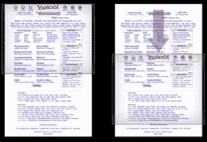

# 建造一个滚动时能保持不动的盒子

> 原文：<https://www.sitepoint.com/building-box-sticks-scroll/>

粘滞框是指无论你在页面上滚动到哪里，在浏览器上都保持可见的框。它们最常用于侧栏和标题栏，以保持品牌和导航菜单在任何时候都是可见和可及的。在过去，粘性框是非常基本的，无论你滚动到哪里，它都只是固定在视窗的一部分，就像雅虎的截图所示。主页。



它们也很容易用 CSS 实现，如下面的 IE6 变通方法所示。

```
<style>
  #header {
    position: fixed;
    top: 0px;
  }
  * html #header {
    position: absolute;
    top: expression(document.body.scrollTop);
  }
</style>
```

但是现在，网页已经发生了变化，粘滞框需要根据网页滚动到的位置放在不同的位置。例如，查看这篇文章的演示页面，[世界各地的瑜伽商店](https://github.com/jsprodotcom/source/blob/master/BuildingABoxThatSticksWhileYouScroll.zip "Demo on GitHub")。请注意徽标和语音气泡是如何优雅地漂浮在主要内容旁边的。当你在页面的顶部时，粘性框可以被钉在屏幕的中间。当您向下滚动时，粘性框会优雅地向上滑动，然后在会话期间保持在视口的顶部。然后，当您接近页面底部(或边界)时，粘性框会进一步向上滑动，直到它从视图中消失。这是一种非常流畅的体验，只需几行代码就可以完成。

## 这个计划

首先，我们需要一个每当页面滚动时都会被调用的函数。此函数必须遍历页面上的每个粘性元素，以确定该元素是否:

1.  在视口顶部边缘的下方。
2.  在视口的顶部边缘上方，并且
    *   不接触其边界的底部边缘。
    *   接触其边界的底部边缘。

现在，让我们运行下面的框架代码:

```
document.onscroll = onScroll;

function onScroll() {
  var list = getAllStickies();

  for (var i = 0, item; item = list[i]; i++) {
    var bound = getBoundary(item);
    var edge = bound.getBoundingClientRect().bottom;
    var height = item.offsetHeight;
    var top = item.getBoundingClientRect().top;

    if (top < 0) {
      // above the top edge of the viewport
      if (edge > height) {
        // not touching the bottom edge of its boundary
        item.style.position = "fixed";
        item.style.top = "0px";
      } else {
        // touching the bottom edge of its boundary
        item.style.position = "relative";
        item.style.top = -((top - edge) + height) + "px";
      }
    } else {
      // below the top edge of the viewport
      item.style.position = "relative";
      item.style.top = "auto";
    }
  }
}
```

函数`getAllStickies()`和`getBoundary()`还没有定义。稍后我们将再次讨论它们。`getBoundingClientRect()`函数是一个方便快捷的函数，用于返回一个元素相对于视窗的位置。视口上方的元素是负数。通过使用这个函数，我们只需要检查顶值是正数还是负数。

我们的函数检测每个粘性元素的三种情况:

1.  如果元素位于视窗的上边缘之下，则该元素仍然是页面的一部分，并且应该位于其自然位置，以便与页面一起滚动。
2.  如果元素在视口的顶部边缘之上(即隐藏)，并且不接触其边界的底部边缘，则该元素应该被移动到视口的顶部，并且其`position`被设置为`fixed`。
3.  如果该元素在视口的上边缘之上(即隐藏)，并且接触其边界的下边缘，则该元素应该被移动到边界边缘的正上方。在这种情况下，它的`position`被设置为`relative`，这样它就可以随页面一起滚动。

现在逻辑到位了，我们来讨论一下语义。

## 标记

我们将粘性元素定义为包含`x-sticky`属性的元素。sticky 是用`x-sticky-boundary`属性标识的边界元素的子元素或后代元素。粘性物质在边界元件的范围内自由移动。下面是一个粘性边界的例子。

```
<div x-sticky-boundary="">
  <div x-sticky="">I am a sticky confined within a boundary</div>
</div>
```

接下来，我们将实现我们之前提到的`getAllStickies()`和`getBoundary()`函数。我们可以将`getAllStickies()`替换为:

```
var list = document.querySelectorAll("[x-sticky]");
```

此外，我们可以实现`getBoundary()`来返回带有`x-sticky-boundary`属性的第一个祖先元素(或者返回`body`元素):

```
function getBoundary(n) {
  while (n = n.parentNode) {
    if (n.hasAttribute("x-sticky-boundary")) {
      return n;
    }
  }

  return document.body || document.documentElement;
}
```

目前，代码只支持每个边界一个 sticky。但是很多时候，我们在每个边界上有两个或更多不应该互相冲突的粘性。如果第二个粘滞移动到视口的顶部，它应该会将第一个粘滞推开。

以前，我们假设边界的底部边缘是边界界限。我们需要对此进行修改，以检查同一边界内的下一个粘性元素的顶部边缘。

```
var edge = bound.getBoundingClientRect().bottom;
var nextItem = findNextInBoundary(list, i, bound);

if (nextItem) {
  edge = nextItem.getBoundingClientRect().top;
}
```

我们定义了一个新函数`findNextInBoundary()`，它循环遍历一个数组，从一个定义的索引开始，寻找与当前 sticky 共享一个边界元素的下一个 sticky。

## 下降

有一个主要的场景我们还没有考虑到。页面滚动后，我们动态地将一个粘性元素移动到页面上的另一个位置。这意味着粘性元素的原始位置没有被保留，这意味着当用户向上滚动时，我们不能恢复它的原始位置。

还有，当我们把 sticky 做成一个固定位置的元素时，它被从文档流中拉出来，这意味着它下面的内容会上移。我们希望保留它所占据的空间，这样它下面的内容就不会跳来跳去。为了解决这个问题，我们需要在粘性的原始位置放置一个占位符元素。我们还将把粘性放入占位符中，这样它就不会影响占位符兄弟的`nth-child`伪选择器。然后，每当我们需要恢复粘性的位置时，我们用粘性替换占位符，并丢弃占位符。

需要记住的一点是，如果我们想得到一个 sticky 的初始位置，我们应该得到它的占位符的当前位置。这是我们更新后的功能:

```
document.onscroll = onScroll;

function onScroll() {
  var list = document.querySelectorAll("[x-sticky]");

  for (var i = 0, item; item = list[i]; i++) {
    var bound = getBoundary(item);
    var edge = bound.getBoundingClientRect().bottom;
    var nextItem = findNextInBoundary(list, i, bound);

    if (nextItem) {
      if(nextItem.parentNode.hasAttribute("x-sticky-placeholder")) {
        nextItem = nextItem.parentNode;
      }

      edge = nextItem.getBoundingClientRect().top;
    }

    // check if the current sticky is already inside a placeholder
    var hasHolder = item.parentNode.hasAttribute("x-sticky-placeholder");
    var rect = item.getBoundingClientRect();
    var height = rect.bottom - rect.top; // get the height and width
    var width = rect.right - rect.left;
    var top = hasHolder ? item.parentNode.getBoundingClientRect().top : rect.top;

    if (top < 0) {
      if(edge > height) {
        item.style.position = "fixed";
        item.style.top = "0px";
      } else {
        item.style.position = "relative";
        item.style.top = -((top - edge) + height) + "px";
      }

      if (!hasHolder) {  //create the placeholder
        var d = document.createElement("div");

        d.setAttribute("x-sticky-placeholder", "");
        d.style.height = height + "px";  //set the height and width
        d.style.width = width + "px";
        item.parentNode.insertBefore(d, item);
        d.appendChild(item);
      }
    } else {
      item.style.position = "relative";
      item.style.top = "auto";

      if (hasHolder) {  //remove the placeholder
        item = item.parentNode;
        item.parentNode.insertBefore(item.firstChild, item);
        item.parentNode.removeChild(item);
      }
    }
  }
}

function findNextInBoundary(arr, i, boundary) {
  i++;

  for (var item; item = arr[i]; i++) {
    if (getBoundary(item) == boundary) {
      return item;
    }
  }
}

function getBoundary(n) {
  while (n = n.parentNode) {
    if (n.hasAttribute("x-sticky-boundary")) {
      return n;
    }
  }

  return document.body || document.documentElement;
}
```

## 诱饵

为了最大化占位符的有用性，我们还需要从 sticky 元素复制几个 CSS 属性到占位符中。例如，我们希望页边距相同，以便它占据完全相同的空间。我们还希望保留`float`属性，这样它就不会弄乱基于浮动的网格布局。

让我们引入一个函数`copyLayoutStyles()`，一旦占位符创建完毕，就会调用这个函数将样式复制到占位符中:

```
function copyLayoutStyles(to, from) {
  var props = {
    marginTop: 1,
    marginRight: 1,
    marginBottom: 1,
    marginLeft: 1
  };

  if (from.currentStyle) {
    props.styleFloat = 1;

    for (var s in props) {
      to.style[s] = from.currentStyle[s];
    }
  } else {
    props.cssFloat = 1;

    for (var s in props) {
      to.style[s] = getComputedStyle(from, null)[s];
    }
  }
}
```

## 清理

目前我们正在将元素的`position`属性直接设置为`fixed`或`relative`。让我们将调用移入 CSS 样式表，并使用选择器来应用属性。这允许其他程序员在必要时覆盖默认行为。CSS 样式表将如下所示:

```
<style>
  [x-sticky] {margin:0}
  [x-sticky-placeholder] {padding:0; margin:0; border:0}
  [x-sticky-placeholder] > [x-sticky] {position:relative; margin:0 !important}
  [x-sticky-placeholder] > [x-sticky-active] {position:fixed}
</style>
```

让我们通过创建一个临时元素并用样式表设置它的`innerHTML`,用 JavaScript 注入这个样式表，而不是创建一个单独的样式表。然后，我们可以将结果附加到文档中，如下所示。

```
var css = document.createElement("div");
css.innerHTML = ".<style>" + 
  "[x-sticky] {margin:0}" +
  "[x-sticky-placeholder] {padding:0; margin:0; border:0}" +
  "[x-sticky-placeholder] > [x-sticky] {position:relative; margin:0 !important}" +
  "[x-sticky-placeholder] > [x-sticky-active] {position:fixed}" +
  "<\/style>";
var s = document.querySelector("script");
s.parentNode.insertBefore(css.childNodes[1], s);
```

在 main 函数中，我们需要用`item.setAttribute("x-sticky-active", "")`替换每次出现的`item.style.position = "fixed"`，这样 CSS 选择器就可以匹配属性。为了使这段代码可发布，我们还需要将所有东西都包装在一个闭包中，以保持私有变量的私有性。我们还需要使用`addEventListener()`而不是分配给`document.onscroll`来避免可能的冲突。同时，让我们添加一个 API 检查(如下所示)，这样我们的函数就不会在旧的浏览器中运行。

```
if (document.querySelectorAll && 
    document.createElement("b").getBoundingClientRect)
(function(doc) {
"use strict";

init();

function init() {
  if(window.addEventListener) {
    addEventListener("scroll", onScroll, false);
  } else {
    attachEvent("onscroll", onScroll);
  }

  var css = doc.createElement("div");

  css.innerHTML = ".<style>" + 
    "[x-sticky] {margin:0}" +
    "[x-sticky-placeholder] {padding:0; margin:0; border:0}" +
    "[x-sticky-placeholder] > [x-sticky] {position:relative; margin:0!important}" +
    "[x-sticky-placeholder] > [x-sticky-active] {position:fixed}<\/style>";

  var s = doc.querySelector("script");
  s.parentNode.insertBefore(css.childNodes[1], s);
}

function onScroll() {
  var list = doc.querySelectorAll("[x-sticky]");

  for (var i = 0, item; item = list[i]; i++) {
    var bound = getBoundary(item);
    var edge = bound.getBoundingClientRect().bottom;
    var nextItem = findNextInBoundary(list, i, bound);

    if (nextItem) {
      if (nextItem.parentNode.hasAttribute("x-sticky-placeholder")) {
        nextItem = nextItem.parentNode;
      }

      edge = nextItem.getBoundingClientRect().top;
    }

    var hasHolder = item.parentNode.hasAttribute("x-sticky-placeholder");
    var rect = item.getBoundingClientRect();
    var height = rect.bottom - rect.top;
    var width = rect.right - rect.left;
    var top = hasHolder ? item.parentNode.getBoundingClientRect().top : rect.top;

    if (top < 0) {
      if (edge > height) {
        if (!item.hasAttribute("x-sticky-active")) {
          item.setAttribute("x-sticky-active", "");
        }

        item.style.top = "0px";
      } else {
        if (item.hasAttribute("x-sticky-active")) {
          item.removeAttribute("x-sticky-active");
        }

        item.style.top = -((top - edge) + height) + "px";
      }

      if (!hasHolder) {
        var d = doc.createElement("div");

        d.setAttribute("x-sticky-placeholder", "");
        d.style.height = height + "px";
        d.style.width = width + "px";
        copyLayoutStyles(d, item);
        item.parentNode.insertBefore(d, item);
        d.appendChild(item);
      }
    } else {
      if (item.hasAttribute("x-sticky-active")) {
        item.removeAttribute("x-sticky-active");
      }

      item.style.top = "auto";

      if(hasHolder) {
        item = item.parentNode;
        item.parentNode.insertBefore(item.firstChild, item);
        item.parentNode.removeChild(item);
      }
    }
  }
}

function findNextInBoundary(arr, i, boundary) {
  i++;

  for (var item; item = arr[i]; i++) {
    if (getBoundary(item) == boundary) {
      return item;
    }
  }
}

function getBoundary(n) {
  while (n = n.parentNode) {
    if (n.hasAttribute("x-sticky-boundary")) {
      return n;
    }
  }

  return doc.body || doc.documentElement;
}

function copyLayoutStyles(to, from) {
  var props = {
    marginTop: 1,
    marginRight: 1,
    marginBottom: 1,
    marginLeft: 1
  };

  if (from.currentStyle) {
    props.styleFloat = 1;

    for (var s in props) {
      to.style[s] = from.currentStyle[s];
    }
  } else {
    props.cssFloat = 1;

    for (var s in props) {
      to.style[s] = getComputedStyle(from, null)[s];
    }
  }
}
})(document);
```

## 结论

现在你知道了！通过用一个`x-sticky`属性标记一个元素，它会随着页面滚动，直到它到达顶部，并且它会停留，直到它遇到边界边缘，然后在页面上消失。

## 分享这篇文章