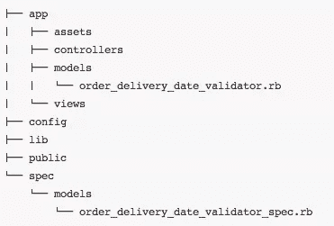

# 快速 Rails 测试的 Lite Spec 助手

> 原文：<https://www.sitepoint.com/lite-spec-helper-faster-rails-tests/>


## Rails 中测试缓慢的根源

在 Rails 中运行测试通常很慢，而且这种慢通常源于大多数规范文件的第一行–`require 'spec_helper.rb'`。

以一个典型的`spec_helper.rb`为例(来自 [gitlab](https://github.com/gitlabhq/gitlabhq/blob/master/spec/spec_helper.rb) ):

对这个文件的简单检查揭示了它的繁重任务:
——在 [L14](https://github.com/gitlabhq/gitlabhq/blob/master/spec/spec_helper.rb#L14)
的整个 Rails 环境——测试框架及其配置，如`rspec`和`capybara`
——测试助手及其配置，如`email_spec`、`factorygirl`和`webmock`
——测试报告者和接收者—`simplecov`、`spork`

这需要加载大量代码，而且加载时不考虑测试环境。验收测试加载它，集成测试加载它，单元测试也加载它。当我们需要运行任何单个测试时，这种一劳永逸的`spec_helper.rb`会增加不必要的加载时间。

## 我们真的需要那么多吗？

在测试驱动开发的过程中，我们在开发过程中需要运行的最频繁的测试是单元测试。我们只需要在开发周期的末尾运行集成测试和验收测试。

此外，有了好的设计模式，大多数对象将建立在 POROs(普通的老 Ruby 对象)之上，如[值对象](https://www.sitepoint.com/value-objects-explained-with-ruby/)、[策略对象](http://blog.codeclimate.com/blog/2012/10/17/7-ways-to-decompose-fat-activerecord-models#policy-objects)或[表单对象](http://blog.codeclimate.com/blog/2012/10/17/7-ways-to-decompose-fat-activerecord-models/#form-objects)。这些对象**是建立在框架 API**之上的，可以在框架之外独立测试。

为了测试这些 POROs，我们不需要加载整个 Rails 框架。我们只需要选择启动测试所需的组件。这解决了测试缓慢的根本原因。

这里的是一个工作演示来说明这个想法。

```
git clone https://github.com/yangchenyun/lite_spec_helper_demo 
```

它包含继承自`ActiveModel::Validators`的 Rails 模型验证器的源代码和规范。

该文件夹保留了传统的 Rails 结构，但是省略了除两个相关文件之外的所有代码:要测试的验证器和验证器的规范。



运行`rspec spec/models`，你会发现它惊人地运行了三个测试。这是启动测试的最低要求。

```
$ rspec spec/
...

Finished in 0.02124 seconds
3 examples, 0 failures 
```

## 学习在没有 Rails 的情况下运行测试

快速浏览一下 this spec 文件会发现几行通常不会出现在此类文件中的内容:

```
# ...
require 'active_model'
require 'active_support/core_ext/object'
require_relative '../../app/models/order_delivery_date_validator'

# ... 
```

上面代码片段中的两个`require`是在规范中运行验证器所需的依赖项。这项额外的工作是必要的，因为我们没有加载 Rails 及其所有的魔法。

首先，默认情况下没有加载 Rails 的组件——没有`ActiveModel`,没有`ActiveSupport`,没有`ActionController`,我们的项目代码也没有。其次，这里没有使用`ActiveSupport::Autoload`，所以我们不能依靠 Rails 来猜测对象名和加载正确的源文件。加载所需文件的责任现在是我们的了。

`require 'active_model'`载入[该文件](https://github.com/rails/rails/blob/master/activemodel/lib/active_model.rb)并使`ActiveModel::Validator`可用。

`require 'active_support/core_ext'`用 [`blank?`延伸`Object`，用](https://github.com/rails/rails/blob/master/activesupport/lib/active_support/core_ext/object/blank.rb#L14) [`days`](https://github.com/rails/rails/blob/master/activesupport/lib/active_support/core_ext/numeric/time.rb#L49) 延伸`Fixnum`。

这种手工工作还带来了另一个隐含的好处。外部 API 是公开的，并提供关于对象所处的上下文的信息。

最后，`require_relative '../../app/models/order_delivery_date_validator'`通过相对路径加载待测试的源代码。

## 建造最小的`spec_helper_lite.rb`

现在，我们开始减去多个相似规格的共同点。

`require_relative`线是一个很好的起点。如果我们改变文件夹的结构，`../..`太冗长了，很难维护。如果我们能以一种更简洁的方式比如`require 'order_delivery_date_validator'`来要回源代码会怎么样？

这可以通过修改 Ruby 中的`$:` ( `$LOAD_PATH`)来实现。当我们`require 'something'`时，Ruby 会在`$:`的所有路径中查找，并根据 [ruby-doc](http://www.ruby-doc.org/core-2.0.0/Kernel.html#method-i-require) 寻找`something.rb`进行加载:

> 如果文件名没有解析为绝对路径，将在$LOAD_PATH ($:)中列出的目录中进行搜索。如果文件名的扩展名为。rb，它是作为源文件加载的…

为了实现这种简洁的语法，我们只需将`app/models`目录添加到`$:`中。我们还可以使用这种配置添加保存其他资源的任何目录。

```
# spec/spec_helper_lite.rb
# ...
$:.unshift File.expand_path '../../app/models', __FILE__ 
```

现在我们可以在我们的眼镜中使用这个光助手了。我们可以只使用`require 'order_delivery_date_validator'`，而不是使用带有大量`..`的长路径的`require_relative`。此外，我们可以在将来将大多数规范通常需要的文件放入这个“lite”助手中。

这里是更新的[回购](https://github.com/yangchenyun/lite_spec_helper_demo/tree/4dce9780f84b7f228569fc6b323151dda26e7403)与这个新创建的`spec_helper_lite.rb`。

## 少即是多

与功能丰富的典型`spec_helper.rb`相比，我们的`spec_helper_lite.rb`是最小的。它没有加载所有的框架开销，而是只加载测试框架`rspec`并调整`$:`以减轻我们项目源代码的加载。

这个`spec_helper.rb`很好的支持单元测试，比原来快很多。此外，它还揭示了规范中的依赖关系，并检测出过于复杂的对象。

功能齐全的`spec_helper.rb`仍然可以加载用于集成测试和验收测试，但是`spec_helper_lite.rb`会让你在频繁运行的单元测试中更快乐。

# 结论

从对 Rails 中的对象运行单元测试的最低要求开始，我们创建了精简版的`spec_helper.rb`。它为文件加载提供了最少的实用程序，并揭示了对象依赖性，同时加快了单元测试的速度。

## 分享这篇文章