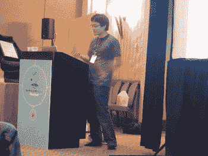
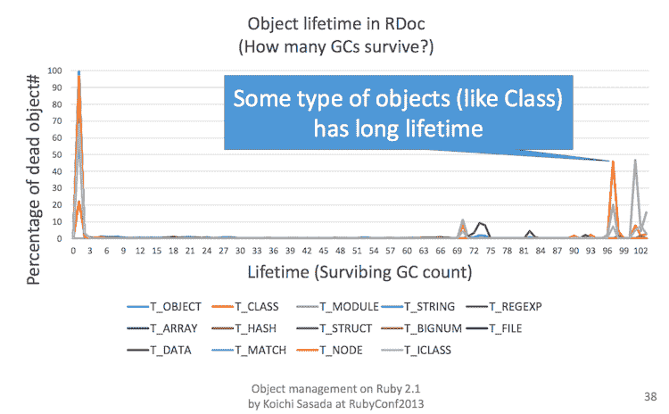
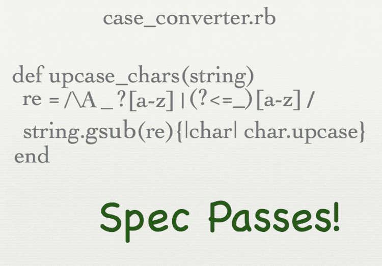
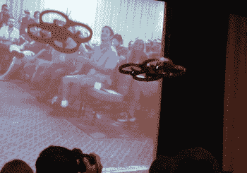
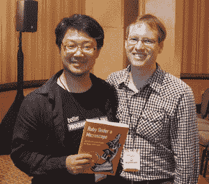

# 三个 RubyConf 惊喜

> 原文：<https://www.sitepoint.com/three-rubyconf-surprises/>


今年 [RubyConf](http://rubyconf.org) 是一次鼓舞人心、热情而有趣的经历。如果你不够幸运，不能亲自参加，我强烈推荐你去看看[http://rubyconf 13 . multiplier . io](http://rubyconf13.multifaceted.io)，这是一个关于 ruby conf 的多媒体网站，由悉尼 Rails 托管公司 [Ninefold](http://www.ninefold.com) 创建。他们从会议中收集了一系列令人惊叹的演讲者采访、幻灯片、演讲摘要和推文。就在本周，Confreaks 开始在网上发布[会议视频](http://www.confreaks.com/events/rubyconf2013)；我错过了很多我迫不及待想看的会议。

然而，今天我想分享一些我在会议期间学到的让我吃惊的技术知识。除了我在走廊、晚餐和午餐交谈中遇到的所有伟大的人之外，在会议结束三周后，当我写这篇文章时，令人惊讶的知识在我的记忆中尤为突出。

|  |
| *Koichi Sasada 谈论
[Ruby 2.1 上的对象管理](http://www.confreaks.com/videos/2866-rubyconf2013-object-management-on-ruby-2-1)* |

### 支持弱世代假说的经验数据

如果你曾经研究过垃圾收集背后的计算机科学理论，你可能听说过*弱世代假说*。这是一个假设，即大多数对象在年轻时就死亡，应用程序将只在相对较短的时间内使用它创建的大多数对象。例如，假设我创建了一个新的 Ruby 对象:

```
obj = Object.new
```

很有可能，我将只在单个方法的范围内使用这个对象，或者在某些计算中作为中间值。该方法一返回，对象就从堆栈中弹出，其内存可以返回给系统。相反，我的代码将在更长的时间内只使用几个对象。这些物体的寿命更长。

该假设允许语言实现者构建垃圾收集系统，以不同的方式处理新旧对象。例如，JVM(JRuby 和许多其他语言都使用它)管理年轻对象的内存与管理老对象或成熟对象的内存非常不同。这被称为*分代垃圾收集*。Rubinius 也是用这个思路。

计算机科学家称之为假设，因为没有简单的方法证明它是真的。我们必须依靠经验证据。当然，开发人员可以出于任何目的自由地创建和使用对象。该假设简单地描述了开发人员通常如何在大多数应用程序中使用对象。

在他精彩的 RubyConf 演讲中，[Ruby 2.1 上的对象管理](http://www.confreaks.com/videos/2866-rubyconf2013-object-management-on-ruby-2-1)，Koichi Sasada ( [@_ko1](https://twitter.com/_ko1) )描述了即将发布的 MRI Ruby 2.1 版本将如何包含分代垃圾收集算法。但是最让我印象深刻的，让*感到惊讶的，是这张幻灯片:*


*来自:[http://www . at dot . net/~ ko1/activities/ruby conf 2013-ko1 _ pub . pdf](http://www.atdot.net/~ko1/activities/rubyconf2013-ko1_pub.pdf)*

在这里，你可以看到幸一实际上提供了弱世代假说背后的经验证据。他在这里所做的是测量运行 [RDoc](http://rdoc.sourceforge.net) 实用程序时创建的不同 Ruby 对象的生命周期。请注意，RDoc 创建的大多数对象在仅进行一两次垃圾收集后就会很快死亡。这是图表左侧的峰值。与此同时，在图表的右边，适度数量的物体存活了更长时间；使用底部的图例，您可以看到这些通常是类、模块和包含的类(模块的内部副本)。

这个图表最有趣和令人惊讶的是，中间的物体非常少。在左侧的初始峰值之后，几乎没有显示任何对象，直到大约 70 次 GC 运行时，出现一个小峰值，然后在大约 100 次 GC 运行时，测量到一组更大的成熟对象。

我发现这个实验很有趣！在 CS 课本上读到弱世代假说是一回事；看到实际数据完全是另一回事。看看这个图表，很容易理解为什么 Koichi 和 Ruby core 团队如此努力地将分代 GC 添加到 Ruby 2.1 中:一旦对象变得成熟，一旦它通过了第一次或第二次垃圾收集，就没有必要再担心它了。根据图表，成熟的物体可能会存在很长一段时间。在 Ruby 2.1 中，标记和清除垃圾收集代码将只关注出现在图表左侧的年轻对象。

|  |
| *Nell Shamrell 在她精彩的 RubyConf
演讲中:[在表面之下:利用
Ruby 中正则表达式的真正力量](http://www.confreaks.com/videos/2862-rubyconf2013-beneath-the-surface-harnessing-the-true-power-of-regular-expressions-in-ruby)* |

### 如何在正则表达式中向后看

就在幸一演讲后的几个小时，我再次感到惊讶。在同一个房间里，Nell sham rell([@ nellshamrell](https://twitter.com/nellshamrell))进行了一场令人惊叹的表演，用 Ruby 向幸运的观众教授正则表达式。内尔的戏剧训练大放异彩；她在公众面前演讲时非常自信，很明显她排练了演讲，就像莎士比亚戏剧中的女演员准备出演《罗密欧与朱丽叶》一样。她不仅解释了如何在 Ruby 中使用正则表达式，甚至深入探讨了它们是如何在 Ruby 内部实现的。

我以为我对正则表达式了解很多，但内尔证明了我错了。她解释并使用了一个我以前从未听说过的正则表达式语法细节，称为*向后看*。这是内尔演示的一张幻灯片，她使用了这个模糊但强大的功能。


*来自:[http://www . slide share . net/NellShamrell/under-the-surface-ruby conf-2013](http://www.slideshare.net/NellShamrell/beneath-the-surface-rubyconf-2013)*

这是 Nell 向我们展示的一个更长的例子中的一部分，这个例子将蛇包转换成骆驼包(最初的灵感来自 Avdi 的一条[推文)。我不会在这里重复所有的细节，除了指出正则表达式中间令人困惑和不熟悉的语法:](https://twitter.com/avdi/status/339544824082468865)

```
(?<=_)[a-z]
```

`[a-z]`部分很简单。这意味着:匹配 *a* 和 *z* 之间的任何字符，或者换句话说，匹配任何小写字母。但是`(?<=_)`部分呢？原来这是一个“向后看”的条款。这意味着*查看当前潜在匹配的后面，只有当前面的文本满足给定的 regex 子句*时，才将其作为实际匹配返回。`?<=`表示“向后看”，而`(?<=_)`表示“向后看，只匹配前面有 *_* 的东西”。

例如，这个正则表达式匹配目标字符串中的第一个小写字母， *t* :

```
str = "this is a long string"
puts /[a-z]/.match(str)
=> t
```

但是第二个正则表达式只匹配下划线后面的单个小写字母， *l* :

```
str2 = "this is a _long string"
puts /(?<=_)[a-z]/.match(str2)
=> l
```

原来还有一种“向前看”的模式。要了解更多关于这些强大的正则表达式工具的信息，请观看 Nell 的演讲或阅读本教程:【http://www.rexegg.com/regex-lookarounds.html】T2

|  |
| *马克·贝茨在他的演讲中穿着酒店浴袍
[用示踪物涂抹红宝石](http://rubyconf.org/program#mark-bates)* |

### 使用 Rails 显示一个页面需要多少次方法调用？

我今天要讲的最后一个惊喜是马克·贝茨在使用[跟踪点](http://www.ruby-doc.org/core/TracePoint.html)功能时发现的。正如 Mark 所描述的，新的 TracePoint API 允许您的 Ruby 代码在发生某种类型的事件时得到解释器的通知:调用一个方法、执行一行代码、定义一个类或模块等等。

Mark 用一些有趣的例子向观众展示了如何使用 TracePoint，包括如何像使用 Java 一样创建抽象类和接口。像往常一样自娱自乐的 Mark 给我们展示了使用 TracePoint API 对 Ruby 内部进行有趣的窥视。

但是马克用 TracePoint 做的一个实验让我大吃一惊！他创建了一个简单的“hello world”Rails web 应用程序，其中包含一个控制器、路由和视图，然后测量生成页面时 Rails 框架发出了多少方法调用。正如 Mark 解释的那样，使用 TracePoint 很容易做到这一点，因为每次发生方法调用时，您都可以让 Ruby 调用您。


当然，Mark 让观众猜猜我们认为 Rails 需要多少方法调用来显示页面。人们猜测是 1 万、2 万甚至 5 万。但是没有人预料到实际的答案:


我发现这是令人震惊的！怎么可能需要这么多方法调用呢？Rails 是一个复杂的框架，但是所有这些方法调用有什么用呢？我想知道这些方法实际上是什么，以及像 Sinatra 甚至 Rack 这样的小框架与 Rails 相比如何。

### 还有更多！

这三个惊喜只是 RubyConf 上分享的一小部分知识和对话。这是我参加过的最有趣的会议之一。这里还有几张我自己相机里的照片……一定要看看 [Confreak 视频](http://www.confreaks.com/events/rubyconf2013)，以及[http://ruby conf 13 . multiplient . io](http://rubyconf13.multifaceted.io)上的内容。

明年的 RubyConf 2014 在圣地亚哥再见！

|  |
| 12 岁的凯蒂·哈格蒂不仅给了
一个主题演讲，她还让
的观众着迷了 45 分钟！ |

|  |
| 在我所见过的最令人惊奇的演示中，罗恩·埃文斯用红宝石来控制飞行机器人，这一切都被视频捕捉到了！ |

|  |
| *Matz 正在观看我的朋友
Doel Sengupta 和 Manu Singhal 在 BioRuby 上的精彩演讲
。* |

|  |
| 就我个人而言，把一本签名的[我的书](http://patshaughnessy.net/ruby-under-a-microscope)
送给马茨是令人激动的
。 |

## 分享这篇文章