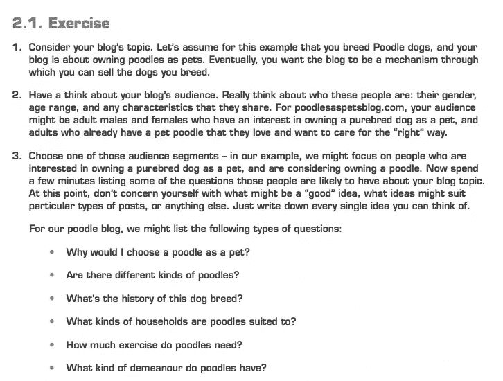

# 用文字展示而不是讲述的 3 种方式

> 原文：<https://www.sitepoint.com/3-ways-show-tell-text/>

向人们展示你的产品，而不是告诉他们，是吸引潜在用户或客户的好方法。

[上周](https://www.sitepoint.com/show-product-rather-tell/)我们看了一些使用富媒体的方法。但是今天我想看看我们如何用文字向人们展示你们的产品*。*

## 为什么使用文本？

是啊，怎么了？毕竟，技术已经让我们触手可及更明显的演示选项，比如视频和图像。那么，为什么要担心文本呢？

嗯，因为你可能会在你的网站上使用文本以及其他更迷人的媒体。你需要平衡不同内容之间的展示和讲述，这样用户才能了解全貌，并且足够清晰地想购买你的产品。

是的，你的文字很可能伴随着图像或视频，以帮助讲述完整的故事。但是在某些时候，你可能需要使用文本来展示，而不是(或者说)讲述。

## 但是我们不是用语言来表达吗？

当我们谈论展示和讲述时，最好不要想得太过字面。如果不可能通过文本展示任何东西，那么好的小说就不会存在，视力受损的人也永远不会看到任何东西。如果你曾经学习过创造性写作，你也会在那里听到这样的告诫:“展示，不要说”。

那么我们如何通过写作来表现呢？也许最简单的方法之一就是关注结果。我可以告诉你，“我跑了四十英里去医院。”或者我可以向你展示这对我作为一个人或角色意味着什么:“我头晕目眩，胃里翻腾，心脏在胸腔里顽强地跳动。盲目的恐慌驱使我跑完了那四十英里，当我冲进急诊室的大门时，这种恐慌更加严重了……”不，这不是获得普利策奖的散文，但你会明白:展示结果往往会让听者设身处地地想一想。它向他们展示了事物是什么样的。因此，故事或叙述通常是展示而不是讲述某事的好方法。

不过，有一点:如你所见，展示比讲述需要更多的赘言。所以我们需要在我们的内容中考虑到这一点，并且仍然关注保持文本尽可能的简洁。让我们看看这在实践中如何发挥作用。

## 文本内容类型

有一些内容类型可以很容易地用来向人们展示你的产品。

### 证明书

一个是证明书，我上周提到过。一份好的文字证明可以让用户看到你的产品如何影响客户的生活。考虑这些来自 [Apostle.io](http://apostle.io/) 网站的例子。如你所见，这两段文字都不长。

第一个证明非常生动。通过提及一个令人激动的产品结果，这篇推荐词立即在读者脑海中浮现出图像。

第二份证明更能说明问题。怎么可能更“花架子”呢？或许通过提及改进控制的结果。

### 个案研究

另一种非常适合展示的内容类型是优秀的老案例研究。我最近写了一个案例研究，解释了一个团队如何利用技术将大学的虚拟教室带到远程位置，使更多的人能够学习。

该文本讲述了一个项目的故事，实际上是为了向*展示*一个 IT 团队的技能是如何帮助机构实现其最终使命的。

Flippa 博客上的案例研究帖子[就像这个](http://flippa.com/blog/rome2rio-interview/)一样，也有助于以一种不那么直接的方式教育读者。

案例研究是一个很好的工具，可以向读者展示不太具体、更空灵的概念是如何影响结果的，也可以展示复杂的主题(如[企业家如何发现机会](http://flippa.com/blog/sidekicker-interview/))是如何工作的。

### 例子

示例是向人们展示某些东西的另一种好方法，尤其是在支持信息、课程和常见问题等教育内容中。

ProBlogger 很喜欢例子:Darren 的教育电子书总是包含大量的例子，向读者展示如何实施他的建议。

下面的图片摘自 *ProBlogger 给你写博客第一周的指南*。通过整合一个关于狮子狗的博客的例子，这些内容向读者展示了如何实施他的建议——并通过文本向他们展示。

99designs 还在 FAQ 内容中使用了一些例子，来展示[像版权](http://99designs.com.au/help/concept-originality-policy)这样棘手的概念是如何在客户与设计师的日常交流中体现出来的。

在像这样的更具体的环境中，例子是很好的，可以展示一个过程在实践中是如何工作的。

## 你是在展示，还是在讲述？

不要让你的页面文本仅仅告诉用户信息！文本内容可以——并且在大多数情况下应该——*显示信息，就像图像、视频和动画一样。*

你用你的文字是为了这个目的吗？我很想在评论中听到你们的故事。

## 分享这篇文章