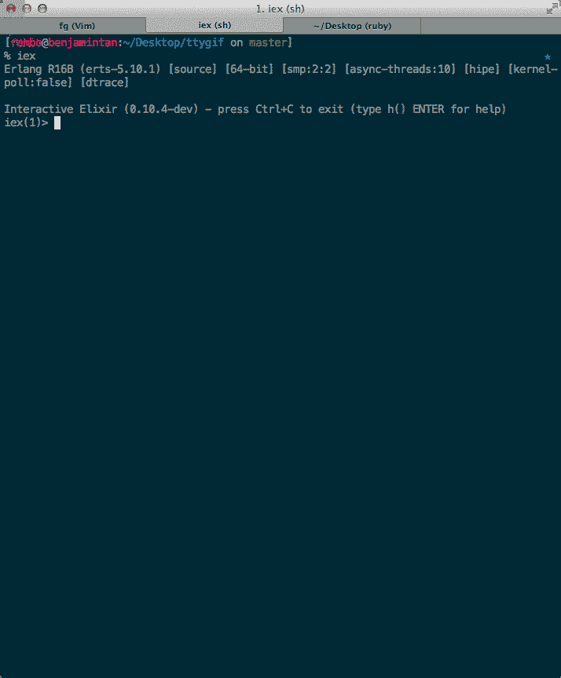

# 灵药——鲁比和二郎的私生子

> 原文：<https://www.sitepoint.com/elixir-love-child-ruby-erlang/>


Elixir 是一种功能性的元编程语言，构建在 Erlang VM 之上。它由 Jose Valim 在 2011 年创建，最近引起了很多人的兴趣，尤其是 Ruby 和 Erlang 程序员。二郎神的发明者之一乔·阿姆斯特朗甚至[写了](http://joearms.github.io/2013/05/31/a-week-with-elixir.html)关于仙丹的好话。

对于那些不熟悉 Jose 的人来说，他是 Ruby on Rails web 框架的核心提交者，也是流行的 Ruby gems 如 Devise 的作者。因此，在语言的设计中看到一些 Ruby 的影响并不奇怪。您很快就会看到，Elixir 还借鉴了各种编程语言的许多思想，如 Clojure、Haskell 和 Python。

在本文中，我们将对 Elixir 的一些最佳特性进行一次快速浏览。在这个过程中，我们看了一些长生不老药代码的简短片段。让我们直入主题吧！

## 先决条件

如果您想遵循这些示例，您至少需要安装 Elixir v0.10.4-dev。安装说明可在[这里](http://elixir-lang.org/getting_started/1.html)找到。

我还假设你至少精通一门编程语言，并且对终端相当熟悉。

## 1.交互式药剂外壳

Ruby 程序员对交互式 Ruby shell`irb`很熟悉。仙丹当量是`iex`。开箱即用，它提供了一些漂亮的特性，比如语法高亮和漂亮的文档系统。

一旦安装了 Elixir，您就可以从终端启动`iex`:

```
Erlang R16B (erts-5.10.1) [source] [64-bit] [smp:2:2] [async-threads:10] [hipe] [kernel-poll:false] [dtrace]
Interactive Elixir (0.10.4-dev) - press Ctrl+C to exit (type h() ENTER for help)
iex(1)>
```

### 获得帮助

除了你的编辑，你可能花在`iex`上的时间最多。因此，知道可以从相同的环境中访问 Elixir 的文档是非常方便的。

例如，要访问`Enum`模块的文档，输入`h(Enum)`。类似地，如果我对`Enum`模块的`reverse`功能感兴趣，那么我输入`h(Enum.reverse)`来代替。

这就是它的作用:



你在本文中看到的任何代码都可以复制粘贴到`iex`中。

## 2.功能的

Elixir 是一种函数式编程(FP)语言。它拥有我们所期望的所有常见功能，例如:

#### 高阶函数

仙丹中的功能是一等公民。这意味着函数可以作为参数传递给其他函数。这也意味着函数可以将其他函数作为值返回。

这里我们定义一个匿名函数来平方一个数。该功能被分配给变量`square`。`Enum.map`带 2 个参数。第一个是集合，比如序列`(1..10)`，第二个是应用于每个元素的函数。

```
iex> square = fn x -> x * x end
#Function<6.17052888 in :erl_eval.expr/5>
iex> Enum.map(1..10, square)
[1, 4, 9, 16, 25, 36, 49, 64, 81, 100]
```

#### 列出理解

在 Haskell 和 Python 等语言中， *list comprehensions* 在我们需要从另一个列表构建一个列表时非常有用。这是长生不老药的版本:

```
iex> lc x inlist [1, 2], y inlist [3, 4], do: x * y
[3, 4, 6, 8]
```

虽然我真的很喜欢列表理解，但我发现 Elixir 通常有更好的功能(比如来自`List`和`Enum`的功能)，更灵活。这是因为列表理解，顾名思义，只限于列表。

#### 模式匹配

Erlang 最初是用 Prolog 编写的。从 Prolog 继承的最酷的特性之一是*模式匹配*。长生不老药也有这个特点:

```
iex> {[head | tail], {:atom, msg}} = {[1, 2, 3], {:atom, "PATTERN MATCHING FTW!"}} 
{[1, 2, 3], {:atom, "PATTERN MATCHING FTW!"}}
```

上面展示了 Elixir 中的 4 种数据类型，其中一些您已经遇到过:

| 数据类型 | 例子 |
| :-- | :-- |
| 目录 | `[1, 2, 3]` |
| 元组 | `{:atom, msg}` |
| 原子 | `:atom` |
| 线 | `"FTW!"` |

有些人可能在 Haskell 等语言中看到过`[ head | tail ]`。`|`是 cons 运算符。它用于模式匹配列表。`head`捕获列表中的第一个元素，而`tail`捕获剩余的元素，那也是一个列表。

让我们检查一下`head`、`tail`和`msg`的内容:

```
iex> head
1
iex> tail
[2, 3]
iex> msg
"PATTERN MATCHING FTW!"
```

模式匹配非常强大，提供了一些非常简洁的程序。它也经常在*消息传递*中使用，稍后您会看到。

#### 不变性和递归

##### 不变

作为一种 FP 语言，Elixir 没有*循环，或者至少是你通常期望的那种。原因是传统的循环结构，如`for`和`while`引入了*可变性*。事实上，Elixir 的所有数据结构都是不可变的。例如，这意味着您不能修改现有列表:*

```
iex(1)> list = [:a, :b, :c]
[:a, :b, :c]
iex(2)> List.delete(list, :b)
[:a, :c]
iex(3)> list
[:a, :b, :c]
iex(4)> list = List.delete(list, :b)
[:a, :c]
iex(5)> list
[:a, :c]
```

当我们在`list`上调用`List.delete`时，结果是`[:a, :c]`——正如所料。然而，当我们检查`list`的内容时，我们发现`list`并没有改变。获取这个值的唯一方法是将它赋给另一个变量。

##### 递归

原来我们根本不需要`for`循环。下面是一个计算列表长度的简单递归程序:

```
defmodule MyList do 
  def length(the_list) do
    length(the_list, 0)
  end

  def length([], count) do
    count
  end

  def length([_head|tail], count) do
    length(tail, count + 1)
  end
end
```

让我们执行它:

```
iex> MyList.length([1, 2, 3])
3
```

这并不奇怪。但是引擎盖下发生的事情很有趣。

首先，所有的函数都被称为`length`。唯一的区别在于他们的不同之处，以及他们争论的模式。让我们追踪这个程序:

`MyList.length([1, 2, 3])`通话`MyList.length([1, 2, 3], 0)`。现在，Elixir 需要用一个非空的列表和一个数字来匹配`length`的定义——只有第三个定义符合要求。该函数调用自己，但是这次少了一个元素，并将`count`加 1。

注意列表的剩余部分`tail`是如何在`|`操作符的帮助下提取的。在两次递归调用后，我们最终得到一个空列表和`count`，它现在包含了我们开始时列表的实际长度。这里只匹配`length`的第二个定义。

#### 流

你可能听说过懒求值，Haskell 和 Clojure 都支持。最近 Ruby 2.0 内置了[懒惰枚举](http://ruby-doc.org/core-2.0/Enumerator/Lazy.html)。在仙丹中，我们有*溪流*。

##### 贪婪 vs 懒惰

`List`中的大多数函数都是贪婪的。也就是说，一旦调用该函数，就会返回整个结果。这显然是我们所期望的。然而，考虑一下如何表示一个无限的数据流。如果您不知道数据馈送何时结束，您怎么能从远程数据源读取数据呢？

Streams 非常优雅地处理了这些情况——通过懒惰。

让我们创建一个随机生成的 1 和 0 的无限流。

```
iex> Stream.repeatedly(fn -> :random.uniform(2) - 1 end)
#Function<6.80570171 in Stream.repeatedly/1>
```

让我们向流请求 5 个值:

```
iex> Stream.repeatedly(fn -> :random.uniform(2) - 1 end) |> Enum.take 5
[1, 0, 0, 0, 1]
```

## 3.| >运算符

管道操作符是一个特别有趣和有用的操作符。| >获取左边表达式的结果，并将其作为右边函数调用的第一个参数插入。

在这个例子中，嵌套列表作为第一个参数被发送到`List.flatten`。然后将结果(`[1, 2, 3, 4, 5]`)作为`Enum.map`的第一个参数传递，其中每个元素都是立方的。

```
iex> [1, [2], [[3, 4], 5]] |> List.flatten |> Enum.map(fn x -> x * x * x end)
[1, 8, 27, 64, 125]
```

如果没有| >操作符，代码看起来会非常混乱:

```
iex> Enum.map(List.flatten([1, [2], [[3, 4], 5]]), fn x -> x * x * x end)
[1, 8, 27, 64, 125]
```

请注意您是如何从外向内阅读这段代码的。看看使用| >操作符如何使代码更具可读性？Elixir 程序员非常自由地使用。你也会在官方文档中看到很多这样的例子。

## 4.流程和消息传递

在面向对象的语言中，我们创建对象。在 Elixir 中，我们*生成进程*。每个流程都可以通过消息传递与其他流程进行通信。如果消息的接收者理解了消息，他可以选择对消息进行操作。否则，该消息将被忽略。

值得注意的是，Elixir 进程不同于操作系统进程或线程。Elixir 进程是非常轻量级的，由 VM 管理。一个程序产生数千个进程是很常见的。

### 行动中的信息传递

让我们通过一个简短的程序来简单理解消息传递是如何工作的。

```
defmodule Greeter do
  def greet do 
    receive do 
      {:english, name} -> 
        IO.puts "Hello, #{name}."
        greet
      {:chinese, name} -> 
        IO.puts "你好, #{name}."
        greet
      {:spanish, name} -> 
        IO.puts "¡Hola!, #{name}."
        greet
      :exit -> 
        IO.puts "Bye bye!"
      _ -> 
        IO.puts "I don't understand ... but Hello anyway!"
        greet
    end
  end
end
```

`receive`块是最有趣的部分。这告诉您这段代码应该在一个单独的进程中运行。一旦完成，该进程将一直等待，直到收到消息。

在本例中，它理解 4 种消息。每当它收到它理解的消息时，它打印出一个问候，并再次递归调用`greet`，以便为下一条消息做准备。

在接收到`:exit`消息的情况下，进程将简单地退出，因为`greet`没有被调用。

对于任何其他类型的消息，它将简单地打印一个道歉，然后再次调用`greet`。

让我们开始我们的第一个过程:

```
iex> greeter = spawn(Greeter, :greet, [])
#PID<0.52.0>
```

`spawn`创建流程。我们给`spawn`模块(`Greeter`)、函数(`:greet`)和参数。结果是一个进程 id，或 *pid* ，存储在`greeter`中。

为了向`greeter`发送消息，我们使用了`<-`操作符:

```
iex> greeter <- {:english, 'Amy'}
Hello, Amy.
{:english, 'Amy'}
iex> greeter <- {:chinese, 'Ben'}
{:chinese, 'Ben'}
你好, Ben.
iex> greeter <- {:spanish, 'Charlie'}
{:spanish, 'Charlie'}
¡Hola!, Charlie.
```

让我们尝试发送一条我们的流程无法理解的消息:

```
iex(31)> greeter <- {:klingon, 'David'}
I don't understand ... but Hello anyway!
```

没有一个模式符合`{:klingon, 'David'}`。所以，就落到了最后一种情况。`_`像一个包罗万象的模式，因此它匹配*任何前 4 个模式不能匹配的*。

最后，我们告诉`greeter`退出:

```
iex(32)> greeter <- :exit
:exit
Bye bye!
```

## 5.Erlang 互操作性

Elixir 仍然是 Erlang 这两种语言共享相同的字节码。因此，您可以从 Elixir 调用任何一个 Erlang 代码，而不会影响性能:

```
iex> :erlang.localtime
{{2013, 10, 22}, {0, 14, 29}}
iex(9)> :random.uniform
0.7230402056221108
```

`:erlang.localtime`和`:random.uniform`都是对 Erlang 函数的调用。在 Erlang 中，函数将分别由`erlang:localtime().`和`random:uniform().`调用。Erlang 互操作性还意味着 Elixir 程序员可以自由使用*任何* Erlang 库，这可能会节省大量时间。

Elixir 还可以使用 Erlang 的 OTP 框架的全部功能，这是一组经过实战检验的库，允许 Erlang(和 Elixir！)程序员来构建健壮的、并发的和分布式的应用程序。

## 后续步骤

这篇文章刚刚给了你一个关于 Elixir 的一些最好的特性的旋风之旅。希望它已经让你领略了这门令人兴奋的语言的优雅和力量。

这里有一些额外的资源供您了解更多信息:

*   官方[文档](http://elixir-lang.org/docs/master/)必不可少。
*   [编程灵丹妙药:功能| >并发| >实用| >乐趣](http://pragprog.com/book/elixir/programming-elixir)是一本为有经验的程序员准备的相对快节奏的书。
*   [介绍 Elixir:函数式编程入门](http://shop.oreilly.com/product/0636920030584.do)是一本节奏稍慢的书，也是一本开始学习函数式编程的好书。
*   为了更好的效果，学点儿二郎腿吧！可能是了解 Erlang 最有趣的方式。
*   [编程 Erlang(第二版)](http://pragprog.com/book/jaerlang2/programming-erlang)Erlang 的发明者之一写的。

## 分享这篇文章