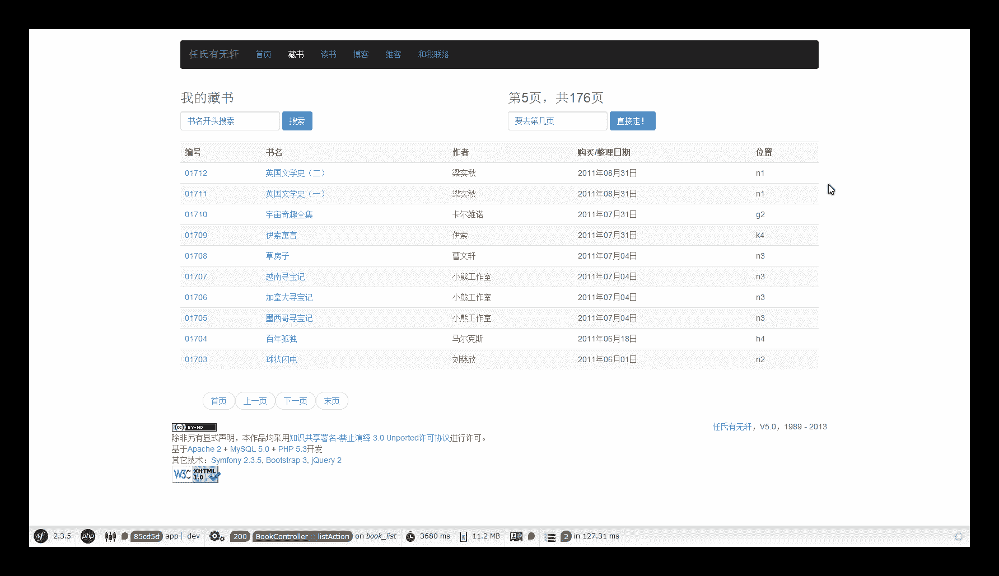

# 使用 Symfony 2 构建 Web 应用程序:开发

> 原文：<https://www.sitepoint.com/building-web-app-symfony-2-development/>

在第一部分中，我已经向你展示了如何设置 Symfony 2 和连接数据库。我们还讨论了框架的一些基本概念。在这一部分中，我们将通过创建路线、控制器、实体/存储库和视图来将事情联系起来，以使站点启动并运行。

### 路线

我们的 Symfony 实例使用 [YAML](http://yaml.org/) 格式来配置应用程序的路由。该网站路线的示例部分如下所示:

文件位置:`src/tr/rsywxBundle/Resources/config/routing.yml`

```
 home:
      pattern:  /
      defaults: { _controller: trrsywxBundle:Default:index }

    contact:
      pattern: /contact
      defaults:
        _controller: FrameworkBundle:Template:template
        template: 'trrsywxBundle:Default:contact.html.twig'

    book_list:
      pattern: /books/list/{page}/{key}
      defaults: 
        page: 1
        key: null
        _controller: trrsywxBundle:Book:list

    books_search: 
      pattern: /books/search
      defaults: {_controller: trrsywxBundle:Book:search}
      requirements: 
        _method: POST        

    book_detail:
      pattern: /books/{id}.html
      defaults: { _controller: trrsywxBundle:Book:detail}
```

每个 app 都需要一个入口。这是“回家”的路线。`pattern`定义路线应匹配的 URI 模式。因为这是入口点，所以使用了`/`。`defaults:_controller`定义当该路线匹配时应用程序将采取的动作。请注意 [FQN](http://en.wikipedia.org/wiki/Fully_qualified_name) 格式，它用于为要采取的行动绘制路线(和模式)。在这种情况下，这意味着每当我们进入只有它的域的站点时，名称空间`trrsywxBundle`下的`Default`控制器中的`index`动作就会被触发。

您可以在模式和默认值中设置其他参数。例如，`book_list`路径在 URI 中有一个带两个参数的模式:`page`表示当有多页结果要显示时的当前页(我将在第 3 部分介绍分页)，而`key`是用于搜索与`key`匹配的书籍的关键字(在我当前的实现中，我只搜索书籍标题的开头)。`pattern`中的所有参数必须在一对花括号内。

在`book_list:default`中，我给出了上述两个参数的默认值:1 代表`page`，null 代表`key`。这样做，一个简单的 URI 像`http://localhost/app_dev.php/books/list`会列出所有书的第一页，而`http://localhost/app_dev.php/books/list/3/Beauty`会简单地列出所有书名以`Beauty`开头的书的第三页(像《美女与野兽》)。

您还会注意到，`books_search`路线已经将`requirements:_method`设置为`POST`。这将该模式的调用方法限制为 POST(在表单提交中),因为我不希望用户只是在浏览器中访问`/books/search`。在我的实现中，这个路径是供内部使用的，应该重定向到另一个页面，其中的搜索结果与通过表单提交(发布)的标准相匹配。

关于路线的完整文件可以在 Symfony 的网站上找到。

### 控制器

下一步是定义控制器。我在`src/tr/rsywxBundle/Controller`总共有 4 个控制器。它们是:BookController.php、DefaultController.php、LakersController.php 和 ReadingController.php。我根据功能将与不同路线相关的功能分组。

这里我只展示两个控制器，分别对应`book_list`和`books_search`。

```
 <?php

    class BookController extends Controller
    {
        // ... Many other functions here, see source

        public function listAction($page, $key)
        {
            $em = $this->getDoctrine()->getManager(); // Get the Entity Manager
            $rpp = $this->container->getParameter('books_per_page'); // Get the global parameter for how many books to show on one page

            $repo = $em->getRepository('trrsywxBundle:BookBook'); // Get the repository

            list($res, $totalcount) = $repo->getResultAndCount($page, $rpp, $key); // Get the result

            $paginator = new \tr\rsywxBundle\Utility\Paginator($page, $totalcount, $rpp); // Init the paginator
            $pagelist = $paginator->getPagesList(); // Get the pagelist used for navigation 

            return $this->render('trrsywxBundle:Books:List.html.twig', array('res' => $res, 'paginator' => $pagelist, 'cur' => $page, 'total' => $paginator->getTotalPages(), 'key'=>$key)); // Render the template using necessary parameters
        }

        public function searchAction(Request $req)
        {
            $q = $req->request->all(); // Get the posted data

            $page = 1; // Get which page to display 
            $key = $q['key']; // Get the search criteria

            $em = $this->getDoctrine()->getManager();
            $rpp = $this->container->getParameter('books_per_page');

            $repo = $em->getRepository('trrsywxBundle:BookBook');

            list($res, $totalcount) = $repo->getResultAndCount($page, $rpp, $key);

            $paginator = new \tr\rsywxBundle\Utility\Paginator($page, $totalcount, $rpp);
            $pagelist = $paginator->getPagesList();

            return $this->render('trrsywxBundle:Books:List.html.twig', array('res' => $res, 'paginator' => $pagelist, 'cur' => $page, 'total' => $paginator->getTotalPages(), 'key' => $key));
        }
    }
```

在典型的控制器中，它做三件事:

*   做好所有的准备工作(输入参数，获取实体管理器，存储库等)；
*   从存储库中获取结果；
*   通过渲染模板(Symfony 使用 [Twig](http://twig.sensiolabs.org/) 作为其模板引擎)来显示结果(有或没有进一步处理)。

仔细观察三件事:

1.  看看我们在 route `book_list` ( `page`和`key`)中定义的参数是如何通过名字传入函数调用的。Symfony 不关心参数出现的顺序，但要求严格的名称匹配。

2.  看看表单中发布的参数是如何传递到`searchAction`中的，以及我们如何从提交的数据中检索必要的信息。

3.  `getParameter`是检索全局参数的函数。全局参数在文件`app/config/parameters.yml.dist`中定义(由 composer 自动生成)。yml)并且看起来像这样:

```
 books_per_page: 10
```

通常，将应用程序逻辑留在控制器函数中，将数据提供者留在存储库中是一种好的做法。这有助于组织代码并保持其可重用性。

关于控制器的详细文件可以在[这里](http://symfony.com/doc/current/book/controller.html)找到。

### 实体和存储库

在 ORM 的方法论中，实体是数据库表的客观反映。相反，通过在 PHP 中发出原生 SQL 命令来操作数据，我们可以使用直观和简单的方法来处理数据。虽然 Symfony 生成的实体包含通过 ID 检索数据的简单方法，但在适当的应用程序中这远远不够。存储库是为了提供更多定制的方法来操作数据。

通过控制台/终端命令生成实体:`php app\console doctrine:generate:entity`(参见[第一部分](https://www.sitepoint.com/building-a-web-app-with-symfony-2-bootstrapping/)或[官方文档](http://symfony.com/doc/current/book/doctrine.html))。)生成的 PHP 实体文件位于`src/tr/rsywxBundle/Entity`。看看这些 PHP 文件，了解更多关于数据库表如何映射(通过 ORM)到 PHP 类的信息。

**注意:**不要直接对这些 PHP 文件做任何修改。它们是由 Symfony 生成的。

要创建一个存储库来保存所有定制的数据库操作方法，您需要做两件事:

*   修改相应的 ORM 映射文件(位于 src/tr/rsywxBundle/Resources/config/doctrine ),为该数据库对象指定一个存储库类；
*   创建所有必要的函数，以提供所需的数据库操作能力(如检索数据)。

以我的图书收藏表(及其实体为例):

文件位置:`src/tr/rsywxBundle/Resources/config/doctrine/BookBook.orm`

```
 tr\rsywxBundle\Entity\BookBook:
        type: entity
        repositoryClass: tr\rsywxBundle\Entity\BookRepository # Add this line to indicate that we will use BookRepository.php as the repository class for BookBook table
        table: book_book
        fields:
    ...
```

之后，再次运行`php app\console doctrine:generate:entity`。您会注意到在`src/tr/rsywxBundle/Entity`下创建了一个新的`BookRepository.php`文件。现在，您可以打开该文件并创建自己的数据操作函数:

```
 public function getResultAndCount($page, $rpp, $key=null)
        {
            // Get the book count
            $em = $this->getEntityManager();
            if ($key == 'null')
            {
                $q1 = $em->createQuery('select count(b.id) bc from trrsywxBundle:BookBook b');
            }
            else
            {
                $qstr = sprintf("select count(b.id) bc from trrsywxBundle:BookBook b where b.title like '%s%%'", $key);
                $q1 = $em->createQuery($qstr);
            }
            $res1 = $q1->getSingleResult();
            $count = $res1['bc'];

            // Now get the wanted result specified by page

            $repo = $em->getRepository('trrsywxBundle:BookBook');
            $q2 = $repo->createQueryBuilder('r')
                    ->setMaxResults($rpp)
                    ->setFirstResult(($page - 1) * $rpp)
                    ->orderBy('r.id', 'desc');
            if ($key <> 'null')
            {
                $key = $key . '%';
                $q2->where('r.title like :key')
                        ->setParameter('key', $key);
            }

            $q2 = $q2->getQuery();

            $res2 = $q2->getResult();

            return array($res2, $count);
    }
```

在上面的代码中，这是一个非常有代表性的检索数据的代码段，我使用了两种方法来生成并执行 SQL 查询。

一种是使用`$em->createQuery()`，它使用的语法与我们在数据库中发出 SQL 命令时使用的语法相似。唯一的区别是在`from`段。我们不使用原始表名(`book_book`)，而是使用表类名(`trrsywxBundle:BookBook`)。

在我的第一个查询中使用了`getSingleResult`,因为我预计该查询将只返回一个结果(符合某个标准的图书数或所有图书)。

在第二个查询中，我使用了`createQueryBuilder`并链接了所有方法来设置必要的 SQL 参数(起始记录、记录计数、顺序和一个要过滤的`where`条件)。

因为我们将期待不止一条记录，所以使用了`getResult`。

最后，我们将结果打包到一个数组中:`$res2`作为结果数据集，`$count`作为结果数据集的计数。它们将在调用控制器函数中被进一步处理(在这种情况下，创建一个 Paginator 对象以方便导航)。

### 视图和模板

到目前为止，我们一直在做“背景”工作。没有风景就没有像样的东西。和大多数框架一样，在 Symfony 中，视图相当于一个模板。正如我前面提到的，Symfony 使用 Twig 作为它的模板引擎。这是简单的学习和快速显示。

我将向您展示我用来显示图书列表页面的 Twig 模板的一部分。

(我不是一个好的网页设计师，所以我打开 [Bootstrap 3.0](http://getbootstrap.com/) 来快速启动我的页面设计。可以用自己设计或者现成的模板)。
**注:**下面只是整个模板的一个片段。

文件位置:`src/tr/rsywxBundle/Resources/views/Books/List.html.twig`

```

 

    <title>{{ "RSYWX | Book Collection | Page }}{{cur}}</title>


<div class="container">
    <div class="row">
        <div class="col-md-6">
            <h3>My book collection</h3>
        </div>
        <div class="col-md-6">
            <h3>Page {{cur}} of {{total}}</h3>
        </div>
        <div class="col-md-4">
            <form class="form-inline" method="post" action="{{path('books_search')}}" name="searchform" id="searchform">
                <div class="form-group">
                    <input type="text"  class="form-control" required="required" placeholder="Search the beginning of a book title" name="key" id="key" value="{{key}}"/>
                    <input type="hidden" name="cur" id="cur" value="{{cur}}"/>
                </div>
                <button type="submit" class="btn btn-primary">Search</button>

            </form>
        </div>
    <br>
    <div class="row">
        <div class="col-md-12">
            <table class="table table-striped">
                <tbody>
                    <tr>
                        <td><strong>ID</strong></td>
                        <td><strong>Title</strong></td>
                        <td><strong>Author</strong></td>
                        <td><strong>Purchase Date</strong></td>
                        <td><strong>Location</strong></td>
                    </tr>
            
                 
            
            
            
                    <tr>
                        <td><a href="{{path('book_detail', {'id':book.id})}}">{{book.id}}</a></td>
                        <td><a href="{{path('book_detail', {'id':book.id})}}">{{book.title}}</a></td>
                        <td>{{author}}</td>
                        <td>{{book.purchdate|date('Y-m-d')}}</td>
                        <td>{{book.location}}</td>
                    </tr>
            
                </tbody>
            </table>
        </div>
    </div>
    <div class="row">
        <div class="col-md-6">
            <div class="pager">
                <ul>
                    <li class="previous"><a href="{{path('book_list', {'page':1, 'key':key})}}">First</a></li>
                
                        <li class="previous disabled"><a href="{{path('book_list', {'page':cur-1, 'key':key})}}">Previous</a></li>
                
                            <li class="previous"><a href="{{path('book_list', {'page':cur-1, 'key':key})}}">Previous</a></li>
                
                
                                <li class="previous disabled"><a href="{{path('book_list', {'page':cur, 'key':key})}}">Next</a></li>
                
                                    <li class="previous"><a href="{{path('book_list', {'page':cur+1, 'key': key})}}">Next</a></li>
                
                                        <li class="previous"><a href="{{path('book_list', {'page':total, 'key':key})}}">Last</a></li>
                                    </ul>
                                </div>
                            </div>
                        </div>

                    </div>

```

这里要讨论几件事:

*   要显示某个东西，使用`{{obj.member}}`符号；要控制流程或操作数据，请使用``。实际上，这是 Twig 中仅有的两个语法结构。
*   ``可用于从父(基础)布局扩展页面布局。对于页面设计非常有用。
*   `...`用您自己的内容替换父布局中的内容。
*   `{{path(...)}}`用于生成模板中与该路线匹配的 URIs。是一个大家都会用到的非常重要的助手功能。还请注意该路由的参数是如何传递的。
*   ``用于迭代结果集。也很常用。
*   ``用于设置一个局部变量。
*   剩下的就是普通的 HTML 了。

一旦我们运行应用程序，我们的渲染应该如下图所示:



### 结论

在这一部分中，我演示了如何在 Symfony 中链接基本元素，并让您的应用程序启动和运行。如您所见，所需的 PHP 代码非常少。此外，在 Bootstrap 的帮助下，模板代码也非常简单。

在本系列的下一部分也是最后一部分，我们将介绍一些高级技术:

*   页码
*   动态添加与图书相关的标签
*   为图书封面动态创建水印
*   …以及更多

请继续关注，并下载源代码自行实验！

## 分享这篇文章