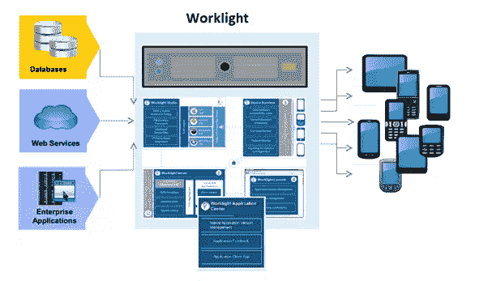
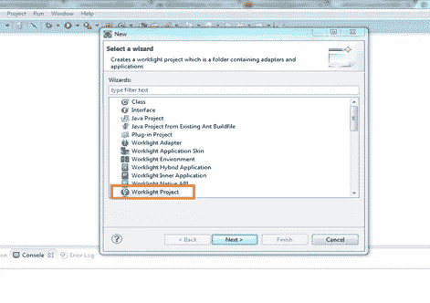
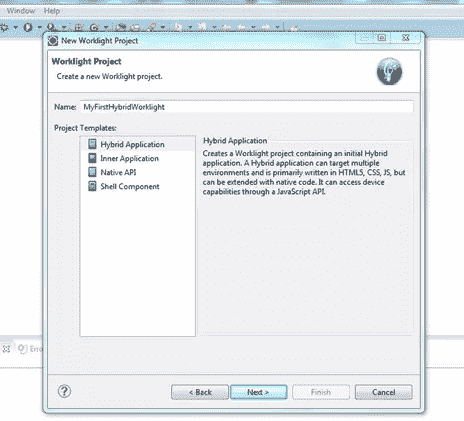
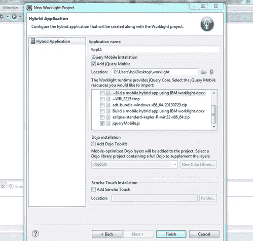
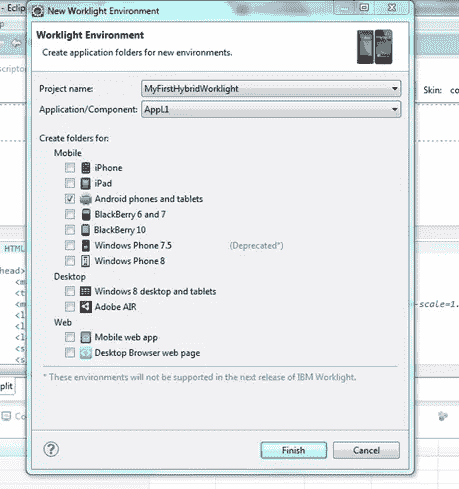
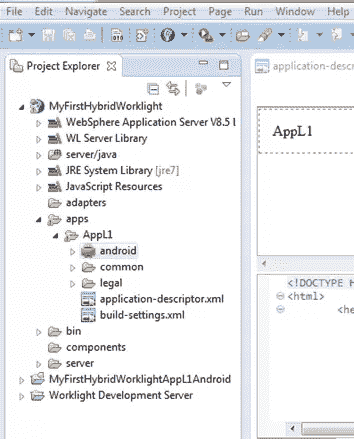
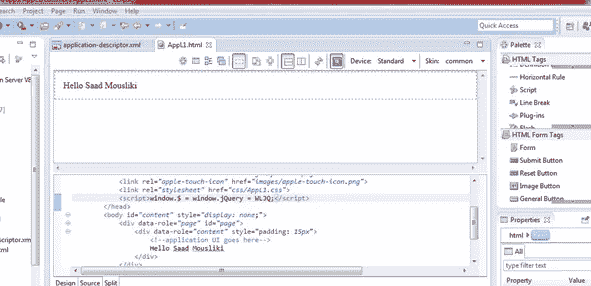

# 使用 IBM Worklight 构建移动混合应用程序:第 1 部分

> 原文：<https://www.sitepoint.com/build-a-mobile-hybrid-app-using-ibm-worklight-part-1/>

对于移动开发者来说，开发在许多智能手机上运行的移动应用程序被认为是一个非常困难的问题。手机是不同的:多操作系统、多设备、多尺寸等。因此，web 技术(HTML5、CSS3 和 JavaScript)与本地执行的结合被认为是解决这一问题的最佳方案之一。

许多公司选择混合移动应用作为移动世界多样性的解决方案。混合移动应用结合了本地和 web 移动应用的优势，因此我们可以使用 HTML5、JavaScript 和 CSS3 一次性开发，并部署到所有设备。

事实上，混合应用程序可以访问移动原生功能:相机、指南针、文件等。，降低开发生命周期的复杂性、时间和成本，并获得原生应用的优势。这些是公司选择混合移动应用作为其移动商业模式的主要原因。

在本文中，我将向您介绍构建移动混合应用程序的最强大的环境之一。我们将从安装和准备开发环境开始，开发一个测试应用程序，并在移动模拟器中测试应用程序。

## IBM 工作灯

IBM Worklight 是一个面向 HTML5、混合和原生移动应用的开放、完整和先进的移动企业应用平台。它允许开发者使用 JavaScript、HTML5 和 CSS3 为不同的移动设备开发应用程序。通过避免供应商锁定，它还为企业提供了一套功能:版本管理、应用中心、直接更新、推送通知、数据库连接、网络服务和企业信息系统。

IBM Worklight 由以下组件组成:

*   IBM Worklight Studio 是一个基于 Eclipse 的 IDE，允许开发人员为 web、混合或本地移动应用程序执行所有编码、测试和集成任务。
*   IBM Worklight Server 是移动应用程序和企业或第三方后端和服务之间的可伸缩网关。它充当移动活动的可审计控制点，并包含强大的安全功能，如多因素身份认证和移动应用程序真实性检查。Worklight 服务器通过多源数据提取和处理、移动应用程序管理、分析和统一推送通知实现数据连接。
*   IBM Worklight 设备运行时组件由编译成最终应用程序的客户端运行时代码组成，这些应用程序嵌入了一些功能，例如与 Worklight 服务器交互的离线、加密和可同步的数据存储。
*   IBM Worklight Application Center 是一个多平台的私有企业应用程序商店，它帮助组织通过适当的访问控制和基于角色的安全性来管理任何生产就绪的移动应用程序在整个企业中的分发，并引发和组织用户反馈。开发团队也可以使用它来自动分发预发布软件版本，并按版本和设备分析反馈，从而加快周期时间。
*   IBM Worklight Console 是一个基于 web 的 UI，专门用于对 Worklight 服务器及其部署的应用程序、适配器和推送通知进行持续监控和管理，有助于总结平台使用情况的各种统计指标。

## 安装 IBM 工作灯

IBM 为需要测试该工具的开发人员提供了 Worklight Development Studio 的试用版。正如我提到的，Worklight 是一个 Eclipse 插件，所以首先我们应该为 J2EE 安装 Eclipse Juno。

*   在这里下载并解压 Eclipse [。](http://www.eclipse.org/downloads/packages/release/juno/sr2)
*   打开 Eclipse，进入 **Help** ，选择 **Eclipse market place** ，使用关键字“worklight”进行搜索。
*   您也可以通过点击**帮助**，选择**安装新软件**，点击**添加**，输入*工作灯*作为名称，以及以下位置 URL:[http://public . dhe . IBM . com/IBM dl/export/pub/software/mobile-solutions/work light/wdeupdate/](http://public.dhe.ibm.com/ibmdl/export/pub/software/mobile-solutions/worklight/wdeupdate/)。
*   现在点击“IBM Worklight 开发者版”的**安装**按钮。
*   点击**下一步**并接受许可条款以安装插件。
*   重启 Eclipse。

**注意:**您必须使用**朱诺 SR2** 版本的 Eclipse，如果您使用另一个版本，您将在安装 Worklight 时面临一些错误。

## 安装 ADT

现在，在安装了 IBM Worklight 插件之后，我们将需要安装 Android 开发工具来为 Android 进行开发。

*   从[这里](http://developer.android.com/sdk/index.html)下载并解压 Android SDK。
*   点击**帮助** > **安装新软件**安装 ADT 插件。
*   点击**添加…** ，输入 ADT 插件名称。
*   对于位置输入:[https://dl-ssl.google.com/android/eclipse/](https://dl-ssl.google.com/android/eclipse/)
*   选择**开发者工具** > **下一步** > **下一步** > **接受许可协议** > **完成**。
*   重启 Eclipse

## 创建移动混合应用程序

### 创建工作灯应用程序

安装完所有必要的 Eclipse 插件后，我们现在可以开始开发我们的第一个 Worklight 移动应用程序了。打开 Eclipse 点击**新建**，选择**其他项目**，从列表中选择**工作灯项目**。

现在点击**下一个**，选择**混合应用**并给它命名。

点击下一个的**。**

您可以从[这里](http://jquerymobile.com/resources/download/jquery.mobile-1.3.2.zip)下载一个 zip 文件，将 JQuery mobile 添加到您的应用程序中。

解压缩它，并在向导中给出它的位置，如下所示:

点击**完成**。

### 添加 Android 环境

开发在一个或多个*环境*中进行。将要打包并构建到环境中的移动 web 应用程序位于一个名为 *common* 的文件夹中。它包含 HTML5、JS、CSS3 和所有应用程序环境之间共享的图像。在我们的例子中，我们使用 Eclipse 和 ADT，所以我们将添加一个 Android 环境。

点击**新建**，选择**工作灯环境**，勾选安卓复选框，点击**完成**。

在 Project Explorer 面板中，您会注意到一个新的 Android 环境已经添加到您的 Worklight 项目中。

### 定制和构建应用程序

现在，打开 HTML 页面，使用所见即所得编辑器修改文本。使用面板向页面添加新的 HTML 标签。您也可以使用 Source 选项卡直接修改代码。

调色板支持 HTML5 元素、JQuery Mobile 和 DoJo 控件，因此您可以轻松地将控件从调色板拖放到页面，HTML5 元素将在页面源代码中自动生成。

在定制了将由手机呈现的页面之后，要构建它，右键单击应用程序文件夹并选择 **Run As** 。之后，点击**构建所有并部署**。

在下一篇文章中，我们将看到如何开发一个遵循 MVC 架构的移动应用程序来访问后端系统，并在移动浏览器模拟器中测试它，而不需要设备或重量级模拟器，也可以在移动模拟器中测试。我们还将看到 Worklight web 控制台的功能。

## 结论

既然你已经学会了如何安装 Worklight 的开发环境和使用 Worklight 的一些特性，你就可以开始开发和测试一个混合移动应用了。

在本系列的第二部分中，我们将探索 Worklight web 控制台以及如何使用 Worklight 适配器建立后端连接。

## 分享这篇文章