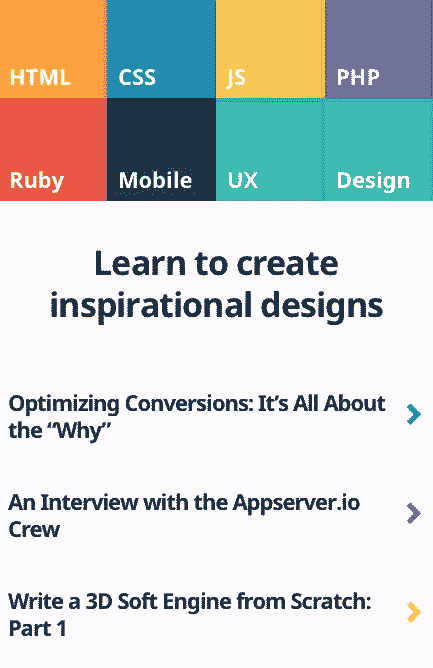

# 链接文本:桌面和移动的最佳实践

> 原文：<https://www.sitepoint.com/link-text-best-practices-desktop-mobile/>

上周[关于平面 UI 设计中文本使用的讨论](https://www.sitepoint.com/flat-ui-design-style-affects-interface-text/)引发了一些有趣的评论，包括来自 Stew 的这条:

> “我认为链接缺乏下划线已经是一个普遍的问题——设计师不希望以牺牲一个容易导航的页面为代价来破坏他们的排版工作——所以对此大声疾呼。”

这让我很好奇。今天的链接状态是什么*？*

是否存在最优链路长度？有没有理想的链接呈现？所有链接都应该加下划线吗？翻转、已查看和未查看状态呢？

## 旧习难改…

或者他们有吗？

如果你是守旧派，你会回忆起所有链接都是蓝色加下划线的日子，无论你做什么，你都不用下划线。

啊，时代变得多快啊…

sitepoint.com 主页顶部的下划线表示文本的作用就像一种旋转木马。这不是一个链接，但带下划线的文本会发生变化，以反映您在这里可以学到的不同内容。

这很好，但我真的想每次我来到主页时都点击那个文本。就好像我大脑的某个部分真的不能相信它没有被链接。

同时，框(全是文字！)列出了网站上新出版物，每个出版物都包含三个链接:

1.  类别链接
2.  文章标题链接
3.  作者姓名链接。

类别链接是唯一可以被解释为有下划线的链接，但也是唯一不会在鼠标经过时改变状态的链接。

这是怎么回事？！显然，旧习惯不会随着设计师而顽固不化。但是它们可能会影响用户。

## 自由发挥？

我能找到的大多数关于[链接展示和长度](http://www.ixda.org/node/24700)的文献都是旧的——比如三年前的。

其中一个关键问题是，这些信息是预先移动的。因此，如果你有任何关于链接处理和文本的移动优先文献，可以在评论中与我们分享，请吧。

也就是说，仍然有一些指导方针似乎和以前一样适用于今天:

*   区分链接文本和非链接文本。
*   从视觉上区分已访问和未访问的链接。
*   使链接文本在上下文中工作。
*   使其可扫描(也就是说，如果不脱离上下文，那么没有包含它的句子的上下文，它也能工作)。
*   保持简短，但要预测用户点击后会得到什么。
*   将与该预测相关的单词放在链接文本的开头。

这些指导方针似乎都适用于手机，尽管(在我看来)手机似乎引发了新的风格，为识别界面中的文本链接提供了新的可能性。再看看 sitepoint.com，这次是在手机上(或者调整你的浏览器)，你就会明白我的意思了。

这篇古老的 Jakob Nielsen 文章对那些想要更多链接基础细节的人有很好的建议。即使 12 年过去了…

对于那些想了解链接文本所处的更广阔背景的人来说，痴迷于可用性的界面设计师 Paul Olyslager 也在他的博客上展示了关于文本可读性的有趣研究。将其与[网页风格指南中关于页面宽度和行长度的信息](http://webstyleguide.com/wsg3/7-page-design/6-page-width-line-length.html)进行比较。

为了完整起见，必须补充一点:一些搜索引擎优化研究人员提倡文本链接不要超过 *n* 个字符，或者[n 个单词](http://www.hobo-web.co.uk/anchor-text-length/)，因为这是谷歌在其结果中显示的内容。或者，显示文章撰写的时间。谁知道谷歌下一步会想出什么可笑的主意？我们继续吧。

## 几个链接文本趋势

我刚才指出了 sitepoint.com 主页的一些潜在的链接相关问题，但我必须承认，这些并不完全是“文本链接”——它们是可点击的标题区，许多人会认为没有下划线这是非常明显的。

好吧，所以他们没有遵守上面列表中的所有准则，并且考虑到桌面主页上每个框中不同的链接交互，事情可能会变得有点混乱，但是我们可以将这些类型的标题链接与内容内文本链接分开考虑。

所以让我们看看世界上一些领先的可用性和内容专家是如何处理他们的链接的，各种各样的，好吗？

交互设计协会(IxDA)网站使用下划线作为每个链接的翻转状态，这个链接不是一个按钮或者图片的一部分。作为起点，所有链接的颜色都与未链接的文本不同。

尼尔森诺曼集团(Nielsen Norman Group)也做了同样的事情，奇怪的是，除了在其网站页脚列出了热门话题。

总部位于澳大利亚的可用性咨询公司 Hiser Group 也做了同样的事情，尽管它在其网站的菜单状态中没有使用下划线。

如何处理文本内链接？我们在以文本为中心的出版商网站上看到一些有趣的例子。

维基百科的内部页面用蓝色文本表示链接，并在滚动时加下划线。

使用过的链接以深蓝色显示，这使得它们与周围的文本区别更小(我认为这使得它们更难被找到)。

《纽约时报》网站给文本链接加下划线，默认为蓝色。一旦被点击，它们就会显示为淡紫色。

比较这两种出版物构建文本内链接的方法也很有趣，如果你是一个编写文本或对文本内链接进行编码的人。

维基百科在百科全书的上下文中链接了主题关键词，这当然是简短和信息丰富的。然而，单字链接的问题在于手机的使用。要点击一个单词的链接，用户可能不得不放大你的页面，这可不太方便。

然而，维基百科需要平衡这一点和提供信息访问的需要——毕竟这是它的目的——以及潜在的链接大量不同信息的需要。对于维基百科来说，单个单词的链接是合理的；对于一般品牌来说，它们不太可能这么容易被证明是合理的。

另一方面,《纽约时报》必须在链接中包含更多的信息，而不仅仅是一个关键词。这里有几个来自《纽约时报》报道的例子。

我对第一个链接中包含“was”表示质疑，因为我们不知道，在链接文本的上下文中，谁被抓住了。从可扫描性的角度来看，这可能是多余的。这里的重要信息是，你可以看到一个人被抓的镜头，所以我会把“was”从链接文本中去掉。

类似地，我会将“a”从第二个链接的文本中去掉，因为从单数“center”的使用可以清楚地看出，我们只讨论一个。我在这里的论点是基于尼尔森的“把重要的词放在第一位”的政策，这也可能有利于用户阅读页面上的链接文本——例如，在搜索结果中。

这个例子也提出了另一个与移动相关的问题，那就是邻近性。我们大多数人都能点击几个单词或更长的文本链接。但是把两个放在一起，我们可能很难找到我们想要的那个。所以这也是需要考虑的事情——即使是链接之间的几个额外的单词也可以产生很大的影响，将链接的文本推得更远，更容易找到你想要的链接。不过，请注意你的措辞(不要只是 pad！).

因此，看起来我上面列出的那些指导方针通常都被可用性专家和主要出版商很好地遵守了，这可能是有原因的。

你的网站怎么样？你的文本链接在桌面和移动浏览器中同样有效吗？在评论里听听吧。

## 分享这篇文章