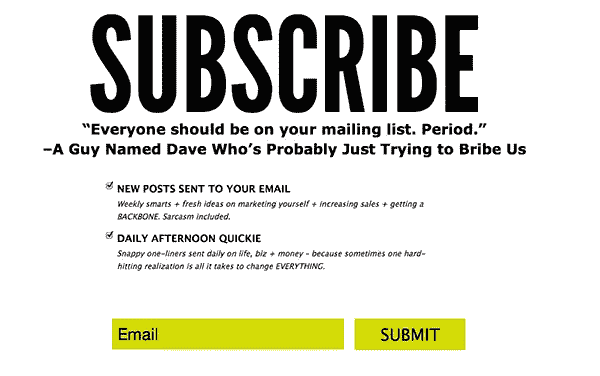
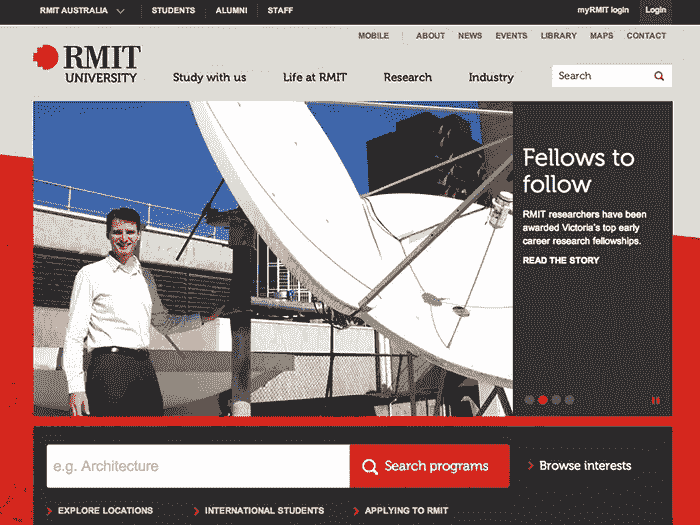
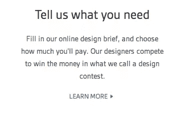

# 平面 UI 设计风格如何影响界面文本

> 原文：<https://www.sitepoint.com/flat-ui-design-style-affects-interface-text/>

等等，什么？设计趋势真的会影响我们在界面中使用文本的方式吗？

是的，可以。上周我们看到[设计和内容相互影响，这包括纯粹的设计趋势，比如现在风靡一时的](https://www.sitepoint.com/make-text-content-mobile-friendly/)[平面 UI](https://www.sitepoint.com/getting-started-flat-ui-design/) (包括就在 sitepoint.com 这里)。

因此，如果你在你的网站上应用平面用户界面美学，这里有一些简单的方法来确保你的文本在视觉环境中最好地支持用户交互。

## 有什么问题？

嘿，没人说“问题”！但是，如果你对平面 UI 设计有什么看法的话，那就是它们是二维的。阴影和渐变是*所以* 2011。当然，在平面 UI 的世界里，还有很多其他的视觉提示可以用来指示页面上的可点击区域。

但从用户的角度来看，这种新趋势仅仅是:新。虽然业内人士可能对它很熟悉，但平板用户界面还没有普及。因此，习惯于看到看起来有触觉的交互元素的用户会发现二维设计有点令人惊讶。

哪些区域是可点击的？哪些地区不是？他们可以在哪里以及如何与页面进行交互？

帮助他们解决这个问题的一个方法是通过短信。我们来看几个例子。

## 2D 呼吁采取行动

行动号召是一个宣传你的品牌的好地方——有什么地方比当你的用户实际接触你的网站时更适合“共鸣连接”呢？

我最喜欢的一个品牌 CTA 曾经出现在 Ashely Ambirge 的中指项目网站上:她的电子邮件注册按钮上写着“轰炸开始！”这反映了她的态度，而且，我敢打赌，让新订户的嘴角露出了微笑。

但是，2D 设计的扁平、简约风格并不会立刻带来这种繁荣。在一个界面中，一个按钮仅仅是一个不同颜色的矩形，这个矩形更好地表达了它的意图。怎么会？通过文本。毫不奇怪，在 Ambirge 的新的平面用户界面上注册 CTA 是“订阅”，电子邮件栏旁边的按钮文本简单地写着“提交”。

因此，在平面用户界面的世界里，不要疯狂使用 CTA 或按钮文本——至少，在这种风格得到进一步发展并且你的用户对它感到舒适之前。同时，确保您的 CTA 确实需要适当的关注:

*   在 CTA 的开头使用动词:例如，get、join、sign、subscribe 和 contact。
*   在适当的时候使用 CTA 惯例。“注册”、“登录”、“订阅”——这些都是既定的 CTA，用户已经知道它们的意思。
*   如果 CTA 服务于相同的目的，请保持一致。因此，如果你在主页顶部使用了“注册”,不要再往下切换到“加入”。同样，保持字体和颜色的一致性，这样当用户看到你网站上的按钮时，他们就会知道它是什么——并对它的作用有所了解。
*   另外，看看文本大小写。在下图中，协作工具[Collaborate.com](http://collaborate.com/)采用了相当扁平的设计，并在标题框中展示了其所有的入门 CTA。看看这个网站，你会发现这是一种不同的处理方式，例如，副标题文本。这有助于将这些交互元素与简单的文本区分开来。

## 2D 导航

导航呢？你可能认为这有点容易，但是随着导航演示越来越复杂，小心使用文本有助于交流什么是交互的，什么不是。

看看这张 RMIT 大学主页的图片。

这些内容可以在我的浏览器上看到。它包括四个导航区域。

它们是如何区分的？通过:

*   文本和背景颜色
*   文本大小写
*   页面上的定位
*   箭头和垂直分隔线等视觉线索的使用。

如果我们看看顶部的两个导航部分——一个是“学生、校友、员工”,另一个是全球导航，其中包含“关于、新闻、事件”等选项，我们可以看到它们的文本很少，而且一直如此。

每个导航区域中的项目之间有一致性——每个组本身都有意义。它们也是用用户在其他网站导航中见过的常用术语构建的。这有助于强化用户可以选择这些项目的想法，就像他们在其他网站上一样。

这些导航项目都有单个单词的标签，这有助于支持它们是一个组的平行部分的想法，并使它们易于浏览和理解。

所以这些导航区域看起来很简单，但是它们之间的一致性——包括使用的标签——有助于给用户一个清晰的指示，即这些项目是可以点击的。

## 最小链接样式

越来越少的网站会给链接加下划线，我发现这种情况在平面用户界面的网站中尤为明显。这给设计者识别页面中的链接带来了挑战，但你可以通过查看链接文本本身来提供帮助。

该 RMIT 站点的主页下方有许多副标题:新闻事件、探索和互动。它们看起来都一样，但有些是可点击的，有些不是。

这远远不够理想。首先，设计者希望用户滚动标题，看看它们是否可点击，因为它们看起来并不可点击。但是如果你翻过错误的一页，你会认为它们都只是标题，而事实上，大多数都不是——它们是更多信息的链接。

添加小而微妙的提示，比如“更多”链接(如果你真的反对下划线)，可能是避免错过交流机会的一种方式。例如，在 [99designs](http://www.99designs.com) 主页上使用了“了解更多”链接，以帮助感兴趣的用户访问有关该服务如何工作的更详细信息。

如果你想让用户点击一个链接，告诉或展示他们可以。

## 使用设计

正如你所看到的，你的文本不需要在平面 UI 设计中做所有繁重的工作，但它可以在这种风格中工作，以帮助确保用户知道他们可以在哪里访问他们需要的内容。

像下面的 [flickr](http://flickr.com) 编辑页面中的阴影导航条和下拉箭头提示这样的东西，在平面 UI 设计中有很大的帮助。但是，举例来说，它们可以影响你有多少空间来处理文本——你可能需要缩短 CTA 以适应这种风格的其他视觉设备。

此外，你可能需要在设计中留出额外的空间，以创建结构一致、超清晰的页面 CTA，如下图所示的[迪肯大学](http://www.deakin.edu.au)主页上的旋转木马。

如果你坚持一致性交互的一致性文本，确保你为特定交互选择的短语(如“了解更多”，如上所述)是通用的，足够清晰地应用于你需要使用它的所有情况。

你在你的网站上使用平面用户界面设计风格了吗？它是否影响了你使用的交互文本，或者你呈现它的方式？请在评论中告诉我们。

## 分享这篇文章