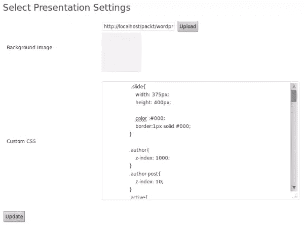
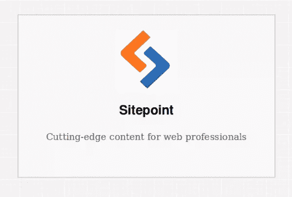
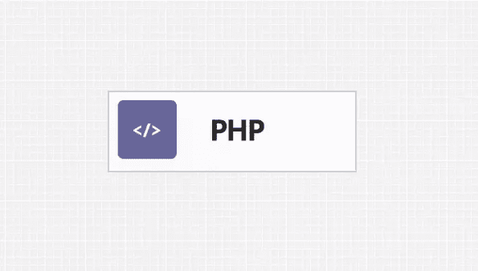
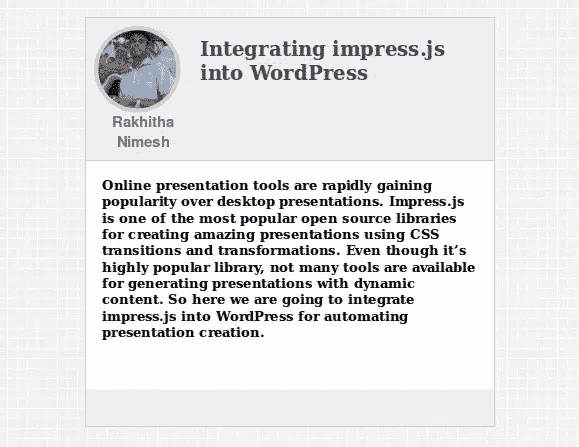

# 使用 WImpress 构建精彩的演示文稿

> 原文：<https://www.sitepoint.com/building-amazing-presentations-wimpress/>

在[第一部分](https://www.sitepoint.com/integrating-impress-js-wordpress/)中，我们学习了如何将 impress.js 集成到 WordPress 中，以创建带有 CSS 过渡和转换的动态演示。impress.js 正在成为 Github 中最受欢迎的 JavaScript 库之一。

灵活性和结构良好的代码可能是它作为演示生成库成功的原因。在本教程中，我们将探讨在使用 WImpress 构建交互式演示文稿时增强 impress.js 默认功能的可能性。

我们用 impress.js 集成 WordPress 插件构建了一个非常基本的演示，从而完成了本文的第一部分。让我们从为演示文稿创建一个选项面板开始本教程。我希望你已经在你的 WordPress 安装中激活了 WImpress 插件。如果是这样，你可以在我们继续实现的时候更新同一个插件的代码。

## 规划选项面板

设计在构建令人惊叹的演示中起着至关重要的作用。使用像 PowerPoint 这样的工具，演示文稿的设计可能会被限制在某个级别，这取决于每个版本中可用的功能。impress.js 完全建立在 CSS 和 HTML 之上，因此你可以自由地进行创造性的设计。在本节中，我们计划实现一个基本的选项面板，这里列出了两个选项。

*   CSS 定制程序
*   背景图像(演示模板)

创建这个选项面板的目的是让你知道如何为任何类型的 WordPress 插件创建基本的选项面板。使用 CSS，你没有任何限制，你可以设计你自己的选项面板，提供更多的选项来满足你的需要。所以让我们开始吧。

## 创建选项页面

WordPress 提供了在管理面板中创建不同类型页面的能力。我们可以创建菜单页面，作为主菜单项或子菜单项显示在左侧菜单中。我们也可以创建设置页面，显示在默认设置部分。这里，我们将使用一个菜单页面来配置 WImpress 插件的设置。因此，让我们开始用下面的动作更新插件构造函数。

```
add_action('admin_menu', array($this, 'wimpr_presentation_settings_page'));
```

让我们看看添加新菜单页面的`wimpr_presentation_settings_page`函数。

```
public function wimpr_presentation_settings_page() {
    	add_menu_page('WImpress Presentation Settings', 'WImpress Presentation Settings', 'administrator', 'wimpr_settings', array($this, 'wimpr_presentation_settings'));
}
```

在函数内部，我们调用 WordPress `add_menu_page`来创建一个顶级菜单项。第一个和第二个参数用于定义选项页面的页面标题和菜单标题。第三个参数定义显示菜单所需的功能。我们需要提供一个独特的 slug 作为第四个参数。最后一个参数定义了用于显示选项面板内容的函数。我们将使用`wimpr_presentation_settings`函数来显示选项面板的表单字段。

您可以在[http://codex.wordpress.org/Function_Reference/add_menu_page](http://codex.wordpress.org/Function_Reference/add_menu_page)查看`add_menu_page`功能的完整参数列表。

## 创建选项表单

一旦我们点击菜单项，WordPress 将执行`wimpr_presentation_settings`功能。因此，我们需要生成必要的 HTML 内容来显示选项页面。下面的代码说明了 `wimpr_presentation_settings`函数的实现。

```
public function wimpr_presentation_settings() {

	$html = '<div class="wrap">

    	<form method="post" name="options" action="options.php">

    	<h2>Select Presentation Settings</h2>' . wp_nonce_field('update-options') . '
    	<table width="100%" cellpadding="10" class="form-table">           	 
        	<tr>
            	<td align="left" scope="row">
            	<label>Background Image</label>
            	</td>

            	<td><input type="text" name="wimpr_bimage" id="wimpr_bimage"
            	value="' . get_option('wimpr_bimage') . '" />
            	<input type="button" name="wimpr_image_btn"  id="wimpr_image_btn"
            	value="Upload" />
            	<div name="wimpr_bimage_preview"  id="wimpr_bimage_preview"></div>

            	</td>
        	</tr>
        	<tr>
            	<td align="left" scope="row">
            	<label>Custom CSS</label>
            	</td>

            	<td><textarea style="width:500px;height:300px;" name="wimpr_css" id="wimpr_css">' . get_option('wimpr_css') . '</textarea></td>
        	</tr>
    	</table>

    	<p class="submit">
        		<input type="hidden" name="action" value="update" />  
        		<input type="hidden" name="page_options" value="wimpr_bimage,wimpr_css" />
        		<input type="submit" name="Submit" value="Update" />
    	</p>
    	</form>

	</div>';
	echo $html;
}
```

我们通过创建一个带有指向`options.php`页面的动作的表单来启动 HTML for settings 页面。这允许我们使用 WordPress 内置选项保存过程，而不是手动保存过程。接下来，我们将背景图像字段定义为一个文本字段，带有一个附加的上传按钮和 DIV 容器，用于预览上传的图像。这里，我们使用了`get_option`函数从`wp_options`表中检索现有值。然后我们定义另一个 textarea 来为演示添加自定义 CSS 样式。

现在，我们的选项面板有两个字段包含现有值。最后，我们定义两个隐藏字段，称为`action`和`page_options`。由于我们使用的是现有的选项保存流程，因此必须让这两个字段具有这里提到的确切名称。字段操作应该具有用于处理表单提交的值更新。然后我们必须定义我们想要保存的每个表单字段的名称，作为`page_options`字段的逗号分隔值。现在我们可以点击**提交**按钮，将数据自动保存到`wp_options`表中。

## 上传背景图像

在上一节中，我们创建了带有上传按钮的背景图像字段。现在，我们必须允许用户使用此按钮上传图像。所以我们将把现有的 WordPress 媒体上传器整合到我们的上传按钮中。

首先，我们必须包含加载媒体上传程序所需的脚本文件。在插件构造函数中使用下面的动作来加载 WordPress admin 的脚本文件。

```
add_action('admin_enqueue_scripts', array($this, 'wimpr_admin_scripts'));
```

现在我们可以看一下`wimpr_admin_scripts`函数，它包含了必要的脚本文件。

```
public function wimpr_admin_scripts() {
	wp_enqueue_script('jquery');

	if (function_exists('wp_enqueue_media')) {
    		wp_enqueue_media();
	} else {
    		wp_enqueue_style('thickbox');
    		wp_enqueue_script('media-upload');
    		wp_enqueue_script('thickbox');
	}

	wp_register_script('wimpr_init', plugins_url('js/wimpr_init.js', __FILE__), array("jquery"));
	wp_enqueue_script('wimpr_init');
}
```

WordPress 3.5 引入了使用`wp_enqueue_media`功能的新版本媒体上传器。因此，我们在将函数加载到插件之前检查它是否存在。如果它不可用，我们可以退回到之前用`wp_enqueue_script`语句加载媒体上传程序的方法。最后，我们包含了一个定制的 JavaScript 文件，用于处理上传按钮的文件上传。

现在让我们看看用于处理图像上传的`wimpr_init.js`文件。

```
jQuery(document).ready(function(){
	jQuery("#wimpr_image_btn").click(function(){
    		if ( typeof wp !== 'undefined' && wp.media && wp.media.editor )
        			wp.media.editor.open("wimpr");

    		var wimpr_image_btn = jQuery(this);
    		var send_attachments = wp.media.editor.send.attachment;

    		wp.media.editor.send.attachment = function(props, attachment) {

        			jQuery("#wimpr_bimage").val(attachment.url);
        			jQuery("#wimpr_bimage_preview").html("");

        			wp.media.editor.send.attachment = send_attachments;
    		}

    		wp.media.editor.open();

    		return false;   
	});
});
```

点击按钮后，我们通过给`wp.media.editor.open`函数一个惟一的 ID 来打开媒体上传器。然后，我们将原始媒体附件函数分配到一个名为`send_attachments`的变量中，以避免与我们的自定义媒体上传程序发生冲突。接下来，我们为上传按钮定义自定义的发送附件功能。

我们使用`attachment.url`获取上传文件的路径，并将其作为背景图像分配给文本字段。接下来，我们将同一个 URL 作为图像分配到预览 DIV 容器中。最后，我们通过使用`send_attachments`变量来恢复原始的发送附件功能。

完成上传处理代码后，我们现在可以使用上传按钮上传图像。上传图像后，我们必须单击**插入页面**按钮，URL 和预览将显示在设置页面中。

## 应用演示设置

到目前为止，我们已经为演示步骤创建了一个带有背景图像和自定义 CSS 的基本设置部分。现在，我们必须将这些数据应用到实际演示中。让我们更新`single-wpresentations.php`文件以包含这些设置。

```
< ?php
        	$style[0] = (get_option('wimpr_bimage') != "") ? "background-image: url('" . get_option('wimpr_bimage') . "')" : "";

?>
<style>
        	body{
            	font-size:12px;
        		< ?php echo $style[0]; ?>
    	}

    	< ?php echo get_option('wimpr_css'); ?>
</style>
```

首先，我们使用从`get_option`函数获取的`wimpr_bimage`选项值为背景图像准备必要的样式。背景图像的样式应用于 HTML 页面的正文。接下来，我们使用`wimpr_css`键从`wp_options`表中获取定制的 CSS 数据，并将其应用到 style 元素中。现在我们已经用设置页面完成了 WImpress 插件的实现。

您可以根据自己的喜好添加更多设置。我想知道你对这个插件还有什么其他的设置。所以请在评论区告诉我。

在这一节中，我们将使用我们在本教程中创建的插件来构建一个高级演示。演示将被设计来说明 SitePoint 网络中的各种教程和类别。让我们通过下面的链接来看看我们最终报告的预览。

演示-[http://goo.gl/oMuO8c](http://goo.gl/oMuO8c)

让我们开始吧。

### 步骤 1–配置演示设置

我们可以通过配置演示设置来开始这个过程。为演示模板选择您喜欢的背景图片，点击**上传**按钮上传，上传后最后点击**插入页面**按钮。

然后，我们必须提供自定义的 CSS 用于文本区域内的演示。用于这个演示的完整的样式集很长，因此我不打算在本教程中包括它。您可以将所有样式放在源代码文件夹中。现在你的设置屏幕应该看起来像下图。



### 步骤 2–创建演示文稿

现在，您可以使用左侧菜单上的 **Impress 演示文稿**项来创建演示文稿。使用有意义的名称并点击**发布**按钮保存演示文稿。

### 步骤 3–创建第一步

在第一步中，我们将包含 SitePoint 标题及其徽标和小标签行。使用 *Impress 步骤*部分创建演示的第一步。添加一个唯一的标题和以下代码作为内容。

```

<p class="title1">Sitepoint</p>
<p class="title2">Cutting-edge content for web professionals</p>
```

确保基于你的 WordPress 安装有正确的图片路径。然后选择**表示名称**，并为这一步添加必要的 CSS 类。这里，我将使用一个名为`banner`的类来设计第一步。接下来，将 data-x 定义为-1000，data-y 定义为 0，作为表示的起点。最后，点击**发布**按钮。

现在转到 **Impress 演示文稿**列表，点击之前创建的演示文稿的查看链接，将其加载到浏览器中。您应该会得到类似下图的结果。



### 步骤 4–创建第二级步骤

现在我们将创建教程类别作为 SitePoint 的子级别。因此它们将被放置在第一个步骤的下方。我们可以增加 data-y 值以将步长移动到屏幕底部，而减少 data-x 值会将步长移动到屏幕左侧。以下代码显示了用于此步骤的 HTML。必要的 CSS 样式放在设置部分。

```

```

像往常一样，从列表中选择相同的表示，并将 CSS 类定义为`post-category`。最后，在点击**发布**按钮之前，将数据 x 值设置为-1500，将数据 y 值设置为 800。现在再次加载演示文稿，并使用空格键或箭头键导航。您应该会得到类似下图的结果。



### 步骤 5–以立方体形式创建教程

现在，我们来看演示的第三个阶段。在这里，我们将构建一个立方体来包含六个教程的信息，并将放置在远离步骤 2 的地方。现在考虑以下用于教程步骤的 HTML 结构代码。

```
<div class="iauthor">
	
	<div class="iauth_name">Rakhitha Nimesh</div>
</div>

<div class="ipost_title">
	<p class="ipost_header">Integrating impress.js into WordPress</p>
</div>

<div style="clear:both"></div>
<div class="ipost_content">Tutorial Summery.</div>
```

对修改值后的所有教程步骤使用相同的结构。像往常一样，选择演示文稿并将 CSS 类定义为 post。接下来，将 data-x 值保持为-2000，data-y 值保持为 2500，以使步骤 3 远离步骤 2。现在你应该有类似下图的东西。



现在，我们必须以类似的方式构建 PHP 类立方体的其余五个步骤。

**立方体的第二步**–data-x =-1750，data-y=2500，data-z=-250，data-rotate-y=90
这里我们使用了 data-z 值来提供立方体的深度。此外，该步骤沿 Y 轴旋转 90 度来构建立方体。

在初始阶段，通过考虑这些值，很难理解立方体是如何构建的。因此，确保使用 impress.js，直到您理解如何正确定位元素。

**立方体的第三步**–data-x =-2000，data-y=2500，data-z=-500，data-rotate-y=180
在第三步中，我们在增加深度的同时沿 Y 轴再旋转 90 度。

**立方体的第四步**–data-x =-2250，data-y=2500，data-z=-250，data-rotate-y=270

**立方体的第五步**–data-X =-2000，data-y=2250，data-z=-250，data-rotate-x=90
在第五步中，我们使用 data-rotate-y 属性通过旋转 X 轴来放置立方体的顶部。

**立方体的第 6 步**–data-x =-2000，data-y=2750，data-z=-250，data-rotate-y=270

所以现在我们已经完成了 PHP 类别的所有三个层次的展示。现在我们必须为 JavaScript 和设计类别完成相同的过程。因此，通过使用与步骤 2 类似的代码为 JavaScript 创建分类步骤来开始这个过程。一旦这三个类别都完成了，你会得到一个类似下面的图片。


现在，您必须继续这个过程，直到所有三个类别的立方体都设计好。您可以在源代码文件夹中找到属性值和剩余步骤的内容。

在[http://goo.gl/oMuO8c](http://goo.gl/oMuO8c)找到最终演示的演示

在[http://goo.gl/TdT1xZ](http://goo.gl/TdT1xZ)下载源代码

## 包裹

在这个由两部分组成的教程中，我们创建了一个基本的 WordPress 插件，将 impress.js 集成到 WordPress 中，用于自动创建演示步骤。您可以看到为什么 impress.js 被认为是使用 CSS3 过渡和转换的最强大的演示创建库之一。

我们用这个插件创建了一个简单而时尚的演示，从而完成了本教程。使用 impress.js 构建演示文稿没有任何限制。因此，通过设计令人惊叹的演示文稿，将创造力付诸实践取决于您。

期待听到您的建议，并在评论区看到一些令人惊叹的演示。

## 分享这篇文章