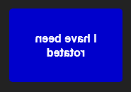

# CSS3 3D 转换:背面可见性

> 原文：<https://www.sitepoint.com/css3-transformations-3d-backface-visibility/>

在我的[上一篇文章](/css3-transformations-3d-functions/)中，我们变换了三维空间中的各种元素，例如[绕 y 轴旋转](https://blogs.sitepointstatic.com/examples/tech/css3-transformations/3drotate.html):

```
transform: rotateY(180deg);
```

元素被有效地反转，子元素通过以下方式显示:

[](https://blogs.sitepointstatic.com/examples/tech/css3-transformations/3drotate.html)

有时候你会想要那种效果。但有时你不会。让我们创建一张可以在悬停/聚焦时翻转的扑克牌，结合使用 3D 变换和过渡。我们的 HTML 代码定义了红心 a 的正面和背面:

```
<div class="card">
	<div class="front"><span>A♥</span> ♥ <span>A♥</span></div>
	<div class="back"></div>
</div>
```

在开始状态下，前端旋转 180 度。(实际上，我使用了-179.9 度来确保它总是以相同的方式旋转，因为浏览器将使用最短的路径):

```
div.card div.back
{
	transform: perspective(400px) rotateY(0deg);
}

div.front
{
	transform: perspective(400px) rotateY(-179.9deg);
}
```

在悬停/聚焦时，两侧都围绕 y 轴顺时针旋转，并带有透视效果，以产生翻转卡片的错觉:

```
div.card:hover div.back, div.card:focus div.back
{
	transform: perspective(400px) rotateY(179.9deg);
}

div.card:hover div.front, div.card:focus div.front
{
	transform: perspective(400px) rotateY(0deg);
}
```

可惜不行: [**查看第一张 3D 卡翻页……**](https://blogs.sitepointstatic.com/examples/tech/css3-transformations/backface1.html)

卡片的背面总是出现在正面的上方，因为这是 HTML 中定义的方式。再多的 z 指数操纵诡计也帮不了你。

幸运的是，有一个简单的解决方案。可以给`backface-visibility`(和`-webkit-backface-visibility`)赋值:

*   **可见** —默认；元素被反转，或者
*   **隐藏** —一个元素在反转时是隐藏的

因此，我们可以将此应用于我们的正面和背面元素:

```
div.card div
{
	backface-visibility: hidden;
}
```

成功！ [**查看第二张 3D 卡片翻页……**](https://blogs.sitepointstatic.com/examples/tech/css3-transformations/backface2.html)

如果您降低动画速度(通过增加时间)，您会发现 div.front 在旋转 90 度后变得可见，同时 div.back 变得不可见。

当与过渡和动画相结合时，2D 和 3D 变换变得非常强大和有效。诱发偏头痛的效果太容易了——有时，越少越好——但唯一的限制是你的想象力。请张贴您创建的任何有趣的演示的 URL。

## 分享这篇文章