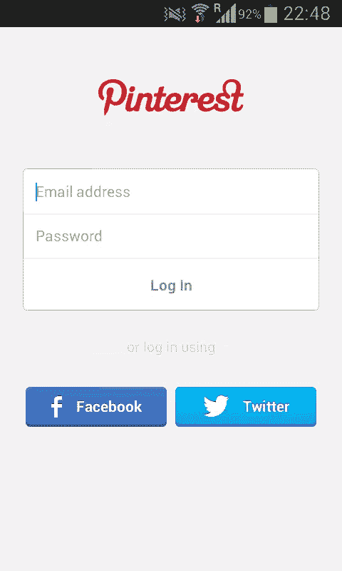
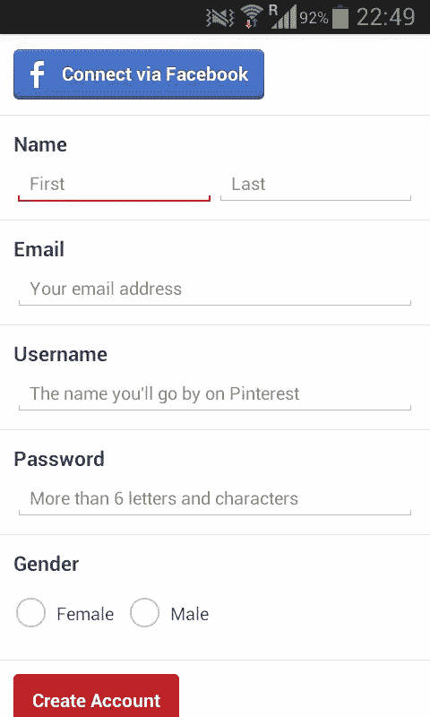
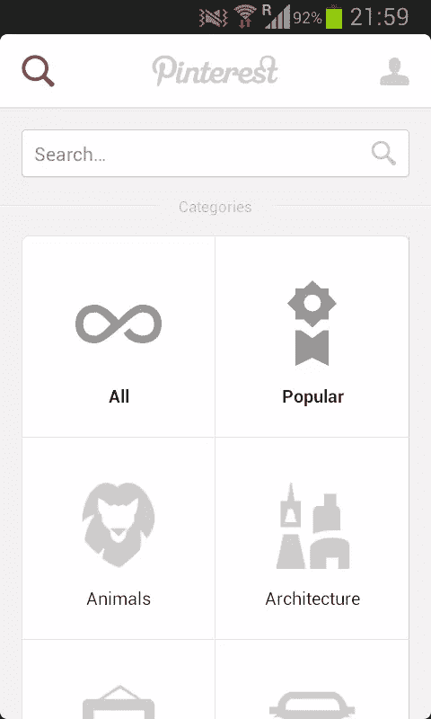
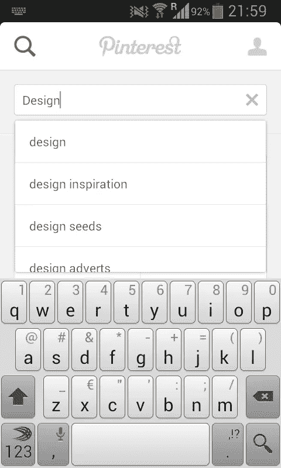
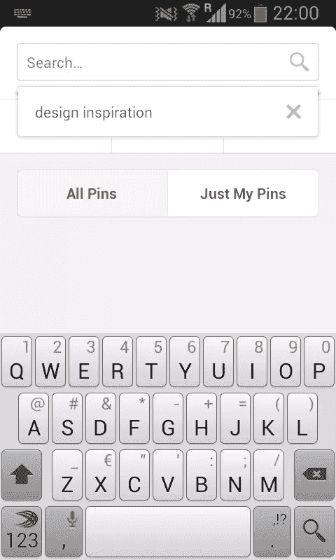
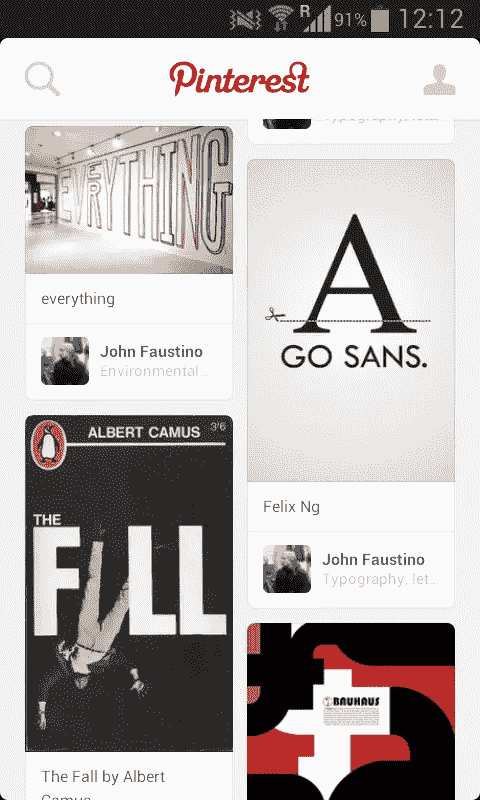

# 移动设计模式的例子

> 原文：<https://www.sitepoint.com/examples-mobile-design-patterns/>

## 介绍

我们生活在这样一个时代，习惯的不断快速变化和技术在我们生活中的不断出现给开发者和设计者带来了巨大的挑战。

越来越重视在具有各种特性的移动设备上使用的应用程序的设计和开发，其结果是网页设计者可能会遇到许多问题，而且这些问题都不容易解决。事实上，考虑和开发一个应用程序的设计并不容易，要注意所有的细节，而不仅仅是图形，这可能标志着它的成功或失败。

花一点时间跟我来简单思考一下:如果使用你的应用程序的人不能立即理解如何继续，你会有什么感觉？如果他们发现在进行搜索、填表或查看图片时有困难呢？你认为他们的满意度会有多高？可能不多，当然他们中的许多人会决定不再使用它。当然，这不是你想要的。

专业人士都很清楚，即使在软件引人注目的图形和辉煌的性能之前，永远不应该低估的是不同年龄、不同技能和能力的用户在使用它时会有的体验。

那么如何防止这种情况发生呢？

有些问题是开发人员普遍存在的，比如菜单列表的安排和创建、最合适的图库的选择、按钮的放置等等。

对于这些问题中的每一个，都有一个或多个解决方案，在设计的特定情况下，这些解决方案也包含在术语“设计模式”中。

但是，更具体地说，这些“设计模式”是什么？

## 设计模式:它们是什么？

就拿**维基百科**提供的简单明了的定义来说吧:

> 建筑和计算机科学中的设计模式是记录特定专业领域中设计问题解决方案的正式方式。这个想法是由建筑师克里斯托弗·亚历山大(Christopher Alexander)在建筑领域引入的，并被应用于其他各种学科，包括计算机科学。与特定领域相关的设计模式的有组织的集合被称为模式语言。
> 
> 这种语言的元素是称为模式的实体。每个模式描述了一个在我们的环境中反复出现的问题，然后描述了该问题解决方案的核心，以这样一种方式，您可以使用该解决方案一百万次，而不必以同样的方式做两次。—克里斯托弗·亚历山大

在开发阶段遇到的问题经常重复出现，并且是可以预测的。设计模式只不过是为解决某些问题而提出的解决方案，它可以被配置为以前设计经验的一种“升华”。

一个设计模式有四个基本组成部分，即:一个名称，它要解决的问题，建议的解决方案以及应用的结果和权衡。

设计模式通常独立于语言和实现:它们的应用既不是机械的也不是自动的。此外，开发人员描述的解决方案必须在要实现的应用程序的上下文中转化为具体的术语。

值得一提和深入关注的设计模式有很多，但是，很明显，在这个小系列中，我无法对它们中的每一个进行详细的概述。

## 移动设计模式的例子:表单

您最近有多少次需要填写表格？购物、回答调查、在网站上创建一个新帐户——有太多的用途需要在网页或移动应用程序上使用表单。嗯，你会说你有一个愉快的浏览体验，并没有任何困难地完成了字段吗？

可能不是所有人都会正面回答这个问题，因为不幸的是，不是所有的开发人员都知道创建一个令人愉快的、完整的、具有严格必要的字段和易于使用的表单的步骤。

让我们来看一些在一个非常著名的移动应用程序中精心设计和组织的表单的实际例子: **Pinterest** 。

从上图中可以清楚地看到，**的登录表单**很短，很简洁，并且缩减到了最小。这种类型的表单应该只有主要的输入字段，即:用户名、密码和操作按钮。即使在这种特定的情况下它不存在，一个“密码帮助”按钮可能是合适的。像许多其他应用一样，Pinterest 也给用户提供了用他们的脸书、推特、谷歌(以及更多)账户登录的选项。正如你所看到的，这是由于清晰，直接和可识别的大按钮。

另一个可以用作案例研究的表单是来自同一个应用程序的**注册表单**。

即使对于登记表，输入的数量也必须是最少的。你应该省略所有与移动应用中的重要功能无关的元素。请注意，只插入这一步中必需的元素:姓名、电子邮件、密码等等。

让用户有可能使用他们现有的帐户:在大多数情况下，他们会感谢你保存了进一步插入的个人数据和新的注册。

也就是说，前两个例子给了我们一个重要的提示:不要试图在这些类型的表单上引领创新；保持它们简单，容易完成，在一页上清晰可见，只需要最必要的信息。这种简单的精明一定会帮助你改善用户体验。

## 移动设计模式的例子:搜索

现在，让我们来看看在移动应用程序中搜索的一些有趣的方法，以便了解哪种模式最适合您的目标。即使在这种情况下，Pinterest 应用程序也符合我们的目的。

在第一张图中，您面对的是一个名为**范围搜索**的模式。这是一种允许您在开始特定搜索之前选择标准或过滤器的模式。您可以选择在单击搜索按钮之前或之后在不同的文件夹中进行搜索。这是一个简单、快速和良好的可能性，以快速达到想要的结果。小心图标:使用简单易识别的图标。Pinterest 提供了一个很好很直接的例子。

这一类别的第二张图片向我们展示了一个很好的带有自动完成功能的**搜索的例子，这可能是移动(以及 web)应用程序中最常用的搜索模式。当你开始写你想要搜索的内容时，系统会显示一组可能的结果，帮助你继续你的活动。**

第三张也是最后一张图片代表了一种用户会非常欣赏的模式:**保存的搜索和最近的搜索**。这无疑是一个非常有用的模式，它使得从以前的搜索中进行选择变得简单，并且尊重用户的已知行为。事实上，通过这种方式，他们不必重复相同的关键字或选择搜索标准，因为他们的搜索已经保存在系统中。

### 快速提示

让我就搜索模式多说几句，并给你一些提示:

*   使用一个**反馈**系统来帮助你的用户:即使结果应该立即显示，这个活动也总是有延迟的可能性。使用进度指示器来指示搜索正在进行，以便用户知道正在执行搜索。
*   插入**清除按钮**和选项以取消搜索。
*   考虑用粗体字符强调结果列表中匹配搜索文本的**的可能性。**

## 移动设计模式的例子:画廊

**图库模式**表示以一定频率更新的内容。内容可能有所不同:你可以找到图片、视频、文章、食谱，有几种方法来组织它们。

一般来说，尤其是对于图像，选择落在可以根据个人需要排列的网格上。然而，使用适合这种用途旋转木马和幻灯片放映也很常见。

让我们最后一次使用 Pinterest 应用程序，看看图片是如何排列的。

你可以清楚地看到，Pinterest 应用程序本身是在一个网格系统上组织的。标题和 pin 作者后面的图像在垂直方向上一个挨着一个显示，这样用户只需向下滚动就可以看到更多内容。如果他想更详细地查看一张图片，他只需点击它，然后他就可以自己锁定它，添加评论，发送等等。

画廊是在更小的空间展示多种内容的最佳解决方案。

## 结论

在这篇文章中，我概述了一些有用的技巧和窍门，可以更好地组织表单、图库和搜索功能。在下一篇文章中，您将了解管理表的正确方法，并且您将测试邀请、建议和反馈对于与应用程序交互的用户的重要性，而在这个简短系列的最后一篇文章中，我计划对最常见(但不推荐)的反模式做一个概述。

## 分享这篇文章