# 在 Photoshop 中创建带阴影的、风格化的文本效果

> 原文：<https://www.sitepoint.com/create-shaded-stylized-text-effect-photoshop/>

在当今的平面和商业设计中，排版和文字效果至关重要。观众正变得越来越被日常信息淹没，结果他们可能会无意中习惯于“过滤掉”那些并不真正与众不同的信息。风格化排版是重新获得注意力和吸引力的有效方法，否则这些注意力和吸引力会在每天的视觉数据中丢失。你可以用正确的字体设计来交流、吸引和赢得你的观众。丰富多彩的、修饰过的文本效果会产生正确的反应。对文字效果和排版设计的热爱永远不会过时，因为市场上总是有新的主题和风格，你总是可以用自己的创意创造出新的风格。您可以在海报、传单、徽标和其他有用的品牌和营销材料中使用文本效果。

所以，今天我在 Photoshop 中带来了一个非常有趣的干净、扁平的风格化文本效果。我们将学习如何使用和实现有趣的工具和技术来实现我们想要的文本效果。我们将使用各种模式、风格和混合选项来实现最终结果。

**资源:**

[细微模式设定](http://www.graphicsoulz.com/premium-item/subtle-patteren-set-vol1-free/)

在我们开始之前，让我们看看我们的最终设计。

 
 **( [下载完毕，分层 PSD 文件](https://www.dropbox.com/s/m38ask8lmanouuk/Clean%20Text%20Effect.zip)。)**

**第一步:**

打开 Photoshop，新建一个宽 1000 像素，高 600 像素的文件。或者，您可以根据自己的喜好调整尺寸。

[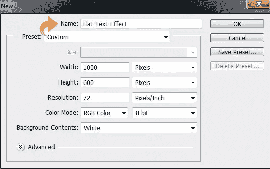](https://www.sitepoint.com/wp-content/uploads/2013/08/Step-11.jpg)

**第二步:**

现在我们将从背景开始，所以创建一个新的层。然后，选择油漆桶工具，用颜色#006d68 填充背景。

[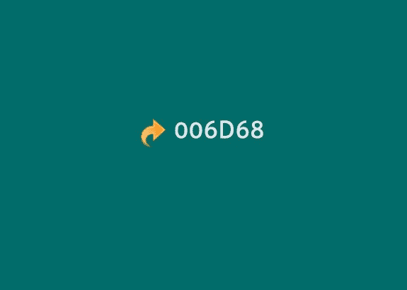](https://www.sitepoint.com/wp-content/uploads/2013/08/Step-21.jpg)

**第三步:**

选择背景层，点击“图层”>“图层样式”>“渐变叠加”(或者，双击选中的图层)，添加一个“黑 7 白”渐变。将不透明度降低到 8%，比例设置为 115%。

[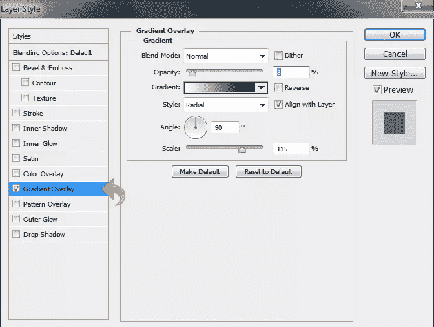](https://www.sitepoint.com/wp-content/uploads/2013/08/Step-31.jpg)

**第四步:**

选择背景层，点击“图层”>“图层样式”>“图案叠加”(或者，双击选中的图层)，从上面的资源中添加一个微妙的图案。改变混合模式为“除”，设置图案比例为 15%。

[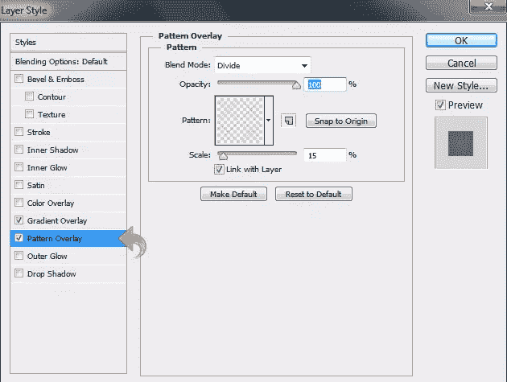](https://www.sitepoint.com/wp-content/uploads/2013/08/Step-41.jpg)

**第五步:**

现在，点击文字工具，用颜色#070707 添加想要的文本。然后，点击“图层”>“图层样式”>“投下阴影”(或者，双击选中的图层)，用下图所示的设置添加一个阴影。

[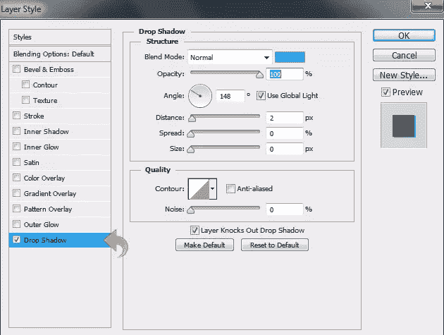](https://www.sitepoint.com/wp-content/uploads/2013/08/Step-51.jpg)

**第六步:**

重复相同的过程，并使用相同的颜色添加额外的文本。然后，点击“图层”>“图层样式”>“投影”(或者，双击选中的图层)，用上面使用的相同设置给文本添加阴影。

[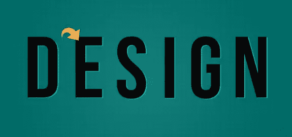](https://www.sitepoint.com/wp-content/uploads/2013/08/Step-61.jpg)

**第七步:**

再次选择文字工具，使用颜色#161d21 添加文本。然后，将文本移到左侧。

[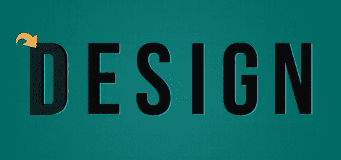](https://www.sitepoint.com/wp-content/uploads/2013/08/Step-71.jpg)

**第八步:**

重复相同的过程，添加文本的其余部分，并再次向左移动。

[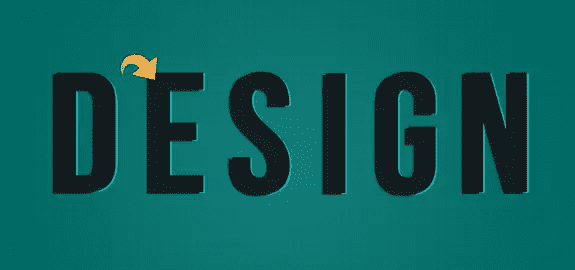](https://www.sitepoint.com/wp-content/uploads/2013/08/Step-81.jpg)

**第九步:**

选择文字工具，使用颜色# bc4232 添加文字；请确保稍微减小文本大小。然后，将文本稍微向左移动。选择文字图层，点击“图层”>“图层样式”>“描边”(或者，双击选中的图层)，用颜色#d43926 添加一些 1px 的描边。保持如下图所示的设置。

[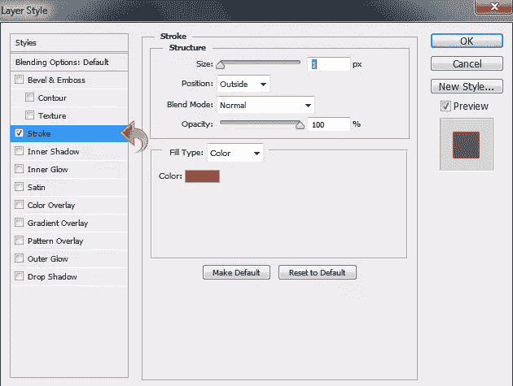](https://www.sitepoint.com/wp-content/uploads/2013/08/Step-9a.jpg)

再次点击“图层”>“图层样式”>“渐变叠加”(双击选中的图层)，设置如下图所示。

[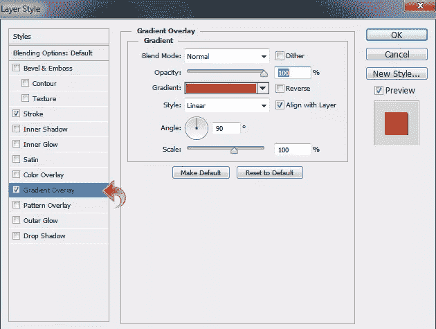](https://www.sitepoint.com/wp-content/uploads/2013/08/Step-9b.jpg)

然后，点击“图层”>“图层样式”>“投影”(双击选中的图层)，将不透明度降低到 75%，其余设置保持不变，如下图所示。

**第十步:**

重复相同的过程，添加文本的其余部分，并将其向左移动。然后，点击“图层样式”,使用与上面相同的设置添加描边、渐变和阴影。

[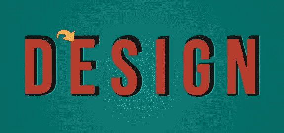](https://www.sitepoint.com/wp-content/uploads/2013/08/Step-101.jpg)

**第十一步:**

再次选择文字工具，添加文字；使文本尺寸小于前一个。然后，选择将文本稍微向左移动。选择文本层，点击“图层”>“图层样式”(或者，双击选中的图层)，添加描边、渐变、叠加和阴影。

使用以下设置添加笔划:

[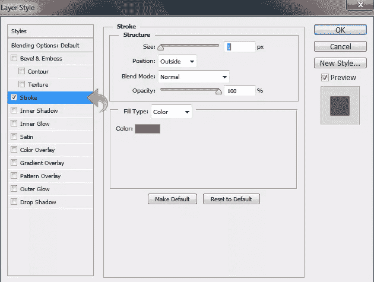](https://www.sitepoint.com/wp-content/uploads/2013/08/Step-11a1.jpg)

使用这些设置添加渐变:

[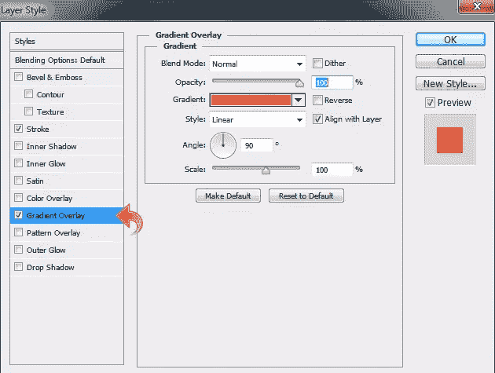](https://www.sitepoint.com/wp-content/uploads/2013/08/Step-11b1.jpg)

最后，使用下面的设置添加阴影。

[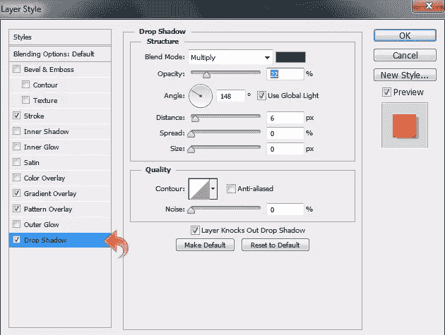](https://www.sitepoint.com/wp-content/uploads/2013/08/Step-11c.jpg)

**第十二步:**

现在，复制主文本层，减少填充到 0%。然后，点击“图层”>“图层样式”>“图案叠加”，从上面的资源中添加一个微妙的图案。将不透明度调整为 43%，缩放为 25%。

[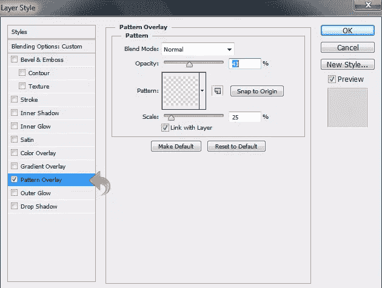](https://www.sitepoint.com/wp-content/uploads/2013/08/Step-121.jpg)

**第十三步:**

现在我们将添加一些黑暗的阴影文本，所以创建一个新的层，然后点击钢笔工具，创建一个简单的路径，右键单击路径，并点击“选择”。

现在，选择油漆桶工具，用颜色#000000 填充选区。然后，减少层不透明度为 20%。

[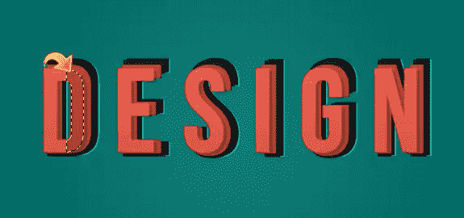](https://www.sitepoint.com/wp-content/uploads/2013/08/Step-131.jpg)

**第十四步:**

再次重复相同的过程，使用钢笔工具进行选择，并在所有剩余的文本上创建深色阴影。

[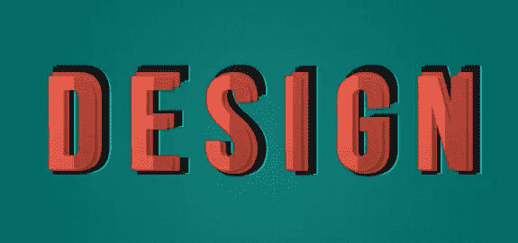](https://www.sitepoint.com/wp-content/uploads/2013/08/Step-141.jpg)

**第十五步:**

现在，让我们给背景和文本添加一些元素。选择线条工具，添加几条线条，粗细为 3px，颜色为#161d21。

[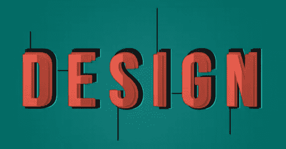](https://www.sitepoint.com/wp-content/uploads/2013/08/Step-151.jpg)

**第十六步:**

重复同样的过程，再次使用线条工具添加更多的线条，这次使用颜色#bb4231。

[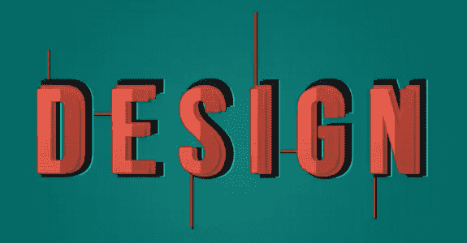](https://www.sitepoint.com/wp-content/uploads/2013/08/Step-16.jpg)

**第十七步:**

再一次，创建一些线条，这次使用颜色#0e1111，长度变化很大。然后，点击“图层”>“图层样式”添加一点笔触。保持如下图所示的设置。

**第十八步:**

选择椭圆工具，使用#161d21 颜色添加小圆。然后，点击“图层”>“图层样式”>“笔画”。使用下面显示的设置。

**第十九步:**

现在让我们创建阴影；我们将玩阴影放置，所以创建一个新的层，并选择钢笔工具来创建阴影路径。点击“选择”并填充颜色#161d21。

[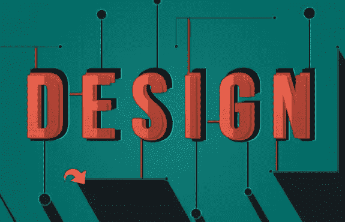](https://www.sitepoint.com/wp-content/uploads/2013/08/Step-19.jpg)

**第二十步:**

现在，减少阴影不透明度到 30%，我们就完成了。

我们的阴影，风格化的文本效果已经准备好了。我希望你们喜欢这个过程。我会带更多回来。在那之前，保重！

## 分享这篇文章