# 在 Illustrator 中创建令人惊叹的转盘

> 原文：<https://www.sitepoint.com/create-a-stunning-turntable-in-illustrator/>

他们说音乐是灵魂的食粮，在你的视觉设计中影射音乐可以唤起观众强烈的情感。作为一名平面设计师，我们的终极工具是 Photoshop，但 Illustrator 提供了一个全新的创意工具世界，尤其是在制作矢量形状时。Illustrator 简化了创建过程，使对象可以根据我们的意愿灵活地改变。那些严重依赖 Photoshop 的人经常低估 Illustrator 提供的创作便利性。只有当你使用它时，你才会理解它在制作插图、图标和不受位图或其他约束的矢量方面的作用。

在本教程中，我将向您展示如何在 Illustrator 中创建一个电唱机。我们将使用钢笔工具，渐变工具，形状工具和效果菜单中的各种其他选项来实现我们的最终结果。所以，让我们开始吧！

**最终结果:([下载完成的分层设计文件](https://www.dropbox.com/s/ikny0gjahtyrz33/Turntable.zip)。)** 

### 第一步

在 Illustrator 中创建新文档，宽度为 600 像素，高度为 500 像素。

[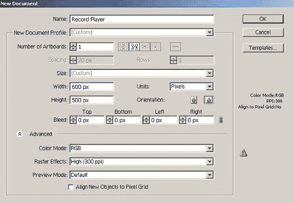](https://www.sitepoint.com/wp-content/uploads/2013/03/112.jpg)

### 第二步

选择浅灰色填充颜色，选择矩形工具画一个合适的矩形。

[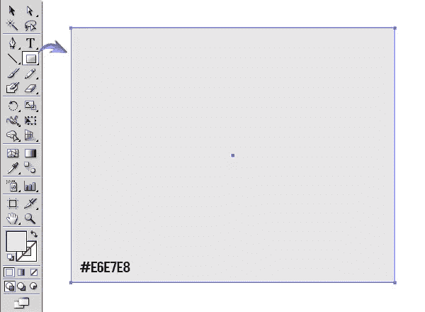](https://www.sitepoint.com/wp-content/uploads/2013/03/24.jpg)

选择矩形层，按下相应层右侧的环形目标，然后进入“效果”>“风格化”>“内部发光”。在此应用以下设置:

[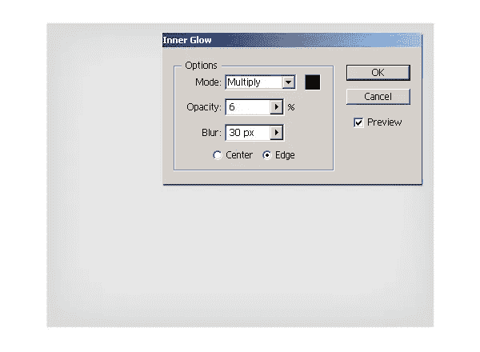](https://www.sitepoint.com/wp-content/uploads/2013/03/2b1.jpg)

### 第三步

再次选择矩形，进入“效果”>“效果图库”>“艺术”>“胶片颗粒”。使用下面的设置为矩形添加粒状纹理。

### 第四步

要创建阴影，使用钢笔工具在矩形图层下面的图层上用黑色填充形状。

[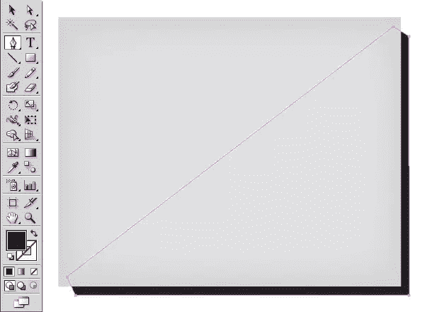](https://www.sitepoint.com/wp-content/uploads/2013/03/42.jpg)

选择这个形状，进入“效果”>“模糊”>“高斯模糊”。在此应用以下设置。

[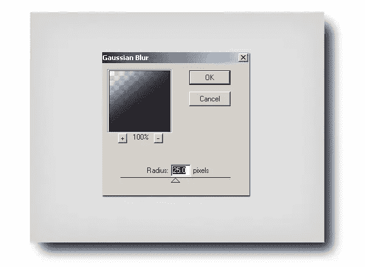](https://www.sitepoint.com/wp-content/uploads/2013/03/4b.jpg)

### 第五步

接下来，我们将制作拼盘并录音。选择椭圆工具，在按住“Shift”键的同时画一个圆。给它一个 1 磅的白色笔触，并使用渐变工具应用如下渐变。

[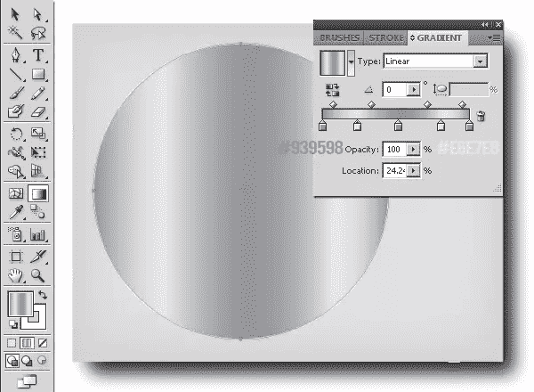](https://www.sitepoint.com/wp-content/uploads/2013/03/52.jpg)

使用深灰色填充颜色和黑色描边(1 磅)在前一个圆圈内再画一个圆圈。

[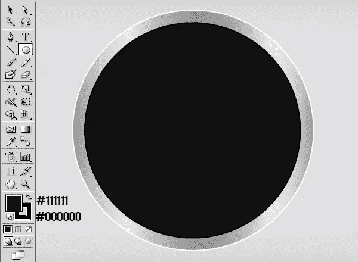](https://www.sitepoint.com/wp-content/uploads/2013/03/5b1.jpg)

### 第六步

现在，设置你的填充颜色为无，从顶部选项栏选择一个 0.25 磅的浅灰色的笔画，在黑色的圆圈里面画一个笔画。为了清楚起见，请看下面。

[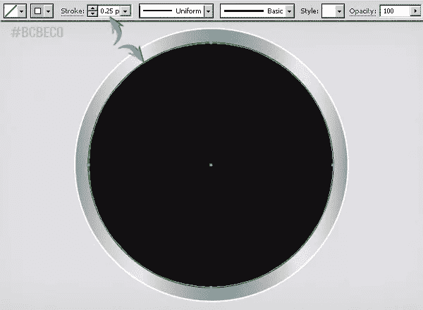](https://www.sitepoint.com/wp-content/uploads/2013/03/62.jpg)

选择这个灰色的笔画，进入“效果”>“扭曲和变换”>“变换”在此应用以下设置:

[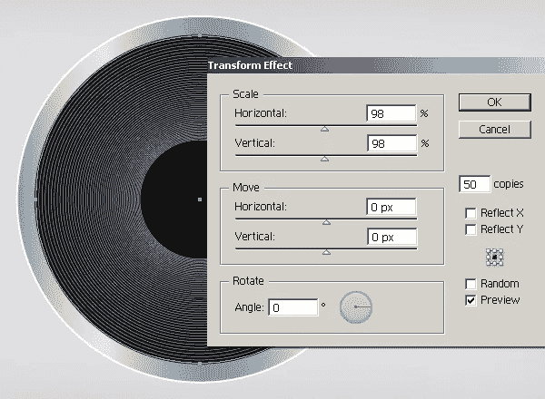](https://www.sitepoint.com/wp-content/uploads/2013/03/6b2.jpg)

在透明度面板中，将该层的混合模式设置为“叠加”(Shift + Ctrl + F10)。

[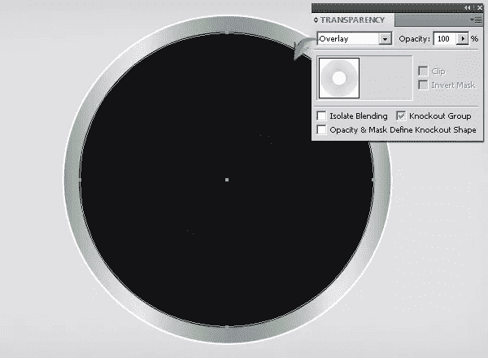](https://www.sitepoint.com/wp-content/uploads/2013/03/6c.jpg)

### 第七步

在黑色椭圆的内侧再画一个黑色圆形笔画(1 磅)。选择它，然后进入“效果”>“扭曲&变换”“变换”在此应用以下值。一旦你完成，减少这一层的不透明度为 25%。

[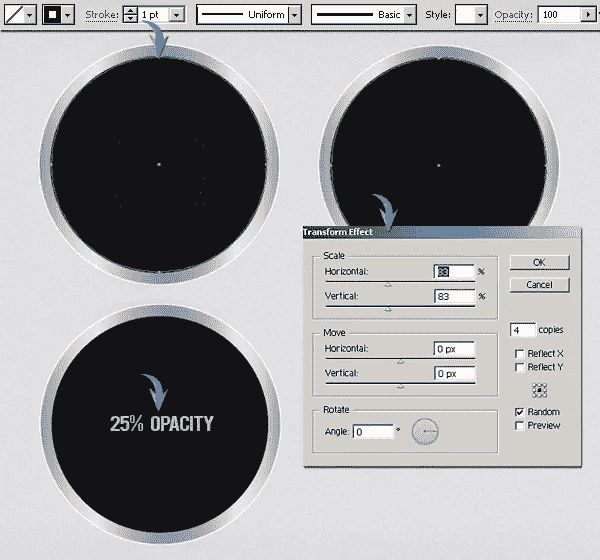](https://www.sitepoint.com/wp-content/uploads/2013/03/72.jpg)

### 第八步

要在记录上突出显示，请使用钢笔工具绘制一个白色填充的三角形。复制形状三次，在旋转工具(“R”)的帮助下，如下图所示放置它们。

[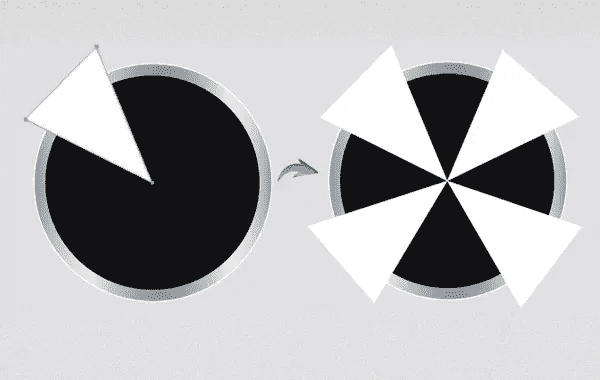](https://www.sitepoint.com/wp-content/uploads/2013/03/82.jpg)

要将这些形状限制在记录中，请在三角形上方画一个与记录大小相同的圆，并将其填充和描边设置为无。现在，选择四个三角形和这个新的圆，然后进入“对象”>“剪贴蒙版”>“制作”

[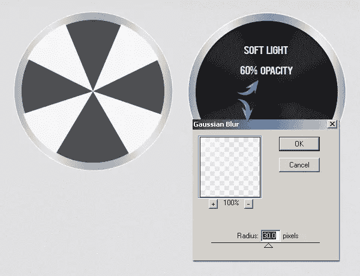](https://www.sitepoint.com/wp-content/uploads/2013/03/8b2.jpg)

### 第九步

现在，如下图所示，在彼此上方画三个圆。在灰色的小圆上应用下面的内发光设置。制作另一个白色椭圆来创建一个亮点。使用选择工具(“V”)旋转它，并应用 2px 高斯模糊效果。

[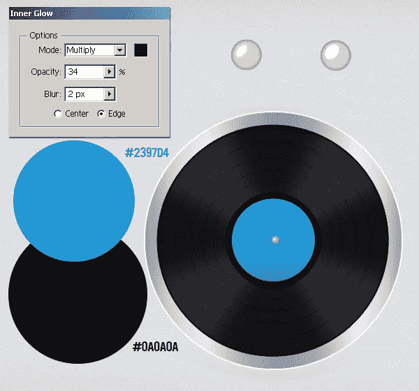](https://www.sitepoint.com/wp-content/uploads/2013/03/92.jpg)

### 第十步

要制作阴影，用黑色填充在矩形层上画一个圆，然后应用 9px 高斯模糊效果。

[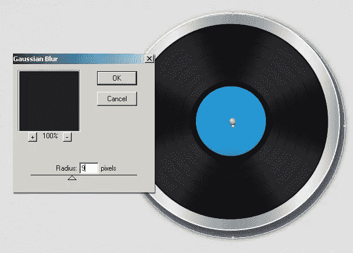](https://www.sitepoint.com/wp-content/uploads/2013/03/102.jpg)

### 步骤 11

现在，使用椭圆工具在记录的右侧画一个 1pt 的圆形笔画。如下所示，在记录内绘制一个椭圆和形状。

[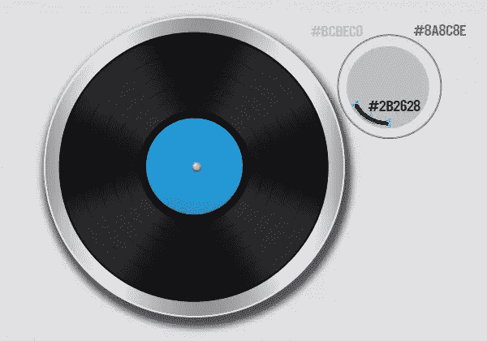](https://www.sitepoint.com/wp-content/uploads/2013/03/113.jpg)

### 步骤 12

画一个矩形，并应用铬渐变。你可以找到这个梯度如下路径，“窗口”>“样本库”>“梯度”>“金属”，并选择铬梯度从选项。然后，复制这个矩形，缩小它的尺寸，并把它放在原来矩形的顶部。

[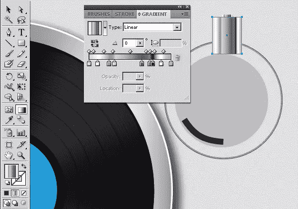](https://www.sitepoint.com/wp-content/uploads/2013/03/122.jpg)

现在，绘制如下所示的形状，并应用深灰色到浅灰色渐变。

[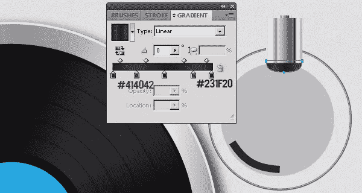](https://www.sitepoint.com/wp-content/uploads/2013/03/12b.jpg)

### 第十三步

接下来，在彼此上方画四个圆圈，并水平画两个深灰色的三角形，以创建高光。对它们应用 4px 高斯模糊效果。将这些三角形的混合模式改为“正片”，不透明度调整为 75%。现在，垂直制作两个浅灰色三角形，如下图所示。模糊他们，改变他们的混合模式为“屏幕”，30%的不透明度。

[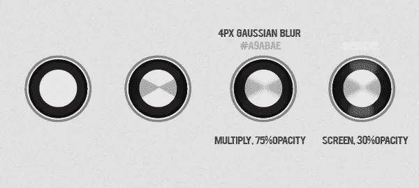](https://www.sitepoint.com/wp-content/uploads/2013/03/132.jpg)

用同样的方法做一个小螺丝。

### 步骤 14

现在，使用钢笔工具制作如下所示的手臂，并应用以下内部发光设置:

[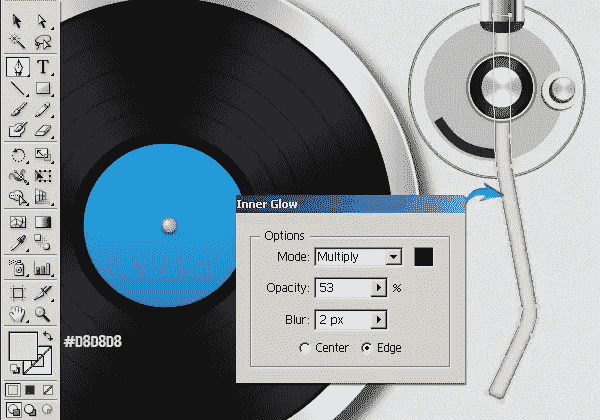](https://www.sitepoint.com/wp-content/uploads/2013/03/142.jpg)

要在手臂上添加阴影，使用钢笔工具绘制 1 磅的白色线条。复制它，向右拖动一点，改变它的笔触颜色为深灰色。之后，选择两个笔画，应用 2px 高斯模糊效果。

[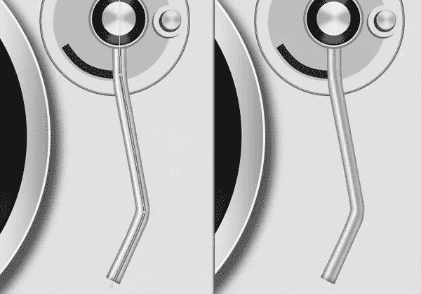](https://www.sitepoint.com/wp-content/uploads/2013/03/14b2.jpg)

### 第十五步

使用形状工具和钢笔工具制作以下部件。为了清楚起见，请看下面。

[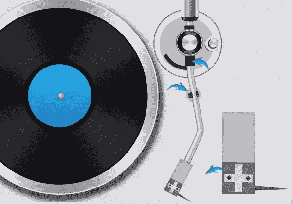](https://www.sitepoint.com/wp-content/uploads/2013/03/152.jpg)

### 第十六步

收集所有的手臂层到一个新层，复制它，并把它放在原始层下面。现在，选择你的新层，并点击“联合”形状模式在探路者面板(Shift + Ctrl + F9)。之后对其应用 4-5px 高斯模糊效果，不透明度调整为 50%。

[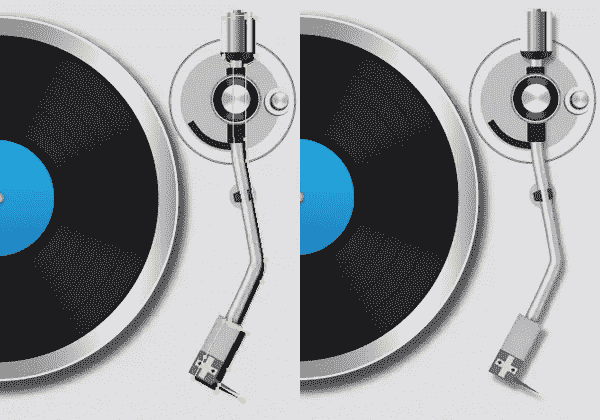](https://www.sitepoint.com/wp-content/uploads/2013/03/162.jpg)

### 步骤 17

现在，用灰色填充一个椭圆和一个矩形，然后将它们合并。复制这个新的形状，减少其大小，并应用 2px 高斯模糊效果。

[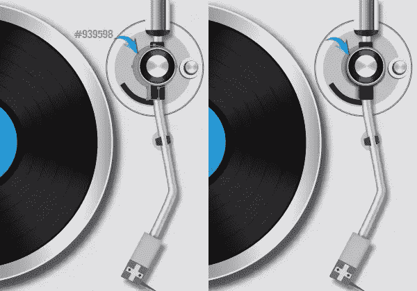](https://www.sitepoint.com/wp-content/uploads/2013/03/172.jpg)

### 步骤 18

接下来，我们将制作控制器。画两个深灰色和浅灰色的垂直矩形。之后，使用钢笔或线条工具画一条 0.5 磅的小水平线，复制，如下图所示放置。现在，选择两条白线，进入“对象”>“混合”>“混合选项”选择 12 个指定步骤并点击“确定”。现在，转到“对象”>“混合”>“制作”

[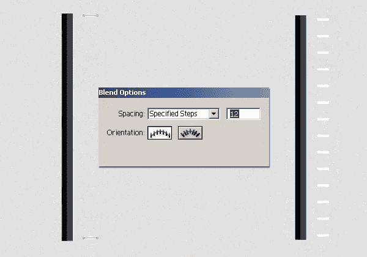](https://www.sitepoint.com/wp-content/uploads/2013/03/182.jpg)

### 步骤 19

画以下四个矩形，把它们放在一起，得到如下所示的效果。要制作阴影，在下面画一个矩形，应用 2.5 像素的高斯模糊效果。

[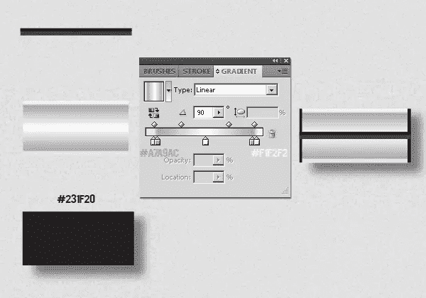](https://www.sitepoint.com/wp-content/uploads/2013/03/192.jpg)

### 步骤 20

最后，我们将在转盘上添加几个按钮。制作以下两种类型的按钮，复制 3-4 次，按照自己喜欢的位置放置。您也可以在按钮上添加一些文本。

[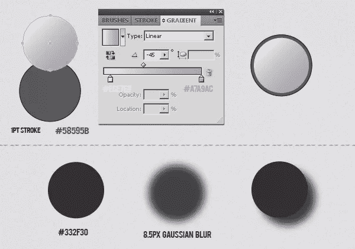](https://www.sitepoint.com/wp-content/uploads/2013/03/202.jpg)

就是这样！我希望你喜欢这个教程，并学到一些有用的东西。请分享你的想法！

## 分享这篇文章