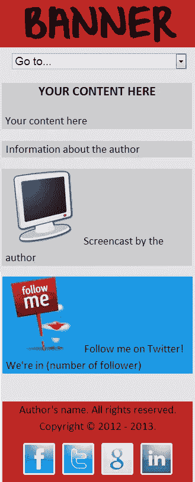

# 从头开始构建一个响应迅速、移动友好的网站:移动办公

> 原文：<https://www.sitepoint.com/build-a-responsive-mobile-friendly-website-from-scratch-getting-mobile/>

在本系列的第五部分中，我们已经看到了我们必须应用的规则，以使我们的网站具有响应性，并确保平板电脑上的良好布局。在这最后一部分，我们将用移动代码和一些最后的考虑和建议来结束它。



在向您展示带有移动版本固有规则的 CSS 代码之前，我们必须添加一小段 HTML 代码来创建移动版本的菜单。从截图可以看出，手机版的菜单是下拉列表(`<select>`元素)。

我们将很快看到为什么，以及如何让网站根据使用的设备显示不同的菜单样式，但是，作为第一步，让我们在用于创建我们的菜单列表的`nav`标签后包括这几行。

```
<select id="menu-select">
  <option selected="selected" value="">Go to...</option>
  <option value="/">Homepage</option>
  <option value="/news">News</option>
  <option value="/graphics">Graphics</option>
  <option value="/mobile">Mobile</option>    
  <option value="/web-design">Web Design</option>
</select>
```

嗯，显然上面的 HTML 代码，如果单独使用不会引起任何变化。这就是为什么我们还需要添加几行 javascript 代码。他们在这里:

```
$("#menu-select").change(function(){
   window.location.href = $(this).children("option:selected").val();
});
```

代码结构非常容易理解。我们正在监听 id 为`menu-select`的元素上的 change 事件，并为其附加一个匿名函数，以便在事件触发后立即运行。完成后，我们将使用`option`元素的值来更改地址栏的 URL，并将用户重定向到选定的页面。

有了这个小功能(在我们不久将深化的条件下)，我们将有可能毫无问题地访问我们网站的其他页面，无论我们是使用 PC 还是平板电脑/智能手机。

这个小介绍完成后，让我们看看 CSS 媒体查询适用于所有那些最大宽度不超过 480 像素的设备。你会注意到的第一件事是字体和图像发生了变化。对于较小的屏幕，要记住的第一条规则是一切都必须清晰、快速、易懂。

所以，太重的图片或者定制的字体会使页面加载太慢，这会影响网站的成功，从而影响你目标的实现。

这部分的代码如下:

```
@media screen and (max-width: 480px)
{
   body
   {
      font-family: Calibri,Arial,Helvetica,sans-serif;
   }

   #banner
   {
      background-image: url("img/mobile-banner.png");
   }

   .menu
   {
      display: none;
   }

   #wrapper
   {
      width: inherit;
   }

   a.menu-item-link
   {
      font-family: Calibri,Arial,Helvetica,sans-serif;
   }

   #menu-select
   {
      display: block;
      margin: 0.5em auto;
      width: 90%;
      font-size: 1em;
   }

   #newsletter-box
   {
      display: none;
   }

   #mobile-newsletter-box
   {
      display: block;
   }

   #mobile-newsletter-box *
   {
      width: 90%;
      margin: 0em auto 0.5em auto;
   }

   #mobile-newsletter-box > form > *
   {
      display: block;
   }

   input#mobile-newsletter-email
   {
      font-size: 1em;
   }

   #mobile-newsletter-box p
   {
      padding: 0;
      text-align: center;
   }

   #mobile-newsletter-box a
   {
      font-size: 1.2em;
      font-weight: bold;
      color: #FFFFFF;
   }

   .long-box,
   .small-box,
   #banner
   {
      box-shadow: none;
   }

   #team-logo-bar
   {
      text-decoration: none;
      width: 100%;
      display: inline-block;
      text-align: center;
   }

}
```

在集中讨论代码中最重要的部分之前，让我们回到菜单风格的话题上来，这是一个值得首先考虑的问题。你可以看到，我们显示了下拉菜单，而隐藏了菜单列表，这在 pc 桌面和平板电脑上是可见的。我们已经将规则`display: none;`应用于班级`menu`。

使用另一个规则`display: block;`，我们将它应用到 id 为`menu-select`的元素上，之后我们让一个下拉菜单(对于移动版本来说更清晰易读)出现。

说到这里，我们必须考虑一个好的网页设计师应该牢记的问题:JavaScript 被禁用了怎么办？如果用户启用了 JavaScript，他在使用这个新菜单时不会有任何问题；如果 JavaScript 被禁用，change 事件将被触发，但处理程序不会。因此，如果 JavaScript 被禁用，用户就不能进入与当前页面不同的页面。一个大问题！

这个问题的可能解决方案有几种，但是，由于讨论超出了本文的范围，我只给你一点提示，将这个问题的深入研究留给下一篇文章。一个可能的解决方案是使用附加到“resize”事件的 JavaScript 函数，该函数进行前面讨论过的更改，并且还负责管理隐藏菜单列表和显示下拉菜单。

因此，如果 JavaScript 被禁用，而用户在移动设备上，下拉菜单将不可见，但他会发现之前提到的菜单列表仍然可用，因为它由常规链接组成。这样，用户可以通过菜单提供的链接访问附加内容。讨论很有趣，值得关注，但是如前所述，这将是未来文章的主题。

现在我们已经讨论了菜单的问题，是时候关注其他话题了，比如:字体和图像，框的布局和阴影。让我们先来看看字体。有两件事要考虑:它的大小和风格，必须适合设备。很容易猜到，字体大小应该与所使用的媒介成比例:对于 pc 桌面来说要大一些，对于平板电脑和智能手机来说要小一些。

此外，请记住，尤其是对于内容和纯文本，您应该坚持使用最常见和“标准”的字体，因为这将确保每个访问您的网站的人都能以您希望的方式看到它，并且更容易阅读。

如你所见，我设置了一种最常见的字体，Calibri。为什么这样选择？答案很简单:自定义字体意味着额外的请求，并且文件通常不会很小。你会同意，对于手机来说，可爱的字体没有可读性重要，因为屏幕更小。此外，你应该记住，连接也较慢，性能是非常重要的。因此，下载的 kb 越少，用户浏览我们页面的体验就越好。

在桌面上，使用可爱的字体不会影响它的效率，因为**通常**它意味着快速连接，而在移动设备上，对普通字体的更改应该总是适用于实现最佳性能。但是，即使在这种情况下，也会下载规则中指定的自定义字体。但是……为什么呢？真的有必要吗？答案是字体下载很容易避免。

事实上，更正确的选择可能是从通用样式表中移除自定义字体规则，并创建一个新的断点。这样，一旦网站显示在移动设备上，应用于该特定设备的规则就会被覆盖，而自定义字体(以前在平板电脑和桌面版本中可见)则不会被下载，这导致了内容和样式的加载速度更快。

事实上，如果设备大于范围中指示的尺寸，这意味着该人至少在使用平板电脑，因此字体可以显示其所有的美和特殊性；否则这段话将被删除，因为它既没有用也没有效率。

因此，让我们编写另一个媒体查询(其中我们将设置一个值范围):

```
@media only screen and (min-width : 481px)
{
   a.menu-item-link
   {
      font-family: Bebas Neue, Calibri,Arial,Helvetica,sans-serif;
   }
}
```

还有另一个东西，比如字体，可以在我们之前创建的范围内移动，那就是横幅；事实上，可以对横幅图像进行同样的考虑。

我们正在为手机进行优化，到目前为止，我们并不关心，因为我们正在谈论平板电脑，但现在它是适当的，甚至触及这个话题。我们正在做一个演讲，以提高性能，所以为什么下载两个图像时，我们总是会看到其中一个时间呢？即使在这种情况下，引用 banner 的代码行也应该从公共样式表中移出并放入该范围，如下所示:

```
@media only screen and (min-width : 481px)
{
   #banner
   {
      background-image: url("img/banner.png");
   }
}
```

最后，对于盒子的影子，我们将做与交易相同的考虑；在小屏幕上，阴影是基础吗？事实上，这种效应的特殊性在 pc 桌面上很明显，在其他设备上不会有同样的效果。

## 结论

关于如何从头开始构建一个响应迅速、移动友好的网站的系列文章已经结束。我希望你喜欢它！如果我能给你什么建议的话，那就是继续“练习这些东西”，不仅在网站的实际实现中，而且在设计阶段也是如此，设计阶段非常重要，因为每件事都经过详细的计划是非常重要的；只有在这种情况下，你才能避免浪费时间和令人筋疲力尽的修改，你才能完全理解如何组织你的内容和改善你的最终结果。

## 分享这篇文章