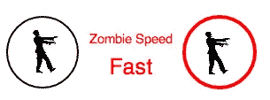
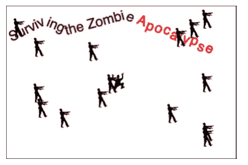
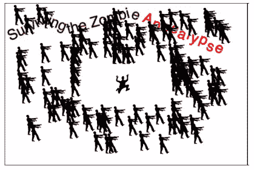
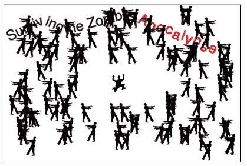

# 从僵尸末日中幸存下来:用 JavaScript 操纵 SVG

> 原文：<https://www.sitepoint.com/surviving-the-zombie-apocalypse-manipulating-svg-with-javascript/>

在天启中幸存需要付出很多。或者至少构建一个 HTML5 应用程序，根据应用程序和启示，这可能或多或少有些困难。到目前为止，在本系列的第 1 部分中，我们已经介绍了静态 SVG 元素——文本、图像、圆形、矩形，以及最重要的路径。[第 2 部分](https://www.sitepoint.com/surviving-the-zombie-apocalypse-text-paths-and-basic-animation/)介绍了一些不用 JavaScript 也能完成的很酷的动画技巧。

但我们的应用程序不会从僵尸手中拯救任何人，至少现在不会。为此，它需要一些额外的东西，比如可以工作的按钮。为此，本系列的第三个演练将介绍两种不同的方法来响应用户交互，包括 SVG 元素本身的属性动画和使用 JavaScript 来操作核心 DOM 和 SVG DOM 元素。

注意:本文中的代码基于本系列第 2 部分的最终源代码。代码本身可以在 http://justinwhitney.com/zombies/zombies_part2.htm 的[后面找到。此外，本演练添加了一些新图像。在 http://justinwhitney.com/zombies/zombieAssets.zip](http://justinwhitney.com/zombies/zombies_part2.htm)的[可以找到这个系列中使用的资产的完整档案。](http://justinwhitney.com/zombies/zombieAssets.zip)

## 使用<set>元素</set>

在最后一个演练中，僵尸开始移动是因为一个叫做<animatemotion>的小元素，当它嵌入到元素中时，为定义了运动的路径和持续时间。这种方法仅仅触及了 SVG 动画的皮毛。除了给用户一个控件功能的视觉指示器(或者仅仅是给页面提供糖果)，动画可以也应该用来指示对用户交互的响应。</animatemotion>

传统上，这是通过使用 JavaScript 交换图像，或使用 CSS 定义悬停样式，或上千种类似技术中的任何一种来实现的。SVG 向 bat belt 添加了自己的工具，允许将属性更改嵌入元素本身，然后连接到鼠标事件。一个最常见的例子是使用<set>元素来改变笔画和/或填充颜色。</set>

回到蹒跚的僵尸身边。现在，就像他们最初被定义的那样，缓慢的僵尸被一个红色的粗线圈住，而快速的僵尸被一个黑色的细线圈住。显然，当用户点击快速僵尸，这将需要改变。通常，需要向元素添加一些东西来响应点击。但在这种情况下不会。

看看 id 为“fastCircle”的<circle>元素。现在，它被定义为:</circle>

```
<circle id="fastCircle" cx="275" cy="325" r="40" stroke="black" fill="white" stroke-width="2" />
```

要让这个元素响应点击，嵌入<set>元素，定义所有可能的笔画和笔画宽度变化，以及(这里是重要的部分)它们将要开始的鼠标事件。在这种情况下，当“fastZombie”图像接收到 mousedown 事件时，“fastCircle”的属性将会改变，因此语法应该是:</set>

```
<circle id="fastCircle" cx="275" cy="325" r="40" stroke="black" fill="white" stroke-width="2">

  <set attributeName="stroke" from="black" to="red" begin="fastZombie.mousedown" />

  <set attributeName="stroke-width" from="2" to="4" begin="fastZombie.mousedown" />

</circle>
```

(请注意，右括号已改为右标签。)当然，同样的元素也需要响应“慢速僵尸”点击，所以完成它:

```
<circle id="fastCircle" cx="275" cy="325" r="40" stroke="black" fill="white" stroke-width="2">

   <set attributeName="stroke" from="black" to="red" begin="fastZombie.mousedown" />

  <set attributeName="stroke-width" from="2" to="4" begin="fastZombie.mousedown" />

  <set attributeName="stroke" from="red" to="black" begin="slowZombie.mousedown" />

  <set attributeName="stroke-width" from="4" to="2" begin="slowZombie.mousedown" />

</circle>
```

“慢圈”需要同样的处理，反过来:

```
<circle id="slowCircle" cx="75" cy="325" r="40" stroke="red" fill="white" stroke-width="4">

  <set attributeName="stroke" from="black" to="red" begin="slowZombie.mousedown" />

  <set attributeName="stroke-width" from="2" to="4" begin="slowZombie.mousedown" />

  <set attributeName="stroke" from="red" to="black" begin="fastZombie.mousedown" />

  <set attributeName="stroke-width" from="4" to="2" begin="fastZombie.mousedown" />

</circle>
```

仅仅基于这些额外的元素，仍然没有任何 JavaScript，圆圈现在响应用户交互，如图 1 所示。


**图一。使用<设置>来改变鼠标按下时的笔画属性**

## 用 JavaScript: textContent 操作 <text>DOM</text>

使用<set>是一个巧妙的技巧，但是它有一个大问题:不是所有支持 SVG 的浏览器都实现了这个特殊的功能。幸运的是，作为一种基于 XML 的规范，可以像 JavaScript 访问任何基于核心 DOM 规范的文档一样访问 SVG 即通过 getElement()和 setElement()。因此，为了实现最大的浏览器兼容性，需要添加一个名为 setSpeed(speed)的新函数:</set>

```
<script>
&NBSP;
function setSpeed(speed) {

  if (speed == 'Fast') {

    var circleSelected = document.getElementById('fastCircle');

    var circleUnselected = document.getElementById('slowCircle');

  } else {

    var circleSelected = document.getElementById('slowCircle');

    var circleUnselected = document.getElementById('fastCircle');

  }

  circleSelected.setAttribute('stroke','red');

  circleSelected.setAttribute('stroke-width','4');

  circleUnselected.setAttribute('stroke','black');

  circleUnselected.setAttribute('stroke-width','2');

}

</script>
```

该函数获取 fastCircle 和 slowCircle 元素，然后通过直接访问它们来设置“笔画”和“笔画宽度”属性。

现在圆圈根据用户选择的快僵尸或慢僵尸进行切换，文本也需要改变。这可以使用相同的技术来完成——通过核心 DOM 访问 SVG 属性。但是在某些情况下，可以通过 SVG DOM 直接访问元素的属性。这不仅使代码更紧凑，而且还能提高性能。诀窍是知道您需要的属性的语法。

<text>元素的内容恰好是可以通过 SVG DOM 访问的属性之一，在这种情况下，textContent 是正确的答案。是“textContent”。不客气</text>

```
function setSpeed(speed) {

  if (speed == 'Fast') {

    var circleSelected = document.getElementById('fastCircle');

    var circleUnselected = document.getElementById('slowCircle');

  } else {

    var circleSelected = document.getElementById('slowCircle');

    var circleUnselected = document.getElementById('fastCircle');

  }

  circleSelected.setAttribute('stroke','red');

  circleSelected.setAttribute('stroke-width','4');

  circleUnselected.setAttribute('stroke','black');

  circleUnselected.setAttribute('stroke-width','2');

  var speedText = document.getElementById('speedText');

  speedText.textContent = speed;

}
```

确保将 onmouseup 事件添加到僵尸图像中:

```
<image id="slowZombie" x="375" y="1875" width="175" height="304" transform="scale(.16,.16)" xlink:href="zombie.svg" onmouseup="setSpeed('Slow');">

<image id="fastZombie" x="1630" y="1875" width="175" height="304" transform="scale(.16,.16)" xlink:href="zombie.svg" onmouseup="setSpeed('Fast');">
```

单击僵尸现在应该会改变文本以及它们的容器圆圈，如图 2 所示。



**图二。<文本>元素**上的文本内容变化

MSDN 上的 IEBlog 更详细地比较了 SVG DOM 和核心 DOM，并涵盖了其他最佳实践。。SVG DOM 规范可以在[这里](https://www.w3.org/TR/SVG/svgdom.html)找到。

## 添加新的 SVG 元素

回到第 1 部分，本系列介绍了<path>元素，并使用其中几个元素在 controlPanelBox 窗格中创建增量/减量控件。现在是利用 JavaScript 的力量给这些控件注入活力的好时机，首先创建新的僵尸，然后添加乡巴佬和建筑，最后在减量时移除这些元素。</path>

任何熟悉基于名称空间定义创建新元素的人都知道 document.createElementNS 命令。这也是创建新的 SVG 元素的关键。

在头中，创建一个名为 newZombie()的新 JavaScript 函数。稍后将添加更健壮的代码，但是现在通过引用“https://www.w3.org/2000/svg”名称空间的“image”定义来创建一个僵尸:

```
function newZombie() {

  var svg = document.createElementNS("https://www.w3.org/2000/svg","image");

}
```

请注意，在创建了 SVG 元素之后，下一步演示了操作其属性时的一点异常。虽然元素的大多数属性都可以通过 setAttribute 引用，但是图像本身的源(它的 xlink:href 属性)却不能。该属性需要通过引用源代码的规范来定义，在本例中是“https://www.w3.org/1999/xlink”名称空间的 href 定义。

W3 wiki 指出了创建新的<图片>元素时最常见的错误，从而掩盖了这一困惑。

```
function newZombie() {

  var svg = document.createElementNS("https://www.w3.org/2000/svg","image");

  svg.setAttributeNS('https://www.w3.org/1999/xlink','href','zombie.svg');

}
```

在这个系列的早期，当放置僵尸元素用于速度控制时，需要一些疯狂的诡计来使图像完全跨浏览器兼容。凭直觉，有人可能会认为，设置图像所需的宽度和高度，然后将它放置在所需的坐标上，就可以获得您想要的结果。而在大多数浏览器中，情况就是如此。但是对于离群值，需要进行一些缩放。作为一个例子，让我们再来看看慢速僵尸的定义:

```
<image id="slowZombie" x="375" y="1875" width="175" height="304" transform="scale(.16,.16)" xlink:href="zombie.svg" onclick="setSpeed('Slow');">
```

这里的目标是放置一个 50×50 的图像(或者说“高度”是 50，宽度是成比例的)。实际的 zombie.svg 源定义了一个 175×304 的图像。因此，为了实现这一点，将元素的尺寸定义为 175×304，然后使用. 16 作为缩放因子来应用 transform:scale。由于缩放，x，y 坐标也需要改变，这样缩放后的结果将是 60，300。

当动态地创建一个新的元素时，类似的巫术需要发生:

```
function newZombie() {

  var svg = document.createElementNS("https://www.w3.org/2000/svg","image");

  svg.setAttributeNS('https://www.w3.org/1999/xlink','href','zombie.svg');

  svg.setAttribute('width','175');

  svg.setAttribute('height','304');

}
```

但是，不要根据缩放因子计算 x，y 坐标，而是将图像放在这些坐标上，尝试不同的方法。相反，使用“变换:平移”来设置僵尸的位置。平移变换重新定义了元素的原点。因此，例如，不是将对象放置在原点为 0，0 的画布上的 x，y 坐标为 50，100 处，translate 会将画布本身的原点移动到 50，100 处，并将对象放置在 0，0 处。其语法应该是:

```
svg.setAttribute('transform','translate(50, 100)');
```

多个变换可以组合在同一行中，所以用“缩放”变换结束函数:

```
function newZombie() {

  var svg = document.createElementNS("https://www.w3.org/2000/svg","image");

  svg.setAttributeNS('https://www.w3.org/1999/xlink','href','zombie.svg');

  svg.setAttribute('width','175');

  svg.setAttribute('height','304');

  var scale = .16;

  var x = Math.floor(Math.random()*550);

  var y = Math.floor(Math.random()*350);

  svg.setAttribute('transform','translate(' + (x) + ', ' + (y) + ') scale(' + scale + ', ' + scale + ')');

  document.getElementById('cityBox').appendChild(svg);

}
```

此示例还将 x，y 设置为“cityBox”窗格中的随机点，即 600×400(补偿图像本身的 50×50 大小)。默认情况下,( 0，0)原点位于左上角。最后，新元素像其他元素一样被添加到 DOM 中，在这种情况下，指定“city box”<svg>元素作为其父元素。</svg>

要触发该函数，找到 id 为“zombieMore”的<path>元素，并将 newZombie()函数添加到 onmouseup 事件中。这将是“城市人口(000)”的增量按钮，这是预测世界末日期间僵尸流行的一个重要因素。现在，不要担心其他按钮，因为这只是为了测试。</path>

<path id="”zombieMore”" d="”M" l="" stroke="”black”" stroke-width="”1″" fill="”red”" onmouseup="”newZombie();”"></path>

当然，根据随机放置的不同，结果会有所不同，但是单击新启用的 increment 按钮应该会使城市景观布满新的僵尸，如图 3 所示。



**图 3。快跑！！！**

DOM 操作是可行的，但是代码可以做一些美学上的调整。首先，虽然饥饿的僵尸可能看起来准确地捕捉，并可能消耗人类的大脑，但这更像是一个最终的游戏场景。作为一个“生存”预测器，该应用程序可能会在跑步者周围有一个安全区域的情况下工作得更好。第二，除非在大脑或噪音附近，否则僵尸往往会受到方向挑战(正如任何人试图同时发短信和走路所目睹的那样)。因此，为了多样化，水平翻转一些图像可能看起来更好。

第一个调整可以用基本的 JavaScript 完成。以下代码在尖叫者周围建立了一个 200×100 的安全区域。

```
function newZombie() {

  var svg = document.createElementNS("https://www.w3.org/2000/svg","image");

  svg.setAttributeNS('https://www.w3.org/1999/xlink','href','zombie.svg');

  svg.setAttribute('width','175');

  svg.setAttribute('height','304');

  var scale = .16;

  var x = Math.floor(Math.random()*550);

  var y = Math.floor(Math.random()*350);

  var cityWidth = 600;

  var cityHeight = 400;

  var safezoneWidth = 200;

  var safezoneHeight = 100;

  var safezoneX = Math.round((cityWidth - safezoneWidth) / 2, 0);

  var safezoneY = Math.round((cityHeight - safezoneHeight) / 2, 0);

  if ( ((safezoneX - 50) <= x) && (x <= (safezoneX + safezoneWidth)) &&

  ((safezoneY - 50) <= y) && (y <= (safezoneY + safezoneHeight)) ) {

    switch (Math.floor(Math.random()*4)) {

      case 0:

      x = safezoneX - 50;

      break;

      case 1:

      x = safezoneX + safezoneWidth;

      break;

      case 2:

      y = safezoneY - 50;

      break;

      case 3:

      y = safezoneY + safezoneHeight;

      break;

    }

  }

  svg.setAttribute('transform','translate(' + (x) + ', ' + (y) + ') scale(' + scale + ', ' + scale + ')');

  document.getElementById('cityBox').appendChild(svg);

}
```

虽然它与 SVG 没有直接关系，但是这段代码做了一些事情来影响图像的放置。首先，它设置一个 200×100 的安全区域，并计算该区域的原点 x，y 坐标，假设它位于 600×400 画布的中心。第二，如果僵尸当前的 x，y 坐标在该区域内，图像会被推向一个随机选择的方向，直到它刚好位于安全区域之外。

图 4 显示了在一波特别讨厌的不死生物之后，安全区域是如何出现的。



**图 4。安全区**

更好，但它看起来更像黑色星期五大甩卖，而不是僵尸横行(微妙的区别，但仍然是不同的)。如果这些僵尸被翻转过来会更好看。但是有一个问题:正如在本系列的第 2 部分中提到的，transform 属性可以用于缩放、旋转、倾斜、平移或定义一个全新的矩阵。注意这个列表中没有的:翻转，无论是水平还是垂直。这是一个悲剧性的疏忽，但可以通过结合使用平移和缩放来克服。

诀窍是:通过将元素的比例因子设置为负数，可以垂直或水平翻转元素。但是，这会相对于画布的原点缩放元素。因此，通过将原点留在(0，0)处，然后应用一个比例(-1，1)，元素将被翻转到监视器左侧的一种负区域中。它会存在，并且转换是有效的，但是它实际上会使元素消失。

幸运的是，由于以跨浏览器友好的方式放置图像所使用的技术，即通过使用 transform:translate 和 transform:scale 属性，可以不费吹灰之力就插入一个负的比例乘数。

总结一下:

*没有 transform:flip 属性—它不存在。

*单独使用 transform:scale(-1，1)会将图像从其父元素<svg>中完全翻转出来。</svg>

*结合使用 transform、translate 和 transform:scale 可以有效地将图像翻转到位；在这种情况下，transform:scale 通过将图像缩放到您想要的大小来完成双重任务，这无论如何都需要完成。

要做到这一点，添加一些聪明的随机化，位置调整，以补偿图像的大小，并调整变换:缩放代码:

```
function newZombie() {

  var svg = document.createElementNS("https://www.w3.org/2000/svg","image");

  svg.setAttributeNS('https://www.w3.org/1999/xlink','href','zombie.svg');

  svg.setAttribute('width','175');

  svg.setAttribute('height','304');

  var scale = .16;

  var x = Math.floor(Math.random()*550);

  var y = Math.floor(Math.random()*350);

  var cityWidth = 600;

  var cityHeight = 400;

  var safezoneWidth = 200;

  var safezoneHeight = 100;

  var safezoneX = Math.round((cityWidth - safezoneWidth) / 2, 0);

  var safezoneY = Math.round((cityHeight - safezoneHeight) / 2, 0);

  if ( ((safezoneX - 50) <= x) && (x <= (safezoneX + safezoneWidth)) &&

  ((safezoneY - 50) <= y) && (y <= (safezoneY + safezoneHeight)) ) {

    switch (Math.floor(Math.random()*4)) {

    case 0:

    x = safezoneX - 50;

    break;

    case 1:

    x = safezoneX + safezoneWidth;

    break;

    case 2:

    y = safezoneY - 50;

    break;

    case 3:

    y = safezoneY + safezoneHeight;

    break;

    }

  }

  flip = Math.floor(Math.random()*2)*2-1; //results in -1 or 1

  x += 25 - 25*flip; //adjust for 50x50 zombie size; results in +50 or +0

  svg.setAttribute('transform','translate(' + (x) + ', ' + (y) + ') scale(' + (scale * flip) + ', ' + scale + ')');

  document.getElementById('cityBox').appendChild(svg);

}
```

这导致启示录看起来更加混乱，如图 5 所示。



图 5。僵尸。翻转僵尸。应用变换:平移和变换:缩放

要想看到《僵尸启示录生存预测》现在的运行情况，请访问[http://justinwhitney.com/zombies/zombies_part3.htm](http://justinwhitney.com/zombies/zombies_part3.htm)。请务必查看到目前为止示例代码的页面源代码。

## 包扎

事情开始变得严重了。可怜的有嚼劲的人类完蛋了。现在只有两样东西可能拯救尖叫者:购物中心和乡下人。但是就像任何好的系列一样，这将会是一个扣人心弦的故事。乡巴佬会护送人类到安全的地方吗？他们能及时找到一个购物中心来逃离饥饿的人群吗？敬请关注。

* * *

本文是来自 Internet Explorer 团队的 HTML5 技术系列的一部分。通过三个月的免费浏览器堆栈跨浏览器测试@ [来尝试本文中的概念。即](http://modern.IE)。

## 分享这篇文章