# 在 Photoshop 中将单调的照片变成耀眼的图像

> 原文：<https://www.sitepoint.com/turn-dull-photos-into-dazzling-images-in-photoshop/>

几年前，如果你想让你的照片有特定的风格或效果，你会直接去找专业摄影师。然而，今天的技术使之有可能达到同样的效果，而无需支付丰厚的费用来获得想要的照片效果，即使在稍纵即逝的照片机会来了又走了之后。

我们自己的 Photoshop 不仅使这项工作变得简单，而且令人惊讶地令人愉快。Photoshop 允许用户使用正确的技术对他们的图像进行大幅度的改进和增强，就像我们将要演示的那样。有数不清的效果、风格和动作可供选择，如果你有特别的想法和合适的技术，你可以让你的效果成为现实…或者至少是数字现实。色彩可以被赋予生命，也可以被弱化以创造复古的外观。Photoshop 可以帮助你轻松实现你想要的效果，有了这个神奇的工具，你的创造力没有限制。

今天，我将向你展示如何在 Photoshop 中对你的照片进行一些强有力的、省时的改进。在这个过程中，你会学到一些突出图像的技巧。我们将使用各种调整层和过滤器来完成这项工作。所以，让我们开始吧！

**资源:**

[图片由 masha.kushnir 拍摄](http://www.flickr.com/photos/masha-chaplin/4025788293/sizes/z/in/photostream/)

**最终结果:**

### 第一步

在 Photoshop 中打开要改善的图像。我将使用 masha.kushnir 下面的华丽图片。复制它——我们现在将在这个副本上工作，以保留原始图像。

### 第二步

首先，我们将使用斑点修复笔刷工具清除皮肤上的任何瑕疵。对斑点修复画笔使用“正常”模式，并选择“内容感知”作为源采样类型。我们将使用 8-10px 的软圆刷来完成这项工作。使用刷子在斑点附近的透明皮肤上，按“Alt”键对该区域进行采样。现在，将笔刷应用到有问题的瑕疵上——它会用之前采样的正常皮肤代替斑点。将这个新图层标记为“透明”。

[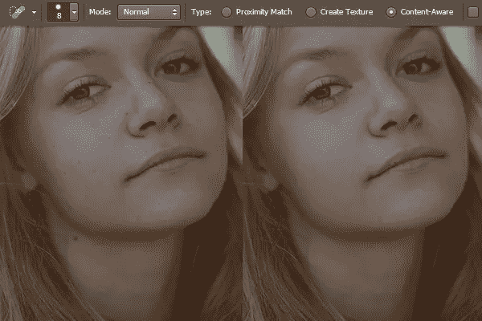](https://www.sitepoint.com/wp-content/uploads/2013/04/23.jpg)

### 第三步

接下来，我们将平滑皮肤。复制“清晰”层。选择浓度为 5%的涂抹工具，用不同大小的圆形软刷沿着自然的面部曲线涂抹，如下图所示。将这个新图层标记为“模糊”。

[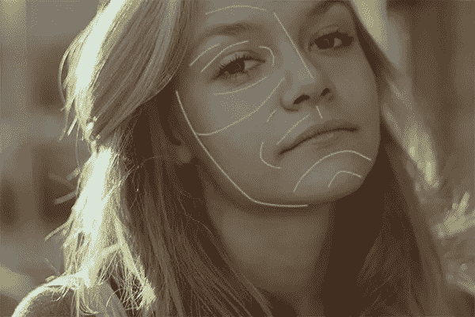](https://www.sitepoint.com/wp-content/uploads/2013/04/33.jpg)

如果你想显示皮肤的纹理，你可以调整涂抹层的不透明度到 50-80%。对于这个特殊的图像，我正在进行 100%的不透明度。

[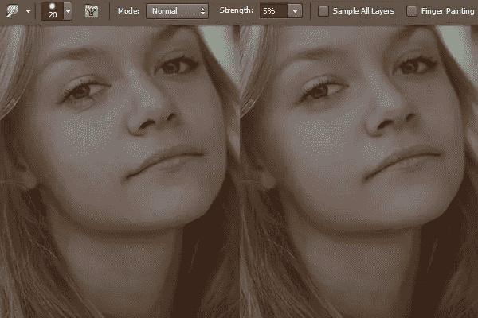](https://www.sitepoint.com/wp-content/uploads/2013/04/3b.jpg)

### 第四步

复制涂抹图层，贴上“发光边缘”的标签。现在，进入“滤镜”>“滤镜库”>“风格化”>“发光边缘”在此应用以下设置。

[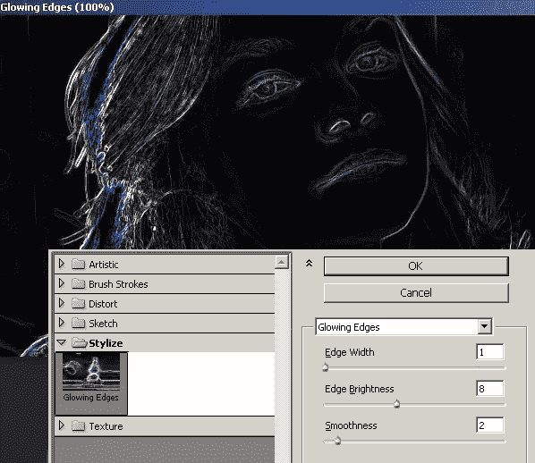](https://www.sitepoint.com/wp-content/uploads/2013/04/41.jpg)

改变混合模式为“线性减淡”，设置不透明度为 50%。

### 第五步

下一步，复制原来的涂抹层，并把它放在发光边缘层上面。现在，进入“滤镜”>“锐化”>“模糊蒙版”使用以下设置来锐化图像。

[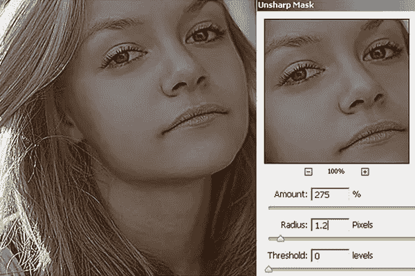](https://www.sitepoint.com/wp-content/uploads/2013/04/51.jpg)

### 第六步

接下来，我们将在皮肤上遮罩锐化效果，以保持皮肤光滑。要做到这一点，点击“添加图层蒙版”图标，这是在层面板的底部。现在，按“D”选择默认颜色，并使用油漆桶工具填充黑色的面具。用黑色填充蒙版会隐藏锐化效果。现在，选择一个合适大小的软圆刷，在你想要锐化的区域涂上白色。我已经在整个图像上应用了白色软笔刷，留下如下图所示的皮肤。如果你涂白色的时候出了问题，就用黑色覆盖那个区域来隐藏图层蒙版中的效果。

[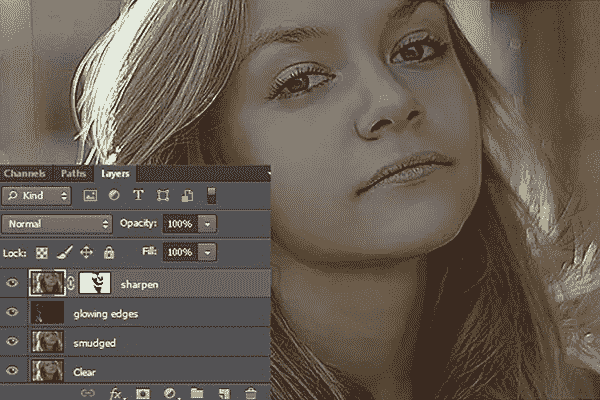](https://www.sitepoint.com/wp-content/uploads/2013/04/62.jpg)

### 第七步

要融合面部肤色，可以试试这个技巧。然而，这是可选的——如果你觉得你的图像的肤色已经适合你，你可以跳过这一步。在其他图层上新建一个图层，命名为“白色蒙版”。选择一个 50-60px 的软圆形笔刷，在这个新图层的表面涂上白色。稍微降低图层的不透明度，如下图所示。

[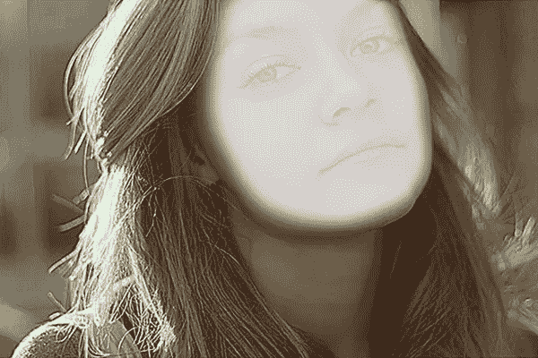](https://www.sitepoint.com/wp-content/uploads/2013/04/71.jpg) 
选择柔软的圆形橡皮擦工具，粗略擦除眼睛、眉毛、鼻孔、嘴唇等部位的白色蒙版。

### 第八步

现在，在白色蒙版上应用 5px 高斯模糊滤镜，将不透明度降低到 5-8%。这可能因图像而异。

[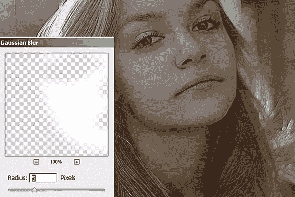](https://www.sitepoint.com/wp-content/uploads/2013/04/81.jpg)

### 第九步

为了改善脸部的阴影和光照，我们将使用加深和减淡工具。创建一个新层，进入“编辑”>“填充”——使用“50%灰色”。将这一层标记为“阴影”，并改变其混合模式为“柔光”。现在，我们将使用加深工具来加深图像的阴影部分，使用减淡工具来加深高光部分。你需要使用不同大小的刷子来完成这项工作。然而，使用低设置(中间色调)的烧伤和减淡工具和曝光-5-10%之间。

下面是我如何使用这些工具，首先在普通混合模式下展示给你，这样你就知道我在哪里烧了和减淡了图像。

[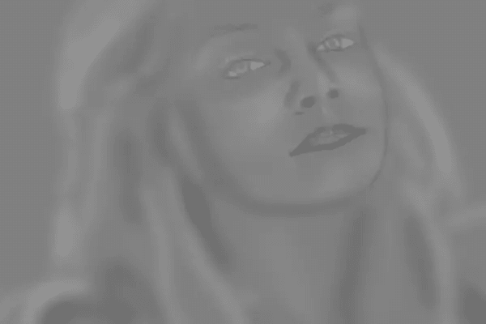](https://www.sitepoint.com/wp-content/uploads/2013/04/91.jpg)

然后，将其混合模式改为“柔光”后。

### 第十步

接下来，点击图标“创建新的填充或调整层”，选择“曲线”。在此应用以下设置。

[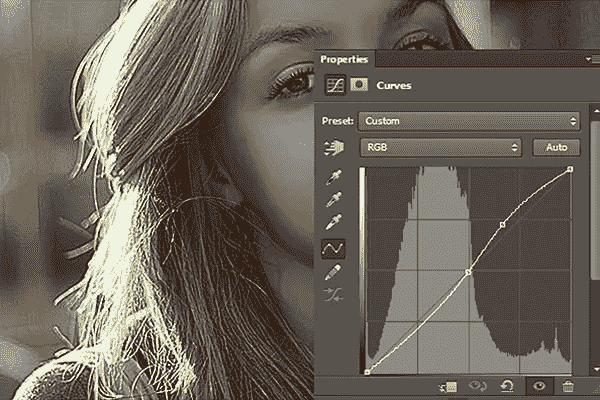](https://www.sitepoint.com/wp-content/uploads/2013/04/101.jpg)

### 步骤 11

现在，使用油漆桶工具用黑色填充曲线蒙版来隐藏效果，然后在想要增加对比度的区域涂上白色。

[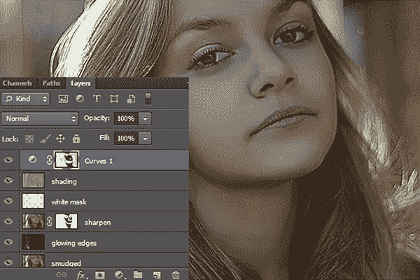](https://www.sitepoint.com/wp-content/uploads/2013/04/111.jpg)

### 步骤 12

创建一个“色彩平衡”调整层。对中间色调、阴影和高光应用以下设置。

[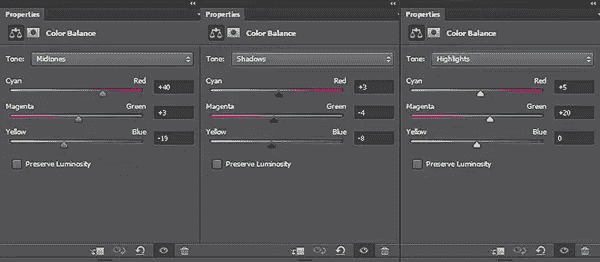 ](https://www.sitepoint.com/wp-content/uploads/2013/04/121.jpg) 

### 第十三步

接下来，创建一个“曝光”调整层，并应用以下设置。

[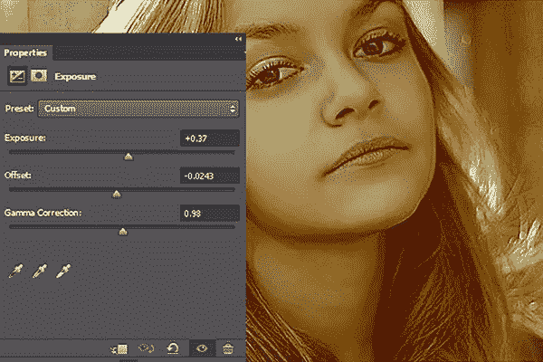](https://www.sitepoint.com/wp-content/uploads/2013/04/131.jpg)

### 步骤 14

为了使图像更亮，用下面的设置创建一个“亮度/对比度”调整层。

### 第十五步

复制涂抹的图层，把它放在其他图层上面，标上“高通”。现在，进入“过滤器”>“其他”>“高通”。使用 1.5 像素的半径。将这一层的混合模式改为“线性光”。通过添加一个遮罩来隐藏皮肤上的效果，就像我们在步骤 11 中对曲线所做的那样。

[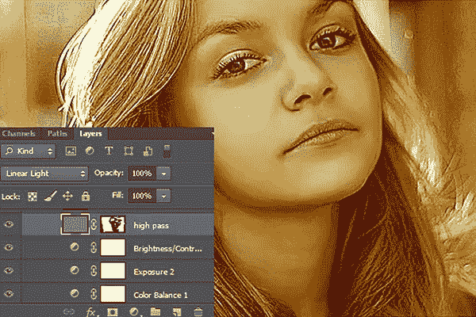](https://www.sitepoint.com/wp-content/uploads/2013/04/151.jpg)

### 第十六步

最后，创建一个“色调/饱和度”调整层，增加图像的饱和度。

[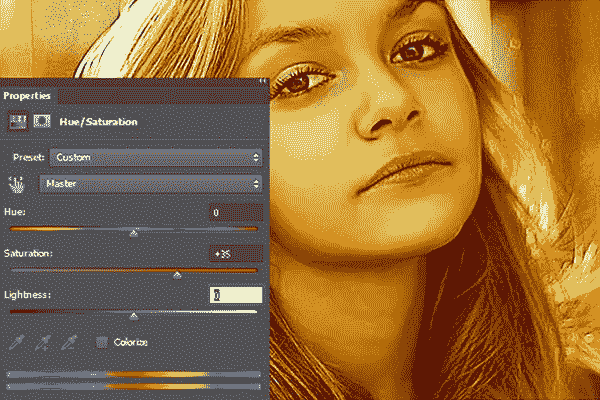](https://www.sitepoint.com/wp-content/uploads/2013/04/162.jpg)

**原始图像:**

**修图:**

就是这样！我希望你喜欢这个教程，并学到一些有用的东西。我很想看到你的结果。

## 分享这篇文章