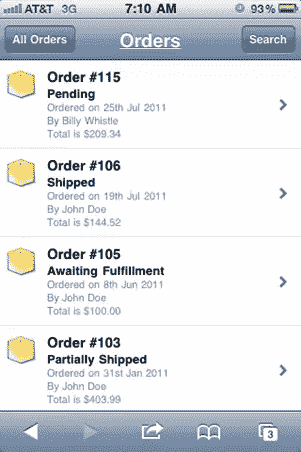
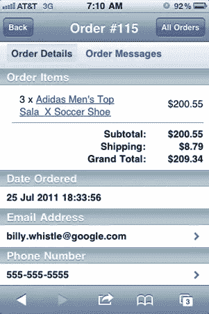
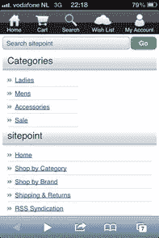

# Android 到 Windows:十大 Windows 应用商店认证技巧

> 原文：<https://www.sitepoint.com/android-to-windows-8-top-10-windows-store-certification-tips/>

作为一名在 Google Play 中发布应用程序的 Android 开发人员，您只需发布该应用程序，它就会实时出现。然而，在 Windows Store(和苹果的 App Store)中，有一个认证过程，在发布之前，你的应用程序要经过测试和人工审查。

所以，你可能想知道是否有任何通过 Windows 商店认证的提示和技巧。以下是帮助你通过认证的 10 大技巧。

**1。跑吧。**

Windows 应用程序认证工具包(WACK)是一个非常棒的工具。也许你以前开发过应用程序商店，遇到了真正有趣的循环:提交你的应用程序，等待，收到失败通知，修复你的错误，重新提交你的应用程序，等待，收到失败通知，修复你的错误，重新提交你的应用程序，等待…然后重复。

WACK 缩短了这个周期，它让你可以在把应用程序提交到 Windows 商店之前，在本地对其进行问题筛选。从本质上讲，WACK 是一系列自动化测试(也在认证过程中运行)。在本地运行它们，您可以在将应用提交到 Windows 应用商店之前找到并修复错误。

当你安装[Visual Studio Express 2012 for Windows 8](http://aka.ms/JenVS2012)(可以在这里免费下载[，页面下方蓝色部分)时，这个 WACK 就被安装了。当你安装 Visual Studio 时，你也应该在你的开始菜单中得到一个 WACK 的磁贴(见下图)。最后，这里有一些如何使用 WACK 的](http://aka.ms/JenVS2012)[文档](http://msdn.microsoft.com/en-us/library/windows/apps/8AA27AB1-2743-42A2-923B-74FABE8DEB34.aspx)。

**2。在 ARM 上测试。**

特别是对于性能要求，它有助于在运行 ARM 处理器和/或低端机器的设备上进行测试。一般来说，在几台不同的机器上进行测试是一个好主意。

另请注意，您的应用必须在其支持的所有处理器类型上提供相同的用户体验(这是[认证要求 3.2](http://msdn.microsoft.com/en-us/library/windows/apps/hh694083.aspx#acr_3_2) )。如果您的应用程序在不同的处理器类型上运行时具有不同的用户界面或功能，您必须为每种处理器类型提交一个单独的应用程序，并在每个应用程序的“描述”部分描述其差异。

最后，您可能想知道“如何在 ARM 上测试？”因为 Visual Studio 不能在 ARM 设备上运行。您可以通过远程调试来实现这一点。Tim Heuer 写了一篇关于如何在 ARM 设备上启用远程调试的精彩文章。

**3。阅读文档。**

我知道这一部分并不有趣，但是花些时间通读所有的认证要求会帮助你避免错误。这里是 Windows 8 认证要求的完整列表。还有关于[避免常见认证失败](http://msdn.microsoft.com/en-us/library/windows/apps/jj657968.aspx)和[解决认证错误](http://msdn.microsoft.com/en-us/library/windows/apps/hh921583.aspx)的指导。

最后，这里是针对开发者的[应用开发者协议](http://msdn.microsoft.com/en-us/library/windows/apps/hh694058.aspx)和针对下载你的应用的用户的 [Windows Store 使用条款](http://windows.microsoft.com/en-us/windows/store-terms-of-use)。

我还在下面的参考资料部分列出了一些额外的文档。

**4。创建一个准确和引人注目的应用程序列表页面。**

当你将应用提交到 Windows 应用商店时，你将被要求填写关于你的应用的各种元数据:描述、年龄分级等。慢慢来，做好申请信息的填写工作。(如果你已经花时间写了一个很棒的应用程序，不要急着看完这一部分！)在[为商店准备你的应用](http://msdn.microsoft.com/en-us/library/windows/apps/hh694079.aspx "http://msdn.microsoft.com/en-us/library/windows/apps/hh694079.aspx")中有很多关于这方面的很好的指导(营销从来不是我的强项，所以我觉得这真的很有用)。以下是创建优秀应用列表页面的一些具体技巧:

*   尽可能详细地描述你的申请。有关于[创建一个伟大的应用列表](http://msdn.microsoft.com/en-us/library/windows/apps/jj657970.aspx)的指导，这是真正有帮助的。
*   不要用你的刊登页来宣传你的公司或产品。[认证要求 2.3](http://msdn.microsoft.com/en-us/library/windows/apps/hh694083.aspx#acr_2_3) 禁止在应用描述中出现广告，所以要当心试图在你的描述中混入广告的出现。
*   大多数应用程序应该有 12+的评级。如果你在为你的应用程序选择两个[年龄等级](http://msdn.microsoft.com/en-us/library/windows/apps/jj657970.aspx#picking)时有困难，选择较高的一个。请记住，应用程序永远不会因为评级过高而未能通过认证。(更多信息见[认证要求 6.2](http://msdn.microsoft.com/en-us/library/windows/apps/hh694083.aspx#acr_6_2) 。)
*   不要[声明你的应用程序是可访问的](http://msdn.microsoft.com/en-us/library/windows/apps/hh694072.aspx)，除非你专门为可访问性场景设计和测试它。
*   确保你告诉测试人员他/她需要知道的一切。当你提交申请时，有一个“测试人员注意事项”部分，你应该利用这个机制与审查你的应用程序认证的人“交谈”。除了你应该提供的显而易见的项目(比如如果你的应用需要登录的话，演示账户的用户名/密码)，你可以解释你的开发选择，以及如果你觉得有什么可能被误解，它们如何符合认证要求。

**5。使用 Windows 应用商店模拟器测试对 Windows 应用商店的调用。**

您的应用程序可以从[窗口使用 Windows 应用商店商业应用编程接口。ApplicationModel.Store](http://msdn.microsoft.com/en-us/library/windows/apps/windows.applicationmodel.store.aspx) 名称空间，用于试用功能或应用内购买等功能。如果你使用这些:首先，测试你的 app，验证它处理典型的异常；你可以通过 [CurrentAppSimulator](http://msdn.microsoft.com/en-us/library/windows/apps/windows.applicationmodel.store.currentappsimulator.aspx) 类使用 Windows 商店模拟器来实现。然后，确保你在提交之前更改你的应用程序以与真实商店而不是模拟器对话(你的应用程序应该使用 [CurrentApp](http://msdn.microsoft.com/en-us/library/windows/apps/windows.applicationmodel.store.currentapp.aspx) 类，而不是 [CurrentAppSimulator](http://msdn.microsoft.com/en-us/library/windows/apps/windows.applicationmodel.store.currentappsimulator.aspx) 类，后者仅用于测试目的)。最后，确保你的应用在没有网络连接的情况下不会崩溃。

**6。使用 Visual Studio 模拟器测试触摸以及不同的屏幕大小、分辨率和方向。**

认证测试人员(当然，还有您的最终用户)使用的机器可能与您的开发环境完全不同。Visual Studio 模拟器允许您在各种条件下测试应用程序的行为。

在带有绿色播放按钮的运行下拉菜单中，选择“模拟器”(目前可能设置为“本地机器”)。然后点击按钮启动模拟器。

模拟器启动时，您会在右侧看到一个按钮菜单。

在最小化按钮下面，按钮是(按从上到下的顺序):

*   Pin 按钮–使模拟器始终保持在顶部
*   箭头按钮–切换到鼠标模式
*   手动按钮–切换到触摸模式
*   缩放按钮–切换到挤压/缩放触摸模式(以便您可以模拟此手势)
*   旋转按钮–切换到旋转触摸模式(这样你就可以模拟这个手势)
*   顺时针旋转按钮–将显示屏顺时针旋转 90 度(模拟纵向/横向方向变化)
*   逆时针旋转按钮–将显示屏逆时针旋转 90 度
*   监视器按钮–改变分辨率
*   球形按钮–设置位置
*   相机按钮–复制屏幕截图
*   选项按钮–更改屏幕截图设置
*   问题按钮–链接到[模拟器帮助](http://msdn.microsoft.com/library/windows/apps/hh441475.aspx)

使用 Visual Studio simulator 可以测试应用程序在多台计算机上的运行情况。如果您没有触摸机器，您可以模拟触摸；如果您使用基于位置的服务，可以模拟石板/平板电脑的方向变化、不同的屏幕尺寸/分辨率和不同的位置。

**7。确保你的应用程序功能齐全，不会被认为是未完成的。**

这又回到了[认证要求 1.2](http://msdn.microsoft.com/en-us/library/windows/apps/hh694083.aspx#acr_1_2) ，要求应用程序必须功能齐全。这一类别中的许多因素都可能导致认证失败:

*   Windows 应用商店中对你的应用列表页面的描述不准确或过于模糊。
*   任何不完整的部分、未实现的按钮或菜单选项、到正在构建的网页的链接、应该包含数据的空白页面、使用诸如“即将推出”和“测试版”等语言。会给人一种 app 不完整的感觉。
*   功能损坏或缺失将触发此故障。
*   确保您为测试人员提供了足够的测试信息。例如，如果您的应用程序具有“登录”功能，请创建一个测试用户帐户，并在提交应用程序时在“测试人员注意事项”字段中提供用户名/密码。

有关更多信息，请参见这篇“ [1.2 版应用必须功能齐全](http://blogs.msdn.com/b/jennifer/archive/2012/11/13/common-windows-store-certification-errors-1-2-app-must-be-fully-functional.aspx)”的博文。

**8。测试性能。**

在低功耗电脑上，应用程序必须在 5 秒或更短时间内启动，并在 2 秒或更短时间内暂停。Windows 应用程序认证工具包会运行性能测试，因此您可以使用该数据来衡量您的应用程序的性能。如果您发现确实需要提高启动和挂起时的性能，这里有一些提示:

*   尽可能在本地打包(或缓存)内容，这样您就不必在发布时从网络上获取资源。
*   启动时只加载和执行您需要的内容。您可以在后台或在实际需要时异步加载其他数据并执行其他工作。
*   在挂起时保存数据时使用“脏位”,以便只保存已更改的数据。(如果数据没有改变，不要重新序列化你的应用程序的状态，创建一个布尔标志变量(或“脏位”)来表示你的数据已经被修改，只有当数据改变时才重新序列化。)
*   如果您使用 JavaScript 开发，请使用字节码缓存，这样每个 JS 文件都会创建一次字节码，而不是每次应用程序启动时都创建。要实现这一点，请确保所有 JavaScript 文件都是使用字节顺序标记(BOM)进行 UTF8 编码的，并且在 HTML 起始页的根目录中被静态引用。

有关更多详细信息，请参见这篇“ [3.8 应用必须满足基本性能标准](http://blogs.msdn.com/b/jennifer/archive/2012/11/14/common-windows-store-certification-errors-3-8-app-must-meet-the-basic-performance-criteria-on-a-low-power-computer.aspx)”的博文。

**9。如果您的应用程序连接到互联网(或者如果您检查了互联网功能)，请提供隐私策略。**

这是 Windows 应用商店提交失败的一个非常常见的原因。默认情况下，Visual Studio 模板中启用了“Internet (Client)”功能，因此默认情况下，如果您没有更改清单，则必须提供隐私策略。这些功能位于 Package.appxmanifest 文件中的“功能”选项卡下:

如果您不使用互联网，取消选中此功能，您就不必提供隐私政策。如果您正在使用互联网，您需要创建一个隐私策略，解释通过互联网发送的数据/您使用它做什么，在线发布隐私策略，在您的应用程序设置中链接到它(通过 Settings charm 访问)，并在提交到 Windows 应用商店时提供链接。如果您收集个人信息，用户必须选择加入并同意分享这些信息。

有关更多详细信息，请参见这篇“ [4.1 应用程序必须符合隐私要求](http://blogs.msdn.com/b/jennifer/archive/2012/11/15/common-windows-store-certification-errors-4-1-your-app-must-comply-with-privacy-requirements.aspx)”的博文。

10。针对您的应用程序支持的所有语言对其进行适当的本地化。

以下是一些可能导致[本地化认证要求](http://msdn.microsoft.com/en-us/library/windows/apps/hh694083.aspx#acr_6_5)失败的常见“陷阱”:

*   提交过程中在描述页面上提供的应用程序元数据(如描述、功能、关键字或屏幕截图)缺失或与应用程序中定义的语言不匹配。例如，您可能不小心为中文版的应用程序提供了英文描述。
*   别忘了提供本地化的屏幕截图！这一次绊倒了很多人。
*   应用程序必须支持[种认证语言](http://msdn.microsoft.com/en-us/library/windows/apps/jj657969.aspx)中的一种。这是语言的子集，我们有测试人员来确认您的应用程序符合认证要求。
*   确保该应用程序对于您声称的所有语言都是有效和完整的。如果任何声称的语言支持是不完整的，这个要求将失败。

更多信息(包括支持语言和市场的区别，以及如何恰当地实现对不同语言的支持)，请看这篇“ [6.5 App 必须本地化](http://blogs.msdn.com/b/jennifer/archive/2012/11/16/common-windows-store-certification-errors-6-5-app-must-be-localized.aspx)”的博文。

希望这些建议有用！如果你想了解开发 Windows 8 应用程序的更多信息，请注册 [AppBuilder](http://aka.ms/AppBuilderCR) 计划，获得 30 天的指导。2013 年 6 月 30 日前在 Windows Store 发布应用还可获得 100 美元/app；详见[保管现金](http://aka.ms/CashForApps)。

#### **认证资源**

[Windows 8 应用认证要求](http://msdn.microsoft.com/en-US/library/windows/apps/hh694083)–这是认证要求的完整列表。如果你的应用没有通过认证，它会特别引用这些要求中的一个作为失败的原因。

[避免常见的认证失败](http://msdn.microsoft.com/en-us/library/windows/apps/jj657968.aspx)–本文列出了认证失败的一些主要原因。

[解决认证错误](http://msdn.microsoft.com/en-us/library/windows/apps/hh921583.aspx)–本文将详细介绍每项要求，并列出针对该特定要求的其他资源和/或常见问题。

[开发人员对 Windows 应用商店应用的支持](http://msdn.microsoft.com/en-us/windows/apps/hh690938)–有多种支持选项可供选择，包括电话、电子邮件和实时聊天。你也可以免费使用[论坛](http://social.msdn.microsoft.com/Forums/en-US/category/windowsapps)。

[构建 2012 会议，主题为“Windows 应用商店:如何运作？”](http://channel9.msdn.com/Events/Build/2012/2-120)–这是一个来自 BUILD 2012 的关于提交到 Windows 商店的精彩视频。[幻灯片](http://video.ch9.ms/sessions/build/2012/2-120.pptx)也可以下载。

我的“常见 Windows 应用商店认证失败”系列中的博文:

> [一般提示&窍门和资源](http://blogs.msdn.com/b/jennifer/archive/2012/11/12/common-certification-errors-when-submitting-to-the-windows-store.aspx)
> 
> [1.2 应用程序必须功能齐全](http://blogs.msdn.com/b/jennifer/archive/2012/11/13/common-windows-store-certification-errors-1-2-app-must-be-fully-functional.aspx)
> 
> [3.8 App 必须满足基本性能标准](http://blogs.msdn.com/b/jennifer/archive/2012/11/14/common-windows-store-certification-errors-3-8-app-must-meet-the-basic-performance-criteria-on-a-low-power-computer.aspx)
> 
> [4.1 应用程序必须符合隐私要求](http://blogs.msdn.com/b/jennifer/archive/2012/11/15/common-windows-store-certification-errors-4-1-your-app-must-comply-with-privacy-requirements.aspx)
> 
> [6.5 App 必须本地化](http://blogs.msdn.com/b/jennifer/archive/2012/11/16/common-windows-store-certification-errors-6-5-app-must-be-localized.aspx)

Windows 应用商店博客:[快速获得应用认证的 5 个技巧](http://blogs.msdn.com/b/windowsstore/archive/2012/11/19/5-tips-to-getting-your-apps-certified-quickly.aspx)

*本文最初发表于[http://blogs . msdn . com/b/Jennifer/archive/2013/04/23/Android-to-windows-8-top-10-tips-for-passing-windows-store-certification . aspx](http://blogs.msdn.com/b/jennifer/archive/2013/04/23/android-to-windows-8-top-10-tips-for-passing-windows-store-certification.aspx)，经允许在此转载。*

## 分享这篇文章