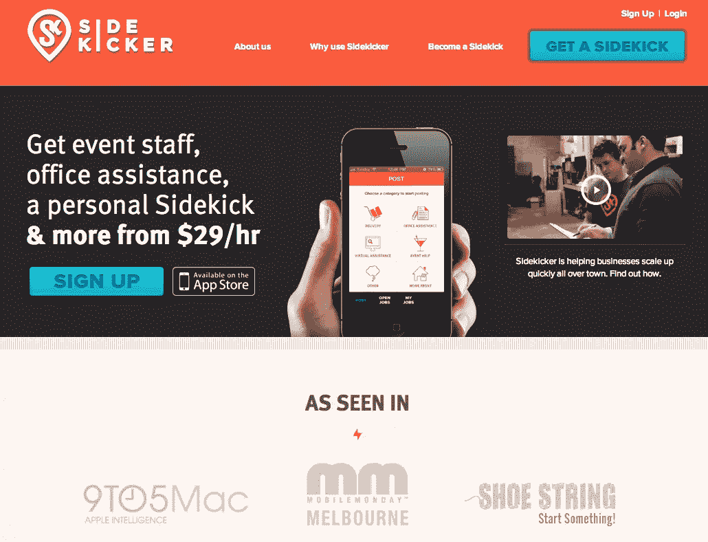

# 如何利用 Block 中的特色来打动合适的人

> 原文：<https://www.sitepoint.com/how-to-use-an-as-featured-in-block-to-impress-the-right-people/>

你需要在你的主页上的块中看到一个[吗？在](http://www.sidekicker.com.au/)上看到的[怎么样？](https://flippa.com/)中的[？](http://99designs.com/)

block 中的特色是许多创业公司主页或页脚中非常受欢迎的元素。但是如果你没有盲目地追随网络趋势，你可能会想知道这到底是怎么回事。

## 谁在乎呢。

为什么要在你的页面上添加一个功能模块？

为了客户？我想知道。在我上面链接的服务中，有多少用户会在意他们在*福布斯*中被提及？普通人——一些不是超级技术专家或商业专家的人——可能会因为在你的主页上看到*福布斯*的标志而有点害怕，但对他们来说，这可能不会意味着更多。

更有可能的是，“in Featured”区块可能会影响二级或三级受众，比如潜在合作伙伴和员工、媒体以及潜在投资者。如果你想让这些受众留下深刻印象，或许值得考虑加入“精选”板块。

## 不算“社会证明”吗？

社交证明涉及点对点推荐。想想你典型的客户评价。我可能不认识博伊西的贝蒂，但如果她听起来像一个正常人，并且你的服务为她解决了我遇到的同类问题，我可能会考虑她的意见——即使有所保留。

一个专栏更多的是一种行业证明——只有当你引用的出版物为你的读者所熟悉和尊重时，它才会起作用。由于这个原因，并且用户不是傻瓜，他们知道在这个内容营销疯狂的令人兴奋的环境中，行业推荐很容易被买到，行业推荐可能不如用户的同行、联系人或朋友的个人推荐有价值。

但是，你可能会问，block 里的 Featured 不就说明你的品牌有权威吗？

嗯，是的……也不是。block 中的特写并不少见——环顾网络，似乎这些天每个人都出现在了 *TechCrunch* 、 *Mashable* 等等。

列出提到你的服务的出版物可能会让你在用户眼中从最普通的网站中脱颖而出，但这可能不会让你从竞争对手中脱颖而出。希望你的网站设计、文案、产品或服务的质量能让你的服务与众不同。

## 里面有什么？

如果你要在你的页面上有一个特色板块，确定你要放谁的 logos 是很重要的。

我可能会在我卑微的博客《读者群:三个人加上我的猫》中提到你的服务，而且是用热情洋溢的语言。但是你不会把它放在你的主页上，是吗？

同样，对你列出的大品牌有所选择也很重要。为什么？因为把别人的商标放在你的主页上，你就把你的品牌和他们的联系在了一起。一些出版物的徽标可能会让用户失去兴趣，尤其是当他们非常不喜欢所讨论的出版物时。

但是在你的页面上列出某些出版物还有其他更微妙的副作用。看看下面的[侧踢球者主页](http://www.sidekicker.com.au/)。

这是在我的显示器上出现在折叠上方的内容。这个应用在 iPhone 上的描述告诉我这是一个 iPhone 应用。然后，Side Kicker 将 *9to5 Mac* 列为其 As seen in block 的第一项，接下来是 *Mobile Melbourne* 。

这些出版物我都不认识，但我能大致猜出它们是关于什么的。*鞋串*？我不知道。由于标识没有链接，我可能永远也不会。

那么，我是否应该认为我需要 iPhone 应用程序才能使用这项服务——它不是为像我这样的 Android 用户准备的？是不是说我那无聊的旧电脑上没有可以访问的网络界面？这些问题在主页或 FAQ 中没有答案，但是主页的第一个视图可能会鼓励用户认为答案是否定的。(答案是肯定的。)

作为一个客户，虽然，我不认为在这个页面上的功能块增加了多少价值。对我来说，一些证明或好处的描述会更有价值。

## 其他选项

因此，让我们想象一下，我们一致认为《block》中的特写最适用于潜在合作伙伴、员工、媒体和投资者，*而非*客户(尽管我有一种感觉，你可能不同意——并期待在评论中听到你的想法)。

如果你想把整个主页都献给目标客户*会发生什么？*

 *好吧，不要把功能块放到你的页脚，以为工作已经完成了，考虑一些其他的选择:

*   把它放在你的“关于”、“工作”和/或“新闻”页面上
*   将它添加到媒体发布的页脚
*   将其添加到员工电子邮件签名中
*   将其添加到以行业为中心的演示文稿、宣传材料等中。

这样做还有另外一个好处。在我上面提到的网站中，只有 99 个设计实际上从媒体标志链接到了提及该业务的文章。

我猜这是因为大多数使用特色功能的企业不希望客户在销售的关键时刻从登录页面跳到《华尔街日报》,永远不再回来。没有链接，因为链接会导致销售漏斗出现漏洞。对于那些真正想知道《T2 华尔街日报》对你的服务有什么评价的人来说，这只是运气不好。

然而，如果你把特色放在我上面提到的网站的其他地方，或者其他地方，在很多情况下，你可以把标志链接到实际提及的地方。这样，他们不会分散你的客户的注意力，但他们会给其他二级受众提供有价值的背景信息，这些信息与他们以及他们与你的品牌的关系有关。

你的网站上有特色板块吗？为什么，针对哪些用户？我很想听听你是如何在评论中使用这个内容元素的。* 

## *分享这篇文章*