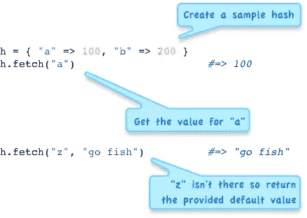
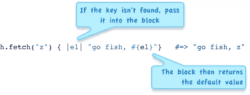
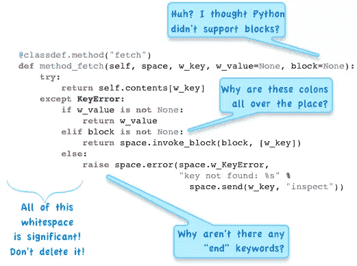
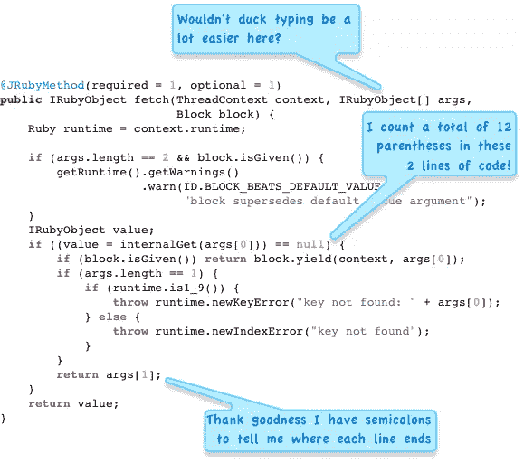

# Ruby、Python、Java、C 和程序员快乐

> 原文：<https://www.sitepoint.com/ruby-python-java-c-and-programmer-happiness/>

> “Ruby 的设计是为了让程序员开心。”–松本幸弘“Matz”

不是每个人都同意，但是作为一个 Rubyist，我认为 Matz 实现了他的设计目标。Ruby 的语法有一种无形的东西，让它变得有趣、有益且易于使用——这让我很开心。我认为，通过观察不同的开源开发者如何在每种语言中实现相同的方法或功能，将 Ruby 与其他一些语言进行比较会很有趣。这些语言有什么不同？他们让你同样快乐吗？

还有什么比 Ruby 本身更好的例子呢！今天我要看看 Ruby 的 Hash#fetch 方法是如何在 Ruby(Rubin ius)、Python(Topaz)、Java(JRuby)以及最后在 C(标准 Ruby 2.0)中实现的。当然，还有很多其他的编程语言，甚至是其他版本的 Ruby，但是看一下 Ruby 内部的一小部分就给我们提供了一个有趣的例子，并允许我们进行比较。

## 哈希#获取

对于那些不熟悉 Ruby 或者不熟悉 Hash#fetch 方法的人，让我们先回顾一下 Hash#fetch 是做什么的。Fetch 允许您使用键从散列中查找值，就像[]方法一样。此外，fetch 还允许您指定 Ruby 在找不到所请求的键时应该返回的默认值。下面是 Ruby 文档中的例子:

同样，如果你提供了一个块，Ruby 会调用它来得到一个返回值，如果它找不到请求的键的话:

## Rubinius 中的散列#fetch

让我们从 Rubinius 如何实现 Hash#fetch 开始我们的调查。因为 Rubinius 使用 Ruby 来实现它的内核，所以阅读 Rubinius 源代码是准确理解一个给定的 Ruby 方法做什么的好方法。

下面是 Rubinius 对来自 kernel/common/hash19.rb 的 Hash#fetch 的实现:

正如你在这里看到的，Ruby 的语法有很多值得批评的地方。当然，这并不是世界上最优雅的 Ruby 代码示例。

但是我喜欢。这让我很开心。为什么？因为理解这段代码做什么很简单。Ruby 语言不会妨碍代码的含义，也不会妨碍代码试图达到的目的。

阅读 Ruby 几乎就像阅读伪代码——你知道，就是那种你写在白板上试图解释一些想法或算法的代码。为什么要用伪代码？因为你没有时间在语言语法上做文章。你只是想表达你的观点。对我来说，写 Ruby 就像写伪代码一样。

## Topaz 中的散列#fetch

今年 Ruby 社区中最激动人心的事件之一是 Alex Gaynor 已经使用 Python 和 PyPy 工具包实现了 Ruby。PyPy 允许 Python 开发人员使用 Python 的子集“RPython”为他们自己的语言实现编译器和虚拟机。PyPy 使用一系列复杂的优化将开发人员的定制 VM 转换成 C，然后将 C 编译成快速的本机语言。

让我们看看同样的代码在 Python 中是怎样的:

对我来说，Python 真的像是 Ruby 的姐妹语言。除了在空格、冒号和结束关键字上的一些细微差别，这两种语言非常相似。

两者之间的一个重要区别是 Python 不像 Ruby 支持块那样优雅地支持闭包。这里的 block 参数和 invoke_block 调用是 Topaz 的 Ruby 块实现的一部分。

阅读这段代码就像阅读 Rubinius 实现一样简单。这里的任何额外代码或冗长都是由于 Topaz 内部工作方式的细节。我想如果我花一些时间学习使用 Python 语言，我会变得很开心——至少如果我的编辑器正确处理了空格！

## JRuby 中的散列#fetch

当您将 Ruby 和 Python 中的任何一个与 Java 进行比较时，它们之间的相似性会变得更加明显。为了理解我的意思，请看一下 Hash#fetch 的 JRuby 实现:

同样的代码在 Java 中比在 Python 或 Ruby 中要冗长一些。试图阅读和理解这段代码比以前需要更多的努力。首先你要训练你的眼睛不要去看分号、括号或大括号。

更重要的是，Java 的工作方式开始妨碍算法。最明显的例子是使用接口 IRubyObject 来处理方法的参数和返回值。因为 Java 是一种静态类型的语言，所以你必须考虑每个对象究竟是什么类型的值。

取决于您如何看待它们，Java 接口要么是这个问题的一个笨拙的解决方法，要么是确保每个对象都提供您所需要的 API 的一个优雅的方法，允许 Java 编译器给您有用的错误消息。但对我来说，它们是不必要的打字和思考。我开始忘记我想要达到的目标，更担心 Java 编译器是如何工作的。Java 编译器应该让我开心，而不是相反！

## C #中的散列#fetch

现在我们来看看 Hash#fetch 的正式版。这是运行 Ruby 2.0 时 Ruby 程序实际使用的 C 代码:

现在冗长的程度跳得更高了。在 C 语言中，我们不仅拥有与 Java 中相同的静态类型，而且现在我不得不担心指针、内存管理和使用“volatile”等关键字的硬件优化

如果你熟悉 Ruby 源代码的惯用风格，比如“RHASH”、“st_lookup”和“rb_scan_args”，那么理解起来并不难。但是这里仍然有非常混乱的细节，比如使用 rb_protect 来处理在生成“key not found”错误消息时可能出现的异常。

像这样写 C 代码，我必须完全清楚每一段数据是如何被我的计算机硬件表示的。它使用了多少字节？这个 API 需要一个值还是一个指针？我需要释放这个指针引用的内存吗？

## 不公平的比较

当然，所有这些语言都非常不同，用于不同的目的。c 语言实际上是汇编语言的简写，如果使用得当，它会给你带来极大的控制力、灵活性和速度。Java 允许您编写优雅、干净、面向对象的代码，而不用担心硬件细节或可移植性问题。而且它在 JVM 上仍然运行得相当快。事实上，JRuby 是目前最快的 Ruby 版本之一，在某些情况下比 MRI Ruby 还要快。

我将这些语言相互比较的原因是为了提醒您编写 Ruby 是多么的快乐。不要想当然！Matz 和 Ruby core 团队在过去的 20 年里做了大量的工作，给你带来了程序员的快乐。

为什么其他有才华的开源开发者如此努力地使用不同的语言，如 Java、Python 或 Ruby 本身来重新实现 Ruby 呢？因为他们也喜欢 Ruby。他们希望将这种快乐带到自己的平台或技术中。

## 分享这篇文章