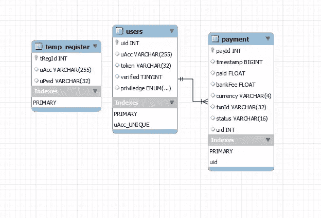
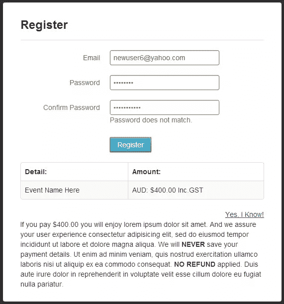
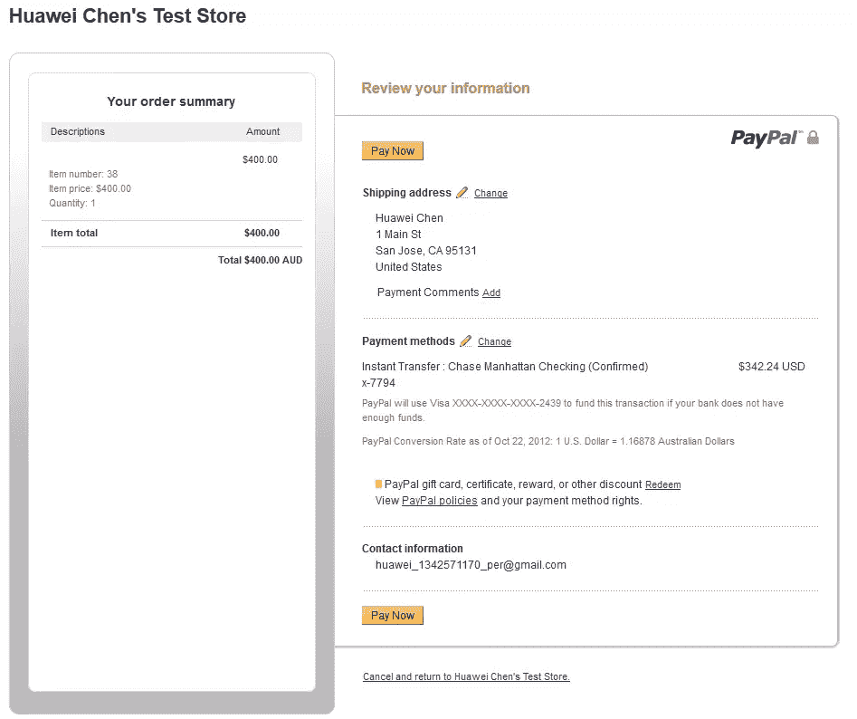
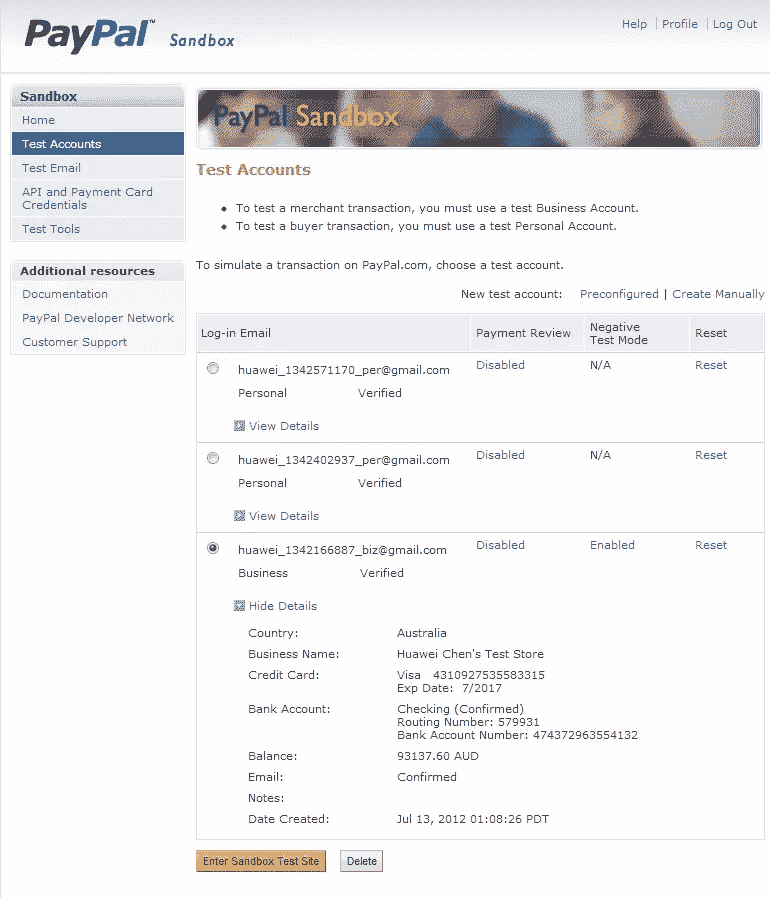
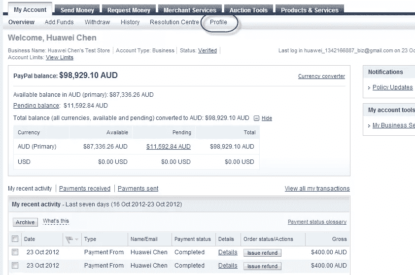
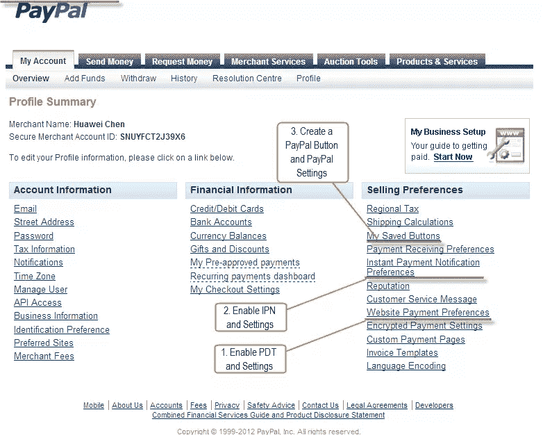
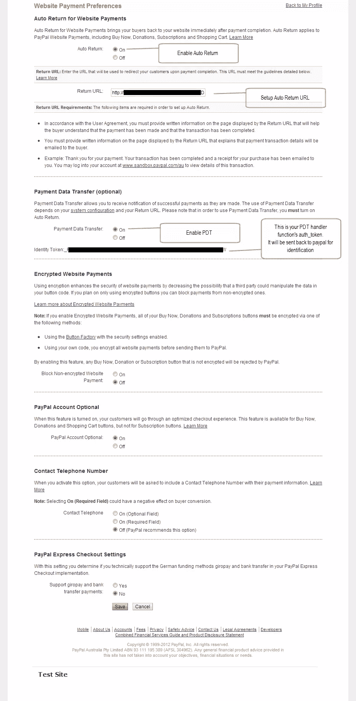
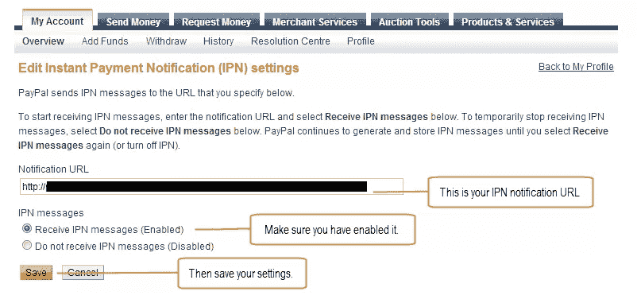
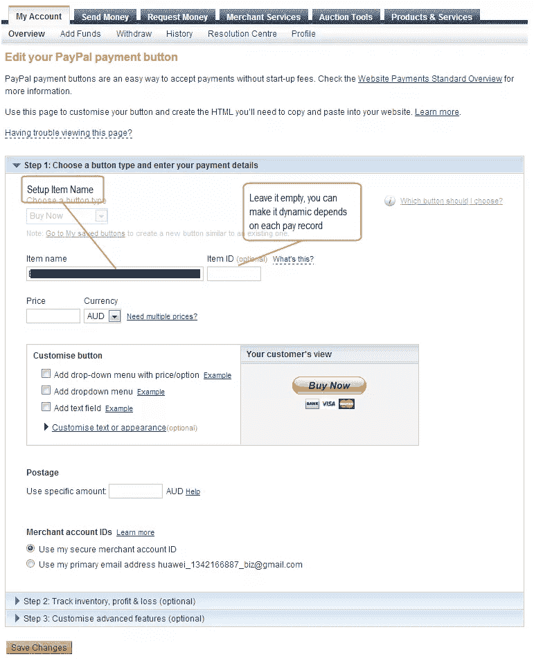

# 注册贝宝教程(2/3):一个真正的贝宝项目注册

> 原文：<https://www.sitepoint.com/register-paypal-tutorial-3-2-real-register-paypal-project/>

解释 PayPal 的工作原理(IPN 和 PDT 流程)。 [第一章](http://www.jquery4u.com/tutorials/register-paypal-tutorial-3-1/)第三章

## 第二章

本章介绍了一个真实的项目:“注册与支付”，从开始到结束，为了更好地解释贝宝帐户设置和注册表单和数据库的集成。

### 项目场景

1.  首先，我们有一张登记表。
2.  正确完成表格后(通过所有验证)，用户点击“注册”按钮。
3.  然后重定向到贝宝，用户支付注册费。
4.  付款后，贝宝将重定向到结果页，10 秒钟自动重定向回我们的网站，然后贝宝 PDT 将处理付款记录。
5.  但是，用户可能会关闭浏览器，所以我们必须实施贝宝 IPN 的备份计划。

### 数据库结构

#### E-R 图:



1.  temp_register 表:临时存储用户账号和用户密码，等待付费。如果付费，元组将被删除，并移动到用户表。
2.  付款表:uid 是引用用户的外键，连接用户信息和付款信息。
3.  用户表:存储用户信息，令牌是确认电子邮件中的验证令牌。如果用户验证了他们的用户帐户，验证将被设置为 1。

#### 数据库架构:

```
CREATE TABLE IF NOT EXISTS `payment` (
`payId` int(11) NOT NULL AUTO_INCREMENT,
`timestamp` bigint(20) DEFAULT NULL,
`paid` float DEFAULT NULL COMMENT 'user paid amount returned by paypal',
`bankFee` float DEFAULT NULL,
`currency` varchar(4) DEFAULT NULL,
`txnId` varchar(32) DEFAULT NULL COMMENT 'Transaction ID: specify single unique transaction from paypal. if this field is NOT NULL, means this payment has been process already. So if IPN returns to PHP, we can refuse to update our database.',
`status` varchar(16) DEFAULT NULL,
`uid` int(11) DEFAULT NULL COMMENT 'FK to users PK',
PRIMARY KEY (`payId`),
KEY `uid` (`uid`)
) ENGINE=InnoDB DEFAULT CHARSET=latin1 AUTO_INCREMENT=1 ;
CREATE TABLE IF NOT EXISTS `temp_register` (
`tRegId` int(11) NOT NULL AUTO_INCREMENT,
`fullName` varchar(255) DEFAULT NULL,
`uAcc` varchar(255) DEFAULT NULL,
`uPwd` varchar(32) DEFAULT NULL,
PRIMARY KEY (`tRegId`)
) ENGINE=InnoDB DEFAULT CHARSET=latin1 COMMENT='prevent unpaid user take uAcc(UNIQUE) in our users table' AUTO_INCREMENT=1 ;
CREATE TABLE IF NOT EXISTS `users` (
`uid` int(11) NOT NULL AUTO_INCREMENT,
`fullName` varchar(255) DEFAULT NULL,
`uAcc` varchar(255) NOT NULL,
`uPwd` varchar(32) NOT NULL,
`token` varchar(32) DEFAULT NULL,
`verified` tinyint(1) NOT NULL DEFAULT '0',
`priviledge` enum('delegate','admin','developer') NOT NULL DEFAULT 'delegate',
PRIMARY KEY (`uid`)
) ENGINE=InnoDB DEFAULT CHARSET=latin1 AUTO_INCREMENT=1 ;
ALTER TABLE `payment`
ADD CONSTRAINT `payment_ibfk_1` FOREIGN KEY (`uid`) REFERENCES `users` (`uid`);
```

### 用户界面



### 项目工作流程

1.  填写表单，所有输入都将得到验证。
2.  点击注册按钮，重定向到贝宝。
3.  PayPal 沙盒“立即支付”:
    
4.  重定向 PayPal 结果页面。
5.  等待重定向(PDT 工程)显示成功/失败页面，或关闭浏览器(IPN 工程)。

### 设置 PayPal 沙箱

在我们开始编码之前，我们需要先设置贝宝沙盒帐户。

假设你已经注册了一个 PayPal 开发者账户，并在沙盒中创建了一个商业用户账户和一个买家账户。

然后选择商业帐户，并单击“进入沙盒测试站点”按钮。

您可以看到主面板弹出页面:



然后你可以看到所有信息和销售偏好设置。



因此，让我们依次设置所有三个选项。

#### 1.启用 PDT 和设置

设置您的 PDT 处理函数调用 URL。



#### 2.启用 IPN 和设置

设置您的 IPN 处理程序函数调用 URL。



#### 2.创建贝宝按钮和贝宝参数设置




保存更改后，您可以看到 PayPal 按钮的源代码:

```
 <form action="https://www.sandbox.paypal.com/cgi-bin/webscr" method="post"></form> 
```

很容易发现按钮实际上是一个表单，所以我们需要使用它的输入来发布数据。
当我们生成“注册”按钮时，重定向 URL 应该包含“& cmd=_s-xclick”和“&hosted _ button _ id = ha 9 dzbckxkcl 2”。
现在，PayPal 沙盒账户已经设置完毕。然后开始编写您的 PDT 和 IPN 处理程序。

### PDT 处理器功能

#### 源代码:

```
/**
* PAYPAL: PDT HANDLER:
* ====================
* called by PayPal, send tokens back
* get payment details and payment result
* @return $ret array contains result true/false, and user account or error message
*/
private function _PDT()
{
// some indexes can not be missing:
$ruler = array(
'tx', // token from paypal
);
if(count(array_diff($ruler, array_keys($_GET))))
{
return array('result' => false, 'error' => 'Index missing ... ', 'index' => $_GET, 'missing' => array_diff($ruler, array_keys($_GET)));
}
// read the post from PayPal system and add 'cmd'
$req = 'cmd=_notify-synch';
// get token and prepare request url (send back to paypal)
$tx_token = $_GET['tx'];$auth_token = "_PJaHiwRfwMmWzW-9nuPuSguYxC-1d9KpxaasaNANtIvyOcmqY6jXNkRmxW";
// $auth_token = "OxDenzKmrWPyEXU0YzIg2zs-VAe7ufCADyjbfxF_RpREL4rLEslZrSa21R4";

$req .= "&tx=$tx_token&at=$auth_token";

// post back to PayPal system to validate

$header = "POST /cgi-bin/webscr HTTP/1.0rn";

$header .= "Host: www.sandbox.paypal.comrn";
// $header .= "Host: www.paypal.comrn";

$header .= "Content-Type: application/x-www-form-urlencodedrn";
$header .= "Content-Length: " . strlen($req) . "rnrn";

$fp = fsockopen ('ssl://www.sandbox.paypal.com', 443, $errno, $errstr, 30); // open socket
// $fp = fsockopen ('ssl://www.paypal.com', 443, $errno, $errstr, 30); // open socket

if (!$fp)
{
// HTML FAIL
return array('result' => false, 'error' => 'HTTP error ... ');
}
else
{
fputs ($fp, $header . $req);
// read the body data
$res = '';
$headerdone = false;
while (!feof($fp))
{
$line = fgets ($fp, 1024);
if (strcmp($line, "rn") == 0)
{
$headerdone = true; // read the header
}
else if ($headerdone)
{
$res .= $line; // header has been read. now read the contents
}
}

// parse the data
$lines = explode("n", $res);
$keyarray = array();
if (strcmp ($lines[0], "SUCCESS") == 0)
{
for ($i=1; $i_validatePaypal($keyarray);
}
// log for manual investigation
else if (strcmp ($lines[0], "FAIL") == 0)
{
// skipped
return array('result' => false, 'error' => 'Transaction failed ... ');
}
}
fclose ($fp);
return $ret;
}
```

#### 解释:

PayPal 调用 PDTHandler()函数，然后这个处理函数调用 process _PDT()。如您所见，它从 URL ($_GET)接收 PayPal 提供的参数。所以我们通过 fsock ssl 将 token 和 tx 发送回 PayPal。然后贝宝将返回支付记录，和支付结果(成功/失败)。_PDT()将这些数据传递给 _validatePaypal()，后者将数据保存到数据库中。然后，根据返回进行页面重定向。

### IPN 处理函数

#### 源代码:

```
/**
* PAYPAL: IPN HANDLER:
* ====================
* called by PayPal, send POSTed payment data back (handshake)
* get payment result
* return: payment VERIFIED: array('result' => true/false, and other user details)
* payment INVALID: false // no further process (see handler in Register Module)
* TODO: return true if success, then send email to buyers
*/
private function _IPN()
{
// get IPN data
$postData = $_POST;// read the post from PayPal system and add 'cmd'
$req = 'cmd=' . urlencode('_notify-validate');
foreach ($postData as $key => $value) {
$value = urlencode(stripslashes($value));
$req .= "&$key=$value";
}

// CURL: copy from paypal sample code

$url= 'https://www.sandbox.paypal.com/cgi-bin/webscr';
// $url= 'https://www.paypal.com/cgi-bin/webscr';

$curl_result=$curl_err='';
$ch = curl_init();
curl_setopt($ch, CURLOPT_URL, $url);
curl_setopt($ch, CURLOPT_RETURNTRANSFER, 1);
curl_setopt($ch, CURLOPT_POST, 1);
curl_setopt($ch, CURLOPT_POSTFIELDS, $req);
curl_setopt($ch, CURLOPT_HTTPHEADER, array("Content-Type: application/x-www-form-urlencoded", "Content-Length: " . strlen($req)));

curl_setopt($ch, CURLOPT_HEADER , array('Host: www.sandbox.paypal.com'));
// curl_setopt($ch, CURLOPT_HEADER , array('Host: www.paypal.com'));

curl_setopt($ch, CURLOPT_VERBOSE, 1);
curl_setopt($ch, CURLOPT_SSL_VERIFYPEER, FALSE);
curl_setopt($ch, CURLOPT_TIMEOUT, 30);

$res = @curl_exec($ch);
$curl_err = curl_error($ch);
curl_close($ch);

$keyarray = $postData;

if (strcmp (substr($res, '-8'), "VERIFIED") == 0)
{
// validate paypal information
return $this->_validatePaypal($keyarray);
}
elseif (strcmp (substr($res, '-7'), "INVALID") == 0)
{
// log for manual investigation
return false;
}
// return $ret; // Do not need to return, because IPN runs in background
}
```

#### 解释:

PayPal 调用 IPNHandler()函数，然后这个处理函数调用 process _ IPN()。如您所见，它从请求($_POST)中接收 PayPal 提供的数据。因此，我们通过 cURL 将支付细节发送回 PayPal，这是握手过程。然后贝宝发回付款结果(验证/无效)。如果通过验证，_IPN()会将这些数据传递给 _validatePaypal()，后者会将数据保存到数据库中。

在 zip 文件中，包含模板、javascript 文件、css、bootstrap、jquery、debug 插件和 smarty 插件，以及所有核心 php 源代码。

[下载项目(344KB)](http://www.jquery4u.com/tutorials/register-paypal-tutorial-3-2-real-register-paypal-project/attachment/res_paypal/)

## 分享这篇文章