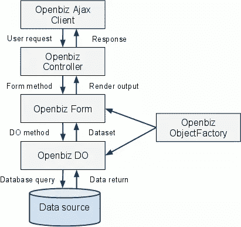

# Openbiz Cubi:健壮的 PHP 应用程序框架，第 2 部分

> 原文：<https://www.sitepoint.com/openbiz-cubi-a-robust-php-application-framework-2/>

在本系列的第一部分中，我们讨论了我们面临的开发挑战，以及 Openbiz Cubi 如何通过提供一个可靠的、随时可用的 web 应用程序框架来提供帮助。在这一部分中，我们将看到如何构建我们自己的模块，并更深入地了解框架的核心架构。

## 构建第一个模块

让我们进入激动人心的部分——创建一个模块；我们将从一个简单的客户编辑页面开始。在此页面上，用户可以创建、更新和删除客户。

首先让我们制作一个数据库表`customer`。创建该表的 SQL 是:

```
CREATE TABLE customer (
  id INTEGER NOT NULL AUTO_INCREMENT,
  name VARCHAR(64) NOT NULL,
  description VARCHAR(255) DEFAULT NULL,
  address VARCHAR(255) DEFAULT NULL,
  phone VARCHAR(20) DEFAULT NULL,
  fax VARCHAR(20) DEFAULT NULL,
  status INTEGER DEFAULT NULL,
  create_by INTEGER DEFAULT '1',
  create_time DATETIME DEFAULT NULL,
  update_by INTEGER DEFAULT '1',
  update_time DATETIME DEFAULT NULL,
  PRIMARY KEY (id)
)
ENGINE=InnoDB
```

创建模块的下一步是为客户编辑页面创建 XML 元数据文件。这里我们使用的是`cubi/bin/tools`目录下的元数据生成命令`gen_meta`。

```
/dev/cubi/bin/tools$ php gen_meta.php Default customer
```

您只需按 Enter 键即可完成向导。该命令执行后，将生成以下文件:

**模块配置文件**

*   `modules/customer/mod.xml`

**模块做文件**

*   `modules/customer/do/CustomerDO.xml`

**模块形式文件**

*   `modules/customer/form/CustomerListForm.xml`
*   `modules/customer/form/CustomerDetailForm.xml`
*   `modules/customer/form/CustomerEditForm.xml`
*   `modules/customer/form/CustomerNewForm.xml`
*   `modules/customer/form/CustomerCopyForm.xml`

**模块视图文件**

*   `modules/customer/view/CustomerListView.xml`

**模块 Widget 文件**

*   `modules/customer/widget/DashboardForm.xml`
*   `modules/customer/widget/LeftMenu.xml`

**模块模板文件**

*   `modules/customer/template/detail.tpl`
*   `modules/customer/template/detail_elementset.tpl`
*   `modules/customer/template/grid.tpl`
*   `modules/customer/template/view.tpl`

接下来，我们用`load_module`命令加载新创建的模块。

```
/dev/cubi/bin/tools/php$ load_module.php customer
Start loading customer module ...
--------------------------------------------------------
[2013-01-26T17:57:16+08:00] Loading module customer
[2013-01-26T17:57:16+08:00] Install Module customer
[2013-01-26T17:57:16+08:00] Install Module ACL.
[2013-01-26T17:57:16+08:00] Install Module Menu.
[2013-01-26T17:57:16+08:00] Install Module Widget.
[2013-01-26T17:57:16+08:00] Install Module Resource.
[2013-01-26T17:57:16+08:00] Install Module Change Logs.
[2013-01-26T17:57:16+08:00] Copy resource files to /cubi/resources folder.
[2013-01-26T17:57:16+08:00] customer is loaded.

Give admin to access all actions of module 'customer'
--------------------------------------------------------
End loading customer module
```

让我们测试模块。如果您已经登录到 Cubi，注销并再次登录。您应该会在标题部分看到一个名为“Customer”的新选项卡。点击选项卡进入客户仪表板页面，然后点击客户管理链接进入客户管理页面。现在，我们能够创建、更新、搜索和删除客户。

## 在后台

你可能想知道，没有任何编程，Openbiz Cubi 是如何让一切工作的？在前面的步骤中，`gen_meta`在客户模块文件夹下创建了 XML 文件。Cubi 然后知道如何解释这些文件。先访问模块描述文件`mod.xml`吧。

### 模块描述文件

我们在`modules/customer`目录下创建了带有`mod.xml`的客户模块。

```
<?xml version="1.0" standalone="no"?>
<Module Name="customer" Description="customer module" Version="0.1.0" OpenbizVersion="3.0">
 <ACL>
  <Resource Name="customer">
   <Action Name="Access" Description="Access Customer Module Dashboard"/>
  </Resource>
  <Resource Name="customer">
   <Action Name="Access" Description="Access Customer"/>
   <Action Name="Manage" Description="Manage Customer"/>
  </Resource>
 </ACL>
 <Menu>
  <MenuItem Name="CustomerTop" Title="Customer" Description="Customer Description" URL="/customer/dashboard" Parent="" Order="10">
   <MenuItem Name="Customer" Title="Customer" Description="Customer description" URL="" Order="10">
    <MenuItem Name="Customer.List" Title="Customer Manage" Description=""  URL="/customer/customer_list" Order="10"/>
   </MenuItem>  
  </MenuItem>  
 </Menu>
 <Dependency>
  <Module Name="system"/>
 </Dependency>
</Module>
```

`mod.xml`包含 3 个部分:

*   访问控制—`ACL`部分定义了资源及其动作。这些定义用于控制给定角色的权限。
*   菜单—`Menu`部分定义了导航系统中的页面链接(应用程序标签、面包屑和菜单)。
*   dependencies——`Dependency`部分定义了当前模块所依赖的模块。应该首先安装依赖的模块。

通常每个模块都包含自己的数据模型和 XML 表示文件。该框架有一个元数据引擎，可以理解 XML 并动态加载数据和 UI 对象。该框架主要处理两种类型元数据对象:

*   数据对象——Cubi 将物理数据存储(比如数据库表)映射到逻辑对象。
*   表单和视图对象–表单对象描述如何在页面中的块上显示数据对象的数据，而视图对象定义表单对象的容器。在浏览器中，视图与网页相同。

### 数据对象

现在让我们看看`modules/customer/do/CustomerDO.xml`中的数据对象 XML:

```
<?xml version="1.0" standalone="no"?>
<BizDataObj Name="CustomerDO" Description="" Class="BizDataObj" DBName="Default" Table="customer" SearchRule="" SortRule="" OtherSQLRule="" Uniqueness="" Stateless="N" IdGeneration="Identity" CacheLifeTime="0" CreateCondition="customer.Manage" UpdateCondition="customer.Manage" DeleteCondition="customer.Manage">
 <BizFieldList>
  <BizField Name="Id" Column="id" Type="Number"/>
  <BizField Name="name" Column="name" Length="64" Required="Y" Type="Text"/>
  <BizField Name="description" Column="description" Length="255" Required="N" Type="Text"/>
  <BizField Name="address" Column="address" Length="255" Required="N" Type="Text"/>
  <BizField Name="phone" Column="phone" Length="20" Required="N" Type="Text"/>
  <BizField Name="fax" Column="fax" Length="20"   Required="N" Type="Text"/>
  <BizField Name="status" Column="status"    Required="N" Type="Number"/>
  <BizField Name="create_by" Column="create_by" Type="Number" ValueOnCreate="{@profile:Id}"/>
  <BizField Name="create_time" Column="create_time"  Type="Datetime" ValueOnCreate="{date('Y-m-d H:i:s')}"/>
  <BizField Name="update_by" Column="update_by" Type="Number" ValueOnCreate="{@profile:Id}" ValueOnUpdate="{@profile:Id}"/>		
  <BizField Name="update_time" Column="update_time" Type="Datetime" ValueOnCreate="{date('Y-m-d H:i:s')}" ValueOnUpdate="{date('Y-m-d H:i:s')}"/>
 </BizFieldList>
 <TableJoins>
 </TableJoins>
 <ObjReferences>
 </ObjReferences>
</BizDataObj>
```

XML 定义了`customer`表到`CustomerDO`对象之间的映射。它还定义了对象的某些规则以及每个字段的有效性、类型和值。

### 表单对象

我们也来看看`modules/customer/form/CustomerListForm.xml`中的表单对象 XML。

```
<?xml version="1.0" encoding="UTF-8"?>
<EasyForm Name="CustomerListForm" Class="EasyForm" FormType="List" jsClass="jbForm" Title="Customer Management" Description="" BizDataObj="customer.do.CustomerDO" PageSize="10" DefaultForm="Y" TemplateEngine="Smarty" TemplateFile="grid.tpl" Access="customer.Access">
 <DataPanel>
  <Element Name="row_selections" Class="RowCheckbox" Label="" FieldName="Id"/>
  <Element Name="fld_Id" Class="ColumnText" FieldName="Id" Label="Id" Sortable="Y"/>
  <Element Name="fld_name" Class="ColumnText" FieldName="name" Label="Name" DefaultValue="New Customer" Sortable="Y" Link="javascript:">
  <EventHandler Name="fld_name_onclick" Event="onclick" Function="SwitchForm(customer.form.CustomerDetailForm,{@:Elem[fld_Id].Value})"   />
 </Element>
 <Element Name="fld_description" Class="ColumnText" FieldName="description" Label="Description"  Sortable="Y"/>
  <Element Name="fld_address" Class="ColumnText" FieldName="address" Label="Address"  Sortable="Y"/>
  <Element Name="fld_phone" Class="ColumnText" FieldName="phone" Label="Phone" Sortable="Y"/>
  <Element Name="fld_fax" Class="ColumnText" FieldName="fax" Label="Fax" Sortable="Y"/>
  <Element Name="fld_status" Class="ColumnText" FieldName="status" Label="Status" Sortable="Y"/>
 </DataPanel>
 <ActionPanel>
...
  <Element Name="btn_delete" Class="Button" Text="Delete" CssClass="button_gray_m" Access="customer.Manage">
   <EventHandler Name="del_onclick" Event="onclick" EventLogMsg="" Function="DeleteRecord()" ShortcutKey="Ctrl+Delete" ContextMenu="Delete"/>
  </Element>
...
 </ActionPanel>
 <NavPane>
...
 </NavPanel>
 <SearchPane>
...
 </SearchPanel>
</EasyForm>
```

XML 将字段从数据对象映射到 UI 元素。它还为元素的逻辑布局定义了面板。对于每个 UI 元素，交互行为可以在它的`EventHandler`部分中描述。

### 自定义对象

每个`Metadata`元素都有一个`Class`属性。在由`gen_meta`生成的元数据中，属性被设置为一个核心框架类(`BizDataObj`用于数据对象，`EasyForm`用于表单对象)。开发人员可以简单地替换它来实现特殊的业务逻辑。例如，要添加删除客户记录的特殊逻辑，您可以创建文件`/modules/customer/form/CustomerForm.php`，并为其设置`Metadata`元素的`Class`属性。PHP 类可能看起来像这样:

```
<?php
class CustomerForm extends EasyForm
{
    public function deleteRecord($id = null) {
        // add your logic here
        Parent::deleteRecord($id); // call parent deleteRecord method
    }
}
```

### Cubi 执行流程

那么在浏览器中调用*http://host/cubi/index . PHP/customer/customer _ list*会发生什么呢？

1.  `index.php`调用`_forward.php`来解析 URL。它理解 */customer/customer_list* 基于 Cubi 的 URL 命名约定指向`cubi/modules/customer/view/CustomerListView.xml`。
2.  调用视图的 render 方法。
3.  render 方法调用其包含表单的 render 方法(`cubi/modules/customer/form/CustomerListForm.xml`)。
4.  表单的 render 方法调用其数据对象的数据查询方法。
5.  查询方法准备 SQL 并对数据库执行它。
6.  表单使用从 DO 返回的数据集来生成带有模板的 HTML。
7.  视图使用表单的输出来生成带有模板的 HTML。
8.  服务器将 HTML 输出发送到浏览器。

一旦视图被加载到浏览器中，大多数用户交互都是通过 Ajax 在表单上进行的(无需重新加载页面)。下图显示了 Ajax 调用是如何工作的:



## 结论

在这个系列中，我们已经学习了如何安装 Cubi，设置系统，并创建一个模块。您可能还会发现，XML 元数据文件比编程代码更容易学习和维护。我希望你喜欢这个系列，并祝你拥有自己的 Openbiz Cubi 业务应用程序。

<small>图片 via[Fotolia](http://us.fotolia.com/?utm_source=sitepoint&utm_medium=website_link&utm=campaign=sitepoint "Royalty Free Stock Photos at Fotolia.com")</small>

## 分享这篇文章