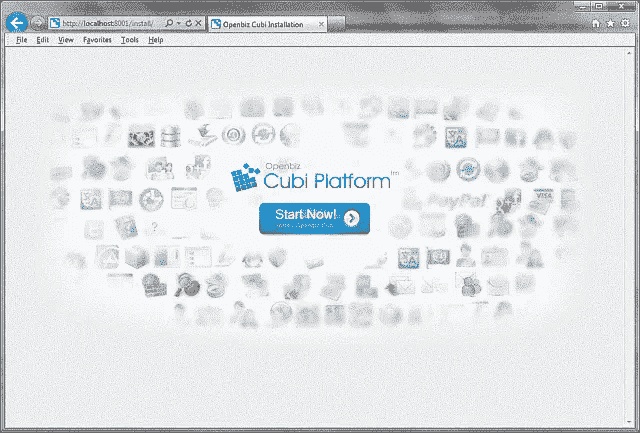
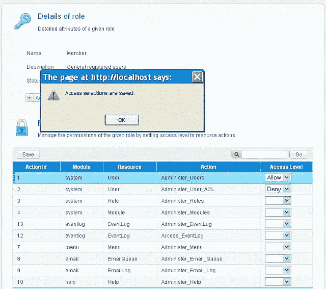

# Openbiz Cubi:健壮的 PHP 应用程序框架，第 1 部分

> 原文：<https://www.sitepoint.com/openbiz-cubi-a-robust-php-application-framework-1/>

十多年来，web 一直是面向消费者和面向商业的应用程序的标准平台。大量的开源项目、商业工具和框架使得快速 web 开发成为可能。

Openbiz Cubi 是一个健壮的 PHP 应用程序框架，让开发人员能够以最少的努力创建业务应用程序。在这个由两部分组成的系列中，我将解释使用 Cubi 创建您自己的业务 web 应用程序所必需的概念和步骤。我们将首先看看 web 开发人员面临的挑战，以及 Openbiz Cubi 如何提供帮助，然后看看如何安装 Cubi。在第 2 部分中，我们将看到如何创建我们自己的模块。

## Openbiz Cubi 特性

即使 web 开发框架有很多选择，应用程序开发仍然是一项非常具有挑战性的工作。

一个好的框架可以帮助开发人员用 MVC 和 ORM 等良好的编程实践进行编码，尽管为了构建一个真实世界的应用程序，我们有时不得不花时间编写超出框架能力的代码。

*   学习框架并用它编码。在用框架创建了一个“Hello World”应用程序之后，开发人员仍然有一个陡峭的学习曲线来构建第一个原型应用程序。
*   实现用户注册、登录、密码重置等常见功能。
*   为用户提供权限控制。由于一般化访问控制的复杂性，许可逻辑通常被硬编码在软件中。
*   做一个专业的 UI。微调 HTML、CSS 和 JavaScript 非常耗时，尤其是为了取悦所有主流浏览器。

所有上述任务都是必要的，但不是应用程序的突出功能。在他们身上花费太多时间会给客户和开发团队带来挫败感。

Openbiz Cubi 是一个成熟的平台，主要用于商业应用的快速开发。它旨在通过提供以下功能来减轻此类应用程序开发的痛苦:

*   一种基于 XML 的编码方案。开发人员使用直观的 XML 来描述数据对象、页面和表单，以及用户交互。
*   内置了许多通用组件模块化平台。开发者自己制作模块，加载到平台中。
*   支持多主题的默认专业用户界面。
*   灵活的权限控制选项，从简单到复杂。

要了解更多关于 Cubi 的信息，请务必访问项目网站[code.google.com/openbiz-cubi](http://code.google.com/openbiz-cubi)和官方网站 [www.openbiz.me](http://www.openbiz.me) 。

## 安装 Openbiz Cubi

要安装 Openbiz Cubi，你需要从[code.google.com/p/openbiz-cubi/downloads/list](http://code.google.com/p/openbiz-cubi/downloads/list)下载源代码或 Windows installer，或者你可以从 [Openbiz Cubi SVN 服务器](http://code.google.com/p/openbiz-cubi/source/checkout)获得最新的源代码。

当您选择下载源 ZIP 存档或从 SVN 获得源时，您可以按照下面的步骤安装它:

1.  准备灯组。Openbiz Cubi 可以在 Unix、Windows 和 Mac 服务器上运行。运行时环境应该包括:

*   Web 服务器——Apache、IIS 等。
*   数据库服务器–MySQL、MSSQL、Oracle、PgSQL 和 Zend_DB 支持的数据库
*   PHP 5.2 及以上，带有 mysql、PDO 和 mcrypt 扩展

*   在您的 web 服务器的 web 目录中，创建一个名为`cubi`的文件夹。*   将 Cubi ZIP 文件解压到目录中(或者在这个目录下查看来自 SVN 的源代码)。

如果您使用 Windows 作为开发环境，您可以安装 Cubi 及其 Windows Installer。安装程序:

*   安装 Apache 2.4、PHP 5.4 和 MySQL 5.3。安装完成后，您可以在系统服务列表中找到 Apache 和 MySQL。
*   安装 Openbiz Cubi 平台和业务应用程序。您可以选择取消选择安装未在开源下发布的业务应用程序的选项。
*   添加桌面图标和开始菜单项。

代码安装到 web 服务器的目录后，您可以在浏览器中启动 Cubi 的 web 安装向导来设置数据库和加载模块。通过在浏览器中启动 *http://host/cubi/install* 来运行安装向导。

单击“立即开始”按钮，按照步骤操作，直到看到“安装完成”页面。然后你就可以试驾 Cubi 了。

## Openbiz Cubi 快速浏览

在你以管理员*的身份登录 Cubi 后，你会看到管理面板。您可能还会看到其他标签，如“联系人”和“日历”。*

Cubi 由模块组成。所有模块都在`cubi/modules`目录下。在许多内置模块中，以下是最重要的:它们是其他模块经常使用的核心模块:

*   系统模块–为系统管理员提供管理用户、角色、模块、组和权限的能力。
*   菜单模块–支持通过菜单、标签和面包屑进行页面导航。
*   用户模块–为用户提供注册、登录和重置密码的功能。
*   我的帐户模块–提供我的帐户页面，用户可以在其中管理自己的个人资料、首选项、活动和密码。

Cubi 附带了其他模块，如联系人、电子邮件、事件日志、安全、主题、翻译、附件、图片、图表、支付、OAuth、Web 服务等等。

前端的典型 Cubi 页面由四个部分组成:

*   标题–此部分包含徽标、我的帐户链接、应用程序选项卡和面包屑导航。
*   左侧菜单–此部分包含导航菜单和其他小部件。
*   内容——这是用户使用数据和业务逻辑的主要领域。
*   页脚-页脚可能有关于应用程序提供商、版权等的链接。

## 管理用户和角色

对于应用程序管理员来说，最重要的任务之一是管理用户及其访问特定资源的权限。Cubi 支持几种广泛使用的访问控制模型，包括基于角色的访问控制(RBAC)和基于组的访问控制(类似于 Unix 文件权限)。我将简要讨论如何使用 RBAC。

Cubi 用户帐户简称为“用户”。角色通常意味着一种类型的用户。不同的角色被允许做不同的事情。Cubi 有三个角色:管理员、会员和访问者。一个用户可以被分配一个或多个角色。

管理员需要使用角色管理页面来允许或拒绝给定角色的资源。当他想要授予用户某些权限时，他将用户与拥有这些权限的新角色相关联。

### 结论

我将在这里结束这个系列的第一部分。到目前为止，我们已经讨论了 web 开发人员面临的挑战以及 Openbiz Cubi 如何提供帮助，如何安装 Cubi，并对 Cubi 的组织方式进行了简要概述。在下一部分中，我将深入探讨并向您展示如何创建您自己的模块。敬请期待！

<small>图片 via[Fotolia](http://us.fotolia.com/?utm_source=sitepoint&utm_medium=website_link&utm=campaign=sitepoint "Royalty Free Stock Photos at Fotolia.com")</small>

## 分享这篇文章