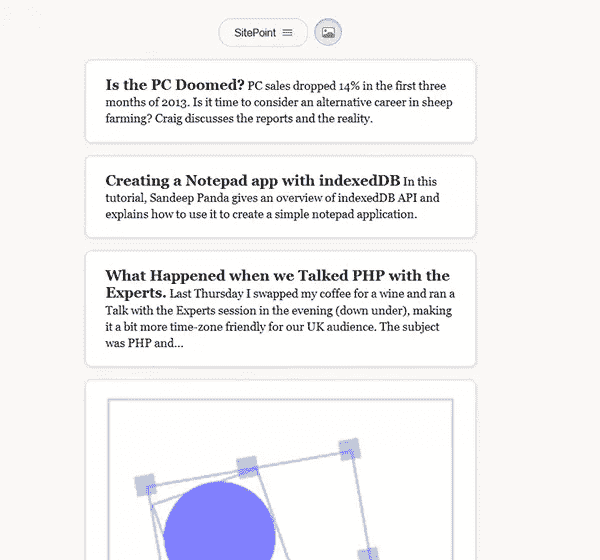

# Skimr:内幕

> 原文：<https://www.sitepoint.com/skimr-the-inside-story/>

我在我现在的雇主 Seznam.cz 遇到了我的两位联合创始人 Josf 和 Davd。这基本上就是捷克的雅虎——电子邮件、地图、新闻、搜索、分类广告等。我们是一个小团队(skunk works 或 Google X，如果你愿意的话)的一部分，在这个团队中，我们探索新的产品创意，创建原型，实验…其中一些会进入生产。

顺便说一句，我同事的真名是约瑟夫和大卫。缩写版本 Josf 和 Davd 来自 VentureBeat 的 Dylan Tweney。他认为我的名字是彼得，我缩短了我的名字，就像我们缩短了斯金纳的名字一样(而不是斯金纳)。然后我们把它应用到我同事的名字上。我们认为这很有趣，所以我们一直称他们为 Josf 和 Davd。

我用谷歌阅读器已经很久了。基本上从它发布的那天起。然后我转向了流行的 Reeder 应用程序。我最喜欢的订阅一直是 TechCrunch，Techmeme 等。然而，由于欧洲和美国之间的时差，大多数文章是在夜间发表的。所以在早上，我有大量未读的新帖子——不可能全部读完。

所以我在想一个办法，从字面上浏览标题，并迅速看到什么是新的。我意识到有时候光是标题是不够的，但是标题加上开头的一两句话通常就足以让你了解基本的故事了。如果它足够有趣，我可以点击它并阅读全文。

在我意识到这一点后，我问 Josf 我们是否可以将 Techmeme 的 RSS 提要以这种格式显示在网页上。几天后，我一直在使用这个网页。我把它给我的朋友看，他们都问他们是否可以添加自己的订阅源。

我做了一些模型，Josf 开始编码。然后，我请我的另一位同事 Davd，他是一位伟大的设计师，帮我把模型做得好看一些。你知道，字体，颜色，比例等等。在这个阶段，我们仍然在为我们自己和我们的朋友构建一个小工具。所以后端非常简单，最多只能处理几十个不同的 RSS 源。

几周后，Skimr 开始运行，我们所有的朋友都在使用它。每天。一天很多次。难以置信。这鼓励我把它贴在几个网站上，看看其他人怎么说。这时候事情开始变得复杂了…

在捷克共和国之外，我们真的不认识任何记者或博客，我们可以请他们写一篇评论。所以，我去了 Quora，在那里找到了一些帖子，列出了人们可以提交项目的网站。在向大约 20 个网站提交了 Skimr 之后，我决定不再继续这种方式，因为它根本没有效果。

我的名单上还剩下一个地方——Web.Appstorm.net。所以，我强迫自己也提交了 Skimr。五分钟后，我收到了他们的编辑马修·盖伊的电子邮件，说他正在为即将到来的周末寻找一些有趣的东西来写，不知道从哪里，斯金纳进入了他的邮箱。他喜欢这项服务，于是马上写了一篇[评论](http://web.appstorm.net/reviews/media-reviews/skimr-a-slick-and-simple-rss-reader/)。

然后在周一，更多的评论开始出现。

我非常高兴。戴维也是。只有约瑟夫怒不可遏。他的后端绝对不是为更大的用户群构建的。幸运的是，我们在 AWS 上运行 Skimr，所以总是可以选择租用更多的实例。此外，我们了解到推特-文章-访客-注册用户之间的转换率非常高。

假设一个博主写了一篇文章，并在 Twitter 上向他的 10，000 名粉丝推广。10%的人会点击链接阅读文章。那是 1000 人。10%的人会点击文章中的链接，并实际访问你的网站。那是 100 个人。然后 10%的人报名，也就是 10 个人。

所以，几个星期后，我们有了一个真正喜欢这项服务的小用户群，他们给我们发电子邮件，告诉我们他们希望我们添加的功能，并告诉他们的朋友他们的朋友关于 Skimr 的情况。他们每小时都会添加一些独特的内容，所以没什么大不了的。

但随后，谷歌宣布他们将关闭他们的阅读器。突然间，世界各地的人们开始寻找替代品。不是每小时有几个独特的 RSS 提要被添加到 Skimr，而是每分钟有 100 个独特的提要被添加。然后每分钟 1000 个饲料。我们不断升级我们的 AWS 实例，推出越来越多的下载机器人，租用更多的存储空间，等等。

太迷人了。但我们知道，在如此沉重的负荷下，我们这个小小的系统崩溃只是时间问题。

此外，记者们变得非常积极。我开始收到他们的回信。甚至沃尔特·莫斯伯格也回复了我给他的邮件。来自一个小国，这是令人惊讶的。

幸运的是，在周末，人们平静了一些。我们立即联系了我的老朋友 Radm，他是一个优秀的后端程序员来帮助我们。以下段落来自他:

> 当前版本是建立在 LAMP 技术+基于 JavaScript 的前端之上的。该解决方案非常适合作为概念验证，能够在一定程度上处理流量。
> 
> 在谷歌宣布结束其阅读器后，流量显著增长，我们通过添加新的 AWS 服务器来处理这种情况。这个解决方案有一个很大的缺点——它非常昂贵，而且 PHP 后端并没有真正有效地使用服务器。为了解决这一挑战，作为第一步，我们决定将网站从 AWS 迁移到我们自己的专用服务器(位于布拉格)。这为我们节省了大约 2/3 的运营成本。
> 
> 下一步，我们将网站改写为一个更高效的技术——我们已经在 www.agentka.cz(一个受欢迎的本地求职网站)成功使用了几年的技术。通常，频繁使用的站点的瓶颈之一是高负载的数据库。这是一个悖论，因为大多数网站并没有按照设计的方式真正使用高级(有时甚至是基本)SQL 数据库功能——负载重的数据库通常被反规范化，只作为持久存储。当需要对所有存储的数据执行全文搜索时，情况会更糟。
> 
> 在过去，这种观察使我们放弃了 SQL 数据库，而使用一种特殊的索引器，这种索引器以非常松散的结构存储文档，并提供非常快速的全文搜索功能，当然，还提供对原子操作的支持。这个索引器是网站的心脏，它用于存储所有数据，它还允许我们根据需要扩展网站。在我们将当前的 Skimr 实现从 LAMP 迁移到所描述的一个之后，我们将能够为我们的用户提供很多很好的功能——例如 feeds 中的全文搜索。这项工作正在进行中，我们希望在几周内有一个新的版本。

启动一个 web 项目总是会带来这种困境——快速启动，如果它变得流行，就有系统崩溃的风险；或者先把它造好，准备好。如果我们选择了第二种方法，我们就会完全错过谷歌宣布关闭阅读器时出现的机会之窗。

让我们从后端开始，看看前端是如何工作的。它有两个基本部分:

1.  通过 PHP 在服务器上生成的静态页面，如[http://skimr.co/about](http://skimr.co/about)
2.  在客户端用 javascript 生成的动态页面，如[http://skimr.co/techcrunch](http://skimr.co/techcrunch)

有趣的是第二部分——动态页面。应用程序的核心只是一个带有静态对象文字的普通 JavaScript 构建(主页、文章、更新程序等的单个模块)。我们不使用任何像 jQuery 这样的大型 JavaScript 库。我们希望完全控制速度和简单性。

HTML 的渲染严格由 Dust.js 使用服务器上的预编译模板来完成。JavaScripts 不包含任何 HTML 代码或任何对 DOM 的直接操作。我们只是通过 JSON API 从服务器提供数据，处理它们，然后将它们发送到一个渲染函数，该函数为活动页面生成 HTML。

使用 URL 是通过 HTML5 函数`pushState()`来完成的，并回退到 hash。这是非常重要的，也是一个真正“响应迅速”的应用程序的关键，因为您能够立即“切换”页面。

总的来说，前端非常简单，完全响应——开箱即用，在台式机、平板电脑和智能手机上都能很好地工作。一切都是在 CSS 中完成的，我们没有任何应用程序逻辑来支持应用程序的响应功能。我们也在样式表中减少使用。对于任何类型的网站或应用程序，我们肯定会推荐更少的。

关于设计，我希望 Skimr 尽可能简单。我一直认为传统的 RSS 阅读器对于普通用户来说有点太复杂了。但是我喜欢通过 RSS 获取内容并以统一的形式显示的概念。然而，我认为我们只展示原始内容的一小部分，而不是整篇文章是公平的。如果人们喜欢它，他们可以在出版商的网站上点击阅读。

传统网站最大的问题是人们试图放在网站上的元素数量。所有的菜单、选项、上下文内容等。我觉得它们很让人分心。任何网站的意义都应该是解决一个特定的需求，然后放手。

说到新闻网站，他们应该告诉他们的用户什么是新的，仅此而已。所以我确保 Skimr 的存在有一个明确的目的——快速看到新的东西。经过几次迭代，我意识到有一种比传统 RSS 阅读器更简单的方法——简单的 feed。最新的在上面，旧的在下面。不多不少。这在现在听起来很明显，但在当时，这意味着放弃一个好的 RSS 阅读器应该拥有的大部分功能。

构建 Skimr 的另一个有趣的方面是本地应用与 web 应用的对比。我就这个话题采访了 ZDNet 的戴夫·摩根斯坦。

基本上，我认为很快，人们将无法区分本地应用和网络应用。CSS，JS 和 HTML 5 的最新发展使应用程序设计者能够创建与传统原生应用程序几乎相同的用户体验。

所以，我认为 web 应用程序已经足够了。但我错了。

我们用户的主要要求之一是本地应用。他们认为原生应用提供了更好的性能。由于这基本上是一个分销渠道，我们决定为他们建立这些。

说到新功能请求，文件夹是一个有趣的故事。很久以前，我曾经在 Google Reader 订阅过很多网站。随着时间的推移，我把数量减少到大约 10 个。基于这一原则，我们为订阅较少的用户设计了 Skimr。很快发现，世界各地仍有许多人食用数百甚至数千种饲料。在这种情况下，需要文件夹来组织这些提要。所以，经验教训:我们为我们的用户开发了[文件夹。](http://blog.skimr.co/2013/04/folders-are-here.html)

关于如何让 Skimr 更好地为我们的用户服务，我们有很多想法，例如原生应用、搜索(在用户的 RSS 订阅源中，甚至是系统中的所有 RSS 订阅源中)。但是在实现用户请求之前，一定要三思而后行，这一点非常重要。

由于我们不是在构建一个传统的 RSS 阅读器，我们的一些用户(恕我直言)不太明白这一点，所以他们要求在谷歌阅读器上使用他们已经习惯的功能。我们的道路和 Google Reader、Feedly 等不同。所以我们可能不会让每个人都开心。然而，这种方法的好处是，我们的大多数用户实际上非常高兴我们提供一些不同的东西。我们已经找到了一个利基市场，那里的人们厌倦了复杂的读者，并对 Skimr 提供的简单性感到满意。他们甚至给我们发邮件，要求我们保持 Skimr 不变，不要添加任何新功能。太神奇了！

展望未来，我们可以期待 6 月份左右的流量高峰，届时谷歌肯定会关闭 Reader。我们会尽最大努力为他们做好准备，主要是把后端改写成无 DB 的东西。

但是，总的来说，我们更感兴趣的是有机增长，而不是一夜成名。这有助于与用户建立联系，倾听他们的意见，并仔细改进产品。毕竟 Skimr 是我们的一个爱好项目。我们都有全职工作。

话虽如此，我们还是可以尝试一些明显的商业模式，尤其是免费增值(收取少量费用的一些特殊功能)。

到目前为止，Skimr 项目充满了惊喜，所以谁知道接下来会发生什么？

## 分享这篇文章