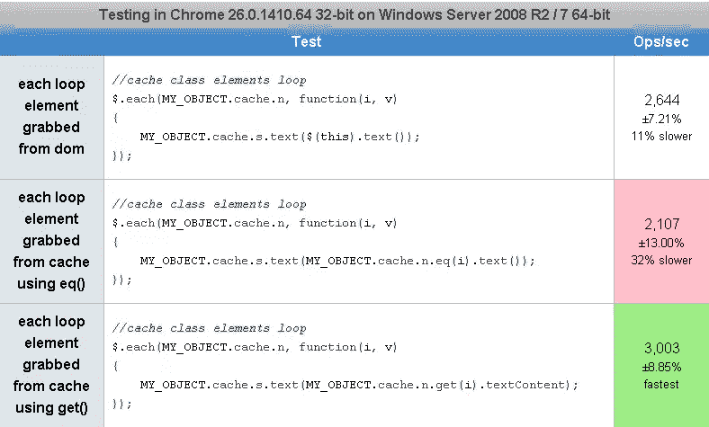

# jQuery 速度测试:$(this) vs .get() vs .eq()

> 原文：<https://www.sitepoint.com/speed-test-this-get-eq/>

每个循环缓存性能–测试从每个循环中获取当前元素是否可能/更快地从缓存的元素数组中获取。即 **$(this) vs .get() vs .eq() with。text()和 textContent/innerText** 。使用 jQuery 1.9.1 运行测试。类似: [jQuery 速度测试:$(本)。attr(" id ")；vs this.id](http://www.jquery4u.com/?p=16722) 。

[](http://jsperf.com/each-loop-dom-cache)

*   。get()和。eq()都从 jQuery 对象数组返回单个“元素”,但是它们以不同的形式返回单个元素。
*   。eq()将其作为 jQuery 对象返回，这意味着 DOM 元素被包装在 jQuery 包装器中，这意味着它接受 jQuery 函数。
*   。get()返回一个原始 DOM 元素。您可以通过访问它的属性和调用它的函数来操作它，就像对原始 DOM 元素一样。但是它失去了作为 jQuery 包装对象的身份，所以 jQuery 函数像。fadeIn 没用。

## 设置

## 试验

```
$.each(MY_OBJECT.cache.n, function(i, v) 
{
    MY_OBJECT.cache.s.text($(this).text());
});

$.each(MY_OBJECT.cache.n, function(i, v) 
{
    MY_OBJECT.cache.s.text(MY_OBJECT.cache.n.eq(i).text());
});

$.each(MY_OBJECT.cache.n, function(i, v) 
{
    MY_OBJECT.cache.s.text(MY_OBJECT.cache.n.get(i).textContent);
});
```

## 分享这篇文章