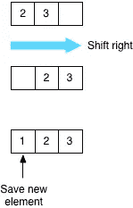
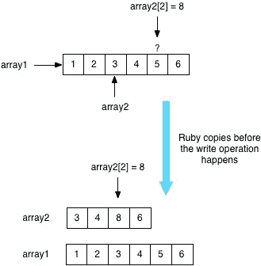
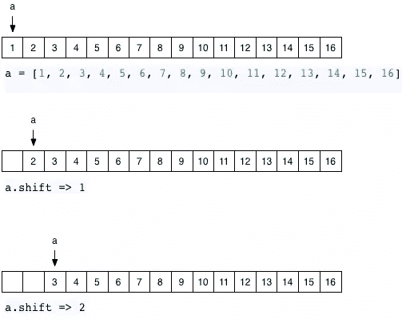
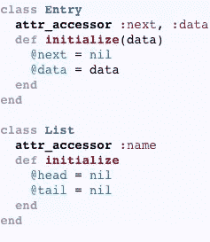

# Ruby 缺失的数据结构

> 原文：<https://www.sitepoint.com/rubys-missing-data-structure/>

你有没有注意到 Ruby 不支持链表？大多数计算机科学教科书都充满了基于链表的算法、例子和练习:插入或删除元素、排序列表、倒排列表等。然而奇怪的是，Ruby 中没有链表对象。

最近，在学习了 Haskell 和 Lisp 几个月之后，我回到了 Ruby，并尝试使用我学到的一些函数式编程思想。但是我如何在 Ruby 中创建一个列表呢？如何在 Ruby 中添加或删除列表中的元素？Ruby 包含数组和散列类的快速内部 C 实现，在标准库中，您可以找到实现集合、矩阵和向量类的 Ruby 代码以及其他许多东西。但是没有链表——为什么？

答案很简单:Matz 包含了通常会与 Ruby Array 类中的链表相关联的特性。例如，您可以使用 Array#push 和 Array#unshift 向数组中添加一个元素，或者使用 Array#pop 和 Array#shift 从数组中移除一个元素。

今天我要看一些你通常使用链表的常见操作，然后看看你如何使用数组来实现它们。我们还将深入了解 Ruby 的数组对象在内部是如何工作的。

## 使用数组作为链表

当我想到链表时，我会想到 Lisp 编程语言，它是“列表处理器”的缩写。在他的经典文章“符号表达式的递归函数及其机器计算，第一部分”中，Lisp 发明者约翰·麦卡锡将“cons 单元”定义为链表的基本构建块，并定义了相应的“(cons…)”Lisp 函数来创建这些 cons 单元。

例如，要在 Lisp 中创建一个列表 (2，3) ，您可以调用:

Lisp 会在内部创建一个如下所示的链表:

在 Ruby 中，由于我们没有“列表”对象，我们可以使用一个数组和如下的 Array#unshift 方法来实现同样的事情:

在内部，Ruby 将创建一个这样的数组:

从表面上看，Array 类上的 unshift 方法相当于 Lisp 中的 cons 函数。它们都在列表的开头或头部添加了一个新元素。

## 向列表中添加新元素–移动数组元素

然而，数组和列表是非常不同的东西。数组是为在一个大集合中随机访问数据而设计的，而链表则可以很好地插入、删除或重新排序元素。

假设我想在列表中添加第三个值——在 Lisp 中，我只是再次调用“cons ”:

在内部，Lisp 只是创建一个新的“cons cell ”,并将指针设置为指向原始列表:

在 Ruby 中，我会再次调用 unshift :

但是请记住，在数组中没有指针，Ruby 需要将所有现有元素移动一个位置——因此方法名为 unshift :

这意味着使用 unshift 意味着每次在列表的头部添加新元素时都要付出性能代价。正如您可能猜到的那样，将元素添加到列表的末尾更便宜，因为不需要移动——在 Ruby 中创建列表的更好方法是使用推送或 < < 方法:

向列表中间添加新元素的工作方式与向列表头部添加新元素的工作方式基本相同。如果调用 Array#insert 方法，Ruby 首先需要将剩余的元素向右移动，为新值腾出空间。

## 向列表中添加更多元素–调整数组容量

现在假设我加入第四个元素。在 Lisp 中，我可以继续调用“cons”函数，以完全相同的方式添加越来越多的元素。然而，在 Ruby 中，注意我的数组已经填满了，没有空间容纳第四个元素:

事实证明，我没有选择在我想象的数组图中显示三个方框，只是为了让图更简单。在内部，Ruby 跟踪每个数组中的两个独立值:“size”和“capacity:”

size 表示数组的实际大小。正如我在上面的例子中反复调用 unshift 一样，数组的大小从 1 增加到 2 再增加到 3。

当 Ruby 在内部创建一个数组时，它会分配一些额外的内存，因为你可能很快会向数组中添加更多的元素。每当你创建一个新的数组对象时，Ruby 最初将容量设置为 3；这意味着它可以将三个值保存到数组中，而不必要求更多的空间。然而，一旦添加了第四个元素，Ruby 就必须停下来，在保存第四个值之前，从垃圾收集系统中获取一些新的内存。如果没有可用的内存，这可能会触发 GC 操作。

随着您添加越来越多的元素，每当您跨越特定的数组大小时，Ruby 就会重复地增加数组容量的大小:3、20、37、56、85 个元素，等等。确切的阈值由 array.c 中的函数确定。阵列容量每次大约增加 50%,尽管第一次增加(从 3 增加到 20)是一个特例。每次发生这种情况，您都要付出额外的性能代价。

每当你从一个数组中移除一个元素时，比如使用 shift 或 pop ，Ruby 也可能会减少数组的容量和大小。这意味着它可能会停止并将数组中未使用的内存释放回 GC 系统，从而导致额外的延迟。

## 作为功能数据结构的链表

到目前为止，我们已经看到 Ruby 数组可以像链表一样工作。Ruby 提供了 push 、 unshift 和 insert 方法向列表中添加新元素，以及 pop 或 shift 方法从列表中移除元素。不仅如此，使用数组你还可以直接、随机地访问数组的所有元素，这是纯链表结构所不能提供的。

使用数组作为链表的唯一缺点似乎是性能:如果你有 1000 多个元素，理论上 Ruby 会减慢重复调整数组大小以容纳你添加的所有元素的速度。

此外，如果你需要在列表的头部或者中间的某个地方添加或者删除元素，那么 Ruby 也会减慢将剩余元素向左或者向右移动的速度。但是请记住，因为 Ruby 是在内部用 C 实现的，所以它能够使用非常高效的 C 函数来移动元素。Memmove 和类似的低级 C 函数通常由微处理器硬件直接实现，工作速度非常非常快。

然而，链表还有另一个不明显的重要特性:它们作为函数数据结构工作得很好。这是什么意思？在像 Lisp 这样的函数式编程语言中，你把你的程序指定为一系列“纯函数；给定相同的输入，这些代码总是返回相同的输出。

函数式编程语言也不鼓励使用“可变值”——可以就地从一个值变为另一个值的变量或对象。使用纯函数和不可变值的主要好处是允许你的软件更可靠、更健壮地运行，因为你的代码没有副作用。函数式语言在多线程环境中也能很好地工作，因为不需要同步或锁定修改数据的代码——你根本不需要修改数据。

专门使用不可变值的数据结构被称为“函数数据结构”除了健壮性和消除同步访问不同线程的需求的巨大好处之外，函数式数据结构还允许轻松共享数据。由于您从不就地修改数据，因此许多不同的功能数据结构很容易在内部使用相同的数据副本。

链表就是一个很好的例子:不同的列表可以在内部共享相同的“cons”单元格或数据值。例如，假设我在 Lisp 中创建了一个列表:

然后通过向第一个列表添加另一个元素来创建第二个列表:

现在我有两个链表，它们为 2 和 3 共享相同的 cons 单元格。只要你从来没有真正改变其中一个元素的位置，不同链表的元素共享是完全没有问题的！

函数式数据结构允许您——或者至少是语言实现者——应用优化来共享和节省内存。

## Ruby 数组中的写时复制优化

乍一看，在 Ruby 中使用数组作为列表似乎使得空间优化变得不可能。首先，Ruby 中的数组不是一个函数式的数据结构——当然，你可以随时改变数组中的任何值。但是让我们假设一下，Ruby 数组是不可变的——或者 Ruby 中有一个“ImmutableArray”对象。两个独立的阵列怎么可能共享相同的数据呢？例如，假设我创建了一个包含六个元素的数组:

…第二个阵列作为子集:

为了使用类似于 Lisp 和其他函数式语言的空间优化，我们必须想象 Ruby 可以在两个数组中共享相同的公共元素副本:

事实上，事实证明 Ruby 正是这样做的！使用一系列被称为“写时复制优化”的技巧，Ruby 在不同的数组之间共享值！Ruby 通过维护包含所有数据值的大数组的单个副本，并使用指向大数组中间的简单指针或引用来创建第二个数组，如上所示。

这被称为“写时复制”优化，因为当您更改或写入共享数组中的一个值时，Ruby 必须中断共享并复制数据元素。

实际上，你不需要担心这一点:Ruby 会自动在内部为你处理一切，尽可能地节省内存，并在必要时支付复制数据的费用。

然而，与链表相关的一个简单的受益于写时复制优化的例子是重复使用 shift 来遍历一个列表:

正如我在上面解释的那样，理论上，每当你从列表的头部删除一个元素时，Ruby 需要将所有现有的元素移动或复制到左边。对于像这样的小数组来说这无关紧要。但是如果数组包含 1000 个元素，这可能是一个缓慢的操作。

但是由于 Ruby 在数组对象内部的写时复制优化，Ruby 足够聪明地保留了原始数组，并在调用 shift 时简单地移动指针或引用:

为什么我要在这些图中画一个有 16 个元素的数组呢？原来当你调用 shift 的时候，Ruby 直到至少有 16 个元素才使用这个优化。如果你从一个 15 个或更少元素的数组中移出一个值，那么 Ruby 将会把所有的元素都移到左边，因为 memmove 对于一个小数组来说非常快。

## 实现你自己的链表

为了总结今天的内容，让我们看看如何在 Ruby 中实现一个链表。正如我们所见，数组通常可以很好地充当列表。然而，有时你可能需要在一个大的列表中重复地插入、删除和重新排序元素。为了避免与数组大小调整和移位相关的性能损失，您可能需要一个真正的链表。

创建链表的一个简单方法是使用 Struct 对象表示一个 cons 单元格，如下所示:

参见[这篇有趣的 2012 年文章](http://khakimov.com/blog/2012/05/11/back-to-school-linked-list-with-ruby/)了解更多关于这种方法的细节。作者还展示了一些比较数组和列表的基准。

另一种方法是创建单独的条目和列表对象，正如 Eno Compton 在他的优秀文章:[Reversing a Linked List in Ruby](http://www.commandercoriander.net/blog/2012/12/23/reversing-a-linked-list-in-ruby/)中所描述的。代码如下:

最后，如果你有兴趣学习更多关于函数式数据结构的知识，并在 Ruby 中试用它们，请参阅 Simon Harris 的用 Ruby 实现的不可变数据结构的仓鼠库。西蒙也在 2010 年写了一篇关于函数式编程如何促使他重新思考如何编写面向对象类的优秀文章:[面向对象语言中的函数式编程](http://www.harukizaemon.com/blog/2010/03/01/functional-programming-in-object-oriented-languages/)。

## 分享这篇文章