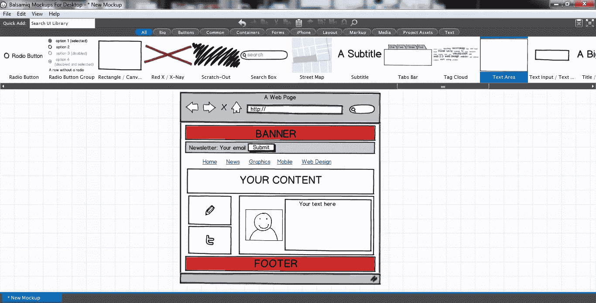
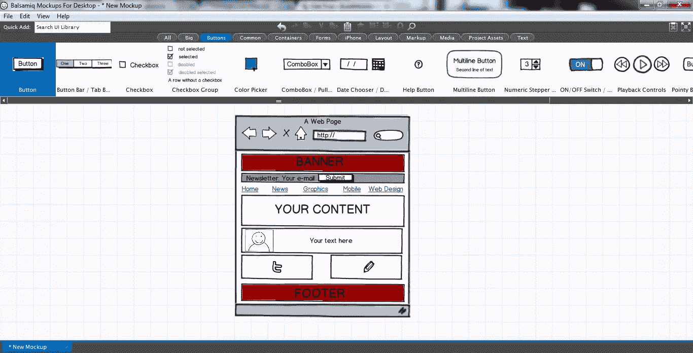
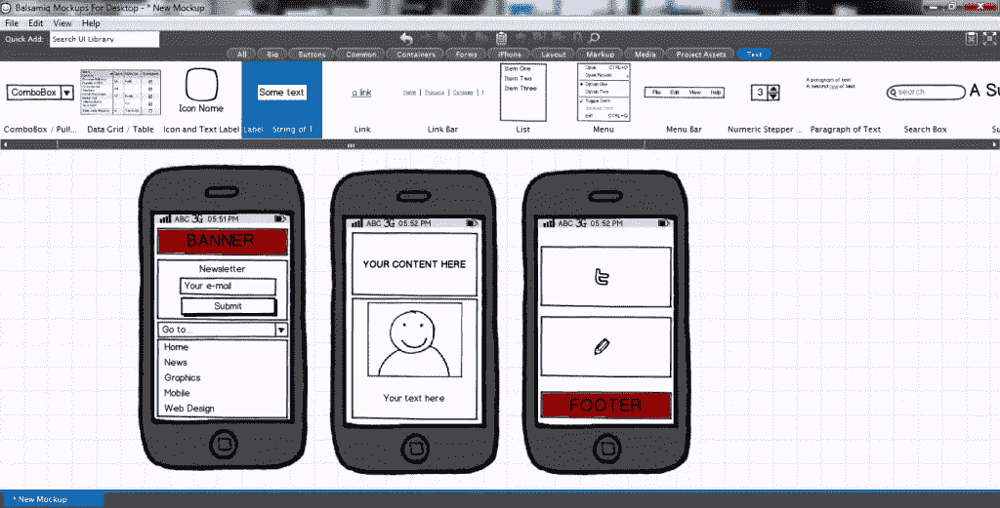

# 从头开始构建一个响应迅速、移动友好的网站:设计一个模型

> 原文：<https://www.sitepoint.com/build-a-responsive-mobile-friendly-website-from-scratch-design-a-mockup/>

在这个全新系列的[第一篇文章](https://www.sitepoint.com/building-a-responsive-website-introduction/ "Build a Responsive, Mobile-Friendly Website From Scratch: Introduction")中，我介绍了该系列的主要目标，并对媒体查询和响应断点的关键组件进行了简短但完整的介绍。现在，是时候开始做一些实际工作了。正如我之前提到的，我将从规划和创建三种主要设备类型的模型开始，我们的响应式网站将在这三种设备类型上设计、测试和显示:PC 桌面、平板电脑和移动电话。

### 3…2…1…我们开始吧！

在继续之前，我想给你一点建议:记住，你做的模型越多，你的工作就会变得越艰巨，越令人困惑。响应模型不同于静态模型；你真的不知道你的内容会放在哪里，因为这取决于屏幕的大小。

显然，正如我们在前面的系列文章中看到的，为每个屏幕尺寸设计模型几乎是不可能的，因为可能有数百个屏幕、布局和方向需要您去适应。这就是为什么我建议你选择你的目标屏幕/布局，只为你的前三个主要设备类别建立项目模型。

由于显而易见的原因，我不会向您展示如何设计和构建整个网站，但我会将重点放在主页上，尽管我确信一旦您理解了响应式 web 设计的逻辑和基础，您将能够继续构建整个门户，一切都会井井有条。我应该重申，创建实体模型通常不需要你把每一个视图都布置得尽善尽美，只要它们是最终产品(网站或应用程序)的足够抽象，给你足够的信息来开始构建，它们就是有效的。

我已经选择使用 [Balsamiq 模型](https://www.sitepoint.com/build-a-project-mockup-using-balsamiq/ "Build a project mockup using Balsamiq")来构建我的项目模型。正如我在链接文章中详细解释的那样，Balsamiq 样机是一个工具，它可以帮助开发人员创建线框，并通过设计计划的可视化表示与客户和同事进行交流。Balsamiq 是一款离线桌面软件，你可以使用自己选择的操作系统来使用它，因为它可以在 Mac、Windows 和 Linux 上运行。

让我们开始规划我们的网站在 PC 桌面版本的工作模型。

首先也是最重要的，让我来介绍一下我们要去的网站类型，以及我们会在里面找到的所有元素。事实上，在构建 web 应用程序或网站时，提前确定您的内容并在网站模板中指定各自的内容区域是一个很好的做法。出于我们的目的，我们将建立一个以图形、网页设计和移动开发等主题为主要内容的网站，一个设计爱好者可以阅读他们最喜欢的领域的文章、进行讨论、学习新技术和保持消息灵通的地方。

让我们看看如何继续使用 Balsamiq 模型的元素，并首先关注一个目标布局。我们必须在布局上放置块，作为第一步，我放置浏览器窗口形状来表示任何浏览器页面的轮廓，并使用鼠标稍微调整它的大小。

至于主页的风格，首先要确定的是我们要在全新的主页上展示哪些元素。一般来说，我们可能会发现一个标题，一个时事通讯栏，一个菜单列表，一些侧边栏(基于你想输入的额外内容)，一个最重要信息的文本框，一张图片，或者一些链接。

由于其简单、直观的拖放系统，我们只需点击几下鼠标，就可以轻松添加我们想要的一切。对于我们页面的第一个组件，我们必须打开名为“大”的类别在这里，我们将找到以下元素:标题、文本区域和图像框。因此，将这些拖放到您的模型中。然后，打开“常用”类别，找到矩形、文本区域、文本输入框、图像和图标指示器以及链接指针。让我们将两个侧边栏放在主内容框下面的作者信息框的左边(在这里可以添加一张照片),它占据了整个窗口的宽度。

此时，我们的设计概念应该是这样的:

一旦您拖放了元素，您会看到每个元素都有广泛的编辑选项。当你点击标题或文本框时，你会看到一个典型的文本编辑器，在这里你可以指定特征或内容。您可以通过选择大小、文本对齐方式、格式和颜色来修改文本。您还可以设置背景颜色，设置边框颜色，添加滚动条，以及调整不透明度和焦点。

对于图像，我们可以显示或隐藏边框，裁剪图像，并将选择的图像超链接到新的 URL 或屏幕。由于这是一个模型项目，主要是为了记住所有的页面元素和它们的安排，在我看来，没有必要做出超精确的风格变化。重要的是要有一个“框架”，或者一个出发点，在 HTML 代码和 CSS3 样式规则的帮助下，把注意力集中在需要构建的结构上。

一旦我们完成了第一段，让我们继续规划我们的平板电脑版本。

如上图所示，第二个模型中使用的所有元素都是相同的；唯一改变的是他们的安排。在页面的顶部，几乎所有的东西都有相同的风格:横幅和简讯栏占据了 PC 桌面和平板电脑的所有窗口宽度。

改变的是菜单列表项目的排列。为了使菜单项的阅读变得清晰和容易，即使是在缩小的屏幕上，我已经计划增加所有当前项目之间的空间。此外，模型的底部部分引入了一些微小的变化:放置在作者框左侧的侧边栏被移动到了它的下方，并彼此相邻放置，以便给它们一个更大的宽度。为了清楚起见，请看下面。

作为模型制作过程的最后一步，让我们来处理智能手机版本。我已经放置了 iPhone 形状(如前所述，这是唯一一个可以代表所有现代智能手机轮廓的形状)，并复制了两次，以便您可以查看用户从上到下滚动网站时会看到的内容。

正如您所看到的，对于门户的顶部，新闻稿元素的排列已经改变，菜单项列表也与 PC 桌面和平板电脑模型不同。输入框和提交按钮是垂直显示的，以便使数据的写入和发送过程更快更简单。至于菜单，在这种情况下采用的最佳解决方案(因为菜单仅由五个项目组成)是创建一个下拉菜单，用户可以轻松地触摸它来加载他想要访问的页面。

页面的所有其他组件都被设置为最大宽度，以使内容直观且易于访问。即使在这个阶段你看不到它，对于文本视图，你可以考虑一个简单的技巧来让你的用户满意。请记住，如果你的内容太长，他们将不得不向下滚动页面很多次才能到达结尾，这很容易导致迷惑和厌倦。因此，你可以通过放置一个“阅读更多”链接来解决这个“内容太多”的问题，该链接直接将用户带到他所需要的信息，并使主页更加精简，更容易加载，更容易访问，即使在狭窄的智能手机屏幕上也是如此。

### 结论

在这篇文章中，我们看到了如何建立一个项目模型，响应性思维，以及响应性设计如何适应三种目标布局:默认(PC 桌面)、写字板和智能手机。我们已经看到了如何通过创建一个表示常见内容元素的模板，在三个主要设备类别中排列典型网站的元素。在本系列的第三部分中，我们将开始编写 HTML 代码，处理主页的结构，并设置第一个 CSS 样式规则来构建初始设计。

## 分享这篇文章